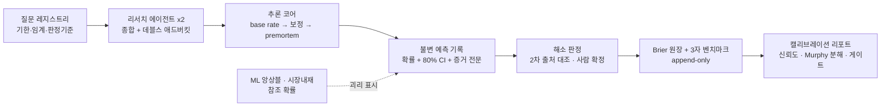

# AI-FC — AI Superforecaster for Market Events

[](https://github.com/Sung-JinPark/Jin-s-investing-prediction/actions/workflows/verify.yml)


> **시장 이벤트 확률화 엔진.** 프론티어 LLM 리서치 파이프라인과 오픈웨이트 ML 앙상블로
> "기한·임계값·판정기준이 있는 질문"에 확률을 매기고, **모든 예측을 불변 기록**으로 남겨
> Brier 점수로 검증한다 — 예측을 사후에 고칠 수 없는, 감사 가능한 track record.

`Python 3.12` · `LLM + open-weights (inference-only)` · `append-only ledger` · `run cost ≤ $20/mo`

---

## 무엇이 다른가

| 특징 | 구현 |
|---|---|
| **불변 예측 기록** | 1예측 = 1파일, 생성 후 수정·삭제 불가. SHA-256 앵커(`forecasts/.hashes`) + 드리프트 검사(E1~E7)가 위변조를 기계적으로 검출 — GitHub 타임스탬프가 제3자 공증 |
| **캘리브레이션 원장** | 해소 시 전 회차 Brier 채점 → append-only CSV. 대표 지표는 제외 표본 수까지 상시 병기 |
| **3자 벤치마크** | 같은 질문에 대해 LLM vs ML 앙상블 vs 시장내재확률을 병행 채점 — "시장을 이기는가"를 데이터로 답하는 배관 (룩어헤드 차단 내장) |
| **구조화 추론** | base rate 앵커 → 증거별 보정 → 분해 트리 → premortem → 확률+80% CI — 전 단계가 스키마로 강제되고 파일에 남는다. 반대증거 전담 에이전트(데블스 애드버킷) 생략 시 예측 무효 |
| **참조 모델 분리** | Chronos-2·Bolt·T5(zero-shot 분위수·경로), GBM MC, FinBERT, 예측시장·옵션 내재확률 — 전부 **참조·견제 역할** (공식 확률에 산술 결합하지 않음). 15%p+ 괴리는 표시 후 사람이 판단 |
| **게이트 기반 활성화** | 표본이 쌓여야 기능이 열린다: 앙상블 K회(해소 30+) → edge 시그널(50+, Brier<0.18) → 사후 보정(100+) → 가중 학습(200+). 과적합·과신을 구조로 차단 |
| **경량 운영** | 로컬 CPU 추론 + 질문당 $1.2~4, 월 상한 자동 차단. 주간 자동 리프레시·기계 판정 초안(확정은 사람) |

## 파이프라인



## 빠른 시작

```bash
uv sync && uv run ai-fc due        # 오늘 할 일 (재예측·해소 기한 + 괴리 경고)
# 또는: cd src && python -m ai_fc <due|forecast|resolve|report|sync>

python -m ai_fc report             # 캘리브레이션 대시보드 (reports/calibration.html)
python -m ai_fc sync --check       # 불변성 검사 — exit 0이 정상
python -m ai_fc resolve --draft    # 가격형 질문 기계 판정 초안 (원장 무기록 — 확정은 사람)
cd dualdb && python -m dualdb report   # 닷컴↔AI 사이클 비교 리포트
```

API 키는 `ANTHROPIC_API_KEY` 환경변수로만 주입 — 저장소에는 어떤 시크릿도 포함되지 않는다.

## 저장소 구조

```
questions/     질문 레지스트리 + 등록 필터·수확 캘린더 (무엇을 언제 예측하는가)
forecasts/     불변 예측 기록 (+ .hashes 앵커, retro/ 회고 노트)
calibration/   Brier 원장 + 3자 벤치마크 원장 (append-only)
data/          base rate 라이브러리 + 모델 산출 이력 (계층: data/README.md)
prompts/       추론 코어 시스템 프롬프트 (버전 관리)
src/ai_fc/     엔진 — LLM 파이프라인 + quant/ml/market 참조 계층 + 테스트
dualdb/        닷컴↔AI 이중시대 비교 DB (독립 패키지, base rate 공급자)
docs/          아키텍처·모델 카드·결정 기록·한계 대장·변경 이력
reports/       캘리브레이션 대시보드 · 리서치 노트
```

핵심 문서: [ARCHITECTURE](docs/ARCHITECTURE.md) (업계 표준 대비 계층 지도) · [MODEL_REGISTRY](docs/MODEL_REGISTRY.md) + [모델 카드](docs/models/) · [DECISIONS](docs/DECISIONS.md) · [KNOWN_LIMITS](docs/KNOWN_LIMITS.md) (한계 정직 고지) · [CHANGELOG](docs/CHANGELOG.md) · 운영: [P1_OPERATIONS](docs/P1_OPERATIONS.md) · [FACTORY_GUIDE](questions/FACTORY_GUIDE.md) · [HARVEST_CALENDAR](questions/HARVEST_CALENDAR.md)

## 제3자 검증 방법 — track record를 직접 확인하기

이 저장소의 핵심 주장("예측을 사후에 고치지 않았다")은 **누구나 3단계로 검증**할 수 있다:

```bash
git clone https://github.com/Sung-JinPark/Jin-s-investing-prediction.git
cd Jin-s-investing-prediction
python tools/verify_track_record.py     # 표준 라이브러리 + git만 — pip install 불필요
```

검증기는 ① 전 예측 파일의 SHA-256 ↔ 해시 앵커 대조 ② git 이력상 수정/삭제 이벤트 0
③ 커밋 시각 ≤ 질문 마감 ④ Brier 점수 독립 재계산 — 을 수행하고 결과를 **2등급으로 정직하게 구분**한다:

- **A급 (강한 증명)**: 공개 baseline 커밋 **이후** 기록 — 리모트 고정 이력의 커밋 시각이 외부 증거
- **B급 (약한 증명)**: baseline 커밋에 포함된 초기 기록 — 해시·내부 정합만 (자기증명임을 명시)

초기 21건은 B급이며, 이후의 모든 기록은 A급으로 쌓인다 — **시간이 지날수록 공증력이 자란다.**
`forecasts/.hashes`는 OpenTimestamps로 비트코인 블록체인에도 앵커된다
(`ots verify forecasts/.hashes.ots` — 별도 도구 필요). CI(상단 배지)가 매 푸시마다 같은 검증을 수행한다.

## 현재 상태

- **Phase P1** (자동화 스캐폴드 운영) — 질문 38 · 예측 21+ · 해소 표본 축적 중
- 2026 하반기 수확 캘린더 가동: 연말까지 해소 30+건 → 2027 초 P2 게이트 판정 예정
- 모든 출력은 **참고 의견** — 게이트 통과 전까지 자금 결정의 단독 근거로 사용하지 않는다

## 원칙 (전문: [CLAUDE.md](CLAUDE.md) — 시스템 헌법)

1. **이벤트 → 가격**: 예측 대상은 항상 해소가능한 질문 — "주가 맞히기"가 아니라 이벤트 확률화
2. **라이브 포워드 only**: LLM은 과거 결과를 학습에 내포 — 과거 질문 백테스트는 원천 무효 (결정론 수치 모델의 워크포워드만 조건부 예외)
3. **캘리브레이션이 왕**: 기록 없는 예측은 존재하지 않는 예측
4. **Edge 없으면 무행동** · **자동화된 폭**: 정기·이벤트 트리거 재예측, 단 실행 판단은 사람

---

**Disclaimer**: 본 저장소는 투자 자문이 아닌 의사결정 보조 연구 도구입니다. 모든 확률·리포트는
참고 의견이며, 어떤 출력도 매매 신호가 아닙니다. 과거 기록은 미래 성과를 보장하지 않습니다.
