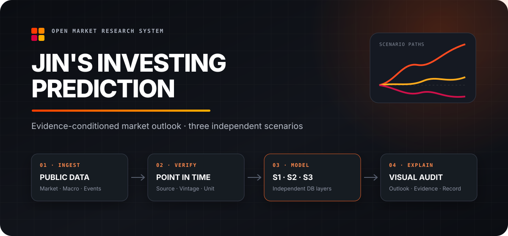
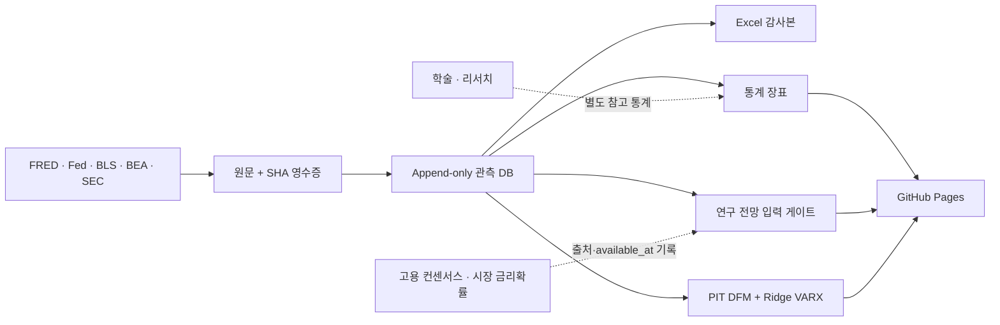

<p align="center">
  <a href="https://sung-jinpark.github.io/Jin-s-investing-prediction/">
    
  </a>
</p>

<p align="center">
  <a href="https://github.com/Sung-JinPark/Jin-s-investing-prediction/actions/workflows/verify.yml"></a>
  <a href="https://github.com/Sung-JinPark/Jin-s-investing-prediction/actions/workflows/pages.yml"></a>
  
  
</p>

# Jin's Investing Prediction

**공식 데이터의 현재 위치, 세 가지 시나리오, PIT 시계열 예측, 닷컴 사이클 비교를 연결하는 투자 리서치 솔루션입니다.**

<p align="center">
  <a href="https://sung-jinpark.github.io/Jin-s-investing-prediction/#today"><strong>오늘</strong></a> ·
  <a href="https://sung-jinpark.github.io/Jin-s-investing-prediction/#future"><strong>미래 전망</strong></a> ·
  <a href="https://sung-jinpark.github.io/Jin-s-investing-prediction/#statistics"><strong>통계</strong></a> ·
  <a href="https://sung-jinpark.github.io/Jin-s-investing-prediction/#timeseries"><strong>시계열 예측</strong></a> ·
  <a href="https://sung-jinpark.github.io/Jin-s-investing-prediction/#trust"><strong>검증</strong></a>
</p>

## 무엇을 보여주나요?

| 현재 시장 | 미래 전망 | 시계열 예측 | 닷컴 비교 | 검증 기록 |
|---|---|---|---|---|
| 핵심 가격·거시 신호 | 확장·균형·스트레스 | NASDAQ 1·5·21·63일 | 유동성·금리·신용·기업가치 | 원천·시점·수정 이력 |

미래 전망은 연구 후보이며 공식 확률이나 매매 신호가 아닙니다. 세 경로는 현재 기준점만 공유하고 서로 다른 역사 군집·특징·국면 전환 규칙을 사용합니다.

시계열 예측은 별도 shadow 모델입니다. ALFRED 과거 빈티지로 혼합빈도 성장·물가 상태와 시장 벡터를 구성하고, 오프라인 워크포워드 Gate를 통과하기 전에는 숫자를 공개하지 않습니다. 기존 미래전망·공식 확률과 결합하지 않습니다.

## 숫자가 화면에 도착하는 과정


```mermaid
flowchart LR
    A["FRED · Fed · BLS · BEA · SEC"] --> B["원문 + SHA 영수증"]
    B --> C["Append-only 관측 DB"]
    C --> D["Excel 감사본"]
    C --> E["통계 장표"]
    C --> F["연구 전망 입력 게이트"]
    C --> T["PIT DFM + Ridge VARX"]
    E --> G["GitHub Pages"]
    F --> G
    T --> G
    R["학술 · 리서치"] -. "별도 참고 통계" .-> E
    M["고용 컨센서스 · 시장 금리확률"] -. "출처·available_at 기록" .-> F
```

- 자동 갱신 통계는 등록된 공식·1차 원천과 원문 영수증으로 계산합니다.
- 공식 대체 DB가 없는 학술·리서치 수치는 **참고 통계**로 분리하며 공식 통계 원장에 섞지 않습니다.
- 고용 컨센서스와 시장 금리확률은 출처와 `available_at`을 남긴 연구 후보 입력으로 사용할 수 있지만, 공식 확률이나 챔피언 승격을 뜻하지 않습니다.
- 수정치는 기존 행을 바꾸지 않고 `revision + supersedes`로 추가합니다.
- 과거 전망 입력은 `available_at ≤ as_of`를 만족해야 합니다.
- Excel은 사람이 보는 감사본이며 정본은 append-only 관측 원장입니다.

## 현재 통계 구성

- **유동성** — M2, MMF, 가계 현금성 자산, S&P 500, NASDAQ, Bitcoin
- **금리·신용** — 장단기 금리차, 정책금리, 회사채 부담, 대출기준, 가계부채
- **경기·물가** — 실업률, CPI, WTI, 구리, Census 주택착공, 제조업 확산
- **기업가치** — 기업주식 가치, 세후이익, 기업이익 증가율
- **자본시장** — SEC 공식 IPO 구성 + 기술 IPO 수·첫날 수익률·P/S·흑자/적자 비중·AI 핵심 IPO 비교
- **한국·반도체** — OECD 한국 주가지수와 Nasdaq SOX 공식 배포 계열

현재선은 마지막 실제 관측에서 멈추며 미래 값을 임의로 이어 붙이지 않습니다.

## 데이터 계약

| 계약 | 위치 |
|---|---|
| 공식 숫자 원천 허용목록 | [`authoritative_statistics_sources.yaml`](data/contracts/authoritative_statistics_sources.yaml) |
| 웹 장표·전망 계보 | [`website_data_lineage_v1.yaml`](data/contracts/website_data_lineage_v1.yaml) |
| 누적 관측 DB | [`normalized_observations.jsonl`](data/statistics/official_store/ledgers/normalized_observations.jsonl) |
| 원문·수집 영수증 | [`raw/`](data/statistics/official_store/raw/) · [`raw_receipts.jsonl`](data/statistics/official_store/ledgers/raw_receipts.jsonl) |
| 영수증 정정 이력 | [`raw_receipt_corrections.jsonl`](data/statistics/official_store/ledgers/raw_receipt_corrections.jsonl) |
| 시계열 모델 사전등록 | [`multivariate_timeseries_v1.yaml`](data/contracts/multivariate_timeseries_v1.yaml) |
| 시계열 PIT 원장·감사본 | [`data/timeseries/`](data/timeseries/) |

## 로컬 실행

```bash
uv sync
uv run pytest -q
uv run ai-fc statistics-refresh
uv run ai-fc official-data-workbook
uv sync --extra pit --extra timeseries
uv run ai-fc timeseries-refresh
uv run ai-fc timeseries-fit
uv run ai-fc timeseries-backtest
uv run ai-fc timeseries-forecast
uv run ai-fc timeseries-verify
uv run ai-fc timeseries-workbook
uv run ai-fc dashboard --serve --host 127.0.0.1
```

매주 공식 원천을 다시 수집해 원문 영수증과 관측 revision을 먼저 누적하고, 같은 DB에서 Excel·통계·사이트를 재생성합니다. IPO 참고 통계는 닷컴·역사 값의 출판 빈티지를 고정하고 AI·현재 값만 주간 검토 배치로 갱신합니다. `observation_through`는 마지막 관측일, `knowledge_cutoff`는 빌드가 알 수 있었던 시각입니다. 정적 연구 수치는 참고 통계로 표시하고, 전망용 시장·컨센서스 입력은 출처와 당시 이용 가능 시각을 보존한 연구 후보로만 사용합니다.

---

<p align="center">
  <strong>Evidence first. Scenario aware. Auditable by design.</strong><br>
  정보 제공 목적의 투자 리서치 시스템이며 자동매매·주문 실행·수익 보장 서비스가 아닙니다.
</p>
