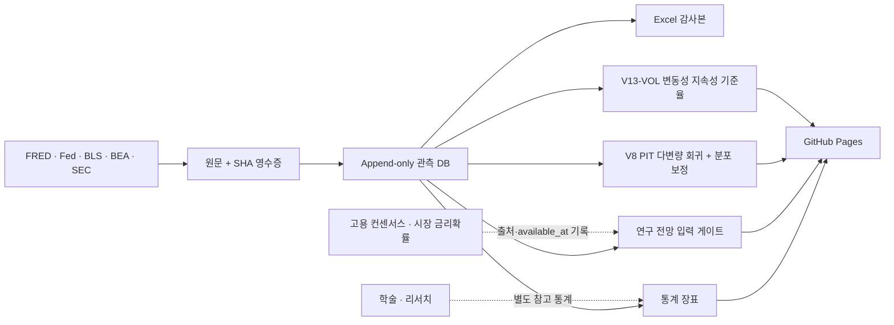

  

  
  
  
  

# Jin's Investing Prediction

**공식 데이터의 현재 위치, 구조 경로와 실제 기록, PIT 시계열 예측, 변동성 기준율, 닷컴 사이클 비교를 연결하는 투자 리서치 솔루션입니다.**

  <a href="https://sung-jinpark.github.io/Jin-s-investing-prediction/#today"><strong>오늘</strong></a> ·
  <a href="https://sung-jinpark.github.io/Jin-s-investing-prediction/#future"><strong>미래 전망</strong></a> ·
  <a href="https://sung-jinpark.github.io/Jin-s-investing-prediction/#statistics"><strong>통계</strong></a> ·
  <a href="https://sung-jinpark.github.io/Jin-s-investing-prediction/#timeseries"><strong>시계열 예측</strong></a> ·
  <a href="https://sung-jinpark.github.io/Jin-s-investing-prediction/#trust"><strong>검증</strong></a>

## 무엇을 보여주나요?

| 현재 시장 | 미래 전망 | 시계열 예측 | 변동성 기준율 | 닷컴 비교 | 검증 기록 |
|---|---|---|---|---|---|
| 핵심 가격·거시 신호 | 세 가지 시장 경로·단일 시나리오·기록 대비 실제 | NASDAQ 1·5·21·63거래일 | VIX·실현변동성 5·21·63영업일 | 유동성·금리·신용·기업가치 | 원천·시점·수정·전진 검증 이력 |

미래 전망은 연구 후보이며 공식 확률이나 매매 신호가 아닙니다. 세 경로는 현재 기준점만 공유하고 서로 다른 역사 군집·특징·국면 전환 규칙을 사용합니다.

단일 시나리오와 기록 대비 실제 그래프는 과거 조정의 굴곡을 반영한 **주간 구조 경로를 우선 표시**합니다. 일별 중앙값은 구조 경로가 없는 기록의 대체 표시이며, 과거에 남긴 전망과 이후 실제 가격을 대조합니다. 구조 경로는 특정 하락일이나 저점 거래일을 예측하지 않습니다.

시계열 예측은 별도 shadow 연구모델입니다. **V8**은 PIT 다변량 회귀와 분포 보정으로 NASDAQ의 1·5·21·63거래일 분위수·상승확률을 산출하며, 봉인 Gate 통과 모델의 전진 예측·만기 결과를 누적합니다. Research Gate와 운영 신선도 Gate를 모두 통과할 때만 참고 의견으로 표시하며 기존 미래전망·공식 확률과 결합하지 않습니다. 2019년 이후 평가창은 완전한 미열람 표본이 아니므로 별도 전진 검증을 계속합니다. 이전 V5의 **HOLD** 판정도 보존합니다. [V8 계약](data/contracts/multivariate_timeseries_v8.yaml) · [V5 봉인 결과](docs/timeseries_v5/GATE_RESULT_20260824.md)

**V13-VOL**은 동결된 지속성 모델로 VIX·실현변동성 이벤트의 기준율을 제공합니다. 홀드아웃은 9셀 중 3셀(VIX 25 이상·21영업일, 실현변동성·5/21영업일)만 통과했으며 나머지 6셀의 숫자는 표시하지 않습니다. 통과 셀도 신선도·계수 무결성·라이브 검증 상태에 따라 보류할 수 있습니다. AI 질문 예측과 정의·지평·출처를 구분하며 자동 합산하거나 매매 신호로 사용하지 않습니다. [V13-VOL 계약·셀별 표시 정책](data/contracts/multivariate_timeseries_v13_vol.yaml)

## 숫자가 화면에 도착하는 과정

```mermaid
flowchart LR
    A["FRED · Fed · BLS · BEA · SEC"] --> B["원문 + SHA 영수증"]
    B --> C["Append-only 관측 DB"]
    C --> D["Excel 감사본"]
    C --> E["통계 장표"]
    C --> F["연구 전망 입력 게이트"]
    C --> T["V8 PIT 다변량 회귀 + 분포 보정"]
    C --> V["V13-VOL 변동성 지속성 기준율"]
    E --> G["GitHub Pages"]
    F --> G
    T --> G
    V --> G
    R["학술 · 리서치"] -. "별도 참고 통계" .-> E
    M["고용 컨센서스 · 시장 금리확률"] -. "출처·available_at 기록" .-> F
```

- 자동 갱신 통계는 등록된 공식·1차 원천과 원문 영수증으로 계산합니다.
- 공식 대체 DB가 없는 학술·리서치 수치는 **참고 통계**로 분리하며 공식 통계 원장에 섞지 않습니다.
- 고용 컨센서스와 시장 금리확률은 출처와 `available_at`을 남긴 연구 후보 입력으로 사용할 수 있지만, 공식 확률이나 챔피언 승격을 뜻하지 않습니다.
- 수정치는 기존 행을 바꾸지 않고 `revision + supersedes`로 추가합니다.
- 과거 전망 입력은 `available_at ≤ as_of`를 만족해야 합니다.
- 확률은 `[0, 1]` 분수로 저장하고 화면·보고서에서만 퍼센트로 변환합니다.
- 검증 화면은 행 평균과 문항 등가중 점수를 병기하며, P3 게이트 미결 상태를 통과로 표시하지 않습니다.
- Excel은 사람이 보는 감사본이며 정본은 append-only 관측 원장입니다.

## 현재 통계 구성

- **유동성** — M2, MMF, 가계 현금성 자산, S&P 500, NASDAQ, Bitcoin
- **금리·신용** — 장단기 금리차, 정책금리, 회사채 부담, 대출기준, 가계부채
- **경기·물가** — 실업률, CPI, WTI, 구리, Census 주택착공, 제조업 확산
- **기업가치** — 기업주식 가치, 세후이익, 기업이익 증가율
- **자본시장** — SEC 공식 IPO 구성 + 기술 IPO 수·첫날 수익률·P/S·흑자/적자 비중·AI 핵심 IPO 비교
- **한국·반도체** — OECD 한국 주가지수와 Nasdaq SOX 공식 배포 계열

현재선은 마지막 실제 관측에서 멈추며 미래 값을 임의로 이어 붙이지 않습니다.

## 데이터 계약

| 계약 | 위치 |
|---|---|
| 공식 숫자 원천 허용목록 | [`authoritative_statistics_sources.yaml`](data/contracts/authoritative_statistics_sources.yaml) |
| 웹 장표·전망 계보 | [`website_data_lineage_v1.yaml`](data/contracts/website_data_lineage_v1.yaml) |
| 누적 관측 DB | [`normalized_observations.jsonl`](data/statistics/official_store/ledgers/normalized_observations.jsonl) |
| 원문·수집 영수증 | [`raw/`](data/statistics/official_store/raw/) · [`raw_receipts.jsonl`](data/statistics/official_store/ledgers/raw_receipts.jsonl) |
| 영수증 정정 이력 | [`raw_receipt_corrections.jsonl`](data/statistics/official_store/ledgers/raw_receipt_corrections.jsonl) |
| 시계열 V1 / V2 사전등록 | [`multivariate_timeseries_v1.yaml`](data/contracts/multivariate_timeseries_v1.yaml) · [`multivariate_timeseries_v2.yaml`](data/contracts/multivariate_timeseries_v2.yaml) |
| 시계열 PIT / V2 원장 | [`data/timeseries/`](data/timeseries/) · [`data/timeseries_v2/`](data/timeseries_v2/) |
| 시계열 V4 원천·Gate | [`multivariate_timeseries_v4.yaml`](data/contracts/multivariate_timeseries_v4.yaml) · [`data/timeseries_v4/`](data/timeseries_v4/) |
| 시계열 V5 직접분포·공개 DB | [`multivariate_timeseries_v5.yaml`](data/contracts/multivariate_timeseries_v5.yaml) · [`V5 아키텍처`](docs/timeseries_v5/ARCHITECTURE.md) · [`데이터 카탈로그`](docs/timeseries_v5/DATA_CATALOG.md) |
| 시계열 V8 계약·shadow 원장 | [`multivariate_timeseries_v8.yaml`](data/contracts/multivariate_timeseries_v8.yaml) · [`data/timeseries_v8/`](data/timeseries_v8/) |
| V13-VOL 계약·동결 계수·라이브 원장 | [`multivariate_timeseries_v13_vol.yaml`](data/contracts/multivariate_timeseries_v13_vol.yaml) · [`data/timeseries_v13/`](data/timeseries_v13/) |
| P3 게이트·검증 기준과 실행 기록 | [`P3 문서 인덱스`](docs/p3_gate_path/00_README_INDEX.md) · [`실행 결과`](docs/p3_gate_path/00_EXECUTION_REPORT.md) |

---

  <strong>Evidence first. Scenario aware. Auditable by design.</strong> 
  정보 제공 목적의 투자 리서치 시스템이며 자동매매·주문 실행·수익 보장 서비스가 아닙니다.

