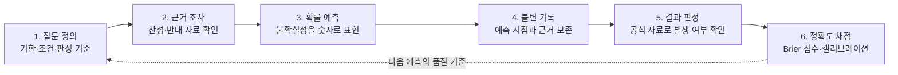
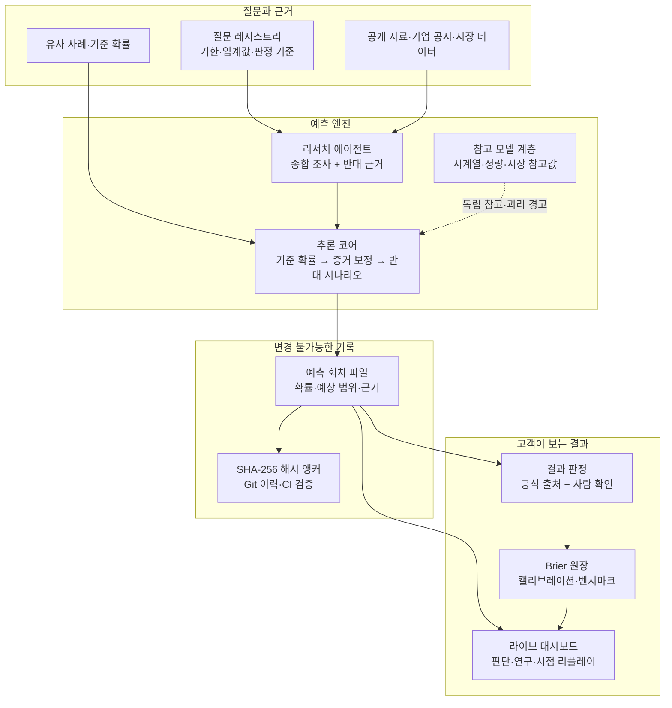
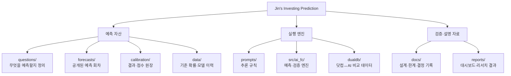

<h1 align="center">Jin's Investing Prediction</h1>

<p align="center"><strong>복잡한 시장 이슈를 검증 가능한 확률로 바꾸는 AI 의사결정 보조 솔루션</strong></p>

<p align="center">
시장 전망을 한 번 말하고 끝내지 않습니다.<br>
질문을 명확히 정의하고, 근거를 모아 확률로 기록한 뒤, 실제 결과가 나오면 정확도를 채점합니다.
</p>

<p align="center">
<a href="https://sung-jinpark.github.io/Jin-s-investing-prediction/"><strong>라이브 대시보드 열기</strong></a> ·
<a href="forecasts/2026/">예측 기록 살펴보기</a> ·
<a href="#누구나-확인할-수-있는-예측-기록">검증 방법 보기</a>
</p>

<p align="center">
<a href="https://github.com/Sung-JinPark/Jin-s-investing-prediction/actions/workflows/verify.yml"></a>


</p>

---

## 이 솔루션은 무엇을 해결하나요?

시장에는 의견이 많지만, 나중에 맞았는지 확인하기 어려운 경우가 많습니다.

- “반도체가 좋아질 것 같다”처럼 **판정 기준이 모호**합니다.
- 전망이 바뀌어도 **언제, 왜 바뀌었는지** 추적하기 어렵습니다.
- 결과가 나온 뒤 과거 설명이 달라져도 **원래 예측을 확인하기 어렵습니다**.
- 높은 적중률을 주장해도 **전체 기록과 계산 방법이 공개되지 않는 경우**가 많습니다.

Jin's Investing Prediction은 시장 의견을 다음과 같은 질문으로 바꿉니다.

> “정해진 날짜까지 특정 사건이, 미리 정한 기준에 따라 발생할 것인가?”

그리고 질문마다 현재 확률, 근거, 변경 이력, 판정일을 함께 기록합니다. 아직 실제 예측 회차가 없는 질문은 임의의 숫자를 만들지 않고 **`산출 전`**으로 표시합니다.

## 고객이 얻게 되는 것

| 원하는 답 | 솔루션이 제공하는 것 |
|---|---|
| 지금 시장을 어떻게 봐야 하나요? | 상승·중립·조정 경로와 주요 위험 구간을 한 화면에서 보여줍니다. |
| 어떤 질문을 다시 확인해야 하나요? | 확률이 변했거나 판정일이 가까운 질문을 Decision Queue로 모아줍니다. |
| 이 확률은 왜 나왔나요? | 기준 확률, 찬성·반대 근거, 관찰 변수와 회차별 판단을 함께 보여줍니다. |
| 과거에는 어떻게 판단했나요? | 선택한 날짜 당시의 예측 상태를 다시 구성해 현재 판단과 비교합니다. |
| 실제로 잘 맞았나요? | 결과가 나온 모든 회차를 Brier 점수로 채점하고 누적 기록을 공개합니다. |

## 작동 방식

전문적인 모델 이름을 몰라도 흐름은 단순합니다.


```mermaid
flowchart LR
    A["1. 질문 정의<br/>기한·조건·판정 기준"] --> B["2. 근거 조사<br/>찬성·반대 자료 확인"]
    B --> C["3. 확률 예측<br/>불확실성을 숫자로 표현"]
    C --> D["4. 불변 기록<br/>예측 시점과 근거 보존"]
    D --> E["5. 결과 판정<br/>공식 자료로 발생 여부 확인"]
    E --> F["6. 정확도 채점<br/>Brier 점수·캘리브레이션"]
    F -.->|"다음 예측의 품질 기준"| A
```

핵심은 **예측 → 기록 → 판정 → 채점**의 순환입니다. 좋은 설명보다 장기간 축적된 검증 가능한 기록을 더 중요하게 봅니다.

## 라이브 대시보드에서 할 수 있는 일

[라이브 대시보드](https://sung-jinpark.github.io/Jin-s-investing-prediction/)는 별도 로그인 없이 읽을 수 있는 정적 사이트입니다.

| 화면 | 무엇을 볼 수 있나요? |
|---|---|
| **오늘의 판단** | 현재 시장 요약, 다시 볼 질문, 핵심 예측 확률 |
| **시장 맵** | 연말 시나리오 경로, 주요 이벤트, 과거 혁신 사이클 비교 |
| **예측 연구** | 전체 질문 검색, 분야·테마 필터, 질문별 근거와 회차 이력 |
| **시점 리플레이** | 특정 날짜 당시의 예측과 이후 변화 |
| **트랙레코드** | 해결된 예측, Brier 점수, 확률대별 캘리브레이션 |

대시보드는 커밋된 예측 기록에서 자동으로 만들어집니다. 웹페이지가 별도로 예측을 실행하거나 데이터를 수정하지 않습니다.

## 왜 결과를 신뢰할 수 있도록 설계했나요?

### 1. 예측을 사후에 고칠 수 없습니다

한 번 공개된 예측은 하나의 독립 파일로 남습니다. 새 판단은 기존 파일 수정이 아니라 새로운 회차로 추가됩니다.

### 2. 맞은 예측만 골라 보여주지 않습니다

질문과 예측 기록은 전체 원장에 남고, 결과가 나온 모든 회차가 채점 대상이 됩니다.

### 3. AI 외의 관점으로 견제합니다

오픈웨이트 시계열 모델, 정량 모델, 옵션·예측시장의 내재확률을 참고합니다. 이 값들을 공식 확률에 기계적으로 섞지는 않고, 판단이 크게 다른 경우 재검토 신호로 사용합니다.

### 4. 모르는 값은 모른다고 표시합니다

근거가 없거나 예측 회차가 아직 생성되지 않았다면 숫자를 추정해 채우지 않습니다. 대시보드는 이를 `산출 전`, `회차 없음`, `기록 없음`으로 구분합니다.

### 5. 성능 주장은 충분한 표본 뒤에만 허용합니다

현재는 **Phase P1 — 포워드 예측 기록 축적 단계**입니다. 해결 표본이 아직 작기 때문에 실전 우월성을 주장하지 않습니다. 표본 수에 따라 앙상블, 보정, edge 기능이 순차적으로 열리는 게이트를 사용합니다.

## 시스템 구조

공식 예측과 참고 모델, 웹 대시보드, 검증 원장을 의도적으로 분리했습니다.


```mermaid
flowchart TB
    subgraph INPUT["질문과 근거"]
        Q["질문 레지스트리<br/>기한·임계값·판정 기준"]
        S["공개 자료·기업 공시·시장 데이터"]
        B["유사 사례·기준 확률"]
    end

    subgraph FORECAST["예측 엔진"]
        R["리서치 에이전트<br/>종합 조사 + 반대 근거"]
        C["추론 코어<br/>기준 확률 → 증거 보정 → 반대 시나리오"]
        REF["참고 모델 계층<br/>시계열·정량·시장 참고값"]
    end

    subgraph RECORD["변경 불가능한 기록"]
        F["예측 회차 파일<br/>확률·예상 범위·근거"]
        H["SHA-256 해시 앵커<br/>Git 이력·CI 검증"]
    end

    subgraph OUTPUT["고객이 보는 결과"]
        W["라이브 대시보드<br/>판단·연구·시점 리플레이"]
        V["결과 판정<br/>공식 출처 + 사람 확인"]
        L["Brier 원장<br/>캘리브레이션·벤치마크"]
    end

    Q --> R
    S --> R
    B --> C
    R --> C
    REF -.->|"독립 참고·괴리 경고"| C
    C --> F
    F --> H
    F --> W
    F --> V
    V --> L
    L --> W
```

실선은 공식 기록 흐름이고, 점선은 공식 확률을 견제하는 참고 신호입니다.

## 누구나 확인할 수 있는 예측 기록

이 저장소의 핵심 주장인 “예측을 결과가 나온 뒤 수정하지 않았다”는 다음 명령으로 직접 확인할 수 있습니다.

```bash
git clone https://github.com/Sung-JinPark/Jin-s-investing-prediction.git
cd Jin-s-investing-prediction
python tools/verify_track_record.py
```

추가 패키지 설치 없이 표준 Python과 Git만 사용합니다.

검증기는 다음 항목을 확인합니다.

1. 예측 파일과 SHA-256 해시 앵커가 일치하는지
2. 공개 이후 예측 파일이 수정되거나 삭제되지 않았는지
3. 예측 커밋 시각이 질문 마감보다 앞서는지
4. 공개된 결과로 Brier 점수를 다시 계산할 수 있는지

기록의 증명 강도도 숨기지 않습니다.

- **A급 기록**: 공개 baseline 이후 생성되어 원격 Git 이력으로 시점을 확인할 수 있는 예측
- **B급 기록**: 초기 baseline에 함께 포함되어 내부 해시와 정합성만 확인할 수 있는 예측

`forecasts/.hashes`는 OpenTimestamps를 통해 비트코인 블록체인에도 앵커할 수 있으며, GitHub Actions가 매 푸시마다 동일한 검사를 수행합니다.

## 저장소 구조


```mermaid
flowchart TB
    ROOT["Jin's Investing Prediction"] --> RECORD["예측 자산"]
    ROOT --> ENGINE["실행 엔진"]
    ROOT --> KNOWLEDGE["검증·설명 자료"]

    RECORD --> Q["questions/<br/>무엇을 예측할지 정의"]
    RECORD --> F["forecasts/<br/>공개된 예측 회차"]
    RECORD --> C["calibration/<br/>결과·점수 원장"]
    RECORD --> D["data/<br/>기준 확률·모델 이력"]

    ENGINE --> P["prompts/<br/>추론 규칙"]
    ENGINE --> E["src/ai_fc/<br/>예측·검증 엔진"]
    ENGINE --> T["dualdb/<br/>닷컴↔AI 비교 데이터"]

    KNOWLEDGE --> DOC["docs/<br/>설계·한계·결정 기록"]
    KNOWLEDGE --> REP["reports/<br/>대시보드·리서치 결과"]
```

| 폴더 | 역할 |
|---|---|
| `questions/` | 질문, 판정 기준, 일정과 관찰 변수를 정의합니다. |
| `forecasts/` | 수정할 수 없는 예측 회차와 근거를 보관합니다. |
| `calibration/` | 결과, Brier 점수, 모델·시장 벤치마크를 누적합니다. |
| `data/` | Base Rate와 ML·시장 참고 모델의 산출 이력을 보관합니다. |
| `prompts/` | 예측 추론 절차와 품질 규칙을 버전 관리합니다. |
| `src/ai_fc/` | 질문 관리, 조사, 예측, 판정, 검증, 대시보드 엔진입니다. |
| `dualdb/` | 닷컴 시대와 AI 시대를 비교하는 독립 데이터 패키지입니다. |
| `docs/` | 아키텍처, 모델 카드, 의사결정 기록과 알려진 한계입니다. |
| `reports/` | 캘리브레이션 보고서와 시장 리서치 산출물입니다. |

## 개발자용 빠른 시작

Python 3.12 환경을 권장합니다.

```bash
uv sync

# 오늘 갱신하거나 판정할 질문 확인
uv run ai-fc due

# 불변 기록과 파생 인덱스 정합성 확인
uv run ai-fc sync --check

# 로컬 대시보드 생성
cd src
python -m ai_fc dashboard
```

주요 명령:

```bash
cd src
python -m ai_fc forecast          # 새 예측 회차 생성
python -m ai_fc resolve --draft   # 기계 판정 초안 — 최종 확정은 사람
python -m ai_fc report            # 캘리브레이션 보고서 생성
python -m ai_fc dashboard --serve --host 0.0.0.0
```

API 키는 `ANTHROPIC_API_KEY` 환경변수로만 주입합니다. 저장소와 예측 파일에는 시크릿을 기록하지 않습니다.

## 더 깊이 살펴보기

- [아키텍처](docs/ARCHITECTURE.md) — 예측 시스템의 전체 계층
- [모델 레지스트리](docs/MODEL_REGISTRY.md) · [모델 카드](docs/models/) — 사용 모델과 역할
- [의사결정 기록](docs/DECISIONS.md) — 중요한 설계 선택과 이유
- [알려진 한계](docs/KNOWN_LIMITS.md) — 통계·데이터·운영상의 약점
- [운영 가이드](docs/P1_OPERATIONS.md) — 일상 실행 절차
- [질문 제작 가이드](questions/FACTORY_GUIDE.md) · [수확 캘린더](questions/HARVEST_CALENDAR.md)
- [변경 이력](docs/CHANGELOG.md)

## 운영 원칙

1. **해소 가능한 질문만 예측합니다.** 기한과 판정 기준이 없는 전망은 공식 기록이 아닙니다.
2. **라이브 포워드 기록만 인정합니다.** 결과를 알고 수행한 LLM 과거 백테스트는 성능 근거로 사용하지 않습니다.
3. **캘리브레이션을 우선합니다.** 기록과 채점이 없는 예측은 존재하지 않는 예측으로 봅니다.
4. **모델 간 차이를 숨기지 않습니다.** 큰 괴리는 자동 매매 신호가 아니라 재검토 사유입니다.
5. **최종 판단은 사람에게 남깁니다.** 자동화는 조사와 기록의 폭을 넓히고, 투자 결정은 대신하지 않습니다.

---

> **Disclaimer**
>
> 본 저장소와 대시보드는 투자 자문, 매매 권유 또는 수익 보장 서비스가 아닙니다.
> 모든 확률과 리포트는 의사결정을 돕기 위한 참고 의견이며, 데이터 오류와 모델 한계가 있을 수 있습니다.
> 과거 기록은 미래 성과를 보장하지 않습니다.
