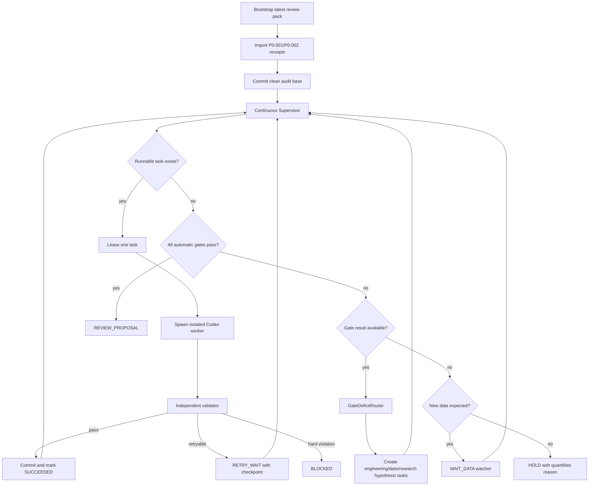

# NASDAQ V7-R3 루프 중단 원인 정밀 감사 및 Ralph R4 Gate 통과 설계서

- 기준일: 2026-08-26
- 최신 검토 팩: `NASDAQ_V7_R3_P0_001_P0_002_FULL_REVIEW_PACK_20260826.zip`
- 직전 실패 학습 run: `v7-alfred-20260825T083047Z`
- 모델 ID: `shadow.nasdaq_pit_hierarchical_distribution_v7`
- 현재 모델 상태: **HOLD_RESEARCH_GATE**
- 본 문서의 핵심 결론: **코덱스가 실패해서 멈춘 것이 아니라, 매 프롬프트와 task acceptance가 “한 Task만 처리하고 다음 Task는 시작하지 말라”로 설계되어 있고, 그 다음 Task를 자동으로 lease할 상위 supervisor가 구현되지 않아 의도적으로 정지했다.**

---

## 1. 최종 판정

최신 산출물에서 성공한 것은 다음 두 작업이다.

| Task | 결과 | 실제 의미 |
|---|---|---|
| `V7R3-P0-001` | SUCCEEDED | ALFRED/PIT 실패 run을 재현하고 Gate HOLD를 확인 |
| `V7R3-P0-002` | SUCCEEDED | 보호 baseline과 현재 파일 4개의 Git provenance를 규명 |
| V7 연구 Gate | **FAIL/HOLD** | 예측 모델 성능은 통과하지 못함 |
| `V7R3-P0-003` | **미시작** | append-only baseline correction조차 아직 실행되지 않음 |
| 반복 Ralph loop | **미구현** | P0-001/P0-002 이후 자동 task lease가 없음 |

최신 팩의 55개 Manifest 항목은 모두 SHA-256 검증을 통과했다. 그러나 task 저장소에는 P0-001/P0-002 산출물이 아직 untracked 상태이며, P0-003을 시작하지 않았다는 것이 팩 자체에 명시돼 있다.

따라서 지금 필요한 것은 또 하나의 단일-task 프롬프트가 아니다. 다음 두 층을 분리해 구현해야 한다.

1. **부모 Ralph Supervisor**: 다음 Task를 자동으로 고르고 새로운 Codex subprocess를 반복 호출한다.
2. **자식 Codex Worker**: 한 번에 Task 하나만 격리된 worktree에서 수행한다.

한 Task 격리 원칙 자체는 유지한다. 문제는 자식이 끝난 뒤 부모가 존재하지 않았다는 것이다.

---

## 2. 왜 루프가 돌지 않았는가

### STOP-01 — 기존 마스터 프롬프트가 다음 Task 시작을 명시적으로 금지

기존 R3 마스터 프롬프트와 첫 Task 프롬프트에는 다음 규칙이 반복된다.

```text
one task = yes
Codex는 다음 task를 시작하지 않는다.
모든 acceptance가 통과해도 다음 task를 시작하지 말고 종료한다.
```

P0-001과 P0-002의 result에도 모두 다음 값이 기록됐다.

```json
"next_task_started": false
```

이는 오류가 아니라 기존 프롬프트의 정확한 이행이다.

### STOP-02 — 다음 Task를 lease할 부모 Supervisor가 없음

설계 문서에서는 Controller가 다음 Task를 lease하도록 돼 있었지만, 실제 실행 경로에는 다음 기능이 연결되지 않았다.

- backlog import
- dependency resolution
- task state persistence
- next eligible task selection
- Codex subprocess dispatch
- 결과 독립 검증
- 자동 commit
- 다음 task 재호출

현재 backlog 기준 P0-001과 P0-002가 성공했다면 즉시 실행 가능한 Task는 다음 둘이다.

```text
V7R3-P0-003  Restore or formally correct protected baseline
V7R3-P0-004  Freeze reproducible Python runtime and wheel hashes
```

그러나 이를 자동으로 시작할 프로세스가 없었다.

### STOP-03 — 연구 Gate 실패를 프로세스 오류 코드 2로 반환

현재 `tools/ralph_v7.py run`은 controller 결과의 return code를 그대로 반환한다.

```python
return outcome.returncode
```

직전 ALFRED run의 상태와 return code는 다음이다.

```text
state      = HOLD_RESEARCH_GATE
returncode = 2
```

따라서 다음과 같은 일반적인 shell wrapper는 즉시 종료된다.

```bash
set -e
python tools/ralph_v7.py run ...   # return code 2
# 여기 아래는 실행되지 않음
```

**모델 Gate 실패는 연구 재계획 신호이지 controller 오류가 아니다.** R4에서는 이를 다음처럼 분리한다.

| 상태 | 프로세스 exit | 다음 행동 |
|---|---:|---|
| `RESEARCH_GATE_FAILED_REPLAN` | 0 | 진단 후 새 가설·generation |
| `WAIT_DATA` | 0 | DB trigger 대기 |
| `RETRY_WAIT` | 0 | retry_at 이후 재실행 |
| `REVIEW_PROPOSAL` | 0 | 자동 Gate 완료 |
| `BLOCKED_SECURITY` | 2 | 즉시 중단 |
| `BLOCKED_PROTECTED_SCOPE` | 2 | diff 폐기 후 중단 |
| `CONTROLLER_BUG` | 2 | 코드 수리 Task 생성 |

### STOP-04 — 현재 controller는 one-cycle executor

현재 open-data 경로는 다음을 한 번 호출한다.

```text
COLLECT
→ VERIFY_RAW
→ PARSE
→ RECONCILE
→ MATERIALIZE_PIT
→ MATURE_LABELS
→ DATA_QUALITY_GATE
→ PLAN_RESEARCH
→ TRAIN
→ NESTED_BACKTEST
→ STACK
→ CALIBRATE
→ QUALIFICATION
→ 종료
```

`while` 기반 recurring scheduler, 다음 generation 생성, Gate 진단 기반 task routing이 없다.

### STOP-05 — 동일 run ID 재실행을 append-only 규칙이 차단

현재 pipeline은 같은 run directory가 있으면 다음 오류를 낸다.

```text
append-only run already exists
```

append-only 원칙은 옳지만 identity가 잘못됐다. R4에서는 다음을 분리해야 한다.

```text
run_id         장기 Ralph 실행 단위
cycle_id       수집·정합성 점검 주기
hypothesis_id  연구 가설
 generation_id 학습·평가 동결 단위
 task_key      단일 작업
 attempt_id    재시도
```

같은 run 안에서 cycle과 generation을 새로 발급해야 하며 기존 directory를 재사용해서는 안 된다.

### STOP-06 — P0 산출물이 commit되지 않은 dirty task repository

최신 review pack의 Git 상태에서 P0-001/P0-002 관련 도구·테스트·문서가 `??` untracked 상태다. 자동 task dispatcher가 clean worktree를 전제로 하면 다음 Task를 안전하게 만들 수 없다.

R4 bootstrap은 가장 먼저 다음을 수행해야 한다.

1. 최신 review pack SHA-256 검증
2. P0-001/P0-002 result import
3. 허용 파일과 secret scan 재검증
4. 별도 audit commit 생성
5. clean base SHA 고정

### STOP-07 — 데이터 freshness 실패가 remediation task로 연결되지 않음

전체 regression은 다음 한 건으로 실패했다.

```text
dualdb/tests/test_sentinels.py::test_ixic_coverage
last ^IXIC date = 2026-08-12
evaluation date = 2026-08-26
```

현재는 이를 `missing_data_freshness`라는 non-binding 실패로 분류하고 종료한다. 올바른 동작은 다음이다.

```text
DATA_STALE
→ target collector task 자동 생성
→ completed XNAS session까지 backfill
→ receipt/hash 검증
→ sentinel 재실행
→ 성공 시 원래 task 재개
```

### STOP-08 — 자동화 구현 Task가 backlog 후반 P6에 위치

105개 backlog에서 실제 controller CLI와 Codex dispatcher는 P6에 있다. 즉 자동화가 필요한 P0~P5의 수십 개 Task를 모두 수동 실행한 뒤에야 자동화가 생기는 역순 구조다.

R4에서는 `BOOTSTRAP_AUTOMATION`을 모든 Task보다 앞에 배치한다.

### STOP-09 — 기술적 reviewer task가 수동 장벽

기존 backlog에는 `reviewer` worker가 여러 dependency chain의 필수 노드로 존재한다. 예를 들어 P0-010이 끝나지 않으면 PostgreSQL P1이 시작되지 않는다.

다음은 deterministic policy reviewer가 자동 승인할 수 있다.

- 테스트·manifest·secret scan의 기술적 PASS
- migration apply/rollback
- data lineage completeness
- candidate contract/runtime hash 일치

다음만 사람 승인을 유지한다.

- Gate threshold 변경
- comparator 변경
- 신규 model contract의 prospective freeze
- 고객 공개
- 실제 매매

### STOP-10 — Gate 실패 후 무엇을 고칠지 자동 진단하는 계층이 없음

현재 Gate는 boolean check를 반환하지만, 실패 check를 engineering/data/model/calibration task로 변환하지 않는다. R4에는 `GateDeficitRouter`가 필요하다.

---

## 3. 현재 Gate 실패 벡터

직전 ALFRED/PIT run의 재계산 결과는 다음이다.

| 항목 | 현재 | 요구 | 부족분/상태 |
|---|---:|---:|---|
| 1일 CRPS skill | +1.53% | 장기 Gate 비대상 | 소폭 개선 |
| 5일 CRPS skill | -4.34% | 비음수 권고 | 실패 |
| 21일 CRPS skill | **-119.14%** | ≥0% | 심각한 실패 |
| 63일 CRPS skill | **-23.13%** | ≥0% | 실패 |
| 21·63일 평균 skill | **-71.13%** | ≥+2% | 심각한 실패 |
| paired CI upper | +0.04445 | ≤0 | 실패 |
| 80% coverage | 76.16% | 76~84% | 통과 |
| 50% coverage | 43.78% | 45~55% | 1.22%p 부족 |
| balanced direction | 51.40% | ≥52% | 0.60%p 부족 |
| P(up) Brier | 0.25060 | <0.23408 | 실패 |
| extreme Q4 coverage | 58.86% | ≥60% | 1.14%p 부족 |
| catastrophic underperformance | 650.56% | ≤10% | 심각한 실패 |
| historical stress | FAIL | PASS | tightening coverage 등 미달 |

현재 실패는 데이터가 며칠 덜 쌓여서 발생한 수준이 아니다. **고정 E2 강제 혼합이 21·63일과 위기·반등 구간을 파괴한 구조적 실패**다.

---

## 4. 현재 모델이 무너진 직접 원인

### 4.1 E2를 성능과 무관하게 강제 혼합

현재 실행 경로는 horizon별로 다음 비중을 고정한다.

```text
1일:  E0 20% + E2 80%
5일:  E0 25% + E2 75%
21일: E0 40% + E2 60%
63일: E0 50% + E2 50%
```

계약의 `minimum_ensemble_weight`는 E0의 하한이지 E2의 고정 비중이 아니다. E2가 stacking fold에서 E0보다 나쁘면 E2 weight는 정확히 0이어야 한다.

### 4.2 실행 E2가 계약의 true Student-t regression이 아님

현재 구현은 사실상 다음이다.

```text
Ridge location
+ in-sample absolute residual의 Ridge log-scale
+ df=5 고정
+ alpha=1 고정
```

계약은 다음 grid와 joint NLL을 요구한다.

```text
df    ∈ {3,5,8,12}
alpha ∈ {0.01,0.1,1.0}
objective = joint location-scale Student-t NLL
```

현재 scale은 in-sample residual에서 만들어져 장기 overlapping target에서 과도하게 낙관적인 scale을 만들 수 있다. 반드시 cross-fitted residual을 사용해야 한다.

### 4.3 실제 learned stacking 미실행

`STACK` stage 이름은 존재하지만 방법은 다음 문자열뿐이다.

```text
fixed_nonnegative_E0_floor_plus_E2
```

또 기존 `fit_weights`가 component별 CRPS의 단순 가중평균을 최소화한다면 이는 실제 mixture CRPS가 아니다. 실제 empirical mixture의 CRPS는 다음 항을 포함해야 한다.

```text
CRPS(F_w, y)
= Σ_i w_i E|X_i-y|
  - 0.5 Σ_i Σ_j w_i w_j E|X_i-X_j|
```

R4는 이 실제 mixture CRPS를 stacking fold에서 최소화해야 한다.

### 4.4 calibration stage가 실질적으로 없음

현재 `CALIBRATE`는 다음 상태다.

```text
none_first_generation_unmodified_distribution
```

50% coverage, extreme coverage, Brier, stress-tail 실패를 고칠 수 없다.

### 4.5 macro feature가 release event가 아니라 daily forward-filled row 차분

월간·분기 ALFRED series를 일별 row에 투영한 뒤 `diff(21)`, `diff(63)`, `diff(252)`를 적용한다. 이 구조는 신규 발표, 단순 carry, revision을 구분하지 못한다.

R4에서 필요한 feature는 다음이다.

```text
first_release_value
latest_known_value_at_origin
revision_amount
revision_count
revision_volatility
change_since_previous_release
release_surprise
release_age
revision_age
filtered factor innovation
```

### 4.6 origin cutoff가 canonical XNAS close가 아님

현재 origin cutoff는 target observation의 availability에서 파생된다. 계약상 cutoff는 versioned XNAS calendar의 completed-session close여야 한다.

---

## 5. 가장 성공 확률이 높은 Gate 통과 순서

### Generation G0 — 손실 차단 및 검증 기반 복구

목표는 PASS가 아니라 대형 음수 skill 제거다.

1. canonical XNAS calendar
2. exact E0 sample identity
3. interval-aware five-role folds
4. E2 weight를 0으로 만들 수 있는 no-regret stacking
5. E0-only fallback
6. component ablation과 sample hash

예상되는 정상 결과는 장기 skill이 최소한 0% 부근으로 복귀하는 것이다. 이 단계에서 +2%를 억지로 만들지 않는다.

### Generation G1 — 직접 horizon location 개선

다음 후보를 E0의 절대 대체가 아니라 **E0 대비 correction expert**로 학습한다.

- E1 direct quantile elastic net
- true E2 Student-t distributional regression
- E3 quantile HGB
- E4 filtered DLM

핵심 안전장치:

```text
candidate correction bound = k × E0 scale
candidate가 stacking fold에서 E0보다 나쁘면 weight=0
feature subset stability 미달이면 탈락
위기 phase >10% 악화 후보 탈락
```

### Generation G2 — learned stacking과 cross-fit calibration

Horizon별로 별도 weight를 학습한다.

```text
w >= 0
Σw = 1
w_E0 >= anchor_floor
unavailable/stale component weight = 0
mixture CRPS가 E0보다 개선되지 않으면 E0=1
```

Calibration fold에서 다음을 분리한다.

- location shift
- central scale
- positive tail scale
- negative tail scale
- zero-threshold CDF calibration for P(up)

### Generation G3 — stress와 extreme Q4 개선

- E5 learned soft regime partial pooling
- E6 positive/negative asymmetric EVT
- E7 full 63-session analog trajectory
- high-volatility conditional conformal scale

목표는 전체 band를 무작정 넓히지 않고 extreme/stress에서만 tail을 확장하는 것이다.

### Generation G4 — 공식 공개데이터 challenger

G0~G3로 +2% skill이 나오지 않을 때만 다음 source를 연구-only 후보로 추가한다.

- BLS 직접 release/revision
- BEA
- Census Economic Indicators
- Treasury nominal/real curve
- New York Fed liquidity/rates
- SEC EDGAR earnings·fundamental revision
- OFR FSI
- Cboe volatility indices
- CFTC positioning

신규 source는 기존 V7 Gate를 본 후 몰래 넣지 않는다. 별도 사전등록된 challenger generation 또는 V8 contract로 동결한 뒤 평가한다.

---

## 6. Ralph R4 핵심 구조



중요한 원칙은 **Codex worker는 한 Task만 수행하지만 Supervisor는 멈추지 않는 것**이다.

---

## 7. Task 자동 선택 알고리즘

### 7.1 우선순위

```text
1. security/protected/runtime blocker
2. stale target 및 source freshness
3. PIT/calendar/lineage
4. validation independence
5. exact baseline/scoring
6. core models E1~E3
7. stacking/calibration
8. stress/tail/path
9. additional data challengers
10. prospective accumulation
```

### 7.2 Gate deficit routing

| 실패 check | 자동 생성 Task |
|---|---|
| target stale | target collector/backfill/reconciliation |
| PIT leakage | cutoff·availability·lineage repair |
| contract/runtime mismatch | candidate factory 및 hash binding repair |
| h21/h63 음수 | component ablation, no-regret stacking, candidate weight zeroing |
| long skill <2% | direct horizon residual model hypothesis |
| CI upper >0 | fold 안정성·sample 증가·candidate shrinkage |
| coverage50 낮음 | central scale calibration |
| coverage80/90 또는 extreme 낮음 | conditional scale·asymmetric tail calibration |
| Brier 실패 | zero-threshold probability calibration |
| balanced accuracy 실패 | direction feature/cost-insensitive calibrator |
| catastrophic >10% | regime partial pooling·analog path·stress guard |
| source missing | collector implementation 또는 weight=0 |
| 동일 blocker 3회 | 다른 해결 family로 route; 동일 prompt 반복 금지 |

### 7.3 자율 가설 형식

Codex가 임의로 코드를 바꾸기 전에 다음 JSON을 동결한다.

```json
{
  "hypothesis_id": "...",
  "mechanism": "왜 이 변경이 어떤 Gate를 개선하는가",
  "target_gates": ["h21_skill", "catastrophic"],
  "allowed_files": ["..."],
  "candidate_budget": 12,
  "training_roles": ["research_train", "candidate_selection"],
  "forbidden_evidence": ["outer_test", "prospective"],
  "success_criteria": "...",
  "falsification_criteria": "...",
  "fallback": "E0_only"
}
```

---

## 8. 기존 105개 backlog의 재배치

### Bootstrap R4 — 가장 먼저

1. 최신 팩 검증과 P0 상태 import
2. P0 audit files commit
3. continuous supervisor 최소 구현
4. exit-code semantics 수정
5. cycle/generation identity 구현
6. automatic policy reviewer
7. Codex dispatcher와 independent validator
8. full-suite freshness router

### Critical path

```text
P0-003 + P0-004
→ P0-005~009
→ auto P0-010
→ P1 control plane
→ P2 FRED/ALFRED incremental
→ P3 PIT/calendar/features
→ P4 E0~E3/stack/calibration
→ historical Gate
```

P5 공식 공개데이터 전체 backfill과 P6 prospective 운영은 첫 historical Gate와 병렬 또는 후속으로 진행한다.

---

## 9. 즉시 다음에 실행해야 하는 작업

### R4 Bootstrap 1

- 최신 review pack Manifest 재검증
- P0-001/P0-002 result import
- untracked audit 산출물 allowlist 검사
- audit commit 생성

### R4 Bootstrap 2

`V7R3-P0-003` 실행:

- 기존 `protected_v6_baseline.json` 수정 금지
- superseding correction ledger append
- original hash, corrected hash, 4개 path, Git commit provenance 기록
- verifier가 base + correction을 해석하도록 구현

### R4 Bootstrap 3

`V7R3-P0-004`와 IXIC freshness remediation 병렬 실행:

- frozen Python/runtime/wheel hashes
- `exchange_calendars`와 Parquet runtime
- `^IXIC` completed-session까지 refresh
- 전체 regression 재실행

### R4 Bootstrap 4

Supervisor가 기존 105개 backlog를 import하고 자동으로 다음 Task를 lease한다.

---

## 10. Supervisor 의사코드

```python
while not aborted:
    reconcile_leases()
    propagate_dependencies()
    refresh_data_triggers()

    runnable = select_runnable_tasks()
    if runnable:
        for task in runnable[:parallel_limit(task.capability)]:
            lease = lease_task(task)
            result = dispatch_isolated_worker(lease)
            verdict = validate_result_independently(result)
            finalize_or_retry(lease, verdict)
        continue

    gate = latest_gate_result()
    if gate and gate.all_automatic_pass:
        create_review_proposal()
        state = "REVIEW_PROPOSAL"
        break

    if gate and not gate.pass_:
        diagnosis = diagnose_gate_deficits(gate)
        tasks = route_deficits_to_tasks(diagnosis)
        if tasks:
            enqueue(tasks)
            state = "REPLAN"
            continue

    if new_data_expected():
        state = "WAIT_DATA"
        wait_until_trigger_or_poll_interval()
        continue

    state = "HOLD_NO_ADMISSIBLE_NEXT_STEP"
    break
```

---

## 11. 반복 연구의 과적합 방지

“통과할 때까지”를 동일 outer 결과에 계속 맞춘다는 의미로 구현하면 Gate 숫자는 좋아져도 예측 신뢰성은 사라진다. R4는 다음을 지킨다.

- smoke/inner fold는 반복 가능
- robust inner fold는 bounded exposure
- full nested qualification은 generation당 1회
- 동일 `hypothesis + data + code + runtime` 재평가 금지
- qualification 실패 후 같은 generation 수정 금지
- 새 generation은 새 데이터 또는 사전등록된 새로운 mechanism 필요
- prospective 결과는 학습·재튜닝에 사용 금지

Historical Gate 통과는 자동화할 수 있지만, 진짜 prospective Gate는 미래 label이 성숙할 때까지 수집을 계속해야 한다.

---

## 12. 완료 상태 정의

### 자동 루프가 계속 진행하는 상태

```text
REPLAN
RETRY_WAIT
DATA_REFRESH
ENGINEERING_FIX
RESEARCH_SCREEN
NEW_GENERATION
WAIT_DATA
```

### 자동 루프가 정상 완료하는 상태

```text
REVIEW_PROPOSAL
```

### 자동 루프가 안전상 중단하는 상태

```text
BLOCKED_SECURITY
BLOCKED_PROTECTED_SCOPE
BLOCKED_GOVERNANCE
HOLD_CONTRACT_INFEASIBLE
HOLD_BUDGET
HOLD_NO_ADMISSIBLE_NEXT_STEP
```

모델 성능이 부족하다는 이유만으로 프로세스를 종료하지 않는다. 성능 부족은 진단과 다음 합법적 연구 Task를 생성한다.

---

## 13. 최종 결론

이번 중단의 제1원인은 모델 성능 자체가 아니라 **orchestration 부재와 명시적 단일-task 종료 규칙**이다. 현재까지 코덱스는 지시를 어긴 것이 아니라 정확히 따랐다.

Gate 통과 확률을 가장 높이는 순서는 다음이다.

1. 부모 continuous supervisor를 먼저 구현
2. P0-003/P0-004 자동 실행
3. stale IXIC를 collector task로 자동 복구
4. canonical XNAS/PIT/five-role validation 완성
5. E2 강제 weight 제거와 E0-only fallback
6. E1/E2/E3 direct horizon 후보 완성
7. 실제 mixture CRPS stacking
8. cross-fit location·scale·tail·P(up) calibration
9. regime/EVT/analog path로 stress와 extreme Gate 개선
10. 필요할 때만 공식 공개데이터 challenger 추가
11. 모든 자동 Gate PASS 시 `REVIEW_PROPOSAL`

이 구조는 Gate를 낮추거나 결과를 조작하지 않는다. 대신 실패를 종료가 아닌 다음 작업으로 변환해, **실제 증거가 나올 때까지 자동으로 수집·수리·학습·평가를 계속하는 시스템**으로 바꾼다.
