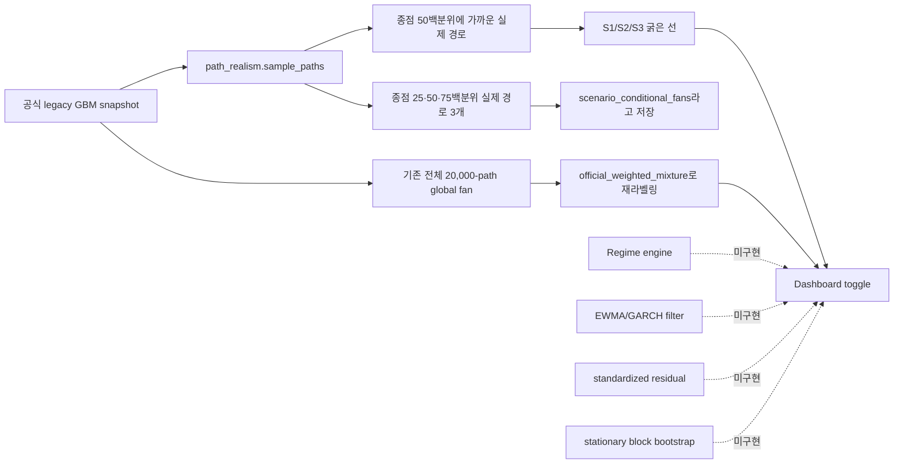
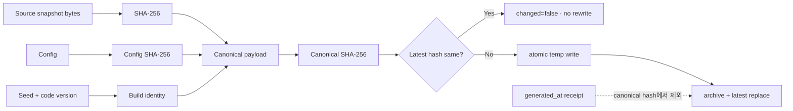
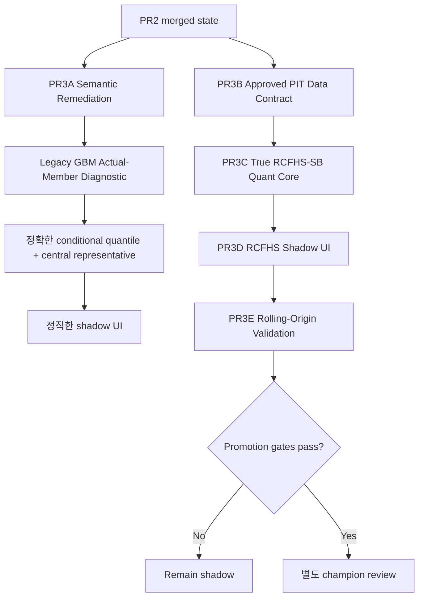

# AI Investing Scenario Graph V4 PR2 정밀감사 및 PR3 고도화 설계

- 검토일: 2026-08-07 (KST)
- 검토 대상: `scenario_v4_shadow_pr2_260807_001.zip`
- 패키지 SHA-256: `d55d04af0f111499d29535e8fe58fd905857c6bcfe8e5abf46d26f3150a26588`
- 패키지 엔트리: 26개
- 대상 PR: #2 `Implement scenario V4 shadow layer`
- Merge commit: `0c14900fec2f1276e799df09f68c8270fd5d9646`
- 공식 시나리오 SHA-256: `7526638e1b11a04e91112a673fbbca91c00ceb4c00cb1211774532f05d796f9c`
- PR2 shadow SHA-256: `cd2bb86b37b2e9cbe6c5c370e3bbd3cc6f21a8953727732c8b4fc27590ee70ca`

---

## 0. 최종 판정

### 종합 판정: **FAIL — RCFHS-SB 구현으로 인정할 수 없음**

PR2에는 두 종류의 결과가 섞여 있다.

1. **유효한 부분 개선**
   - 공식 `nasdaq_latest.json`을 바꾸지 않고 별도 shadow artifact를 만들었다.
   - dashboard toggle 기본값이 OFF다.
   - 기존의 지나치게 매끄러운 pointwise median·구조경로 대신 실제 Monte Carlo ensemble member 한 개를 굵은 선으로 보여준다.
   - 그 결과 2027년 선의 변동성과 방향전환 수는 육안상 더 현실적으로 개선됐다.

2. **치명적인 의미·모델 결함**
   - 실제 RCFHS-SB 엔진은 구현되지 않았다.
   - 기존 공식 GBM snapshot에서 보관된 표본 경로를 꺼내 `rcfhs-sb-v1`로 재명명했다.
   - `scenario_conditional_fans`는 시점별 분위수 fan이 아니라 종점 분위수에 가까운 실제 경로 3개다.
   - dashboard는 이 가짜 conditional fan조차 렌더링하지 않고 기존 단일 global fan을 계속 사용한다.
   - shadow를 켜면 버튼이 `RCFHS-SB v1 official`로 바뀌어 shadow를 official로 오표시한다.
   - 동일 입력을 다시 build하면 `generated_at` 때문에 매번 artifact가 바뀐다.
   - source snapshot 갱신 후 stale shadow를 차단하는 검증이 없다.

따라서 현재 구현은 다음 이름으로만 해석할 수 있다.

> **Legacy GBM Actual-Member Display Diagnostic**

다음 이름으로 해석하면 안 된다.

> ~~RCFHS-SB v1~~  
> ~~Scenario Graph V4 quantitative engine~~  
> ~~검증된 scenario별 conditional distribution~~

### 운영 권고

- 공식 모델과 ledger는 영향받지 않았으므로 긴급 데이터 복구는 필요하지 않다.
- 하지만 현재 V4 toggle은 **즉시 비활성화하거나 정확한 legacy diagnostic 명칭으로 수정**해야 한다.
- PR2 전체 revert보다는 shadow plumbing을 보존하고 잘못된 모델 identity와 분포 계산을 교정하는 **PR3A remediation**이 낫다.
- 진짜 RCFHS-SB는 PR3B~E에서 별도 구현해야 한다.
- champion 승격은 계속 금지한다.

---

## 1. 검토 범위와 방법

다음 자료를 교차 검토했다.

- PR2 검토 ZIP 26개 엔트리
- PR2 source files와 patch
- merge metadata와 changed-file 목록
- 생성된 shadow JSON
- 기존 공식 `data/scenarios/nasdaq_latest.json`
- 기존 `src/ai_fc/scenario.py`
- 기존 `tools/reproduce_scenario_snapshot.py`
- 기존 Scenario V4 Master Prompt
- 관련 scenario·dashboard·contract tests

독립 검증 절차:

1. 원본 전체 handoff 저장소를 재구성했다.
2. PR2 변경 파일을 overlay했다.
3. 공식 snapshot SHA-256을 다시 계산했다.
4. 공식 snapshot의 seed·GBM parameters·calendar·barrier를 사용해 20,000개 path matrix를 재생성했다.
5. S1/S2/S3 partition과 1,764개 daily quantile cell을 재검산했다.
6. PR2 대표선이 실제 어느 global path row인지 확인했다.
7. PR2의 p25/p50/p75 배열이 진짜 pointwise conditional quantile인지 검사했다.
8. 2027년 변동성·낙폭·하락 주·방향전환과 시나리오 간 상관을 계산했다.
9. 신규 tests와 dashboard integration test를 독립 실행했다.
10. 원래 Master Prompt의 Batch A~E 요구사항과 실제 구현을 매핑했다.

---

## 2. 무결성·테스트 기준선

### 2.1 공식 artifact 보존

공식 snapshot SHA-256:

```text
7526638e1b11a04e91112a673fbbca91c00ceb4c00cb1211774532f05d796f9c
```

Phase 1에서 확인한 값과 동일하다. PR2는 공식 `nasdaq_latest.json`을 수정하지 않았다.

이 부분은 **PASS**다.

### 2.2 독립 테스트

| 범위 | 결과 | 판정 |
| --- | ---: | --- |
| `test_scenario.py + test_scenario_v4_shadow.py` | 18 passed | PASS |
| PR2 패키지 작성자 환경 주장 | 51 passed | 참고 |
| dashboard 포함 독립 실행 | `python-frontmatter` 미설치로 collection 차단 | BLOCKED BY ENVIRONMENT |
| legacy 20,000-path 재현 | S1 16,702 / S2 302 / S3 2,996 | PASS |
| daily quantile 재현 | 1,764 cells / mismatch 0 | PASS |

독립 환경의 dashboard collection 실패는 코드 결함으로 확정하지 않는다. 다만 PR2 ZIP의 `51 passed` 로그만으로 핵심 모델 의미를 검증했다고 볼 수는 없다.

### 2.3 PR 범위

PR2 diff에는 scenario 관련 파일 외에도 다음이 함께 포함됐다.

```text
data/source_monitoring/defillama_stablecoins/2026-08-06.json
data/source_monitoring/defillama_stablecoins_status.json
```

Scenario V4 변경과 직접 관련 없는 generated monitoring change가 섞였다. PR3에서는 allowlist 기반으로 범위를 분리해야 한다.

---

## 3. PR2가 실제로 한 일

현재 데이터 흐름은 다음과 같다.



`src/ai_fc/scenario_v4_shadow.py:1-5`는 스스로 이 artifact가 “already published scenario snapshot”에서 생성된 dashboard candidate라고 명시한다.

핵심 함수:

- `_actual_member_paths()` — `scenario_v4_shadow.py:30-61`
- `_scenario_conditional_fans()` — `scenario_v4_shadow.py:64-95`
- `_official_weighted_mixture_fan()` — `scenario_v4_shadow.py:98-108`
- `build_shadow_payload()` — `scenario_v4_shadow.py:139-197`

실제로 존재하지 않는 구성요소:

| 원래 V4 설계 요구 | PR2 구현 |
| --- | --- |
| 승인된 PIT history | 없음 |
| observable regime engine | 없음 |
| state-conditioned drift | 없음 |
| EWMA candidate | 없음 |
| GARCH(1,1) candidate | 없음 |
| standardized residual pool | 없음 |
| regime-conditioned stationary bootstrap | 없음 |
| source residual block lineage | 없음 |
| RCFHS 252-session recursion | 없음 |
| 100k~300k adaptive simulation | 없음 |
| V4 implied scenario weights | 없음 |
| rolling-origin CRPS/WIS validation | 없음 |

따라서 `SHADOW_VERSION = "rcfhs-sb-v1"`는 구현 내용과 일치하지 않는다.

---

## 4. 유효한 개선: 실제 ensemble member 선

PR2가 선택한 경로는 실제 기존 GBM matrix row다.

| Scenario | Global path index | 실제 row 일치 |
| --- | ---: | --- |
| S1 | 13,853 | YES |
| S2 | 18,673 | YES |
| S3 | 1,674 | YES |

기존 2027년 구조경로와 PR2 actual-member path의 비교:

| Scenario | 연환산 주간 변동성 | MDD | 하락 주 | 방향전환 |
| --- | --- | --- | --- | --- |
| S1 | 8.54% → 20.00% | 7.83% → 7.01% | 5 → 13 | 3 → 21 |
| S2 | 8.54% → 16.17% | 7.95% → 6.90% | 5 → 10 | 3 → 11 |
| S3 | 8.54% → 16.90% | 7.99% → 8.47% | 5 → 15 | 3 → 15 |

2027년 수익률 상관도 다음처럼 낮아졌다.

| 비교 | 기존 구조경로 | PR2 actual member |
| --- | ---: | ---: |
| S1–S2 | 0.999998 | -0.029 |
| S1–S3 | 0.999998 | 0.213 |
| S2–S3 | 0.999998 | -0.385 |

따라서 사용자가 느낀 “2027년이 너무 밋밋하다”는 문제를 **시각적으로는 일부 개선**했다.

하지만 이 차이는 시나리오별 RCFHS dynamics에서 나온 것이 아니다. 같은 GBM 생성 과정에서 우연히 선택된 서로 다른 shock realization 세 개다. 따라서 경로 모양을 경제적 시나리오 차이로 해석하면 안 된다.

---

## 5. 치명적 결함 1 — 모델 identity가 거짓이다

shadow JSON의 상위 필드:

```text
version = rcfhs-sb-v1
status = shadow_only
promotion_state = blocked_pending_rolling_origin_validation
```

하지만 provenance는 다음이다.

```text
source_method = gbm-daily-252d-v2-lookup+db-structural-v2
model.n_paths = 20000
model.seed = 42
model.gbm_parameters = legacy GBM parameters
```

또한 복사된 nested model에는 다음이 남아 있다.

```text
model.promotion_state = champion-baseline; v2 alternatives remain shadow
```

즉 하나의 JSON 안에 다음 상충 상태가 공존한다.

```text
top-level: promotion blocked
nested model: champion-baseline
```

### 필요한 수정

모델명은 capability로 검증해야 한다.

```yaml
model_identity:
  family: legacy_gbm
  engine_id: gbm-daily-252d-v2-lookup
  display_variant: actual_member_conditional_diagnostic
  is_rcfhs: false
  capabilities:
    pit_history: false
    observable_regime: false
    conditional_volatility: false
    standardized_residuals: false
    stationary_block_bootstrap: false
    source_block_lineage: false
    rolling_origin_validation: false
```

`family=rcfhs_sb` 또는 model id에 `rcfhs`가 들어가려면 위 핵심 capability가 전부 true이고 증거 receipt가 있어야 한다.

---

## 6. 치명적 결함 2 — conditional fan이 fan이 아니다

PR2는 각 scenario에서 다음 세 경로를 꺼낸다.

```text
terminal percentile 25에 가까운 실제 경로
terminal percentile 50에 가까운 실제 경로
terminal percentile 75에 가까운 실제 경로
```

그리고 이를 시점별 `p25`, `p50`, `p75`처럼 저장한다.

하지만 종점 rank가 25/50/75라는 사실은 중간 날짜의 rank가 25/50/75라는 뜻이 아니다. 실제로 배열이 교차한다.

| Scenario | p25 > p50 | p50 > p75 | 하나 이상 위반 | 전체 지점 |
| --- | ---: | ---: | ---: | ---: |
| S1 | 16 | 5 | 19 | 52 |
| S2 | 26 | 3 | 28 | 52 |
| S3 | 20 | 8 | 27 | 52 |

진짜 pointwise conditional quantile과의 평균 절대 차이도 약 678~1,510 index point다.

따라서 다음 계산도 의미가 없다.

```text
conditional_fan_overlap
```

잘못된 lower/upper path를 band로 간주해 겹침을 계산했기 때문이다.

### 필요한 수정

공식 snapshot은 full member matrix를 직접 저장하지 않지만, 다음이 직렬화되어 있다.

```text
anchor
mu_daily_log_return
sigma_daily_log_return
seed
n_paths
horizon
classification date
ATH
reference price
trading-day calendar
```

기존 `tools/reproduce_scenario_snapshot.py:1-67`가 이 정보만으로 정확히 다음을 재현한다.

```text
S1/S2/S3 counts = 16702 / 302 / 2996
quantile cells = 1764
mismatch = 0
```

따라서 “full scenario member matrix가 직렬화되지 않아 blocked”라는 PR2 판단은 잘못됐다. matrix를 결정론적으로 재생성해 각 시점에서 scenario별 quantile을 계산할 수 있다.

### 표본 gate

현재 20,000-path cohort에서 허용 가능한 표시:

| Scenario | n | 허용 |
| --- | ---: | --- |
| S1 | 16,702 | representative, p05/p10/p25/p50/p75/p90/p95 |
| S2 | 302 | representative + p50만 |
| S3 | 2,996 | representative, p05/p10/p25/p50/p75/p90/p95 |

사전등록 gate:

```text
n >= 200  : representative + p50
n >= 500  : p25/p75
n >= 1000 : p10/p90
n >= 2000 : p05/p95
```

S2에 p25/p75 또는 p10/p90을 보이기 위해 unconditional fan을 복사해서는 안 된다.

---

## 7. 치명적 결함 3 — 대표선이 다변량 중앙 경로가 아니다

현재 대표선 selection은 terminal value 하나만 사용한다.

```text
nearest_terminal_median_continuous_path
```

독립 계산 결과:

| Scenario | 주요 비정상 percentile |
| --- | --- |
| S1 | weekly volatility 92.6p, direction changes 98.1p |
| S2 | MDD 91.2p, longest underwater 91.7p, largest 5-day loss 86.3p |
| S3 | daily volatility 99.98p, largest 1-day loss 99.3p, down weeks 93.0p |

즉 종점은 중앙이지만 전체 path behavior는 중앙이 아니다.

### 필요한 selector

실제 row만 후보로 유지하면서 다음 gate를 적용한다.

```text
terminal return percentile: 35~65
realized volatility percentile: 10~90
maximum drawdown percentile: 10~90
time under water percentile: 10~90
direction-change percentile: 10~90
```

후보 중 다음 robust score가 가장 낮은 row를 선택한다.

```text
score
 = 1.00 × normalized-log trajectory distance
 + 0.50 × terminal return robust distance
 + 0.75 × volatility robust distance
 + 0.75 × MDD robust distance
 + 0.50 × time-under-water robust distance
 + 0.50 × direction-change robust distance
```

중앙 궤적은 target일 뿐, 표시선으로 직접 사용하지 않는다.

---

## 8. 치명적 결함 4 — dashboard 상태가 혼합된다

### 8.1 잘못된 official 표시

`dashboard.js:1332`:

```javascript
shadowButton.lastChild.textContent =
  shadowActive ? 'RCFHS-SB v1 official' : 'RCFHS-SB v1 shadow';
```

shadow를 켜는 순간 official이라고 표시한다. 즉시 수정해야 한다.

### 8.2 정적 metadata가 official에 고정된다

`renderFlow()`는 최초 official scenario로 다음을 한 번만 계산한다.

```text
structural
methodCopy
legend
focusControls
shapeControls
realismCards
lookup copy
chart note
```

toggle handler는 `sc`만 바꾸고 `paintFlow()`만 호출한다. 따라서 선은 shadow인데 설명은 legacy structural forecast인 혼합 화면이 된다.

### 8.3 conditional fan은 표시되지 않는다

`drawFlow()`는 다음만 읽는다.

```javascript
const fanAll = sc.fan?.quantiles || {};
```

`scenario_conditional_fans` 참조는 0건이다. 즉 PR2가 주장한 conditional/mixture separation은 JSON의 명칭 수준에 머문다.

### 8.4 baseline 중복 가능성

shadow에는 `structural_forecast`가 없다.

- display path: `flowDisplayPath(sc, key)` → `sc.paths[key]`
- baseline path: `sc.paths[key]`
- `showBaseline=true`

따라서 같은 path를 굵은 선과 회색 점선으로 중복 렌더링할 수 있다.

---

## 9. 치명적 결함 5 — 결정성·freshness·원장성

### 현재 문제

`build_shadow_payload()`가 호출될 때마다:

```python
generated_at = datetime.now(...)
```

을 넣는다. 동일 input/config/seed로 1초 간격 두 번 실행하면 JSON 전체가 달라진다.

`refresh_shadow()`는 전체 문자열을 비교하므로 두 번째 실행도 `updated`가 된다.

또한 artifact에는 다음이 없다.

```text
source_snapshot_sha256
config_sha256
canonical_payload_sha256
generator_code_version
input_data_sha256
```

`load_shadow()`는 현재 official snapshot과 source id/SHA/asof가 일치하는지도 확인하지 않는다.

### 목표 구조



loader는 다음을 확인해야 한다.

```text
current official snapshot id == source snapshot id
current official SHA == source snapshot SHA
current asof == source asof
artifact canonical hash valid
schema valid
model identity valid
```

하나라도 다르면:

```text
status = stale_source
chart disabled
visible warning
```

---

## 10. 테스트가 핵심 결함을 잡지 못한 이유

신규 테스트는 2개다.

1. actual member path가 보관 sample과 같은지
2. hardcoded guardrail boolean 하나를 true로 바꾸면 validator가 실패하는지

검증하지 않은 항목:

- RCFHS 엔진 존재
- model identity/capability 정합성
- conditional quantile monotonicity
- full matrix 재현 가능성
- sample-size gate
- 대표선 다변량 중앙성
- 동일 입력 deterministic hash
- second refresh no-op
- source stale 차단
- UI `official` 오표시
- toggle 후 metadata 일관성
- conditional fan 실제 렌더링
- duplicate baseline
- 2026→2027 state continuity
- PIT leakage
- regime/volatility/bootstrap
- rolling-origin performance

`guardrails` boolean은 코드에서 파생된 증거가 아니라 self-assertion이다. 실제 위반을 검출하는 구조로 바꿔야 한다.

---

## 11. 데이터 blocker — 진짜 RCFHS의 선행조건

현재 저장소에는 감사 가능한 장기 NASDAQ PIT 일별 history snapshot이 없다.

`data/source_registry.yaml`의 Yahoo entry:

```text
id = yahoo_crosscheck
vintage_capability = none
license_status = review_required
enabled = false
```

반면 legacy scenario source는 Yahoo Finance라고 기록되어 있다.

진짜 RCFHS-SB를 만들려면 최소 다음 계약이 필요하다.

```yaml
dataset_id: nasdaq_composite_daily_pit_v1
symbol: IXIC
fields:
  - date
  - close
  - available_at
  - source_id
  - vintage_id
  - ingested_at
  - response_sha256
  - row_sha256
asof_policy:
  use_only_rows_with:
    - date <= forecast_asof
    - available_at <= forecast_generated_at
minimum_history_sessions: 2520
recommended_history_sessions: 5000
network_during_model_build: forbidden
```

승인된 PIT dataset이 없으면 Codex는 다음까지만 구현해야 한다.

```text
contracts
core modules
synthetic/fixture tests
blocker report
```

실제 V4 forecast JSON을 임의 데이터로 생성하면 안 된다.

---

# 12. 권장 PR3 전체 설계

## 12.1 두 트랙으로 분리



### PR3A — 즉시 교정

목표:

- 잘못된 `rcfhs-sb-v1` identity를 폐기한다.
- 현재 코드를 `legacy_gbm_actual_member_v1` diagnostic으로 재구성한다.
- full GBM matrix를 결정론적으로 재현한다.
- 진짜 conditional quantile을 계산한다.
- 표본 gate를 적용한다.
- multi-metric actual representative를 선택한다.
- UI의 잘못된 문구와 혼합 상태를 고친다.
- 공식 snapshot은 바꾸지 않는다.

### PR3B — 데이터 계약과 quant primitives

목표:

- 승인된 immutable PIT history contract
- observable regime
- state-conditioned drift
- EWMA/GARCH candidates
- standardized residual
- stationary block bootstrap
- source block lineage

### PR3C — 연속 path와 조건부 분포

목표:

- D+1~D+252 단일 연속 recursion
- 2026→2027 calendar reset 없음
- 동일 joint generator
- 기존 S1/S2/S3 partition
- adaptive 100k~300k simulation
- scenario conditional distributions
- official weight와 V4 implied weight 분리
- actual central representative

### PR3D — UI

목표:

- 상단 D=100 대표경로 비교
- 하단 S1/S2/S3 small multiples
- 각 scenario fan·n·gate·weight 명시
- unconditional/mixture는 별도 패널
- legacy/diagnostic/true V4 명칭 분리
- stale/blocked 상태의 명시적 표시

### PR3E — rolling-origin

목표:

- tuning/validation/holdout 분리
- GBM·historical·EWMA-FHS·RCFHS 후보 비교
- CRPS/WIS/coverage/energy score
- no-regression gate
- champion 검토 자료 생성
- 자동 승격 금지

---

## 13. 목표 module 구조

```text
src/ai_fc/
├─ scenario.py                         # 기존 official legacy · 변경 최소화
├─ scenario_v4_shadow.py               # deprecated adapter만 유지
├─ scenario_shadow/
│  ├─ __init__.py
│  ├─ contracts.py                     # model identity/schema/capability
│  ├─ persistence.py                   # canonical hash/atomic write/stale check
│  ├─ legacy_reproduction.py           # official GBM exact reproduction
│  ├─ legacy_actual_member.py          # honest diagnostic artifact
│  ├─ representative.py                # central actual-path selector
│  ├─ diagnostics.py                   # quantile/realism/overlap gates
│  ├─ regimes.py                       # PR3B
│  ├─ volatility.py                    # PR3B
│  ├─ stationary_bootstrap.py          # PR3B
│  ├─ rcfhs_engine.py                  # PR3C
│  └─ backtest.py                      # PR3E
│
├─ dashboard.py
├─ read_model_contract.py
└─ dashboard_parts/
   ├─ dashboard.js
   └─ dashboard.css

data/
├─ contracts/
│  ├─ scenario_path_shadow_v2.yaml
│  └─ nasdaq_pit_history.yaml
└─ scenarios/
   └─ shadow/
      ├─ archive/
      ├─ legacy_gbm_actual_member_v1_latest.json
      ├─ nasdaq_rcfhs_sb_ewma_v4_latest.json
      └─ nasdaq_rcfhs_sb_garch11_v4_latest.json

src/tests/
├─ test_scenario_shadow_contract.py
├─ test_scenario_legacy_reproduction.py
├─ test_scenario_representative.py
├─ test_scenario_shadow_persistence.py
├─ test_scenario_shadow_dashboard.py
├─ test_scenario_regimes.py
├─ test_scenario_volatility.py
├─ test_scenario_stationary_bootstrap.py
├─ test_scenario_rcfhs_engine.py
└─ test_scenario_v4_backtest.py
```

---

## 14. Artifact schema 설계

### 14.1 Legacy diagnostic

```json
{
  "schema_version": 2,
  "artifact_kind": "scenario_path_shadow",
  "candidate_id": "legacy_gbm_actual_member_v1",
  "status": "shadow_only",
  "promotion_state": "not_eligible_diagnostic_baseline",
  "model_identity": {
    "family": "legacy_gbm",
    "engine_id": "gbm-daily-252d-v2-lookup",
    "display_variant": "actual_member_conditional_diagnostic",
    "is_rcfhs": false,
    "capabilities": {
      "pit_history": false,
      "observable_regime": false,
      "conditional_volatility": false,
      "standardized_residuals": false,
      "stationary_block_bootstrap": false,
      "continuous_252_session_recursion": true,
      "actual_member_representative": true,
      "pointwise_conditional_quantiles": true,
      "rolling_origin_validation": false
    }
  },
  "source": {
    "snapshot_id": "...",
    "snapshot_sha256": "...",
    "asof": "...",
    "method": "gbm-daily-252d-v2-lookup"
  },
  "reproducibility": {
    "seed": 42,
    "n_paths": 20000,
    "config_sha256": "...",
    "canonical_payload_sha256": "...",
    "quantile_cells_checked": 1764,
    "quantile_mismatches": 0
  },
  "probability_spaces": {
    "official_model_conditional_weights": {
      "S1": 0.83,
      "S2": 0.02,
      "S3": 0.15
    },
    "candidate_implied_weights": null
  },
  "mixture_distribution": {},
  "scenario_distributions": {
    "S1": {},
    "S2": {},
    "S3": {}
  },
  "representatives": {},
  "diagnostics": {},
  "receipt": {
    "generated_at": "canonical hash에서 제외"
  }
}
```

### 14.2 True RCFHS shadow

```json
{
  "candidate_id": "nasdaq_rcfhs_sb_ewma_v4_shadow",
  "model_identity": {
    "family": "rcfhs_sb",
    "engine_id": "rcfhs-sb-ewma-v4",
    "capabilities": {
      "approved_pit_history": true,
      "observable_regime": true,
      "state_conditioned_drift": true,
      "conditional_volatility": true,
      "standardized_empirical_residuals": true,
      "stationary_block_bootstrap": true,
      "source_block_lineage": true,
      "continuous_252_session_recursion": true,
      "adaptive_joint_simulation": true,
      "pointwise_conditional_quantiles": true,
      "actual_member_representative": true
    }
  },
  "probability_spaces": {
    "official_weights_for_comparison": {},
    "v4_implied_partition_weights": {}
  }
}
```

두 weight는 결합하거나 덮어쓰지 않는다.

---

## 15. Dashboard 목표 설계

```text
┌──────────────────────────────────────────────────────────────┐
│ MODEL MODE                                                   │
│ [Official Legacy] [Legacy Actual-Member Diagnostic] [V4]    │
│ 현재: LEGACY DIAGNOSTIC · SHADOW · NOT RCFHS                │
└──────────────────────────────────────────────────────────────┘

┌──────────────────────────────────────────────────────────────┐
│ NORMALIZED REPRESENTATIVE COMPARISON · D=100                 │
│ S1 actual member / S2 actual member / S3 actual member       │
│ 대표선은 실제 row이며 확률 중앙선이 아님                     │
└──────────────────────────────────────────────────────────────┘

┌────────────────────┐ ┌────────────────────┐ ┌────────────────────┐
│ S1 CONDITIONAL     │ │ S2 CONDITIONAL     │ │ S3 CONDITIONAL     │
│ n=16,702           │ │ n=302              │ │ n=2,996            │
│ p10–p90            │ │ p50 only           │ │ p10–p90            │
│ p25–p75            │ │ insufficient n     │ │ p25–p75            │
│ actual rep         │ │ actual rep         │ │ actual rep         │
└────────────────────┘ └────────────────────┘ └────────────────────┘

┌──────────────────────────────────────────────────────────────┐
│ MIXTURE / UNCONDITIONAL DISTRIBUTION                         │
│ scenario별 fan과 분리 · weight source 명시                  │
└──────────────────────────────────────────────────────────────┘
```

모드가 바뀌면 다음이 함께 갱신돼야 한다.

```text
title
subtitle
candidate id
status
method
probability space
weight source
legend
fan source
sample count
sample gate
representative selection
warnings
ARIA label
chart note
lookup availability
```

---

## 16. Stage gate

| Gate | 필수 조건 | 실패 시 |
| --- | --- | --- |
| R0 Spec preflight | AGENTS + Master Prompt + Audit 존재 및 hash 확인 | 코드 변경 0, BLOCKED |
| R1 Semantic hotfix | RCFHS 오표시 0, old artifact retired | 병합 금지 |
| R2 Honest legacy baseline | exact reproduction, true quantiles, central rep, deterministic hash | UI 진행 금지 |
| R3 Dashboard | model state 일관성, small multiples, no duplicate baseline | PR3A 병합 금지 |
| D0 PIT data | 승인·license·vintage·hash contract | 실제 RCFHS forecast 생성 금지 |
| Q1 Quant core | leakage 0, deterministic regimes/filters/bootstrap | path engine 진행 금지 |
| Q2 Continuous path | calendar reset 0, partition exhaustive, sample gates | UI 진행 금지 |
| UI V4 | shadow default OFF, semantics consistent | backtest 진행 가능하나 공개 금지 |
| OOS | CRPS/WIS/coverage no-regression | champion 검토 금지 |

---

## 17. 지금 해야 할 정확한 조치

1. 현재 `rcfhs-sb-v1` toggle을 운영 화면에서 임시 비활성화한다.
2. 본 감사서와 PR3 Master Prompt를 저장소에 먼저 commit한다.
3. 새 permanent worktree `scenario-v4-pr3-remediation`을 만든다.
4. PR3A-R0 preflight만 실행한다.
5. R0 결과를 검토한 후 R1~R3를 각각 별도 Codex chat으로 실행한다.
6. PR3A를 독립 검증하고 나서만 기존 merge 위에 correction PR을 병합한다.
7. 승인된 PIT history가 준비되기 전에는 진짜 RCFHS forecast artifact를 만들지 않는다.
8. PR3B~E는 각기 별도 PR로 진행한다.
9. 어느 단계에서도 자동 commit/push/merge를 허용하지 않는다.
10. champion 승격은 rolling-origin 결과와 사람의 승인 후 별도 작업으로 남긴다.

---

## 18. 최종 의사결정

| 항목 | 판정 |
| --- | --- |
| 공식 snapshot 무결성 | PASS |
| shadow isolation/default OFF | PASS |
| 실제 member path 사용 | PASS |
| 2027년 시각적 realism 개선 | PARTIAL PASS |
| RCFHS-SB 엔진 | FAIL |
| scenario conditional fan | FAIL |
| model identity | FAIL |
| UI 의미 일관성 | FAIL |
| deterministic artifact | FAIL |
| stale source protection | FAIL |
| rolling-origin 검증 | NOT IMPLEMENTED |
| champion 승격 | PROHIBITED |

### 최종 권고

> **PR2의 shadow plumbing은 재사용하되, `rcfhs-sb-v1` artifact와 명칭은 폐기한다.**  
> **먼저 정직한 Legacy GBM Actual-Member Diagnostic을 완성하고, 그 다음 승인된 PIT 데이터 위에서 실제 RCFHS-SB를 별도 구현한다.**
