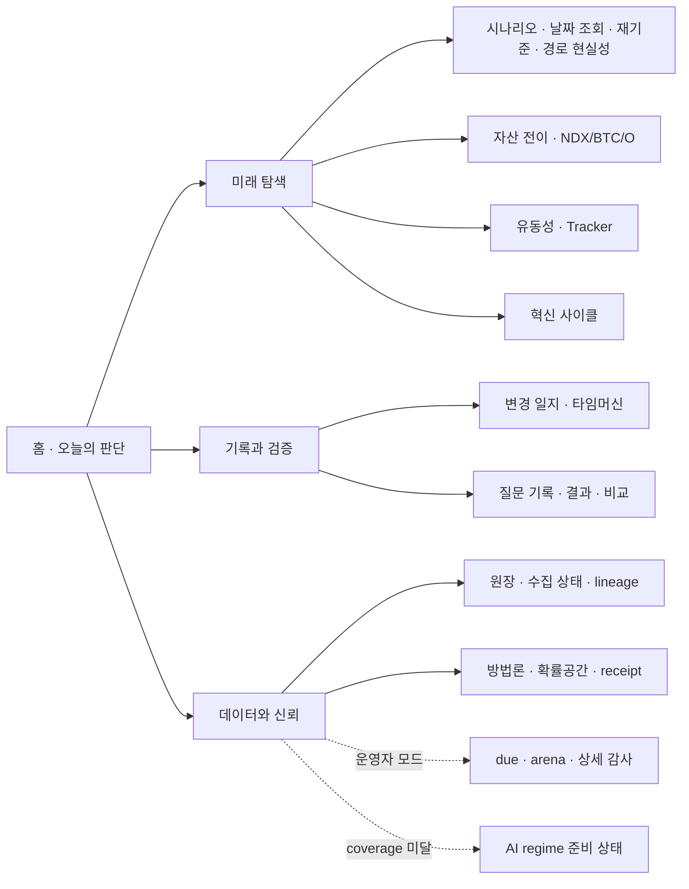

# UX Audit 260805 — U0 Baseline and U1 Gate

작성일: 2026-08-04 KST

대상: `main` / 기준 HEAD `cea5b9f`

실사이트: <https://sung-jinpark.github.io/Jin-s-investing-prediction/>

데이터 기준: scenario `as_of=2026-08-03`, site update `2026-08-04`

상태: **PASS — U1 승인 해제**

## 1. 범위와 판정

이번 문서는 총집합 설계도의 **U0 감사**를 수행한다. 최초 감사에서는 브라우저 캡처 백엔드의 `Page.captureScreenshot` 타임아웃 때문에 게이트를 닫았고, 검토자 J3 승인에 따라 2026-08-05에 보충 촬영을 수행했다. 각 라우트마다 새 Chromium 계열 브라우저 프로세스를 실행하고 1280/390px별 fresh context에서 `document.fonts.ready`와 두 번의 animation frame을 기다린 뒤 viewport-only로 촬영했다. **15개 라우트 × 2 viewport = 30장 전부 성공, 실패 0건**이므로 §1.5의 U1 게이트를 해제한다.

판정 원칙은 다음과 같다.

- P1 — 화면당 질문 하나: 총집합 설계도 §1.3-1
- P2 — 일반 사용자가 원하는 정보까지 3클릭 이내: §1.3-2
- P3 — 정직성 장치는 삭제하지 않고 요약·이동·접기만 허용: §1.3-3
- P4 — 데이터 0인 빈 화면은 주 메뉴에서 숨기고 준비 상태만 노출: §1.3-4
- P5 — 일반 모드와 운영자 모드 분리: §1.3-5
- P6 — 한 화면 배지 유형 최대 3종: §1.3-6

## 2. 전 화면 인벤토리

배지 수는 `인스턴스/유형`이다. 클릭 수는 홈에서 시작하는 일반 사용자 기준이며, URL 딥링크는 클릭 수에서 제외했다.

| 라우트·상태 | 현재 화면이 답하는 질문 | 주 사용자 | 현재 클릭 | 배지 수 | 전문 용어 수 | 3초 첫인상 | U1 제안 | 근거 |
|---|---|---:|---:|---:|---:|---|---|---|
| `#overview` | 지금 시장 판단과 근거는 무엇인가 | A | 0 | 2/1 | 3 | 대체로 일치 | **유지·축약**: 오늘 판단, 신호 2개, 최근 변경 3개, 다음 이벤트 3개만 첫 화면 | P1·P2·P3·P6 |
| `#flow` | 향후 12개월 분포와 경로는 무엇인가 | A | 1 | 53/2 | 12 | 일치하지만 정보 과밀 | **통합**: 날짜 조회·재기준·path realism을 `미래 탐색` 한 화면의 오버레이로 | P1·P2·P3·P6 |
| `#lab=history` | 과거 혁신 사이클과 현재의 유사점은 무엇인가 | A/C | 2 | 2/1 | 4 | 제목이 미래 분포로 보여 불일치 | `미래 탐색 > 혁신 사이클` 하위 보기로 **이동**하고 고유 질문 제목 부여 | P1·P2 |
| `#lab=cross-asset` | 충격 시 NDX·BTC·O의 조건부 전이는 무엇인가 | A/C | 2 | 3/1 | 6 | 제목 불일치 | `미래 탐색 > 자산 전이`로 **이동** | P1·P2·P3 |
| `#lab=ai-regime` | AI 자본 사이클을 판정할 수 있는가 | B/C | 2 | 1/1 | 5 | blocked 상태만 보임 | 주 메뉴에서 **숨김**, `데이터와 신뢰`에 `준비 중·coverage 0%` 한 줄 | P4·P5 |
| `#lab=liquidity` | 유동성 조건이 위험 선호를 지지하는가 | A/C | 2 | 1/1 | 4 | 제목 불일치 | `미래 탐색 > 유동성·Tracker`로 **통합** | P1·P2 |
| `#questions` | 등록된 공식 질문과 상태는 무엇인가 | A/C | 1 | 0/0 | 2 | 대체로 일치 | `기록과 검증 > 질문 기록`으로 **이동**, 상태·마감·결과 중심 | P1·P2·P3 |
| `#ask` | 특정 날짜의 조건부 분포는 무엇인가 | A | 2 | 1/1 | 2 | 기능은 명확하나 독립 화면이 불필요 | 독립 메뉴를 없애고 `미래 탐색` 차트 안으로 **통합** | P1·P2 |
| `#asof` | 그날 당시 화면과 지금의 차이는 무엇인가 | A/C | 1 | 0/0 | 2 | 일치 | `기록과 검증 > 변경 일지`로 **유지·강화** | P1·P2·P3 |
| `#track` | 예측 성과, 원장, 근거, 모델 상태를 어떻게 검증하는가 | B/C | 1 | 41/7 | 11 | 한 화면에 목적이 너무 많아 불일치 | 질문 결과는 `기록과 검증`, 원장·receipt·방법론은 `데이터와 신뢰`, arena·due는 운영자 모드로 **분리** | P1·P3·P5·P6 |
| `#q/{id}` | 특정 질문의 사전등록·결과·채점 근거는 무엇인가 | C | 2 | 0/0 | 2 | 대체로 일치 | 질문 기록의 문맥 화면으로 **유지** | P1·P2·P3 |
| `#compare/{id,id}` | 두 질문의 확률·근거·결과 차이는 무엇인가 | C | 4 | 0/0 | 0 | 일치 | 질문 목록에서 2개 선택 후 즉시 열어 **3클릭 이하**로 축소 | P2 |
| `#lookup=YYYY-MM-DD&mode=current` | 현재 앵커에서 선택일 분포는 무엇인가 | A | 2 | `#flow`와 동일 | `#flow`와 동일 | 차트 문맥과 일치 | `미래 탐색`의 공유 가능한 상태로 **유지** | P1·P2·P3 |
| `#lookup=YYYY-MM-DD&mode=rebase` | 선택일을 100으로 재기준한 이후 분포는 무엇인가 | A/C | 2 | `#flow`와 동일 | `#flow`와 동일 | 차트 문맥과 일치 | 오버레이 상태로 **유지**, 기준일·남은 지평 상단 고정 | P1·P2·P3 |
| `#asof=YYYY-MM-DD` | 선택 스냅샷 당시 판단은 무엇이었나 | C | 2 | `#asof`와 동일 | `#asof`와 동일 | 일치 | 변경 일지의 재생 상태로 **유지** | P1·P2·P3 |

### 핵심 진단

1. 다섯 lab 화면의 H1이 모두 `향후 12개월 시장 경로를 분포로 읽는다`여서 history, cross-asset, AI-regime, liquidity의 실제 목적을 3초 안에 구분할 수 없다(P1).
2. `#track`은 배지 유형 7종, 배지 인스턴스 41개로 P6을 위반한다. 사용자는 성과 검증과 운영 감사를 동시에 해석해야 한다.
3. `#flow`의 배지 “유형”은 2종이지만 이벤트별 상태가 반복되어 인스턴스가 53개다. P6의 형식상 유형 제한은 통과해도 첫 화면 정보량은 축약이 필요하다.
4. 일반 사용자가 질문 비교로 가는 경로는 최대 4클릭이라 P2를 충족하지 못한다.
5. `#lab=ai-regime`은 coverage 0의 blocked 화면이다. 정직성 상태는 보존하되 주 메뉴에 빈 목적 화면을 유지할 이유는 없다(P3·P4).

## 3. 1280/390px 증거와 반응형 감사

캡처 원장: [`capture_results.json`](../screenshots/ux_audit_260805/capture_results.json). 원장은 실제 URL·렌더된 hash·view·H1·viewport·문서 폭·실패 사유를 장별로 기록한다.

| 라우트·상태 | 1280px | 390px | 결과 |
|---|---|---|---|
| `#overview` | [보기](../screenshots/ux_audit_260805/overview_1280.png) | [보기](../screenshots/ux_audit_260805/overview_390.png) | PASS |
| `#flow` | [보기](../screenshots/ux_audit_260805/flow_future_1280.png) | [보기](../screenshots/ux_audit_260805/flow_future_390.png) | PASS |
| `#lab=history` | [보기](../screenshots/ux_audit_260805/flow_history_1280.png) | [보기](../screenshots/ux_audit_260805/flow_history_390.png) | PASS |
| `#lab=cross-asset` | [보기](../screenshots/ux_audit_260805/flow_cross_asset_1280.png) | [보기](../screenshots/ux_audit_260805/flow_cross_asset_390.png) | PASS |
| `#lab=ai-regime` | [보기](../screenshots/ux_audit_260805/flow_ai_regime_1280.png) | [보기](../screenshots/ux_audit_260805/flow_ai_regime_390.png) | PASS |
| `#lab=liquidity` | [보기](../screenshots/ux_audit_260805/flow_liquidity_1280.png) | [보기](../screenshots/ux_audit_260805/flow_liquidity_390.png) | PASS |
| `#questions` | [보기](../screenshots/ux_audit_260805/questions_1280.png) | [보기](../screenshots/ux_audit_260805/questions_390.png) | PASS |
| `#ask` | [보기](../screenshots/ux_audit_260805/ask_1280.png) | [보기](../screenshots/ux_audit_260805/ask_390.png) | PASS |
| `#asof` | [보기](../screenshots/ux_audit_260805/asof_1280.png) | [보기](../screenshots/ux_audit_260805/asof_390.png) | PASS |
| `#track` | [보기](../screenshots/ux_audit_260805/track_1280.png) | [보기](../screenshots/ux_audit_260805/track_390.png) | PASS |
| `#q/{id}` | [보기](../screenshots/ux_audit_260805/question_detail_1280.png) | [보기](../screenshots/ux_audit_260805/question_detail_390.png) | PASS |
| `#compare/{id,id}` | [보기](../screenshots/ux_audit_260805/compare_1280.png) | [보기](../screenshots/ux_audit_260805/compare_390.png) | PASS |
| `#lookup=...&mode=current` | [보기](../screenshots/ux_audit_260805/lookup_current_1280.png) | [보기](../screenshots/ux_audit_260805/lookup_current_390.png) | PASS |
| `#lookup=...&mode=rebase` | [보기](../screenshots/ux_audit_260805/lookup_rebase_1280.png) | [보기](../screenshots/ux_audit_260805/lookup_rebase_390.png) | PASS |
| `#asof=YYYY-MM-DD` | [보기](../screenshots/ux_audit_260805/asof_snapshot_1280.png) | [보기](../screenshots/ux_audit_260805/asof_snapshot_390.png) | PASS |

보충 촬영은 30/30 성공했고 촬영 불가 라우트는 없다. 라이브 DOM과 이미지에서 다음 U1d 결함을 다시 확인했다.

- 390px `#flow`, history, cross-asset, liquidity 차트는 내부 가로 스크롤이 있으나 스크롤 가능성·현재 위치 표시가 없다.
- 390px `#ask` 차트의 고정 폭은 640px여서 화면보다 넓다.
- 390px `#track`에서 텍스트 오버플로 4건이 관측됐다.
- 질문 상세의 `.prob-orb`가 모바일 그리드에서 좌측 `x=-13`까지 밀린다.
- 1280px와 390px의 문서 전체 폭은 viewport를 넘지 않아 결함 범위는 위 컴포넌트 내부로 한정된다.

### U1d 모바일 결함 회귀 결과

U0 기준선을 보존한 뒤 같은 390×844 viewport의 로컬 정적 빌드에서 네 결함을 다시 측정했다. 원장과 화면은 [`layout_results.json`](../screenshots/u1d_260805/layout_results.json)에 고정했다.

| 결함 | 변경 후 실측 | 화면 | 판정 |
|---|---|---|---|
| `#ask` 640px 고정 차트 | 컨테이너 `304px`, scroll width `304px` | [보기](../screenshots/u1d_260805/ask_responsive_chart_390.png) | PASS |
| `#track` 텍스트 오버플로 4건 | 검사 대상 overflow `0건` | [보기](../screenshots/u1d_260805/track_text_wrap_390.png) | PASS |
| 질문 상세 `.prob-orb` 음수 위치 | `x=88.9`, right=`301.1` (viewport `390`) | [보기](../screenshots/u1d_260805/question_orb_390.png) | PASS |
| 가로 스크롤 어포던스 | 위치 `50% · 탐색 중`, 진행 막대와 양끝 fade 표시 | [보기](../screenshots/u1d_260805/flow_scroll_affordance_390.png) | PASS |

스크롤 안내는 실제 overflow가 있는 차트에만 노출되며 키보드 포커스·region 라벨·현재 위치를 함께 제공한다. 원본 U0 30장은 변경 전 기준선으로 그대로 보존한다.

## 4. 전문 용어 사전과 화면 대체어

| 내부·전문 용어 | 일반 화면 대체어 | 상세·방법론에서의 설명 |
|---|---|---|
| `as_of` | 데이터 기준일 | 이 날짜 이후 정보는 계산에 사용하지 않음 |
| ATH | 사상 최고치 | 관측 구간의 최고 종가 |
| GBM | 고정 가정 경로 모형 | 수익률과 변동성 가정으로 만든 조건부 경로 |
| p10–p90 | 넓은 구간 | 모델 경로의 하위 10%부터 상위 90% |
| p25–p75 | 중심 구간 | 모델 경로의 가운데 50% |
| p50 | 중앙값 | 경로의 절반이 위·아래에 위치하는 값 |
| scenario_conditional | 시나리오 안의 조건부 값 | 실제 사건 빈도가 아니라 선택한 모델 가정 안의 분포 |
| physical_event | 사전등록 사건 확률 | 명확한 판정일과 규칙이 있는 별도 확률공간 |
| reference_only | 참고용 | 공식 예측이나 사건확률로 합산하지 않음 |
| probability space | 확률의 종류 | 서로 다른 종류는 합산하거나 한 숫자로 비교하지 않음 |
| path realism | 경로 현실성 검사 | 평균 경로가 역사적 조정·반등 특성을 놓치는지 검사 |
| hazard | 위험 구간 | 특정 사건이 발생하기 쉬운 조건의 범위이며 사건 날짜가 아님 |
| regime | 시장 국면 | 사전에 정한 신호 조합으로 구분한 환경 |
| coverage | 확보된 신호 비율 | 필요한 입력 중 실제로 이용 가능한 비율 |
| blocked | 판정 보류 | 근거가 부족해 모델 판정을 노출하지 않는 상태 |
| vintage | 당시 공개본 | 이후 수정된 값이 아니라 그 시점에 알 수 있던 데이터 판본 |
| PIT | 당시 정보 기준 | 미래에 발표된 수치를 과거 계산에 섞지 않는 원칙 |
| reconstructed | 사후 복원 자료 | 당시 공개본이 없어 현재 자료로 과거를 복원한 값 |
| ledger | 변경 원장 | 데이터·모델 실행·판정의 시계열 기록 |
| receipt | 수집 영수증 | 출처 URL, 시각, 해시, 응답 상태의 감사 기록 |
| calibration | 확률 보정 성과 | 60%라고 말한 사건이 장기적으로 그 빈도에 가까웠는지 측정 |
| Brier score | 확률 오차 점수 | 0에 가까울수록 좋은 사건확률 오차 지표 |
| arena | 모델 비교 실험실 | 운영자용 challenger 비교 화면 |
| due | 갱신 예정 | 운영자가 확인할 데이터·질문의 마감 상태 |
| stale | 갱신 지연 | 계약상 신선도 기준을 넘긴 상태 |
| model run | 모델 실행본 | 입력 기준일·코드·설정이 고정된 한 번의 계산 |

## 5. 간결화 전·후 정량 목표

| 지표 | 현재 기준선 | U1/U2 목표 | 판정 방식 |
|---|---:|---:|---|
| 1차 내비게이션 질문 | 5개 메뉴 + 5개 lab | 4개: 오늘·미래 탐색·기록과 검증·데이터와 신뢰 | DOM 링크와 고유 H1 검사 |
| 사용자에게 보이는 주 라우트 유형 | 12종 | 4개 주 섹션 + 문맥 상세 | 라우트 인벤토리 |
| 한 화면 최대 배지 유형 | 7 (`#track`) | 3 이하 | 스타일 변형과 의미 유형을 함께 검사 |
| 첫 화면 반복 배지 인스턴스 | 53 (`#flow`) | 요약 상태 최대 3, 나머지는 접기/hover | 첫 viewport DOM 계측 |
| 홈의 경고성 문구 | 데이터 기준·조건부 고지 등 분산 | 첫 viewport 2개 이하, 원문은 상세에 보존 | 문자열 회귀 + viewport 계측 |
| 질문 비교 도달 | 최대 4클릭 | 3클릭 이하 | 키보드 포함 사용 흐름 테스트 |
| lab 고유 질문 제목 | 1개 공통 H1 | 각 화면 1개 고유 질문 | H1 스냅샷 테스트 |
| `data.json` | 285,199 bytes (실측) | 320KB 이하 | 정적 빌드 파일 크기 게이트 |
| 기존 정직성 문구 | 존재 | 삭제 0건 | 금지 삭제 문자열 회귀 테스트 |

숫자를 줄이는 목적은 정보를 감추는 것이 아니다. 일반 모드 첫 시야에는 판단과 이동만 남기고, 원문·가정·원장·receipt는 문맥 상세 또는 운영자 모드에서 그대로 접근 가능해야 한다(P3·P5).

## 6. §1.4 내비게이션 매핑

| 현재 위치 | 목표 위치 | 처리 | 근거 |
|---|---|---|---|
| overview | 홈 | 유지·축약 | P1·P2·P3 |
| scenario + lookup + rebase + path realism | 미래 탐색 / 시나리오 | 통합 | P1·P2 |
| cross-asset | 미래 탐색 / 자산 전이 | 이동 | P1·P2 |
| liquidity + tracker 요약 | 미래 탐색 / 유동성·Tracker | 통합 | P1·P2 |
| innovation history | 미래 탐색 / 혁신 사이클 | 이동 | P1·P2 |
| decision journal + as-of replay | 기록과 검증 / 변경 일지 | 강화 | P1·P2·P3 |
| questions + result + compare | 기록과 검증 / 질문 기록 | 통합 | P1·P2·P3 |
| ledger + receipts + lineage + method | 데이터와 신뢰 | 분리·이동 | P1·P3 |
| arena + due + probability semantics counters | 운영자 모드 | 숨김·이동 | P3·P5 |
| blocked AI regime | 데이터와 신뢰의 준비 상태 한 줄 | 주 메뉴에서 숨김 | P3·P4 |

## 7. 삭제 금지 가드레일

U1 이후에도 다음 정보는 삭제할 수 없다. 위치 이동, 중복 축약, 접기는 가능하지만 원문 접근 경로와 문자열 회귀 테스트를 유지한다.

- `as_of`와 모델 실행 기준일
- 표본 수와 경로 수
- 미관측 가중치의 비재배분, coverage 미달, blocked/gated 상태
- 목표가·사건확률·투자자문이 아니라는 고지
- 재기준/조건부 분포와 공식 `physical_event` 확률공간 분리
- source receipt, ledger, vintage/PIT/reconstructed 상태
- O 소표본 `CASE LIST ONLY`와 중앙값 강조 금지

## 8. U0 승인 체크리스트

| 항목 | 상태 | 증거 |
|---|---|---|
| 전 라우트/상태 인벤토리 | PASS | §2의 15개 라우트·딥링크 상태 |
| 라이브 1280/390 DOM 계측 | PASS | §2·§3 |
| 전 라우트별 1280/390 스크린샷 | PASS | 15종 × 2 viewport = 30장, 실패 0; §3·capture 원장 |
| 3초 첫인상 평가 | PASS | §2 |
| 전문 용어 사전 | PASS | §4 |
| 간결화 전·후 수치 | PASS | §5 |
| §1.4 내비게이션 매핑 | PASS | §6 |
| U0 기준선과 U1d 변경 분리 추적 | PASS | `ux_audit_260805`는 변경 전 기준선, `u1d_260805`는 변경 후 회귀 증거 |

**U1 승인: 해제.** 검토자 승인과 30/30 보충 촬영을 함께 충족했다. 이후 변경은 §7 가드레일과 U1a~d 분리 push 규칙을 계속 적용한다.
