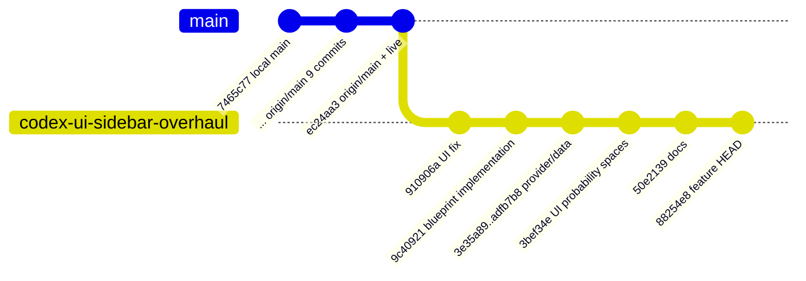
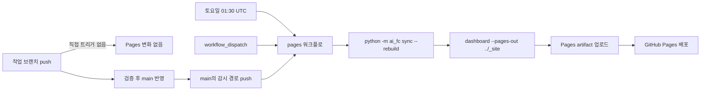

# 브랜치·에이전트 구조 해설서

기준일: 2026-08-01  
실측 저장소: `Sung-JinPark/Jin-s-investing-prediction`  
실측 작업 브랜치: `codex/ui-sidebar-overhaul@88254e8`

## 1. 한눈 요약

`main`은 손님에게 보이는 진열대이고, 작업 브랜치는 새 상품을 만드는 주방이다.  
주방인 `codex/ui-sidebar-overhaul`에 push한 것만으로는 GitHub Pages가 바뀌지 않는다.  
검증된 변경이 `main`에 들어가고 감시 경로가 바뀌어야 Pages가 빌드·배포된다.  
별도로 토요일 정기 배포와 수동 배포가 있지만, 이들도 기본 브랜치인 `main` 산출물을 사용한다.  
현재 라이브 사이트는 `main@ec24aa3`의 데이터와 일치하고 작업 브랜치의 뒤 10개 커밋은 아직 직접 배포되지 않았다.

근거: `git rev-list --left-right --count origin/main...codex/ui-sidebar-overhaul`은 `0 10`, `gh run list --workflow=pages.yml --limit=10`의 최근 10건 `headBranch`는 모두 `main`이었다. 라이브 DOM은 시나리오 기준일 `2026-07-31`, 갱신 시각 `2026-08-01 04:49 KST`를 표시했고, `git show origin/main:data/scenarios/nasdaq_latest.json`은 `asof: 2026-07-31`, `generated_at: 2026-08-01T02:15:21+00:00`를 반환했다.

## 2. 에이전트 분업 지도

| 역할 | 이 저장소에서의 계약 | 코드 변경 여부 | 현재 실측 가능한 상태 |
|---|---|---:|---|
| Claude Fable | 큰 범위의 제품·데이터·UI 설계서를 작성해 다음 구현의 입력으로 제공 | 없음 | 인수인계 문서가 존재하지만 Git 작성자만으로 실행 주체를 식별할 수 없음 |
| Codex | 설계를 코드와 데이터에 다시 대조하고, 작은 단위로 구현·검증·커밋 | 있음 | 현재 작업 폴더와 브랜치에서 수행 중 |
| Claude Code | 필요할 때 로컬 구현이나 검토를 보조 | 있을 수 있음 | 별도 작성자·봇 계정 증거가 없어 현재 사용 여부 미확인 |
| 사람 운영자 | 설계 선택, 승인 필요 정리 결정, 최종 병합·릴리스 판단 | 있음 | 모든 일반 커밋이 사람 이메일 정체성으로 기록됨 |

`git shortlog -sne --all` 결과는 `Sung-JinPark <91ssjj@gmail.com>` 96건, `jin-park <91ssjj@gmail.com>` 1건이다. Git은 실제 대화형 에이전트 이름을 남기지 않았으므로 “어느 커밋을 Codex/Claude가 만들었다”는 통계를 정직하게 분리할 수 없다. 커밋 제목의 `Claude`, `Codex`, `Fable` 문자열도 작업 입력이나 문서 이름일 수 있어 작성자 증거로 사용하지 않는다.

## 3. 브랜치 토폴로지 다이어그램



실제 관계는 두 기준을 구분해야 한다.

- 로컬 `main`은 별도 worktree `C:/workspace/ai-investing`에서 `7465c77`에 머물러 있고 `origin/main`보다 9커밋 뒤다. `git merge-base main codex/ui-sidebar-overhaul`은 `7465c77`, `git rev-list --left-right --count main...codex/ui-sidebar-overhaul`은 `0 19`였다.
- 배포 기준인 원격 `origin/main`은 `ec24aa3`이다. `git merge-base origin/main codex/ui-sidebar-overhaul`은 `ec24aa3`, 원격 기준 차이는 `0 10`이다. 즉 작업 브랜치에는 원격 main의 내용이 모두 있고 추가 10커밋이 있다.
- `git worktree list`는 `C:/workspace/ai-investing [main]`과 `C:/workspace/ai-investing-codex [codex/ui-sidebar-overhaul]` 두 작업 폴더를 확인했다. 같은 저장소라도 체크아웃과 작업 파일은 분리된다.

`scenario-refresh.yml`은 예약/수동 실행 시 기본 브랜치를 checkout하고 새 시장일이 있을 때 그 브랜치에 bot 커밋을 push하도록 정의돼 있다. 그러나 `gh run list --workflow=scenario-refresh.yml`과 최근 전체 run 필터 결과는 실행 이력을 반환하지 않았고, `git log origin/main --author="github-actions\\[bot\\]"`도 비어 있었다. 따라서 위 그림에는 실제로 존재하지 않는 scenario bot 커밋을 추가하지 않았다.

## 4. 배포 파이프라인 원리



`.github/workflows/pages.yml`의 push 조건은 `branches: [main]`이며, 감시 경로는 `forecasts/**`, `calibration/**`, `data/**`, `questions/**`, 대시보드 소스, Pages 워크플로 자체다. 여기에 토요일 `30 1 * * 6` 일정과 수동 실행이 추가된다. 빌드는 checkout한 커밋에서 파생 SQLite를 `sync --rebuild`로 다시 만든 뒤 `_site`를 생성해 Pages artifact로 배포한다.

최근 10회 Pages 실행은 모두 `main`이었다. 최신 실행은 `schedule`, run `30684647968`, head `ec24aa3`, 성공, 2026-08-01 04:48 UTC였고, 직전 push 실행은 `d8b2e69`, 그 전은 `5df32e2`였다. 라이브 페이지의 `2026-08-01 04:49 KST` 표시는 run 시각 04:48 UTC와 거의 같고, 코드가 `datetime.now()`의 무시간대 값을 만든 뒤 JavaScript에서 `KST`를 덧붙인다(`dashboard.py:140`, `dashboard.js:679,1880`). 따라서 이 표시는 CI의 UTC를 KST로 잘못 이름 붙였을 가능성이 높아 배포 커밋 판정 근거로 쓰지 않았다. 대신 페이지의 시나리오 수치(기준일 2026-07-31, NASDAQ 25,373.85/화면 반올림 25,374, ATH 27,093.9, 경로 74/2/24)가 `origin/main`의 JSON과 일치하는 것을 확인했다.

가설 판정은 다음과 같다.

| 가설 | 판정 | 실측 근거 |
|---|---|---|
| A. 작업 브랜치를 main에 반영한 뒤 배포 | **실제 기본 경로** | Pages push 트리거가 main만 포함하고 최근 push run도 모두 main |
| B. scenario bot 커밋을 내 push 반영으로 오인 | **구조상 가능, 현재 실적 없음** | workflow는 기본 브랜치에 push하지만 run·bot commit 이력 없음 |
| C. 다른 브랜치 또는 수동 실행 | **다른 브랜치는 거짓, 수동/일정은 가능** | `branches: [main]`; `workflow_dispatch`와 schedule 존재. 최근 10건 중 수동은 없고 최신 1건은 schedule |
| D. 현재 실제로 main에 직접 push | **현재 작업 폴더에서는 거짓** | `git branch -a -vv`의 현재 표시가 `codex/ui-sidebar-overhaul`; main은 다른 worktree |

결론적으로 “작업 브랜치 push가 곧바로 사이트에 적용된다”는 인식은 착각이다. 사이트가 비슷한 시점에 바뀌었다면 main 반영, 정기 배포, 또는 수동 실행 중 하나가 실제 원인이다.

## 5. 브랜치 분리의 실제 위험

Git에 들어 있는 원본은 브랜치별로 바뀌지만 `db/index.db`와 `dualdb/db/dualdb.sqlite`는 `.gitignore` 대상인 파생 파일이다. 따라서 같은 작업 폴더에서 브랜치를 바꾸면 이전 브랜치에서 만든 DB가 그대로 남을 수 있다. 예를 들어 원본 forecast가 21개인 브랜치에서 다른 브랜치가 남긴 DB 28행을 읽으면 화면은 존재하지 않는 7개 기록까지 보여줄 수 있다. 이는 브랜치가 섞인 것이 아니라 **재생성 가능한 계산 결과를 재생성하지 않은 상태**다.

브랜치를 바꾼 직후 체크리스트:

1. `git status --short`로 원본에 미커밋 변경이 없는지 확인한다.
2. `git fetch --all --prune` 후 현재 브랜치와 추적 원격을 확인한다.
3. 프로젝트 Python 환경에서 `python -m ai_fc sync --rebuild`를 실행해 현재 브랜치 원본만으로 파생 DB를 새로 만든다.
4. inventory/check 명령과 `pytest -q`를 실행한다.
5. 정적 사이트를 새 출력 폴더에 빌드하고 핵심 수치·as-of를 브라우저에서 확인한다.
6. 그 뒤에만 커밋·push·main 반영을 진행한다.

근거: `git check-ignore -v db/index.db dualdb/db/dualdb.sqlite`로 두 DB가 추적 대상이 아님을 확인할 수 있고, Pages 워크플로도 매 배포마다 같은 오염을 피하려고 `sync --rebuild`를 선행한다.

## 6. 권장 운영 수칙

- 기능 하나 또는 설계서 한 묶음당 짧은 작업 브랜치를 사용하고, main 반영 후에는 원격 브랜치를 정리한다. 장수 브랜치는 정기적으로 `origin/main` 포함 여부를 확인한다.
- 병합 전 필수 게이트를 `pytest -q` 전체 통과 → `sync --rebuild` → 사이트 빌드 → 브라우저 확인 순서로 고정한다. 수치·as-of·확률 공간 표기가 핵심 확인점이다.
- `main` 직접 push는 자동 생성된 scenario snapshot처럼 워크플로가 관리하는 좁은 범위, 또는 긴급하고 검증된 수정으로 제한한다. 일반 기능은 작업 브랜치와 리뷰를 거친다.
- scenario 자동 커밋과 사람의 main 반영이 동시에 일어나지 않도록 반영 직전에 `git fetch`하고 원격 main이 예상 SHA인지 확인한다. 달라졌다면 새 main을 포함해 테스트를 다시 한다.
- 로컬 `main`과 `origin/main`을 같은 것으로 간주하지 않는다. 현재처럼 로컬 main이 9커밋 뒤일 수 있으므로 배포 판단에는 `origin/main`을 명시한다.
- 배포 원인을 확인할 때 화면 변화 시각만 보지 말고 `gh run list --workflow=pages.yml`, run의 `event/headBranch/headSha`, 라이브 as-of를 함께 대조한다.

## 7. FAQ

### Q1. 작업 브랜치에 push했는데 사이트가 왜 안 바뀌나요?

정상이다. Pages push 트리거는 `main`만 감시한다. 변경이 main에 반영되고 감시 경로에 해당해야 자동 push 배포가 시작된다. 단, 토요일 일정 또는 수동 실행이 별도로 사이트를 다시 배포할 수 있다.

### Q2. 반대로 작업 브랜치에 push한 직후 사이트가 바뀐 것처럼 보인 이유는 무엇인가요?

같은 시점에 main 반영이나 정기 배포가 있었을 가능성이 높다. 현재 최근 10건의 실제 배포 head는 모두 main이고, 최신 것은 schedule이었다. 실행 이력의 head SHA로 원인을 판정한다.

### Q3. 작업 브랜치를 지워도 되나요?

필요한 커밋이 main에 포함됐고 원격에도 올라갔으며, 미커밋 파일이 없다는 세 조건을 확인한 뒤 지워도 된다. 현재 브랜치는 `origin/main`보다 10커밋 앞이므로 지금 삭제하면 그 10커밋을 main에서 잃는다.

### Q4. 두 worktree에서 동시에 작업해도 되나요?

가능하지만 한 브랜치를 두 worktree에 동시에 checkout할 수 없고, 파생 DB는 각 폴더에 별도로 남는다. 각 worktree에서 브랜치 전환 후 `sync --rebuild`를 실행하고 어느 폴더에서 commit/push하는지 확인해야 한다.

### Q5. 라이브 사이트가 어느 커밋인지 가장 빨리 확인하는 방법은 무엇인가요?

`gh run list --workflow=pages.yml --limit=10`에서 최신 성공 run의 `headBranch/headSha/event`를 확인하고, 라이브 화면의 기준일·수치를 그 SHA의 `data/scenarios/nasdaq_latest.json`과 비교한다. 이번 실측은 `main@ec24aa3`, 시나리오 `2026-07-31`, 경로 `74/2/24`가 일치했다.

## 실측 명령 기록

```text
git branch -a -vv
  * codex/ui-sidebar-overhaul 88254e8 [origin/codex/ui-sidebar-overhaul]
  + main                      7465c77 [origin/main: behind 9]
  remotes/origin/main         ec24aa3

git worktree list
  C:/workspace/ai-investing       7465c77 [main]
  C:/workspace/ai-investing-codex 88254e8 [codex/ui-sidebar-overhaul]

git merge-base origin/main codex/ui-sidebar-overhaul
  ec24aa3d9183fce3d6842fbc420ea8b6a7a0429c
git rev-list --left-right --count origin/main...codex/ui-sidebar-overhaul
  0 10

git shortlog -sne --all
  96 Sung-JinPark <91ssjj@gmail.com>
   1 jin-park <91ssjj@gmail.com>

gh run list --workflow=pages.yml --limit=10
  latest: completed success pages pages main schedule 30684647968
  previous: completed success feat: add scenario change intelligence pages main push 30681817475

live DOM
  갱신 2026-08-01 04:49 KST
  현재 시장 판단 · 2026-07-31
  NASDAQ 25,374 / 시나리오 74%·2%·24%
```
