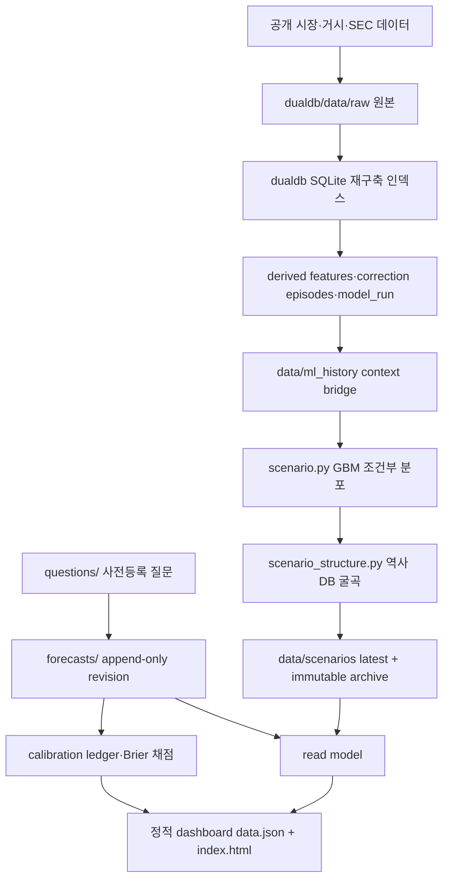

# ChatGPT 전체 인수인계 — Jin's Investing Prediction

작성일: 2026-08-06 KST

기준 저장소: `Sung-JinPark/Jin-s-investing-prediction`

기준 브랜치·커밋: `main` · `dea62a1bd5c527ff16fb240377a6defd8f612934`

현재 NASDAQ 스냅샷: `nasdaq-scenario:2026-08-03:r8`

목적: 새 ChatGPT 대화가 프로젝트 전체 맥락과 불변 원칙을 인수하고, NASDAQ 구조경로의 정합성을 독립 검증하도록 한다.

> 이 문서는 투자 자문이 아니다. 현재 경로·확률·역사 유사도는 모두 모델 조건부 또는 참고용이다. 검토 결과를 특정 방향으로 맞추는 튜닝은 금지한다.

---

## 1. 가장 먼저 알아야 할 결론

이 프로젝트는 단순한 주가 목표가 사이트가 아니다. 사전등록 질문, 시점 고정 예측, append-only 원장, 결과 채점, 과거 시대 DB, 정적 대시보드를 결합한 개인용 시장 의사결정 보조 시스템이다.

이번 인수인계에서 가장 중요한 미해결 쟁점은 NASDAQ 그래프의 **굵은 세 경로가 실제로 서로 다른 시나리오 동학을 갖고 있지 않다**는 점이다.

현재 구현은 다음과 같다.

1. GBM 20,000경로를 S1/S2/S3로 분류해 각 시나리오의 비중과 대표 종점을 만든다.
2. 혁신시대 3종의 고정 월 위상 곡선을 중앙값으로 합쳐 하나의 공통 굴곡을 만든다.
3. 그 공통 굴곡을 2026년 S1 최대낙폭이 -12.19%가 되도록 `strength=1.735781`로 증폭한다.
4. 동일한 strength와 동일한 굴곡을 S1/S2/S3 및 2026/2027 전 구간에 적용한다.
5. 각 경로의 차이는 사실상 연도별 시작·종점과 기울기뿐이다.

따라서 화면에서 세 경로가 나란히 같은 모양으로 움직이는 것은 렌더링 오류가 아니라 현재 생성식의 직접적인 결과다. 이 설계가 통계적으로 정당한지는 아직 검증되지 않았다.

또한 회색 점선인 “혁신사이클 대표 참조선”은 최신 선택 3시대에서 동적으로 계산한 선이 아니다. `src/ai_fc/scenario.py`의 `_ANALOG_VALUES`에 하드코딩된 26개 값, 즉 과거 7/14 닷컴 참조 배열을 현재 anchor에 맞춰 보간하고 `anchor × 1.25`에서 잘라 표시한다. 굵은 구조경로와 별개의 구형 레이어다.

---

## 2. 사용자 요구와 이번 검토의 핵심 질문

사용자는 다음을 검증하고 싶다.

1. 2026-08-03부터 11월 전후까지 세 경로가 하락하도록 만든 근거는 무엇인가?
2. S1/S2/S3가 서로 다른 시나리오라면 왜 같은 굴곡을 따라가는가?
3. 회색 혁신사이클 참조선은 왜 충분히 상승하지 않으며, 최신 혁신 DB를 반영한 선이 맞는가?
4. 닷컴 버블 DB가 구조경로의 주된 기준인가, 여러 시대 중 하나인가?
5. 2027 경로가 단조롭고 세 시나리오가 유사한데, 실제 역사 DB와 조건부 시나리오를 더 세밀하게 반영할 수 있는가?
6. 그래프를 더 “그럴듯하게” 그리는 것이 아니라, PIT·재현성·과적합 방지 조건을 지키며 더 현실적으로 만들 수 있는가?

검토자는 위 질문을 코드와 직렬화 데이터로 재현하고, 현재 방식을 유지·수정·폐기 중 하나로 판정해야 한다.

---

## 3. 시스템 목적과 불변 원칙

### 3.1 목적

- 해결 가능한 시장 질문을 사전등록한다.
- 예측 시점의 근거와 확률을 revision 파일로 보존한다.
- 결과 발표 후 Brier 점수와 캘리브레이션을 계산한다.
- 정량 모델·역사 유사도·LLM 판단을 서로 다른 확률 공간으로 분리한다.
- 정적 GitHub Pages에서 누구나 근거와 변경 이력을 확인하게 한다.

### 3.2 절대 규칙

- `forecasts/` 공개 revision은 수정·삭제하지 않는다. 새 revision만 추가한다.
- `calibration/ledger.csv`와 주요 데이터 archive는 append-only다.
- `scenario_conditional`, `physical_event`, `reference_only`를 산술 결합하지 않는다.
- 과거 결과를 본 뒤 모델 방향이나 가중치를 유리하게 재조정하지 않는다.
- 모델·데이터 coverage가 게이트보다 낮으면 수치를 숨기고 `blocked`를 표시한다.
- 현재 점예측·목표가를 투자 권유처럼 표시하지 않는다.
- 과거 시대 곡선은 확률이 아니라 참고용 또는 경로 형태 가정이다.
- immutable snapshot 수정에는 `calibration/corrections.csv` 승인 행과 새 revision이 필요하다.

---

## 4. 전체 아키텍처



### 4.1 주요 디렉터리

| 경로 | 역할 |
|---|---|
| `questions/` | 질문, 마감, 해소 기준, drivers 등록부 |
| `forecasts/` | 공개 예측 revision과 근거 |
| `calibration/` | 결과 채점, 정정, provider shadow 원장 |
| `src/ai_fc/` | 메인 CLI·예측·시나리오·read model·대시보드 |
| `src/tests/` | 계약·UI·회귀·불변성 테스트 |
| `dualdb/dualdb/` | 과거 시대 수집·파생·k-NN·LPPL·context bridge |
| `dualdb/tests/` | dualdb 모델·PIT·수집 검증 |
| `data/contracts/` | 수집·모델·표시 사전등록 계약 |
| `data/scenarios/` | NASDAQ latest와 immutable correction revisions |
| `data/ml_history/` | append-only 모델·context 출력 |
| `data/base_rates/` | 역사 base rate와 자동 보고서 |
| `data/cross_asset/` | NASDAQ·BTC·Realty Income 조건부 경로 |
| `data/ai_capital_cycle/` | SEC 기반 AI 자본사이클 coverage·regime |
| `docs/` | 아키텍처·모델 registry·결정·운영·알려진 한계 |
| `.github/workflows/` | verify·pages·scenario refresh 등 자동화 |

### 4.2 데이터 계층

| 계층 | 대표 자료 | 현재 사용 |
|---|---|---|
| 시장 가격 | Yahoo/FRED 기반 NASDAQ·VIX·금리·과거 지수 | GBM, 시대 overlay, drawdown |
| 거시·유동성 | 금리·M2·HY·CPI·실업·유동성 진단 | 참고 레이어, 일부 게이트 |
| 혁신시대 | dotcom, Japan 1989, Nifty Fifty, crypto, biotech, Dow, electricity | 유사도·구조 경로 참고 |
| AI 자본사이클 | SEC capex·OCF·D&A·segment coverage | coverage 0.6 전 regime 차단 |
| 예측 원장 | 질문·revision·Brier·correction | 공식 채점과 변경 감사 |
| 교차자산 | NASDAQ·BTC·Realty Income | AI shock 및 닷컴 이후 5년 참고 |

---

## 5. 현재 NASDAQ r8의 정확한 계보

| 항목 | 값 |
|---|---|
| snapshot | `nasdaq-scenario:2026-08-03:r8` |
| correction | `CORR-260806-019` |
| supersedes | `nasdaq-scenario:2026-08-03:r7` |
| anchor | 25,914 |
| ATH | 27,093.9 |
| horizon | 2026-08-03~2027-08-04, 252거래일 |
| GBM | seed 42, 20,000경로 |
| S1/S2/S3 | 83% / 2% / 15% |
| 구조 계약 | `2026-08-06.v3` |
| 선택 시대 | biotech2015 · dotcom · japan1989 |
| 선택 context asof | 2026-07-29 |
| AI overlay current phase | M+42 |
| 보정 목표 | 2026 S1 최대낙폭 -12.19% |
| 공용 strength | 1.735781 |

### 5.1 S1/S2/S3의 본래 정의

- S1: 2026년 분류 구간 안에 ATH를 한 번이라도 상회한 GBM 경로.
- S2: ATH는 상회하지 않았으나 2026년 말 고정 기준가보다 높은 경로.
- S3: 나머지 조정·횡보 경로.

분류는 GBM 표본에 적용된다. 그러나 화면의 굵은 경로 형태는 각 분류 표본의 실제 중앙 경로가 아니라 `scenario_structure.py`가 만든 공통 구조 형태다.

### 5.2 구조경로 생성식

선택 시대 (e\)의 고정 overlay를 현재 AI 위상 (M+42\)에 맞춰 정규화한다.

```text
phase(t) = 42 + calendar_days(t - 2026-08-03) / 30.4375
raw(t) = median_e( overlay_e[phase(t)] / overlay_e[42] )
```

각 표시 연도 안에서 시작과 끝을 잇는 기하 추세를 제거한다.

```text
trend_raw(t) = raw(year_start) × (raw(year_end)/raw(year_start))^progress
residual(t) = raw(t) / trend_raw(t)
```

각 S1/S2/S3의 기존 GBM 대표 경로에서 **연도 시작값과 연도 끝값만** 가져와 기하 baseline을 만든 뒤 같은 residual을 곱한다.

```text
baseline_s(t) = source_s(year_start) × (source_s(year_end)/source_s(year_start))^progress
display_s(t) = round( baseline_s(t) × residual(t)^1.735781 )
```

즉, 시나리오별 GBM 중간 경로는 버리고 시작·끝점만 쓴다. 모든 시나리오가 동일한 `residual(t)^strength`를 공유한다.

---

## 6. 2026-08-03→11월 하락의 직접 원인

### 6.1 코드상 원인

- 선택된 세 시대의 M+42 이후 고정 월별 곡선 중앙값이 8~10월에 약해진다.
- 2026년 연말점까지의 기하 추세를 제거한 residual은 10월 말 약 0.8977까지 내려간다.
- 이 residual을 1.735781승하여 약 0.8292로 증폭한다.
- 상승하는 S1 baseline조차 10월 말에는 `27,487.5 × 0.8292 ≈ 22,793`이 된다.

| 날짜 | 역사 중앙 raw | 연도 detrend residual | 적용 factor | S1 기하 baseline | S1 화면 | S2 화면 | S3 화면 |
|---|---:|---:|---:|---:|---:|---:|---:|
| 2026-08-03 | 1.0000 | 1.0000 | 1.0000 | 25,914 | 25,914 | 25,914 | 25,914 |
| 2026-08-31 | 0.9727 | 0.9587 | 0.9293 | 26,428 | 24,561 | 24,187 | 23,755 |
| 2026-09-29 | 0.9962 | 0.9677 | 0.9446 | 26,953 | 25,459 | 24,690 | 23,815 |
| 2026-10-27 | 0.9377 | 0.8977 | 0.8292 | 27,488 | 22,793 | 21,769 | 20,622 |
| 2026-11-24 | 1.0139 | 0.9566 | 0.9259 | 28,033 | 25,957 | 24,413 | 22,713 |
| 2026-12-31 | 1.0793 | 1.0000 | 1.0000 | 28,730 | 28,730 | 26,508 | 24,113 |

### 6.2 어느 시대가 하락을 주도하는가

| 위상 | biotech2015 | dotcom | japan1989 | 중앙값 |
|---|---:|---:|---:|---:|
| M+42.92 | 0.9727 | 0.8167 | 0.9822 | 0.9727 |
| M+43.87 | 0.9961 | 0.8913 | 0.9979 | 0.9961 |
| M+44.79 | 0.9106 | 0.9376 | 1.0021 | 0.9376 |
| M+45.71 | 0.9297 | 1.0137 | 1.0432 | 1.0137 |

8월 말 중앙값은 biotech, 10월 말 중앙값은 dotcom이 결정한다. 단, 이 결과가 “2026년 10월에 실제 조정이 발생할 확률”을 뜻하지는 않는다. 고정 월 위상 매핑과 보정식이 만든 조건부 형태 가정이다.

### 6.3 검토가 필요한 위상 문제

- k-NN은 현재 AI 상태와 비슷한 **과거 날짜**를 찾지만, 구조경로는 그 이웃 날짜를 사용하지 않는다.
- 구조경로는 선택된 `era label`만 사용하고 각 시대의 고정 `overlay_start + M+42`를 읽는다.
- dotcom의 `model_anchor=1996-01`과 `overlay_start=1995-01`은 12개월 차이가 난다.
- 따라서 “유사한 상태가 발견된 시점”과 “미래 굴곡을 꺼내는 시점”이 서로 다른 좌표계일 수 있다.

이 연결이 이론적으로 정당한지, 아니면 10월 하락을 우연히 만든 위상 누출인지 독립 검증이 필요하다.

---

## 7. 왜 세 시나리오가 같은 모양인가

직접 원인은 `_structural_paths()`가 모든 시나리오에 다음을 공통 적용하기 때문이다.

- 같은 선택 시대 3개
- 같은 raw median
- 같은 연도별 detrended residual
- 같은 `strength=1.735781`
- 같은 위험창 중심월

시나리오별 대안 strength는 계산되어 직렬화된다.

| 시나리오 | 동일 -12.19% 목표에 필요한 strength | 현재 적용 여부 |
|---|---:|---|
| S1 | 1.735781 | 적용 |
| S2 | 1.320724 | 미적용 |
| S3 | 0.819160 | 미적용 |

하지만 strength만 다르게 적용해도 “같은 굴곡의 진폭 차이”일 뿐이다. 진정한 시나리오 분리는 다음 중 하나 이상을 데이터로 정당화해야 한다.

- 시나리오 조건에 맞는 역사 episode subset
- 시나리오별 위험창·회복속도·재하락 횟수 분포
- ATH 돌파/미돌파/조정 상태에 따른 조건부 path archetype
- 금리·신용·유동성 상태 전이별 서로 다른 경로 생성기
- 동일 시점에 여러 형태가 가능한 mixture distribution

검토자는 “다르게 보이게 만들기”가 아니라 시나리오 정의와 경로 동학이 실제로 연결되는지 평가해야 한다.

---

## 8. 회색 혁신사이클 참조선의 실제 정체

현재 `scenario.py`에는 다음 정적 배열이 있다.

```text
_ANALOG_VALUES = [26107, 26918, 25300, ..., 38239]
```

주석은 7/14 시나리오의 닷컴 참조 모양을 최신 anchor로 재기준한 것이라고 설명한다. 생성 시 이 배열을 52개 표시 주차로 선형 보간하고 현재 anchor를 곱한다.

```text
analog = interp(26개 정적 ratio → 52개 주차) × current anchor
clip = current anchor × 1.25
```

따라서 이 선은 다음이 아니다.

- 최신 `selected_eras` 중앙 곡선
- 현재 M+42에서 시작하는 dotcom 실측 경로
- k-NN 이웃 5개의 중앙 forward path
- S1/S2/S3와 같은 endpoint-preserving 구조경로

또한 상승분은 `clip` 때문에 화면상 +25%에서 잘릴 수 있다. 2027-08 원시 참조값은 37,956이지만 clip은 32,392다. UI는 일부 끝점에서 `↗ +x%` 라벨로 잘림을 알리지만, 선 자체는 잘려 보인다.

“혁신사이클 대표 참조선”이라는 명칭은 현재 데이터 계보를 정확히 설명하지 못한다. 유지하려면 “구형 7/14 닷컴 정규화 참조선”으로 명확히 바꾸거나, 최신 DB에서 다시 생성하는 편이 일관적이다.

---

## 9. 닷컴 DB가 main인가

현재 답은 **아니다**.

- 굵은 구조경로: biotech2015·dotcom·japan1989 3개 시대의 중앙 위상. 닷컴은 1/3 구성원이다.
- 보정 진폭: `analog.correction_depth_median=-12.19%`라는 다중 시대 조정 중앙값.
- 회색 점선: 구형 닷컴 정적 배열.
- k-NN 시대 선택: 5개 가격 파생 피처의 유클리드 거리로 고른 과거 이웃의 era label.

사용자가 닷컴 버블을 main analog로 원한다면 별도의 사전등록이 필요하다. 다만 닷컴을 임의로 main으로 올리는 것은 방향 튜닝이 될 수 있으므로 다음을 비교해야 한다.

1. dotcom-only
2. current k-NN selected-era median
3. all-era robust median
4. macro-conditioned subset
5. leave-one-era-out sensitivity

각 방식에 대해 위상·낙폭·회복기간·종점·OOS 성능을 함께 보고 결정해야 한다.

---

## 10. 2027 경로가 단조롭고 유사해 보이는 이유

2027도 2026과 같은 raw와 strength를 사용하지만, 2027-01-08~08-04 구간을 별도 연도로 다시 detrend한다. 시작과 끝에서 residual은 강제로 1이 된다. 그 사이의 역사 곡선은 월간 선형보간이라 비교적 매끈하다.

실제 직렬화에는 2027-06-03→07-02 조정이 있다.

| 시나리오 | 2027 최대낙폭 | peak | trough |
|---|---:|---|---|
| S1 | -7.8% | 2027-06-03 | 2027-07-02 |
| S2 | -8.0% | 2027-06-03 | 2027-07-02 |
| S3 | -8.0% | 2027-06-03 | 2027-07-02 |

그러나 세 경로의 조정 날짜와 상대 모양이 동일하고, 월간 overlay를 주간으로 보간하며, 연도별 기하 baseline이 강하기 때문에 사용자는 하나의 곡선을 수직 이동한 것처럼 인식한다.

2027 고도화는 다음을 검증해야 한다.

- 2026에서 2027로 연도 경계 detrend를 리셋하는 것이 경제적으로 타당한가?
- 표시 연도 분리는 UI만 하고 모델 경로는 252일 전체에서 연속 추정해야 하는가?
- 조건부 episode bootstrap이나 state-transition model이 월간 단일 median보다 적합한가?
- 시나리오마다 correction timing·depth·recovery half-life가 달라야 하는가?
- 굵은 대표선 하나보다 scenario별 median + 내부 band가 더 정직한가?

---

## 11. 주요 모델과 현재 지위

| 모델/레이어 | 지위 | 주의점 |
|---|---|---|
| 공식 LLM forecast | 사전등록 사건확률 | 시장 경로와 산술 결합 금지 |
| GBM MC | scenario-conditional 기준선 | 정규·정상성, fat tail·jump 미반영 |
| 구조경로 v3 | 화면 대표 형태 | 확률 표본 아님, 공통 굴곡 문제 |
| k-NN analog | reference | 5개 상관 피처, 미백색화, effective dimension 문제 |
| LPPL | demoted | 조기경보 참고만, 방향 근거 금지 |
| DTW | reference | 단일 위상 확정 금지 |
| 혁신사이클 overlay | reference-only | 고정 anchor·hindsight 한계 |
| AI capital cycle | blocked if coverage<0.6 | 현재 수치 개입 금지 |
| Scenario Tracker | reference-only counts | 점수·확률 변환 금지 |
| Liquidity | reference-only | timing 식별 근거 아님 |

---

## 12. 운영·빌드·검증 명령

PowerShell 기준:

```powershell
$env:PYTHONPATH='src;dualdb'
python -m pytest -q
python -m ai_fc audit-ledgers --check
python -m ai_fc inventory --check
python -m ai_fc sync --check
python tools/reproduce_scenario_snapshot.py
node --check src/ai_fc/dashboard_parts/dashboard.js
```

시나리오 재생성:

```powershell
$env:PYTHONPATH='src'
python -m ai_fc scenario --force
python -m ai_fc scenario-structure
python -m ai_fc dashboard --pages-out .tmp/review_site
```

주의:

- 같은 asof의 immutable archive를 덮어쓰지 않는다.
- 변경 시 correction ID와 새 revision을 발급한다.
- `scenario --force` 전에 기존 archive 정책과 stale-feed guard를 확인한다.
- SQLite는 재구축 인덱스다. 정본은 파일 원장과 raw snapshot이다.

### 12.1 기준 검증 결과

- 로컬 전체: `383 passed in 175.21s`
- 공개 재현: `83/2/15`, 분위수 1,764셀 mismatch 0
- 정적 `data.json`: 311,360 bytes, 320KB 상한 이내
- ledger audit: violation 0
- r7 archive SHA-256는 V-1 전후 동일
- GitHub Actions verify/pages: `dea62a1`에서 green

---

## 13. 최근 중요 커밋

| commit | 요약 |
|---|---|
| `dea62a1` | V-1 캘리브레이션 불변성 공개, r8 |
| `760328b` | credit-liquidity 설계 문서 정리 |
| `d12c069` | 구조경로·재현성 UI 보강, r7 |
| `334b4e5` | generated inventory/read-model 갱신 |
| `311b2ad` | DB-shaped NASDAQ 및 dotcom cross-asset map |
| `6a0ce0d` | 혁신사이클 참조선과 5년 shock map |
| `96dcdde` | Realty Income rolling-entry cohort |

---

## 14. 현재 미해결 리스크

### P0/P1 후보

1. 시나리오 구분과 화면 경로 동학의 연결 부재.
2. k-NN 이웃 날짜와 구조 overlay 위상 사이 계보 단절.
3. dotcom `overlay_start=1995-01`과 `model_anchor=1996-01` 혼용.
4. 구형 정적 닷컴 참조선을 최신 혁신사이클로 표시.
5. 공용 strength를 S1/S2/S3와 2027에 재사용.
6. 연도별 detrend 리셋이 경제 국면과 무관한 달력 효과를 만들 가능성.
7. 다섯 상관 피처 유클리드 k-NN의 미백색화.
8. 현재 context의 multi-era k-NN model run을 current SQLite 원장에서 직접 찾기 어려운 lineage gap.

### P2 후보

1. 월간 overlay를 주간으로 선형보간해 경로가 지나치게 매끈함.
2. 대표 굵은 선이 내부 분포의 다양성을 가림.
3. analog clip이 상승 참조를 시각적으로 축소.
4. 역사 곡선의 결과가 알려진 hindsight 자료라는 점이 화면에서 충분히 두드러지지 않을 수 있음.

---

## 15. 검토자가 지켜야 할 작업 규율

- 보고서의 주장부터 믿지 말고 JSON·코드로 재계산한다.
- 사용자의 “더 올라야 한다”는 견해를 목표 함수로 쓰지 않는다.
- 경로를 수동으로 예쁘게 그리지 않는다.
- 시나리오별 차이는 사전등록된 조건부 표본 또는 상태 전이로 근거를 만든다.
- 점추정·굵은 선보다 분포, 내부 band, 경로군을 우선 검토한다.
- 선택된 역사 시대가 바뀔 때 결론이 얼마나 변하는지 leave-one-era-out으로 보고한다.
- 2026과 2027은 UI에서 나누더라도 모델 계산은 연속 252거래일 기준과 비교한다.
- 결과물에는 `as_of`, 데이터 availability, 표본 수, probability space, 한계가 항상 있어야 한다.
- 현재 `83/2/15`를 바꾸려면 별도 모델 검증과 새 revision이 필요하다. UI 고도화 명목으로 바꾸지 않는다.

---

## 16. 권고하는 다음 연구 설계

아래는 구현 지시가 아니라 검토 대상 후보이다.

### 16.1 경로 생성 후보

1. **Scenario-conditioned historical bootstrap**

   역사 correction episode를 ATH 돌파·미돌파·깊은 조정 조건으로 나눈 뒤 각 시나리오 내부에서 timing/depth/recovery를 resample한다.

2. **Regime-conditioned state transition**

   금리·HY·유동성·breadth 상태를 PIT 기준으로 분류하고 주간 전이확률로 경로를 생성한다.

3. **Analog-neighbor forward path ensemble**

   선택된 era label의 고정 위상이 아니라 실제 k-NN neighbor date 이후의 forward path를 사용한다.

4. **Hybrid residual bootstrap**

   GBM 또는 heavy-tail baseline에 시나리오별 역사 residual block을 bootstrap한다. 굵은 선은 conditional median, 주변은 within-scenario band로 표시한다.

### 16.2 최소 비교군

- 현행 공통 구조경로
- 기존 GBM conditional representative
- dotcom-only
- selected-era fixed phase
- actual-neighbor-date forward ensemble
- scenario-conditioned episode bootstrap

평가지표는 방향 적합도가 아니라 PIT OOS log score/CRPS, 최대낙폭·회복기간 coverage, 경로 roughness, 시나리오 분리도, calibration이다.

---

## 17. 패키지 읽기 순서

1. `00_README_FIRST.md`
2. `handoff/chatgpt_ai_investing_full_handoff_260806.md`
3. `review/chatgpt_structural_path_review_prompt_260806.md`
4. `review/chatgpt_structural_path_evidence_260806.md`
5. `review/chatgpt_structural_path_acceptance_gates_260806.md`
6. `data/scenarios/nasdaq_latest.json`
7. `src/ai_fc/scenario.py`
8. `src/ai_fc/scenario_structure.py`
9. `dualdb/dualdb/models/knn_analog.py`
10. `dualdb/dualdb/export/context_bridge.py`
11. `data/ml_history/2026.jsonl`
12. `src/ai_fc/dashboard_parts/dashboard.js`

`MANIFEST_SHA256.txt`로 패키지 파일 무결성을 확인한다.

---

## 18. 새 ChatGPT가 최종적으로 제출해야 할 것

1. 각 쟁점의 `PASS/PARTIAL/FAIL/BLOCKED` 판정.
2. 8/3→11월 하락의 데이터→수식→화면 인과 추적표.
3. S1/S2/S3 동일 형태의 코드 근거와 통계적 타당성 판정.
4. 회색 참조선의 실제 lineage와 명칭·표시 시정안.
5. dotcom-only 대 multi-era 대 actual-neighbor-date 비교 설계.
6. 2026/2027 시나리오별 경로 고도화 설계와 과적합 방지책.
7. 파일·함수·테스트 단위 구현 순서.
8. 기존 확률·archive·원장 불변성을 보존하는 migration 계획.
9. 완료로 판정하지 못한 항목과 필요한 추가 데이터.

검토는 `review/chatgpt_structural_path_review_prompt_260806.md`의 출력 형식을 그대로 따른다.
