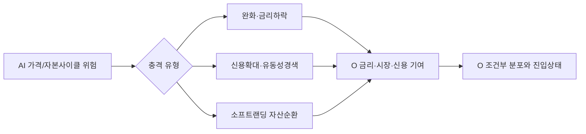

# Claude 정밀 검토 요청서 — AI 버블 위험시계 · 닷컴 DB · Realty Income 진입 · 선행 조정 경로

작성일: 2026-08-04 KST  
검토 대상 커밋: `48fc893` (`main`)  
장기 비교 기준: `b01427c..48fc893`  
사이트: https://sung-jinpark.github.io/Jin-s-investing-prediction/

## 0. Claude에게 요청하는 역할

당신은 이 ZIP을 읽는 독립적인 퀀트 리서치 리드이자 데이터 감사자다. 기존 설계를 칭찬하거나 UI를 표면적으로 평가하는 것이 목적이 아니다. 코드, 계약, 최신 스냅샷, DualDB 추출물, 테스트와 Git diff를 상호 대조해 다음 네 질문에 답할 수 있는 시스템으로 발전시키기 위한 **반증 중심 검토와 다음 구현 설계**를 작성하라.

1. AI 자본사이클이 과열에서 붕괴로 전환될 위험 구간을 분기 단위 분포로 추정할 만큼 DB가 충분한가?
2. 닷컴버블을 가격 한 줄이 아니라 자본조달·기업 펀더멘털·시장 폭·신용·정책·내부 조정파동까지 포함해 비교하고 있는가?
3. AI 위험 국면 전후 Realty Income(O)의 진입 시점을 조건부로 판단할 수 있는가?
4. 버블 붕괴 전 반복되는 5~20% 단기조정과 회복을 날짜를 꾸며내지 않으면서 현실적으로 그릴 수 있는가?

이번 답변에서는 코드를 수정하지 말고, 먼저 검토 결과와 구현 가능한 Grand Blueprint를 작성하라. 모든 문제는 `P0/P1/P2/P3`로 분류하고 가능한 경우 ZIP 내부의 `파일:라인`, 데이터 필드, 행 수와 수치로 증명하라.

## 1. 절대 의미 규칙

- 버블 붕괴 **점 날짜**를 만들지 않는다. 결과는 `분기별 hazard`, `누적발생 구간`, `조건부 위험창`, `모델 불확실성`으로 제시한다.
- 먼저 “AI 버블 붕괴” 사건을 검증 가능한 복수 정의로 나눈다. 최소한 가격 붕괴, 자본사이클 역전, 신용/조달 스트레스, 복합 상태를 별도 사건으로 정의하고 임계값 민감도를 제시한다.
- `scenario_conditional`, `physical_event`, `reference_only`를 혼합하지 않는다. 각 표·그래프·필드에 확률공간을 표시한다.
- 표본경로의 굴곡 날짜를 사건 날짜나 뉴스 인과로 설명하지 않는다. 9/22 하락은 현재 seed 42 GBM 표본의 무작위 충격일 뿐이다.
- 모든 학습·유사도·백테스트는 point-in-time `available_at` 기준으로 수행한다. 사후 확정 정점·바닥·기업 생존정보는 학습 당시 이용 가능한 정보와 분리한다.
- 원천 라이선스로 재배포가 제한된 가격·ICE 지수는 파생 진단과 영수증만 사용한다. 누락을 임의 데이터로 채우지 않는다.
- 현재 모델보다 복잡하다는 이유만으로 후보 모델을 승격하지 않는다. walk-forward 성능, calibration, 안정성, 데이터 커버리지 gate가 먼저다.

## 2. 현재 구현의 사실관계

### 2.1 Nasdaq 조건부 경로

- 스냅샷 `asof=2026-08-03`, 기준값 `25,913.9`.
- 최근 확정 일봉 252거래일로 산출한 `GBM daily 252d`, 20,000경로, seed 42.
- 분류일은 2026-12-31이며 현재 경로 비중은 S1 83%, S2 2%, S3 15%.
- p05~p95 일별 분위수, 현재값/ATH 상회 비중, S1/S2/S3 조건부 중앙값을 252거래일까지 저장한다.
- 굵은 S1/S2/S3 선은 각 분류 내부 종점 50백분위에 가까운 실제 모의 표본이다. 날짜별 중앙값 선이 아니며 굴곡 날짜에 사건 의미가 없다.
- 최신 수정에서 빠른 날짜 1주·1개월·3개월·6개월의 재기준 계산을 `value[startIndex + offset] / value[startIndex]`로 바로잡았다. 선택일 이후 p10~p90과 S1/S2/S3 표본을 각각 100으로 표시한다.
- 한계: 정규 GBM은 fat tail, 변동성 군집, 점프, 레짐 전환, 자본사이클 또는 예정 이벤트 충격을 직접 모형화하지 않는다.

### 2.2 AI 자본사이클 DB

- `ai_regime_latest.json`: `asof=2026-08-03`, `status=blocked`, `coverage=0.0`, gate 0.60.
- SEC Companyfacts에서 MSFT/AMZN/GOOGL/META의 기업 전체 capex, 영업현금흐름, 감가상각, 부채발행 표준 태그는 수집하지만 누적 YTD를 임의 분기화하지 않는다.
- cloud/AI 세그먼트 매출과 명시적 AI 매출은 filing-level dimension 추출 전까지 추론하지 않는다.
- `circular_finance_candidates.csv`는 실질 데이터가 없고, AI regime 좌표·trail·hazard는 생성되지 않는다.
- 따라서 현재 사이트의 Nasdaq S1 83%는 AI 버블 생존확률이 아니며, 현재 DB로 2028년 같은 붕괴 연도를 모델 산출값이라고 주장할 수 없다.

### 2.3 닷컴 DualDB

- SQLite 전체는 재배포 크기 때문에 제외하고, ZIP의 `evidence/dualdb/`에 스키마·행 수·커버리지·핵심 테이블 추출을 넣었다.
- `price_daily`: 285,076행. 닷컴 derived 창은 1995-01-03~2003-12-31이며 ^IXIC, ^NDX, ^SOX, ^SPX, ^TNX, ^VIX와 AMAT/AMD/ASML/CSCO/IBM/INTC/KLAC/MSFT/MU/ORCL/QCOM/TXN 등 18개 시계열이 대체로 2,267거래일 존재한다.
- `correction_episode`: 전체 41행, 닷컴 6행. 닷컴 깊이는 약 -6.84%~-75.04%.
- `dotcom_casualty`: 25행. survivorship bias를 줄이기 위한 시작점이지만 표본과 속성이 매우 제한적이다.
- `ipo_annual`: 14행, `margin_debt_monthly`: 14행, `capex_buildout_annual`: 11행, `valuation_monthly`: 1,832행.
- 핵심 결손: `fundamentals_annual=0행`, `cycle_compare=0행`.
- `model_run` 최신 asof는 KNN 2026-07-17, twins 2026-07-17, LPPL 2026-07-19, DTW 2026-07-20으로 현재 스냅샷보다 낡았다.
- 앵커 불일치: `dualdb/config.yaml`과 era 테이블은 닷컴 anchor 1996-01, `src/ai_fc/era_analog.py`와 UI는 1995-01을 표시한다. overlay start와 모델 anchor의 의미를 분리하지 않으면 위상 설명이 한 해 흔들린다.
- 최근 저장된 유사도는 closest `dotcom`, distance 0.2288, 과거 pool 5개, 선택 시대 dotcom+biotech, forward sample `n=5`, correction median -12.92%. 표본이 작고 `anchor_sensitivity.status=not_computed`다.

### 2.4 Realty Income

- `asof=2026-08-03`, 배당수익률 5.11%, 10년물 대비 스프레드 0.36%p.
- 이 스프레드는 2000년 이후 318개 월 관측 중 0.3백분위다. 이 한 지표만 보면 역사적으로 넓은 진입 스프레드가 아니다.
- 주간 156개 관측의 시장통제 회귀: 10년물 +100bp에 O 약 -8.372%, HY OAS +100bp에 약 -6.062%. 두 신뢰구간 모두 0을 벗어나지만 정확히 최소 관측 gate 156에 걸려 있다.
- 배당 최근 12회 삭감 0회, C1~C4 조건은 현재 2/4 충족.
- 닷컴 완화 이벤트 2001-01-03~2003-06-25에서 O 가격 +50.2%, 총수익 proxy +79.1%, Nasdaq -38.8%, IYR +24.2%, 10년물 -176bp, HY OAS -298bp.
- 그러나 이 구간은 Nasdaq 2000-03-10 정점보다 약 10개월 늦게 시작한다. “닷컴 붕괴 중 O가 올랐다”는 구간 진단일 뿐 “버블 전·중·후 언제 O에 진입했어야 했는가”를 검증하지 않는다.
- AFFO payout, occupancy, same-store rent, acquisition cap rate, WACC spread, debt maturity ladder, fixed-rate debt share, credit rating/CDS, NAV/P-AFFO 등의 기업 펀더멘털 시계열은 현재 진입모델에 없다.

## 3. 검토 트랙 A — AI 버블 위험시계 DB

### 3.1 먼저 사건을 정의하라

다음은 예시이며, 더 나은 정의가 있으면 대체하되 각각 별도 결과로 유지하라.

| 사건 | 예시 정의 | 확률공간 |
|---|---|---|
| `PRICE_BUST` | NDX 또는 AI basket이 직전 252일 고점 대비 30~40% 하락하고 126거래일 내 회복 실패 | physical_event |
| `CAPITAL_CYCLE_BREAK` | hyperscaler capex 성장률 급락 + AI/cloud 매출 성장 둔화 + FCF/OCF 대비 capex·감가상각 부담 임계 초과 | physical_event |
| `FINANCING_STRESS` | HY/IG spread, CDS, private-credit/lease/debt 조달비용과 circular-financing 연결성이 동시 악화 | physical_event |
| `COMPOSITE_AI_BUST` | 위 세 사건 중 사전 등록한 2개 이상 충족 | physical_event |

Claude는 임계값을 임의 확정하지 말고 20/30/40% 가격 하락, 3/6/12개월 지속기간, 1-of-3/2-of-3 결합에 대한 민감도 표를 설계하라.

### 3.2 필요한 기업·공급망 패널

최소 MSFT, AMZN, GOOGL, META, NVDA, TSM, ASML, AVGO, ORCL과 주요 데이터센터/전력 기업을 검토한다.

- capex, OCF, FCF, 감가상각, 자산 내용연수 변경, 장기리스·purchase commitments, 순부채와 이자비용
- cloud/AI segment revenue, explicit AI revenue, RPO/backlog, AI 서비스 gross margin 또는 가능한 proxy
- capex/OCF, capex/revenue, incremental AI revenue / incremental capex, depreciation/capex, FCF after capex
- GPU·네트워크·메모리·파운드리 공급, lead time, ASP, 주문취소, 고객집중도
- 데이터센터 전력 계약, GW 증설, 가동률/공실, 전력가격, grid connection backlog
- vendor financing, equity stakes, compute credits, prepaid capacity, related-party/circular transaction 후보
- 분기별 `observation_period`, 최초 공개 `available_at`, accession/source URL, source hash, revision vintage, reported/derived/estimated 상태

어떤 항목을 SEC XBRL로 자동화할 수 있고, 어떤 항목은 10-Q/10-K HTML 테이블·earnings release·call transcript에서 filing-level extraction해야 하는지 필드별로 구분하라. 명시적 AI 매출이 없으면 0이 아니라 `not_disclosed`로 둔다.

### 3.3 모델 후보와 승격 gate

다음을 비교 설계하되 champion을 미리 정하지 않는다.

- Bayesian change-point / dynamic factor model
- discrete-time survival 또는 hazard model
- hidden/semi-Markov capital-cycle states
- regularized logistic/Cox baseline
- historical analog prior + current company-panel likelihood

분기별 위험창 산출은 최소 `P(event in quarter | information available as of t)`, 12/24/36개월 누적 hazard와 신뢰구간을 가져야 한다. walk-forward에서 Brier score, log loss, calibration slope/intercept, time-dependent AUC, false-alarm lead time을 측정하라. 사건 수가 부족하면 정교한 ML을 금지하고 base-rate 범위와 전문가 사전분포를 분리 제시하라.

### 3.4 반드시 답할 질문

1. coverage 0에서 60%, 80%로 올라가기 위한 가장 작은 데이터 작업은 무엇인가?
2. 2027H2~2028H2 위험창이라는 현재의 인간 가설을 검증하거나 기각할 leading indicators는 무엇인가?
3. 감가상각·리스·부채 부담과 2027~2028 수익화 지연을 어떻게 분기별 maturity wall로 만들 것인가?
4. circular financing을 중복계상 없이 그래프/네트워크로 표현하려면 어떤 edge schema가 필요한가?
5. “AI 수요는 강하지만 가격은 먼저 붕괴”와 “수요/자본사이클도 꺾임”을 어떻게 분리할 것인가?

## 4. 검토 트랙 B — 닷컴버블 DB 재구축

### 4.1 현재 가격 오버레이를 넘어설 것

1994~2003을 최소 다음 국면으로 사전 등록하라.

1. 초기 상용화/IPO 확산
2. 1997~1998 아시아 위기·LTCM과 15~30% 조정
3. 1998 완화 이후 1999 melt-up
4. 2000-03 정점과 1차 붕괴
5. 반등 실패·통신 capex/신용 악화
6. 2001 완화와 실적 붕괴
7. 2002 저점·정상화

각 경계는 사후 가격 정점 하나뿐 아니라 당시 공개된 정책·실적·신용·IPO·폭 지표로 재현하고, 경계일 ±1/3/6개월 민감도를 저장하라.

### 4.2 추가 DB 레이어

- 지수/산업: IXIC, NDX, SOX, telecom, software, internet, equal-weight/breadth proxy
- 기업 패널: 생존·상장폐지·인수 포함, 매출/매출총이익/영업현금흐름/capex/부채/주식보상/현금소진
- issuance: IPO 수·조달액·첫날수익·적자기업 비중·secondary issuance·lock-up
- valuation: P/S, EV/Sales, forward/realized earnings, profitable vs unprofitable dispersion
- capex/supply: telecom·fiber·server·semiconductor 투자와 주문/재고
- macro/liquidity: Fed funds, 2Y/10Y/real rate, M2, dollar, NFCI, margin debt, HY/IG spread
- microstructure: breadth, new highs/lows, volume concentration, volatility/skew, correction episode와 회복기간
- event ledger: Netscape IPO, 1998 crisis, Fed cuts/hikes, 대형 실적·파산·회계 사건을 source URL과 available_at으로 기록

### 4.3 현재 DB의 구체적 감사 질문

- 1995 overlay start와 1996 model anchor를 어떤 용어와 필드로 분리할 것인가?
- `fundamentals_annual`과 `cycle_compare` 0행을 어떤 우선순위와 출처로 채울 것인가?
- 25개 casualty 표본이 survivorship bias를 얼마나 줄이며, 누락된 사망기업/상장폐지를 어떻게 측정할 것인가?
- 6개 닷컴 correction episode의 peak/trough/recovery 산식이 현재 AI correction과 같은 규칙인가?
- KNN의 n=5 forward distribution과 distance 0.2288을 UI에서 얼마나 제한적으로 표현해야 하는가?
- DTW/LPPL/KNN을 anchor 선택에 과적합하지 않도록 nested walk-forward로 어떻게 검증할 것인가?
- 현재 AI와 닷컴의 index 구성·수익성·금리·시장집중 차이를 거리함수에 어떻게 반영할 것인가?

## 5. 검토 트랙 C — Realty Income 진입시점

### 5.1 날짜가 아니라 조건부 진입상태

`O_ENTRY_NONE / WATCH / SCALE_IN / ATTRACTIVE / STRESS_ONLY` 같은 상태를 제안하되, 사용자가 특정 매수가를 받는 것처럼 보이지 않게 한다. 최소 입력은 다음과 같다.

- 배당수익률–10Y/실질금리 스프레드와 역사 백분위
- 10Y·실질금리의 4/13/26주 방향, yield curve, Fed easing 기대
- HY OAS/IG spread와 O의 신용 beta
- AFFO/share, payout, dividend coverage, occupancy, same-store rent
- acquisition cap rate – WACC spread, investment volume, debt maturity/refinancing rate
- P/AFFO, NAV premium/discount, REIT sector 상대가치
- Nasdaq/시장 beta, O/IYR 상대모멘텀과 최대낙폭
- recession/acute-liquidity regime 구분

현재 스프레드 0.36%p·0.3백분위를 반드시 baseline으로 사용하되 이것만으로 진입 결론을 내리지 않는다.

### 5.2 필수 백테스트

- 1998~2005의 매월 말 O 진입을 가정하고 3/6/12/24/36개월 가격·총수익, 최대낙폭, 회복기간을 계산한다.
- Nasdaq 정점 대비 -10/-20/-30/-40%, 첫 Fed cut, HY OAS peak, 10Y 추세반전 전후의 entry cohort를 비교한다.
- 2008, 2020, 2022를 out-of-sample 유사 스트레스로 사용한다.
- 배당 재투자 여부, 거래비용, 월말 신호와 익월 체결, 당시 이용 가능한 배당/금리 자료만 쓰는 PIT 규칙을 명시한다.
- “닷컴 때 올랐다”는 단일 성공 사례가 아니라 median, hit rate, worst case와 regime별 실패 사례를 제시한다.

### 5.3 AI 위험시계와 결합

AI 가격조정이 `growth-to-defensive rotation`인지 `systemic deleveraging`인지에 따라 O의 경로가 반대일 수 있다. 따라서 AI hazard를 O에 직접 곱하지 말고 다음 중간상태를 거친다.

시장 beta와 HY beta가 같은 tail risk를 중복 반영하는지 검증하고, 감쇠계수는 백테스트 전 임의 적용하지 않는다.

## 6. 검토 트랙 D — 버블 전 단기조정 그래프

### 6.1 현재 그래프의 올바른 해석

현재 9/22 같은 굴곡은 표본경로의 무작위 주간 충격이다. 사건 달력과 수직으로 겹쳐도 인과가 아니다. S1 83%도 해당 날짜 이후 상승확률이 아니라 2026년 말 ATH 돌파 분류 비중이다.

### 6.2 후보 경로 생성기

다음을 shadow challenger로 비교하라.

- stationary/circular block bootstrap: 닷컴 전 조정, 2023~현재 AI 조정 등 실제 수익률 블록
- GARCH/EGARCH 또는 stochastic volatility: 변동성 군집
- regime-switching jump diffusion: correction/recovery/melt-up 레짐
- Bayesian ensemble: GBM baseline + bootstrap + regime model
- 외생 상태는 가격경로에 직접 날짜 충격으로 꽂지 말고 breadth/credit/liquidity regime transition에만 사용

평가 지표는 p10~p90 empirical coverage, CRPS, PIT histogram, drawdown depth/frequency, time-to-trough, recovery duration, weekly path roughness, 1/3/6/12개월 horizon별 안정성이다. 2026-08-03 이후 실적 원장이 60개 평가일 미만이면 challenger 승격을 보류한다.

### 6.3 그래프 계약

- fan band/p50은 분포, 굵은 경로는 `illustrative sample`로 영구 분리한다.
- 표본 굴곡 날짜에는 툴팁으로 `날짜 비예측`을 표시한다.
- 단기조정은 정확한 날짜가 아니라 `향후 1/3/6개월 중 5/10/15/20% 이상 drawdown 경험 비중`과 회복기간 분포로 요약한다.
- 1주/1개월/3개월/6개월 재기준은 선택일 인덱스 이후만 사용하고, 선택일에 새로 만든 전망이라고 표현하지 않는다.
- 사건 달력은 정보표식이며 분포확률과 연결하지 않는다.

## 7. Claude가 제출해야 할 산출물

### A. `INDEPENDENT_REVIEW.md`

1. 결론 1페이지
2. P0~P3 발견사항 표: 증거 파일/필드/라인, 사용자 영향, 수정 원칙
3. 현재 시스템이 답할 수 있는 질문과 답하면 안 되는 질문
4. AI·닷컴·O·단기조정 각 DB의 completeness/quality/PIT/reproducibility 점수
5. 서로 충돌하거나 중복 계산되는 데이터/모델 의미

### B. `GRAND_MODEL_BLUEPRINT.md`

1. 데이터 계층 Mermaid
2. 신규 테이블별 schema, PK, 단위, 주기, source priority, available_at, correction 정책
3. AI bubble 복수 사건 정의와 분기 hazard 산출식
4. 닷컴 phase ledger와 anchor sensitivity
5. O rolling-entry cohort와 조건부 진입상태
6. 단기조정 challenger ensemble
7. UI 정보구조와 의미 가드레일
8. walk-forward 및 calibration 설계

### C. `IMPLEMENTATION_SEQUENCE.md`

- L0 데이터 감사 → L1 계약/수집 → L2 baseline → L3 challenger → L4 UI 순서
- 각 단계 예상 변경 파일, 생성 산출물, 테스트, payload/런타임 비용
- `P0`는 즉시, 이후 작업은 dependency graph와 함께 제시
- 2주/6주/12주 범위의 현실적 작업 묶음

### D. `ACCEPTANCE_GATES.md`

- coverage gate, PIT 누출 방지, 분위수 단조성, 결정성/불변성, calibration, survivorship bias, source receipt
- “AI 버블 날짜”, “O 매수가”, “이벤트 때문에 이날 하락” 같은 허위 정밀 문구를 막는 UI 문자열 테스트
- 현재 283개 테스트를 깨지 않으면서 추가할 구체적 테스트 목록

## 8. 우선순위에 대한 기대

Claude는 단순히 “데이터를 더 모으자”고 쓰지 말고 아래 순서로 가장 정보가치가 높은 작업을 선별하라.

1. AI filing-level segment/commitment 추출로 coverage 0 해소
2. 닷컴 anchor 불일치와 빈 `fundamentals_annual`, `cycle_compare` 해결
3. O 1998~2005 rolling-entry cohort와 AFFO/부채/occupancy 패널
4. drawdown 경험확률·회복기간 분포를 GBM fan과 분리
5. 충분한 실적 원장 이후 challenger 승격

각 제안은 “이 작업이 AI 붕괴 시점 분포 또는 O 진입상태의 불확실성을 얼마나 줄이는가”를 기준으로 정렬하라.

## 9. ZIP 탐색 순서

1. `REVIEW_README.md`
2. `evidence/CURRENT_STATE_AUDIT.json`
3. `evidence/dualdb/DUALDB_COVERAGE_AUDIT.json`
4. `data/ai_capital_cycle/`
5. `data/scenarios/nasdaq_latest.json`
6. `data/realty_income/` 및 `data/rate_events/`
7. `src/ai_fc/ai_capital_cycle.py`, `era_analog.py`, `scenario.py`, `realty_income.py`, `cross_asset.py`
8. `dualdb/dualdb/models/`와 `dualdb/schema.sql`
9. `tests/`, `git/`, `site/index.html`

ZIP의 `FILE_MANIFEST_SHA256.csv`로 누락·변조 여부를 확인하라. 전체 SQLite와 재배포 제한 원시 시세는 제외되어 있으며, 이를 데이터가 존재하지 않는다는 뜻으로 오해하지 말고 추출 감사 파일과 스키마를 우선 사용하라.
