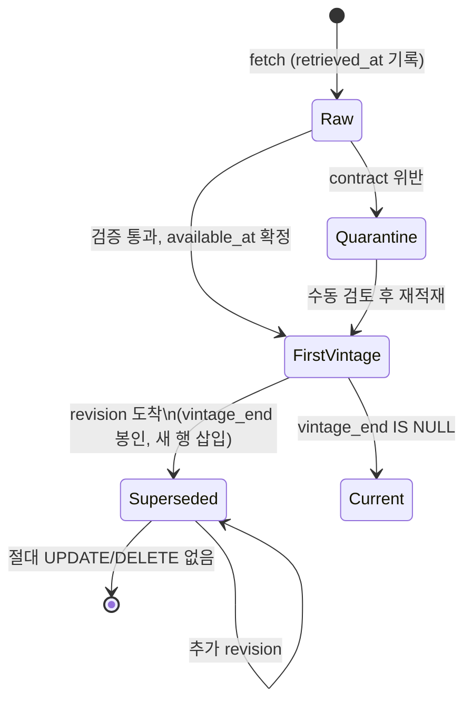
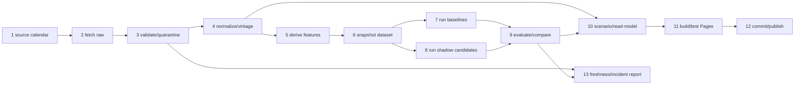
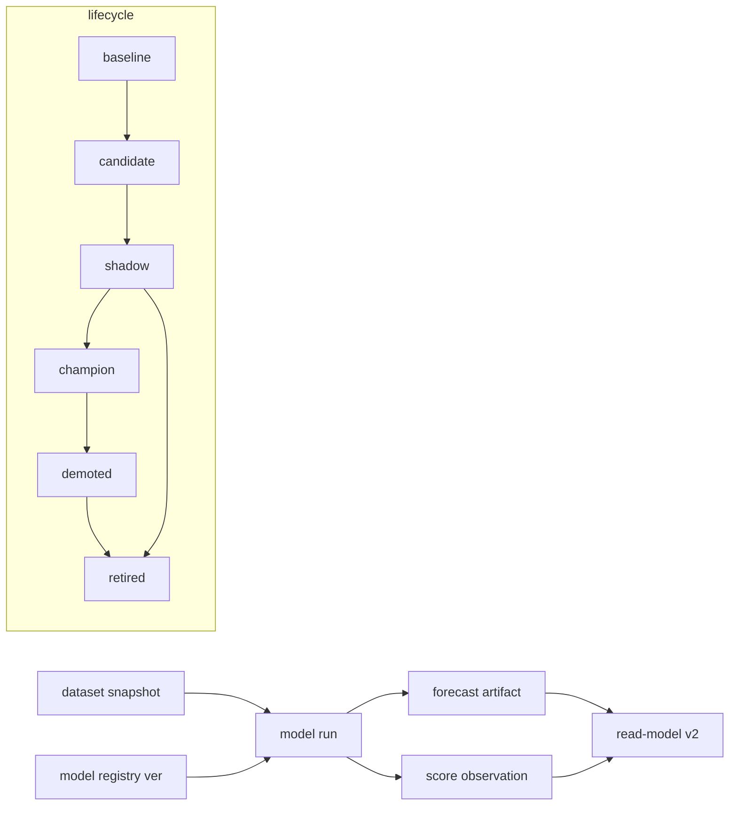
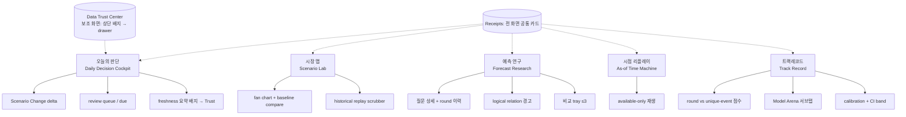
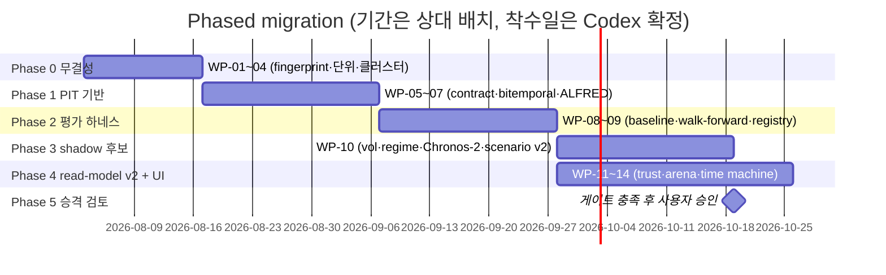

# Claude Fable Grand Blueprint — Jin's Investing Prediction Quant Intelligence Platform

산출 경로(저장소 반입 시): `reports/md/claude_fable_quant_platform_grand_blueprint_260801.md`
작성일: 2026-08-01 · 작성자 역할: 데이터 아키텍트 / 확률예측 연구자 / MLOps / 제품·UX 리드 / 독립 검증자
기준 커밋(인수인계서 기준): `d8b2e69` · 브랜치 `codex/ui-sidebar-overhaul` · 배포 기준 `main`

> **작성 환경 고지 (독립 검증자 소견)**
> 본 설계서는 `codex_to_claude_fable_workspace_handoff_260801.md`(이하 "인수인계서")와
> `claude_fable_quant_platform_master_blueprint_prompt_260801.md`(이하 "마스터 프롬프트")
> 두 문서, 그리고 2026-08-01 웹 재검증 결과를 입력으로 작성됐다. 저장소 파일 트리·라이브
> Pages·로컬 SQLite에 대한 직접 감사는 이번 세션 환경에서 수행할 수 없었다. 따라서 모든
> 사실 진술에 증거 등급을 부여했고, 등급 `[H]` 항목은 인수인계서의 실측을 신뢰 원천으로
> 인용한 것이며, Codex는 구현 전 §2의 재검증 절차로 이를 재확인해야 한다. 이 고지를
> 삭제한 채 본 문서를 "직접 실측"으로 인용하는 것을 금지한다.

**증거 등급 체계** (전 문서 공통)

| 등급 | 의미 | 재검증 의무 |
|---|---|---|
| `[H]` | 인수인계서 2026-08-01 실측값 | Codex가 clean rebuild로 재확인 |
| `[W]` | 2026-08-01 웹에서 공식 문서로 재검증한 사실 | 링크 유효성만 확인 |
| `[I]` | 위 근거에서 논리적으로 도출한 추론 | 도출 전제가 깨지면 폐기 |
| `[P]` | 본 설계서의 제안 | 사용자/Codex 승인 대상 |
| `[U]` | 현재 미확정 — 숫자를 만들지 않음 | 결정 조건을 §35에 명시 |

---

## 1. Executive decision memo

이 제품은 자동매매기가 아니라 **기한·판정기준이 명확한 시장 질문에 사전 확률을 기록하고
Brier로 채점하는 감사 가능한 의사결정 보조 시스템**이다 `[H]`. 전체 루프(질문→조사→확률→
불변 기록→해소→채점)는 이미 존재하고 154개 테스트가 통과하며 HTML 예산도 준수한다 `[H]`.

**핵심 판단: 병목은 모델이 아니라 데이터 정합성과 독립 표본이다.** 해소 원장은 6행뿐이고
그중 4행은 동일 FOMC 결과의 반복 회차다 `[H]`. 시장확률 단위가 0~1과 0~100 사이에서
혼용되어 벤치마크 Brier 484.0 같은 무효값이 원장에 존재한다 `[H]`. 파생 DB에는 다른
브랜치의 예측 7건이 잔존한다 `[H]`. point-in-time 빈티지 계약이 없어 최종 수정 거시값으로
워크포워드하면 look-ahead leakage가 생긴다 `[H]`.

**따라서 본 설계서의 순서는 다음과 같고, 이 순서는 협상 대상이 아니다** `[P]`:

1. **Phase 0 — 무결성**: 확률 canonical 단위 `[0,1]`, correction ledger, branch-aware
   rebuild(fingerprint + staging→atomic swap), resolution event cluster 분리. 새 모델 0개.
2. **Phase 1 — point-in-time 기반**: bitemporal fact schema, ALFRED/BLS/BEA/EDGAR 공식
   원천 채택, source registry와 data contract, leakage sentinel.
3. **Phase 2 — 평가 하네스**: baseline suite(랜덤워크·base rate·현재 GBM), walk-forward
   프로토콜, model registry, 클러스터 채점과 개선 게이트.
4. **Phase 3 — shadow 후보**: EWMA/GARCH 변동성, regime bootstrap, Chronos-2/TimesFM 2.5
   zero-shot shadow, Breeden–Litzenberger RND. 전부 shadow 상태로만.
5. **Phase 4 — read-model v2 + UI**: Data Trust Center, Model Arena, As-of Time Machine,
   receipt 체계. Mistral-light 톤 유지, 리스킨 금지.
6. **Phase 5 — 승격 검토**: 독립 이벤트 30+/50+ 및 유효표본 기준 충족 후에만 calibration·
   ensemble 승격을 사용자 승인 하에 검토.

**채택 권고 요약**: 저장은 **옵션 3 — SQLite 운영 원장 + partitioned Parquet + DuckDB
읽기 전용 분석 뷰** (§10 ADR). 모델 포트폴리오는 §16의 8개 최소 집합(기준선 3 + 변동성 2 +
분포 1 + foundation shadow 2). Kitchen-sink 제안 21건은 §34에서 기각 사유와 함께 기록했다.

**사용자 승인이 필요한 지점**(전체 목록 §35): P2/P3 게이트에 unique-event 축을 병기하는
게이트 v2, 유료 데이터 소스 계약, HTML 예산 조정 또는 JSON 분리, calibration 활성화.

---

## 2. Current-state evidence audit

### 2.1 실측 스냅샷 (2026-08-01, 전부 `[H]`)

| 영역 | 실측 | 상태 판정 |
|---|---|---|
| 질문 registry | 38개 (active 34 / resolved 4) | 정상 |
| 예측 본문 | 21개 (+evidence 16) | 정상, 단 DB와 불일치 |
| 해소 원장 | 6행, 고유 질문 3개, FOMC 회차 4개 포함 | **표본 독립성 결함** |
| 벤치마크 원장 | 6행 | **단위 오류로 일부 무효** |
| `db/index.db` forecasts | 28행 (본문 21 + 타 브랜치 잔존 7) | **오염** |
| `db/index.db` market_implied | 14행, 7/28 레코드 보유 (branch history 최신은 7/19) | **오염** |
| `dualdb.sqlite` entity/event/era/model_run | 32/30/7/4 (seed·config는 46/48/8/9 지지) | **stale** |
| ML history | 13 runs (ml 3 · market 3 · context 7) | ml/market stale |
| 시나리오 | gbm-daily-252d-v1, 기준가 25,373.85, S1 74%/S2 2%/S3 24% | 정상, 자동 갱신 |
| 게이트 | primary n=5 Brier 0.11642 / all n=6 0.09717, P2·P3 미통과 | 능력 주장 불가 |
| 테스트/예산 | 154 passed / HTML 416,955 ≤ 420,000 bytes | 정상 |
| 자동화 | scenario-refresh·pages·verify·ots-stamp만 자동 | 데이터 계층은 수동 |

### 2.2 Codex 재검증 절차 `[P]`

본 설계서를 구현 입력으로 쓰기 전 Codex는 다음을 순서대로 실행하고, 결과가 §2.1과 다르면
해당 WP의 "현재 근거" 필드를 갱신한 뒤 진행한다.

```powershell
git fetch --all; git status; git log -1 --oneline           # HEAD == d8b2e69 확인
uv sync
cd src; uv run python -m ai_fc sync --check                  # E2 오염 경고 재현 확인
uv run python -m ai_fc sync --rebuild                        # clean rebuild 후 row 수 재실측
sqlite3 ../db/index.db "select count(*) from forecasts"      # 21 기대 (rebuild 후)
cd ..; uv run python -m pytest -q                            # 154 passed 재현
python tools/verify_track_record.py
```

수용 기준: rebuild 후 forecasts=본문 파일 수, market_implied 최신 run이 branch JSONL 최신과
일치. 불일치가 남으면 Phase 0의 WP-01이 그것을 해결 대상으로 삼는다.

---

## 3. Contradiction and drift register

| # | 항목 | 원천 A | 원천 B | 판정 | 근거 |
|---|---|---|---|---|---|
| C1 | forecast 수 | 본문 21개 | `index.db` 28행 | **A가 진실.** 잉여 7행은 `codex/work`의 `ea630e4` 산물로 현재 main 조상이 아님 | `[H]`, 사실 우선순위 1 |
| C2 | market run 최신 | branch JSONL 7/19 | DB 7/28 | **A가 진실.** append-only 재적재가 파일에 없는 run을 제거하지 않는 구조 결함 | `[H]` |
| C3 | dualdb inventory | seed/config 46/48/8/9 | 로컬 DB 32/30/7/4 | **A가 진실(재구축 가능 원천).** DB가 stale | `[H]` |
| C4 | 시장확률 단위 | 타 계층 `[0,1]` | benchmark_ledger `22.0`, `5.0` | **A가 canonical.** B는 %로 기록된 단위 오류 후보. outcome=0 가정 시 정규화 후보 0.22/0.05, Brier 0.0484/0.0025이나 **원천 quote·as-of 재확인 전 공식 정정 금지** | `[H]` |
| C5 | 게이트 표본 | 예측 행 6 | 고유 해소 이벤트 3 | 게이트 능력 판정에는 **B(고유 이벤트)** 를 써야 함 | `[H]`+`[I]` |
| C6 | `docs/DB_MAP.md` 숫자 | 문서 서술 | clean rebuild inventory | **자동 생성 inventory가 진실.** 문서 숫자 복사 금지 | `[H]` |
| C7 | 자동화 범위 | "매일 갱신" 인상 | 실제로 시나리오만 평일 자동 | **B.** ML·market·dualdb는 수동 | `[H]` |
| C8 | 본 설계서 작성 조건 | 마스터 프롬프트 "저장소 루트에서 실행" | 실제 세션은 두 md만 접근 가능 | 충돌 인정. 증거 등급 체계와 §2.2 재검증으로 보상 | 사실 |

드리프트 재발 방지: `docs/DB_MAP.md`류 수치 문서는 손으로 쓰지 않고 rebuild 파이프라인이
`inventory.generated.md`를 산출·커밋하도록 한다(WP-03). 문서와 DB의 수치 불일치는 CI에서
실패로 처리한다.

---

## 4. Product north star, goals, non-goals

**North star**: "이 시스템의 어제 확률을 오늘 믿어도 되는가?"에 스스로 감사 가능한 답을
제시하는 것. 정확도 향상을 약속하지 않고, 사전 정의된 out-of-sample 평가로만 개선을
판정한다(가드레일 9) `[H]`.

**Goals** `[P]`
1. 모든 확률이 canonical `[0,1]` 단위와 명시적 확률 공간 라벨을 갖는다.
2. 모든 데이터 포인트가 "언제 알 수 있었는가"(available_at)에 답한다.
3. 능력 주장은 고유 해소 이벤트와 유효표본 기준으로만 한다.
4. 어떤 모델도 기준선을 walk-forward에서 이기기 전 champion이 되지 않는다.
5. UI는 판단 시간을 줄이고, 모든 숫자에 receipt(원천·시점·한계)를 붙인다.

**Non-goals** (마스터 프롬프트 비목표 14항 전부 계승 `[H]`): 자동매매·투자자문 전환,
dark theme 전환, kitchen-sink 모델, gate 전 실보정/가중 ensemble, 확률 공간 간 산술 결합,
결측 보간으로 데이터 있는 척하기, LLM 과거 재실행 능력 주장, risk-neutral의 physical 라벨링.

---

## 5. Research methodology and evidence grades

- 증거 등급 5단계는 문서 서두 표와 같다. 등급 없는 수치는 본 문서에 존재하지 않아야 한다.
- 웹 재검증 원칙: 공식 문서·원 논문·공식 GitHub·규제기관 우선. 본 세션에서 실제 재검증한
  항목은 ALFRED real-time 의미론, DuckDB 동시성 모델, Chronos-2, TimesFM 2.5이며 각 항목에
  `as of 2026-08-01`과 링크를 §36에 남겼다.
- 논문 벤치마크 성능은 이 저장소 성능으로 전이하지 않는다. foundation model의 fev-bench
  우위 `[W]`는 "shadow 후보 자격"의 근거일 뿐 채택 근거가 아니다.
- 작은 표본(현재 고유 이벤트 3개)에서는 어떤 유의성 주장도 하지 않는다. Diebold–Mariano는
  paired 표본이 최소 30 고유 이벤트를 넘기 전 보고하지 않는다 `[P]`.
- 사실/추론/제안 분리는 등급 표기로 강제한다.

---

## 6. Live market/product benchmark findings

라이브 사이트·벤치마크 제품의 직접 관찰은 본 세션에서 불가했다(§C8). 아래는 인수인계서의
현 UI 실측 `[H]`과 각 제품의 공개된 설계 원리 `[I]`에서 추출한 적용 원칙이며, Codex는
Phase 4 착수 전 desktop·mobile 실기 관찰(첫 5초 판독, hover/keyboard, overflow, 상태 표현)을
수행해 본 절을 실측으로 대체한다 `[P]`.

| 벤치마크 | 해결한 문제 | 적용 | 적용하지 않을 것 |
|---|---|---|---|
| Mistral/Le Chat | 밝은 neutral 위 editorial scale로 위계 형성 | 현 warm-neutral 유지, display type만 판단 헤드라인에 | 장식 그라디언트 |
| Linear 2026 | 차분한 chrome, 일관 헤더로 인지 부하 축소 | 전 화면 공통 헤더 문법(제목·as-of·fresh 배지) | 전면 리디자인 |
| Vercel 2026 | collapsible sidebar + mobile bottom bar | 이미 유사 구조 보유 `[H]`, resizable만 검토 | 메뉴 증식 |
| TradingView | 항상 보이는 baseline과 compare | Scenario Lab의 baseline/current 비교 | 밀도 과잉 차트 조작 |
| Koyfin | 저장된 화면 상태 | localStorage 기반 saved views (이미 MY RADAR 존재) | 계정/서버 저장 |
| Mercury Insights | change-first 요약 | 첫 화면을 "무엇이 바뀌었나"로 (Scenario Change 확장) | 원인 단정 서술 |
| Perplexity Finance | overview→detail 위계 | 질문 카드→상세→receipt 3단 위계 | 뉴스 피드화 |
| Ramp/Stripe | receipts·운영 상태로 신뢰 형성 | vintage/model receipt를 전 숫자로 확장 | 과도한 상태 배지 |

---

## 7. Data source decision matrix

정본 후보를 마스터 프롬프트의 열 규격으로 판정한다. 지면상 핵심 열만 표에 싣고, 전체 열
(`rate_limit`, `raw_retention`, `quality_checks` 등)은 각 WP의 data contract에 기재한다.
비용·라이선스 세부는 `[U]` 항목이 많으므로 Phase 1 착수 시 공식 약관을 재확인한다.

| source_id | provider/dataset | official_tier | vintage | latency | license/재배포 | 판정 | 사유 |
|---|---|---|---|---|---|---|---|
| `alfred.macro` | FRED **ALFRED** real-time observations | 1차(연준 집계) | **완전** — 관측마다 `realtime_start/end`로 revision 이력 복원 `[W]` | 시리즈별 상이 | API 무료, 표시 가능, terms 준수 | **adopt now** | point-in-time의 최소 필수 원천 |
| `fred.current` | FRED current series | 1차 집계 | 없음(최신값만) | 낮음 | 동상 | **downgrade to convenience** | 워크포워드 입력 금지, 표시용만 |
| `bls.v2` | BLS Public Data API v2 | 1차 | 공표시각·revision 메타 확인 필요 `[U]` | 공표 즉시 | 무료, 키 등록 | **adopt now** | CPI·고용의 공표시각 확보 |
| `bea.api` | BEA NIPA | 1차 | vintage는 ALFRED 병행으로 보완 | 분기+revision | 무료 | **adopt now** | GDP revision 추적 |
| `edgar.facts` | SEC EDGAR submissions/companyfacts | 1차 | `acceptedDate`가 available_at 역할 | 접수 즉시 | 무료, fair access rule | **adopt now** | NVDA 등 실적 질문의 사실 원천 |
| `treasury.curve` | U.S. Treasury daily yield XML/CSV | 1차 | 일별 공식 곡선 | 당일 | 무료 | **adopt now** | 금리 질문 판정 기준 |
| `nyfed.rates` | NY Fed SOFR/EFFR | 1차 | 공표시각 명확 | 익영업일 오전 | 무료 | **adopt now** | 자금시장 |
| `cboe.vix` | CBOE VIX history/term structure | 1차 | 확정치 | 당일 | **표시·재배포 조건 재확인 필요** `[U]` | **adopt(원장) / redistribution 검토 후 표시** | VIX 질문 판정 |
| `cboe.options` | CBOE 옵션 체인 | 1차 | 스냅샷 | 실시간~지연 | 라이선스 `[U]` | **shadow** | BL RND 입력, 재배포 금지 전제 |
| `polymarket` | Polymarket 공개 API | 시장가격 | 스냅샷+as-of 기록 필수 | 실시간 | 공개 API | **adopt(참조 전용)** | settlement contract 문구를 질문 판정기준과 대조 저장 |
| `cftc.cot` | CFTC COT | 1차 | 주간, 화요일 기준 금요일 공표 — **available_at 지연 필수 기록** | 3일 | 무료 | **shadow** | 포지셔닝 참조 |
| `finra.margin` | FINRA margin stats | 1차 | 월간, 익월 공표 | ~3주 | 무료 | adopt(현행 유지) | 이미 사용 `[H]` |
| `yahoo.chart` | Yahoo chart API | 비공식 편의 | 없음, 무보증 | 즉시 | 비공식·약관 회색 | **fallback only** | 정본 가격과 일일 교차검증 후 divergence 경고 |
| `nasdaq.datalink` | Nasdaq Data Link | 공식/유료 혼재 | 상품별 | 상품별 | **비용·Pages 표시권 `[U]`** | **defer** | 무료 정본 대비 증분가치 미입증 |
| `french.factors` / `shiller` / `ritter` | 학술 데이터 | 학술 정본 | 저빈도 갱신 | 월~년 | 학술 인용 조건 | adopt(현행 유지) | 이미 사용 `[H]` |
| `gnews.finbert` | Google News RSS + FinBERT | 편의 | 없음 | 즉시 | RSS 약관 `[U]` | **shadow, 방향 증거 금지** | 가드레일 유지 `[H]` |
| analyst consensus | 유료(LSEG/FactSet류) | 상용 | 상품별 | — | 고비용·재배포 제한 | **reject(현 단계)** | 단일 사용자 비용 대비 불가 |

**교차검증 설계** `[P]`: 가격은 `treasury/cboe/exchange 정본 ↔ yahoo` 이중 수집,
`|close_official − close_yahoo| / close_official > 0.1%`면 quarantine + Trust Center 경고.
거시는 `alfred 최초공표값 ↔ fred 최신값`을 모두 저장해 revision 크기를 자체 신호로 보존.

---

## 8. Canonical data contracts and glossary

### 8.1 Glossary (규범 정의)

- **observation_time**: 사건이 속한 경제·시장 시점 (예: CPI의 대상월, 종가의 거래일 마감).
- **available_at**: 시스템이 그 값을 **합법적으로 알 수 있게 된 최초 시각** (공표시각,
  EDGAR `acceptedDate`, ALFRED `realtime_start`). 워크포워드 컷의 유일한 기준.
- **retrieved_at**: 우리가 실제 수집한 시각. available_at과 혼동 금지.
- **vintage interval**: `[vintage_start, vintage_end)` — 그 값이 "최신 revision"이었던
  실시간 구간. ALFRED의 realtime_start/end와 동일 의미론 `[W]`.
- **probability (canonical)**: 폐구간 `[0,1]`의 float. 저장 계층에 `%` 단위 금지.
- **probability_space**: `physical_event` / `risk_neutral_terminal` / `path_touch` /
  `scenario_conditional` / `reference_only` 다섯 enum. 서로 다른 공간은 산술 결합 금지
  (가드레일 8).
- **forecast round**: 동일 질문에 대한 rN 회차 관측.
- **resolution event cluster**: 하나의 실제 결과를 공유하는 회차들의 집합. 게이트 표본 단위.
- **effective sample size (ESS)**: 클러스터 내 상관을 반영한 유효표본. §18 정의.

### 8.2 Canonical 타입 계약 (Pydantic + SQL CHECK 병행) `[P]`

```python
Probability = Annotated[float, Field(ge=0.0, le=1.0)]

class ProbabilityRecord(BaseModel):
    source_value: float          # 원천 원시값 (22.0 그대로 보존)
    source_unit: Literal["fraction", "percent", "bps", "price"]
    p: Probability               # 정규화 결과
    normalization_version: str   # "norm-v1" 등
    probability_space: ProbSpace
```

```sql
CHECK (p >= 0.0 AND p <= 1.0)
CHECK (brier IS NULL OR (brier >= 0.0 AND brier <= 1.0))
```

- UI에서만 `%` 변환. 파일·DB·read-model은 전부 fraction.
- round-trip property test: `normalize(denormalize(p)) == p`, 임의 percent 입력에 대해
  `0 ≤ p ≤ 1` 불변식 (WP-02 테스트 목록).

### 8.3 Data contract 문서 형식

각 source는 `data/contracts/<source_id>.yaml` 하나로 계약을 선언한다: 필드 스키마, 단위,
timezone/calendar_id, available_at 도출 규칙, 지연 SLA, revision 정책, 결측 표기
(`미산출`/`표본 부족`/`stale`/`수집 실패` 구분 — 가드레일 12), quality check 목록, fallback.
계약 위반 레코드는 적재되지 않고 quarantine으로 간다(§12).

---

## 9. Bitemporal/point-in-time architecture

### 9.1 원칙

모든 fact는 두 시간축을 갖는다: **valid time**(observation_time)과 **knowledge time**
(available_at, vintage interval). 평가·모델 학습의 유일한 필터는 `available_at <= as_of`다.
retrieved_at은 감사용이며 필터로 쓰지 않는다.

### 9.2 Bitemporal fact schema (핵심 테이블) `[P]`

```sql
CREATE TABLE observation_fact (
  source_id          TEXT NOT NULL,        -- source registry FK
  series_id          TEXT NOT NULL,
  observation_time   TEXT NOT NULL,        -- ISO date/datetime, calendar_id 기준
  value              REAL,                 -- NULL 허용, 가짜값 금지
  value_status       TEXT NOT NULL DEFAULT 'ok'
                     CHECK (value_status IN ('ok','미산출','표본부족','stale','수집실패')),
  available_at       TEXT NOT NULL,        -- knowledge time 시작
  vintage_start      TEXT NOT NULL,
  vintage_end        TEXT,                 -- NULL = 현재 유효 (ALFRED 의미론 [W])
  retrieved_at       TEXT NOT NULL,
  source_revision_id TEXT,
  source_hash        TEXT NOT NULL,        -- raw payload content hash
  parser_version     TEXT NOT NULL,
  timezone           TEXT NOT NULL,
  market_session     TEXT,
  calendar_id        TEXT NOT NULL,
  PRIMARY KEY (source_id, series_id, observation_time, vintage_start)
);
```

### 9.3 As-of query semantics (규범)

```sql
-- as_of 시점에 알 수 있었던 최신 revision
SELECT * FROM observation_fact
WHERE series_id = :sid
  AND observation_time <= :as_of_market_date
  AND available_at <= :as_of
  AND vintage_start <= :as_of
  AND (vintage_end IS NULL OR vintage_end > :as_of)
```

golden test: ALFRED에서 revision이 3회 이상 있었던 시리즈(예: GDP 계열)를 fixture로 받아,
as_of를 revision 경계 전후로 이동시키며 반환값이 당시 공표값과 일치하는지 검증한다 `[P]`.
ALFRED API는 `realtime_start/realtime_end`로 정확히 이 질의를 지원함을 확인했다 `[W]`.

### 9.4 Bitemporal lifecycle



기존 행은 절대 갱신하지 않는다. revision은 새 행 + 직전 행의 vintage_end 봉인(이 봉인만이
유일하게 허용되는 UPDATE이며, append 직후 같은 트랜잭션에서만 수행)으로 표현한다.

### 9.5 Leakage sentinel `[P]`

- sentinel dataset: 최초공표값과 최종값의 차이가 큰 관측 20개를 고정 fixture로 지정.
- sentinel test: 파이프라인이 as_of=공표 전 시점으로 실행될 때 해당 값을 절대 반환하지
  않아야 통과. feature 생성 코드가 `fred.current`를 직접 참조하면 import-level lint로 실패.

---

## 10. Storage ADR: SQLite / DuckDB / Parquet / server DB

### ADR-001: 분석 저장 계층 선택

**컨텍스트** `[H]`: 단일 사용자·단일 writer, 정적 Pages 배포, Git 감사 모델, 약 0.6M
price/macro rows(10배 성장 가정 6M), Windows 로컬 + GitHub Actions Linux, branch 전환이
빈번한 워크플로.

| 기준 | ①SQLite-only | ②SQLite+DuckDB(.duckdb) | ③**SQLite+Parquet+DuckDB view** | ④서버 DB |
|---|---|---|---|---|
| 운영 복잡도 | 최저 | 중 (.duckdb 파일 관리) | 중 | 최고 |
| PIT/워크포워드 스캔 | 행 지향, 느림 | 빠름 | **빠름 + partition pruning** | 빠름 |
| branch/worktree 안전성 | 낮음(현 오염 실증 `[H]`) | .duckdb도 Git 제외 파일이라 동일 위험 | **Parquet은 불변 파일 + manifest로 branch별 재생성 검증 용이** | 무관하나 과잉 |
| 다중 프로세스 | WAL로 다중 reader 양호 | 단일 writer 프로세스 제약, 2번째 프로세스 잠금 오류 `[W]` | DuckDB는 Parquet **읽기 전용**으로만 접근 → 잠금 충돌 원천 제거 `[W]` | 해당 없음 |
| Git/감사 친화 | DB는 Git 제외 | 동일 | **Parquet manifest(경로+hash)만 Git 추적 → 재현성** | 불가 |
| Windows/CI 이식성 | 최고 | 양호 | 양호 (duckdb pip 단일 의존성) | 낮음 |
| 규모 적합 | 0.6M 충분, 6M 한계 근접 | 충분 | 충분 | 과잉 |

**결정** `[P]`: **옵션 3.** 단, DuckDB 카탈로그 파일(.duckdb)을 영속 저장소로 쓰지 않고
매 세션 in-memory로 Parquet을 조회한다. 2026년 현재 DuckDB의 다중 프로세스 쓰기는
Quack(beta, v2.0에서 성숙 예정)·DuckLake 경유로만 가능하므로 `[W]` 쓰기 경로를 만들지
않는 것이 가장 단순하고 안전하다.

**데이터 소속 결정 (한 행씩)** `[P]`

| 데이터 | 소속 | 이유 |
|---|---|---|
| 질문/예측/해소/벤치마크 read index | SQLite `db/index.db` | 현행 유지, 소량·운영 조회 |
| observation_fact (bitemporal) | **Parquet** `data/facts/source_id=*/year=*/*.parquet` | 대량 스캔, 불변 파일 |
| raw payload | 파일 + manifest(JSONL) | 현행 raw 보존 강화 |
| feature/dataset snapshot | Parquet + manifest | frozen 평가 입력 |
| model run/registry | SQLite + JSON artifact | 소량, 트랜잭션 필요 |
| correction ledger | append-only CSV (Git 추적) | 감사 원천 |
| dualdb 기존 테이블 | 단계적으로 Parquet 이관, 이관 전 현행 유지 | 빅뱅 금지 (§28) |

**Parquet 규격**: partition key `source_id/year`, 목표 파일 64–256MB(현 규모에선 연 단위
단일 파일), compression zstd, 스키마 진화는 additive-only + `schema_version` 열.
**Idempotency key**: `(source_id, series_id, observation_time, vintage_start)` — 재수집 시
동일 key·동일 source_hash면 no-op, hash 다르면 새 vintage로 처리.

---

## 11. Physical schema and data dictionary

지면상 신규·변경 테이블만 싣는다(기존 스키마는 `src/ai_fc/db/schema.sql` 대조 후 Codex가
diff 확정). 전 테이블 공통: 확률 CHECK, `created_at`, append-only 트리거.

```sql
-- 운영 SQLite 신규
CREATE TABLE source_registry (
  source_id TEXT PRIMARY KEY, provider TEXT, dataset TEXT,
  official_tier INTEGER, license_note TEXT, contract_path TEXT,
  status TEXT CHECK (status IN ('adopt','shadow','manual','defer','reject')));

CREATE TABLE db_meta (           -- WP-01 branch fingerprint
  key TEXT PRIMARY KEY, value TEXT);
  -- keys: repo_id, worktree_path, branch, head_sha, source_manifest_hash, built_at

CREATE TABLE resolution_event (  -- WP-04 클러스터
  event_id TEXT PRIMARY KEY, question_id TEXT NOT NULL,
  outcome INTEGER CHECK (outcome IN (0,1)), resolved_at TEXT,
  domain TEXT, difficulty_note TEXT);

CREATE TABLE score_observation ( -- 회차 점수와 대표 점수 동시 보존
  forecast_id TEXT, event_id TEXT REFERENCES resolution_event,
  p REAL CHECK (p BETWEEN 0 AND 1),
  brier REAL CHECK (brier BETWEEN 0 AND 1),
  log_score REAL, role TEXT CHECK (role IN ('round','representative')),
  aggregation TEXT,              -- 'latest'|'first'|'time_weighted'
  PRIMARY KEY (forecast_id, event_id, role));

CREATE TABLE correction_ledger ( -- append-only 정정
  correction_id TEXT PRIMARY KEY, target_file TEXT, target_row_key TEXT,
  field TEXT, original_value TEXT, corrected_value TEXT,
  reason TEXT, evidence_link TEXT, approved_by TEXT, created_at TEXT);
CREATE VIEW v_benchmark_corrected AS /* 원장 ⟕ correction 최신본 */ ...;

CREATE TABLE model_registry (
  model_id TEXT, version TEXT, lifecycle TEXT CHECK (lifecycle IN
    ('baseline','candidate','shadow','champion','demoted','retired')),
  code_commit TEXT, dataset_snapshot_id TEXT, feature_schema_hash TEXT,
  hyperparams_json TEXT, seed INTEGER, train_window TEXT, eval_window TEXT,
  runtime_lock_hash TEXT, artifact_hash TEXT, limitations TEXT,
  owner TEXT, approved_by TEXT, created_at TEXT,
  PRIMARY KEY (model_id, version));
```

Data dictionary는 rebuild 시 `docs/generated/inventory.generated.md`로 자동 산출한다
(테이블·행수·범위·최신 as-of). 손으로 쓴 수치 문서는 폐기 예고(deprecation) 배너를 단다.

---

## 12. Ingestion, quality, quarantine, lineage

**파이프라인 단계**: fetch → raw 보존(manifest: path, bytes, sha256, retrieved_at, url,
http_status) → contract 검증 → 정규화(단위·timezone·available_at 도출) → vintage 판정 →
Parquet append → quality report.

**Quality checks (source contract에 선언)**: 스키마 일치, 단위 범위, 거래일 캘린더 정합,
중복 idempotency key, 정본↔fallback 교차검증(§7), 급변값(전일 대비 z-score) 플래그,
freshness SLA. 실패 레코드는 삭제하지 않고 `quarantine/` 아래 원문+사유로 격리하며 Trust
Center에 노출한다. **quarantine은 fail-soft(해당 시리즈만 stale 처리), contract 스키마
위반은 fail-closed(적재 중단)** `[P]`.

**Lineage**: 모든 산출물에 `lineage_edge(parent_id, child_id, edge_type)` 기록 —
raw→fact→feature→dataset_snapshot→model_run→forecast_artifact→read_model_key. UI receipt는
이 그래프를 역추적해 렌더한다(§22, §25).

---

## 13. Orchestration, freshness, backfill, recovery

### 13.1 Job DAG



### 13.2 Job 계약표 (핵심 열만; 전체는 WP별 기재) `[P]`

| job | trigger (UTC) | idempotency key | stale threshold | fail 정책 | commit 정책 |
|---|---|---|---|---|---|
| calendar/fetch(가격·금리) | 화–토 01:00 | source_id+market_date | 2 거래일 | fail-soft | raw manifest만 |
| fetch(거시 vintage) | 공표 캘린더 이벤트 + 일일 sweep | series+obs+vintage | 시리즈별 SLA | fail-soft | fact parquet+manifest |
| validate/normalize | fetch 후속 | 상동 | — | 스키마 위반 fail-closed | quarantine 로그 |
| derive/snapshot | 주 1회 + 수동 | snapshot_id(내용 hash) | 7일 | fail-closed | snapshot manifest |
| baselines/shadow | snapshot 후속 | model_id+ver+snapshot_id | 7일 | fail-soft(개별 모델) | run 기록 |
| evaluate | 모델 후속 | 상동 | — | fail-closed(불변식 위반 시) | score 기록 |
| scenario/read-model | 현행 화–토 01:30 유지 `[H]` | market_date | 1 거래일 | fail-soft→stale 배지 | 현행 유지 |
| Pages build | 현행 유지 `[H]` | HEAD sha | — | fail-closed | 현행 유지 |
| freshness report | 일 1회 | date | — | 항상 실행 | Trust Center JSON |

- 공통: timeout 10분/job, retry 3회 exponential backoff, 동일 market_date 중복 실행 금지
  (idempotency key 조회 후 skip), 월 API 비용 한도는 §27 표를 따르고 초과 시 fetch 계층부터
  degrade(신규 소스→정본 핵심→가격 순으로 차단).
- **인간 승인 경계 유지** `[H]`: LLM forecast 대량 실행과 resolve 확정은 자동화하지 않는다.
- **Backfill**: 소급 수집은 available_at을 "실제 공표시각"으로 기록하되 `backfilled=true`
  플래그를 남긴다. ALFRED처럼 vintage가 복원 가능한 소스만 과거 워크포워드에 사용하고,
  Yahoo류 무빈티지 소스의 backfill은 `retrieved_at 이후 as-of`에만 사용 가능으로 제한.
- **Recovery**: raw+manifest에서 전체 Parquet 재생성이 단일 명령으로 가능해야 하며
  (`rebuild --from-raw`), 재생성 결과 hash가 manifest와 일치하는지 CI에서 분기별 검증.

---

## 14. Baseline model suite

기준선 없이는 어떤 후보도 평가하지 않는다. 전부 결정론 seed 고정.

| baseline_id | 대상 | 정의 |
|---|---|---|
| `bl.rw_drift` | 종점 분포 | 랜덤워크±드리프트(표본 평균) |
| `bl.uncond_base` | 이벤트 확률 | 질문 도메인별 historical unconditional base rate (data/base_rates 활용 `[H]`) |
| `bl.seasonal_base` | 이벤트 확률 | 월·분기 조건 base rate |
| `bl.hist_sim` | 종점/경로 | empirical historical simulation (수익률 재표집) |
| `bl.block_boot` | 경로 | stationary/moving block bootstrap (블록 길이 민감도 보고) |
| `bl.gbm_v1` | 종점/배리어/경로 | **현행 GBM 유지** (gbm-daily-252d-v1 `[H]`) — 시나리오 공식 baseline |

수용 기준: 기준선 6종이 동일 dataset snapshot·동일 as-of cut에서 실행되고 CRPS/pinball/
coverage가 기록된다. **기준선을 이기지 못하는 복잡 모델은 채택하지 않는다** (마스터 프롬프트).

---

## 15. Candidate mathematical/ML model review

각 후보를 규정 템플릿으로 심사했다. 지면상 표를 압축하고 판정만 굵게 표기한다.

| 후보 | 목표변수/확률공간 | 최소 데이터 | PIT 요구 | 기준선 | 평가 | 비용 | 실패 조건 | **판정** |
|---|---|---|---|---|---|---|---|---|
| EWMA vol | 일별 σ / physical | 1y 일봉 | 가격만, 낮음 | 상수 vol GBM | QLIKE, interval coverage | 무시 가능 | coverage 개선 없음 | **adopt (Phase 3)** |
| GARCH(1,1) | σ / physical | 3y+ | 낮음 | EWMA | QLIKE, CRPS | 낮음 | EWMA 미개선 | **shadow** |
| EGARCH/GJR | 비대칭 σ | 5y+ | 낮음 | GARCH | 동일 | 낮음 | GARCH 미개선 | **shadow(후순위)** |
| HAR-RV | RV | **intraday RV 필요** | 높음 | GARCH | QLIKE | 데이터 비용 | intraday 원천 부재 `[H]` | **defer** (원천 확보 전) |
| SV/jump diffusion | 경로 | 장기+추정 복잡 | 중 | GARCH | CRPS | 높음 | 표본 대비 과잉 | **reject(현 단계)** |
| EVT POT | tail P | 장기 일봉(보유 `[H]`) | 낮음 | empirical tail | tail exceedance calib | 낮음 | threshold 민감 과대 | **shadow** |
| regime bootstrap | 경로 | regime 라벨+장기 | 중 | block bootstrap | CRPS, regime cover | 낮음 | 라벨 불안정 | **shadow** |
| Hamilton MS/HMM | regime | 장기 월간(보유) | 중 | 무조건부 | regime 사후확률 안정성 | 중 | 소급 라벨 변동 과다 | **shadow(라벨 공급자로만)** |
| Breeden–Litzenberger RND | terminal / **risk-neutral** | 옵션 체인 | 스냅샷 as-of | 없음(참조) | smile no-arbitrage 검사 | 중 | QQQ↔IXIC 프록시 왜곡 `[H]` | **adopt(참조 전용, RN 라벨 고정)** |
| RN→physical 보정 | terminal | 장기 옵션+실현 | 매우 높음 | RND 원본 | PIT 히스토그램 | 높음 | 표본 부족 | **defer** |
| barrier/path-touch | path P | 일봉 | 낮음 | GBM 해석해 | discrete monitoring bias 보고 | 낮음 | — | **adopt(GBM 부속)** |
| copula/multifactor | 다변량 | 다자산+장기 | 높음 | 독립 가정 | — | 높음 | 질문 구조상 불요 | **reject** |
| Chronos-Bolt(현행) | 분위수 / reference | zero-shot | 컷만 준수 | bl.rw_drift | pinball, coverage | CPU 가능 | 기준선 미달 | **유지(shadow)** `[H]` |
| **Chronos-2** | 분위수·다변량·covariate | zero-shot, 120M encoder `[W]` | 컷+covariate leakage 주의 | Chronos-Bolt | 동일 paired | CPU/GPU 가능 `[W]` | Bolt 미개선 | **shadow 승격 후보** |
| **TimesFM 2.5** | 분위수, 16k ctx, 200M `[W]` | zero-shot | 동일 | Chronos-2 | 동일 | 중 | — | **shadow(비교군)** |
| foundation 학습 leakage | — | — | 학습코퍼스에 시장 데이터 포함 가능성 → **절대 성능이 아니라 상대 비교만 보고** | — | — | — | — | 방법론 주의 `[I]` |
| Bayes log-odds update | 이벤트 P | base rate+증거 | 증거 available_at 기록 | bl.uncond_base | Brier, log | 무시 | — | **adopt(LLM 보조 구조화)** |
| hierarchical partial pooling | 이벤트 P | 도메인별 다수 이벤트 | 높음 | 무풀링 | clustered Brier | 중 | **고유 이벤트 < 30** | **defer(게이트 후)** |
| survival/hazard | 시점 질문 | 이벤트 이력 | 높음 | base rate | — | 중 | 질문 유형 희소 | **defer** |
| logical reconciliation | 질문 간 제약 | 질문 그래프 | 낮음 | 제약 위반율 | 위반 감지율 | 낮음 | — | **adopt(감지·경고만, 자동수정 금지)** |
| adaptive conformal | 구간 | 순차 관측 | 중 | 고정 분위수 | coverage 추적 | 낮음 | — | **shadow** |

---

## 16. Selected minimal model portfolio `[P]`

**8개 운영 집합**: `bl.gbm_v1`(champion, 시나리오), `bl.rw_drift`·`bl.uncond_base`(게이트
기준선), EWMA vol(GBM 입력 개선 후보), GARCH(1,1)(shadow), BL-RND(risk-neutral 참조),
Chronos-2(shadow), 그 외 기준선 3종은 평가 하네스 상비군. LLM 공식 확률 파이프라인은 모델
포트폴리오와 별개의 P1 지위를 유지한다 `[H]`. **어떤 결합도 게이트 전 금지.**

---

## 17. Walk-forward and leakage-control protocol

- **expanding-window walk-forward**를 1차 프로토콜로, rolling-window는 민감도 분석으로.
- 모든 scaler·feature·threshold는 train window 내부에서만 fit. dataset snapshot manifest에
  fit된 파라미터 hash를 포함해 재현.
- **availability cut**: 각 시점 t의 입력은 `available_at <= t`인 fact만. 거시 revision은
  당시 vintage 값 사용(§9.3). FRED current 시리즈 사용은 lint로 차단(§9.5).
- label overlap: 종점 horizon이 겹치는 표본에 purge/embargo(horizon 길이만큼) 적용.
  이벤트 확률 표본은 클러스터 단위로 분리(§18)하므로 별도 purge 불요.
- 최소 평가 조건: 결정론 수치모델은 최소 2개 이상의 regime(예: 저변동/고변동)을 포함하는
  기간 커버 없이는 비교 결론을 내지 않는다.
- multiple testing: 후보 수 K를 registry에 선언하고, 승격 판단 시 naive p-value 대신
  기준선 대비 skill score의 부트스트랩 CI(클러스터 부트스트랩)를 보고. 사후 후보 추가는
  새 평가 라운드로 취급.
- **가드레일 5 준수** `[H]`: 결정론 모델의 PIT 워크포워드 결과를 LLM 캘리브레이션 표본에
  섞지 않는다. LLM 과거 재실행 능력 주장 금지(가드레일 4).

---

## 18. Scoring, calibration, clustering, gates

### 18.1 채점 이중 구조 `[P]`

- **round score**: 모든 rN 회차의 Brier/log score — 운영 투명성용, 전부 보존.
- **representative score**: resolution event cluster당 1개 — 게이트·능력 판정용.
  대표 집계는 **time-weighted average of round probabilities** (예측이 유효했던 기간
  가중; Metaculus류 관행과 유사)를 기본으로 하고, `latest`·`first`를 병기 보고한다.
  기본안 선택 이유: latest는 마감 직전 정보 우위로 과대평가, first는 업데이트 유인 제거.
- **ESS**: 클러스터 내 회차는 결과를 공유하므로 독립 표본이 아니다. 게이트 n은
  `n_unique_events`로 계산하고, 불확실성은 **clustered bootstrap**(클러스터 단위 재표집,
  B=10,000)으로 산출한다.
- 분포 예측: CRPS·pinball을 1차, MAE/RMSE는 보조. interval coverage와 width 동시 보고,
  PIT/rank histogram, tail exceedance calibration. direction·barrier score는 질문에 사전
  정의된 경우만.
- Murphy decomposition(reliability/resolution/uncertainty)과 reliability curve는
  `n_unique_events >= 30`부터 표시하고, 그 전에는 "표본 부족" 상태로 UI에 명시.

### 18.2 게이트 v2 (기존 P2/P3 무단 변경 금지, 병기 제안) `[P]` → **사용자 승인 필요**

| 축 | 현행 | 병기 제안 |
|---|---|---|
| 표본 수 | forecast row 30+/50+ | **unique resolution events 30+/50+** 및 row 수 병기 |
| 점수 | Brier <0.20 / <0.18 | 동일 임계 + clustered bootstrap 95% CI 상한 보고 |
| 커버 | 없음 | 최소 3개 도메인, 최소 2개 regime, 6개월+ 기간 |
| 품질 | 없음 | 데이터 quality pass 비율 ≥ 99%, 단위 불변식 위반 0 |
| 비교 | 없음 | `bl.uncond_base` 대비 skill > 0 (CI 하한 기준) |

같은 outcome 반복 회차만으로 게이트를 통과할 수 없음을 보장하는 회귀 테스트: FOMC r1–r4
fixture에서 `n_unique_events == 1`이 산출되어야 통과 (WP-04).

---

## 19. Ensemble and logical reconciliation

- 현행 고정 중앙값을 baseline으로 보존 `[H]`. 학습 가중은 200+ 게이트 전 비활성.
- 게이트 전 허용: 동일가중·median·trimmed mean·log-odds pool의 **shadow 비교만**.
  전제: 결합 대상이 **동일 probability_space**일 것(가드레일 8). risk-neutral RND·시나리오
  조건부 확률은 어떤 pool에도 넣지 않는다.
- 모델 상관·regime dependency를 paired residual 상관으로 기록. ensemble이 개별 최선
  모델보다 나쁘면 자동 기각 `[H]`.
- **Logical reconciliation**: 질문 registry에 관계 그래프를 선언한다 —
  `subset_of`(A⊆B → P(A)≤P(B)), `monotonic_threshold`(임계 사슬 단조성),
  `mutually_exclusive_exhaustive`(합=1). Phase 3까지는 **위반 감지·UI 경고만** 하고
  isotonic/constrained 자동 수정은 게이트 후 사용자 승인 대상. 자동 수정을 미루는 이유:
  수정은 원본 예측 기록의 의미를 바꾸며 가드레일 1·2의 정신과 충돌 위험이 있다 `[I]`.

---

## 20. Model registry, champion/challenger, MLOps

- registry 스키마는 §11. lifecycle: baseline → candidate → shadow → champion → demoted →
  retired. 승격 조건: 사전 등록된 평가에서 champion 대비 skill CI 하한 > 0, 최소 표본·
  regime 커버 충족, 사용자 승인. 강등: 2 연속 평가 라운드 열세 또는 데이터 계약 위반.
  rollback: champion 강등 시 직전 champion 버전을 즉시 복원(모델 산출은 모두 run 기록으로
  남아 있으므로 재실행 불요).
- 재현성 manifest: code_commit + dataset_snapshot_id + seed + runtime lock hash +
  artifact hash. 동일 manifest 재실행 시 bit-identical 산출을 CI 분기 검증.
- 모델 다운로드 공급망: Chronos-2/TimesFM checkpoint는 HF revision pin + sha256 고정(§27).

### 모델 lifecycle / lineage



```mermaid
flowchart LR
    Q[question] --> R1[round r1..rN forecasts]
    R1 --> REP[representative score\n(time-weighted)]
    R1 --> ROW[round scores 전량 보존]
    E[resolution event cluster] --> REP
    E --> ROW
    REP --> GATE[gate v2 · unique events]
    ROW --> UI[Track Record 투명성 뷰]
    GATE --> UI
```

---

## 21. Scenario engine v2 design

- v1(gbm-daily-252d-v1) 유지·기본값 `[H]`. v2는 **동일 인터페이스의 대체 경로 생성기**로
  shadow 추가: (a) EWMA/GARCH 조건부 변동성 GBM, (b) regime-conditioned block bootstrap,
  (c) EVT tail 보정 오버레이(표시용 tail 확률 주석).
- 산출 계약 확장: 기존 S1/S2/S3에 더해 fan chart용 분위수 경로(p5/p25/p50/p75/p95),
  경로 확률의 `probability_space='scenario_conditional'` 라벨, 방법·가정·한계 텍스트,
  baseline(v1) 대비 delta. **질문별 LLM 확률과의 결합 금지 유지** `[H]`.
- 아카이브 호환: `data/scenarios/archive/` 규격 유지, v2 산출은 `method` 필드로 구분.
- discrete monitoring bias: 배리어 확률은 일별 관측 기준임을 산출물에 명기.

---

## 22. Dashboard read-model v2 contract

**호환 규칙** `[H]`: 기존 키(`meta, scenario, scenario_history, questions, forecast_history,
resolutions, ml_runs, market_runs, calibration, due`)는 삭제·개명하지 않는다. v2는
**additive** 확장이다.

| 신규 키 | 내용 | 공급 job | empty/stale/error 표현 |
|---|---|---|---|
| `trust` | source health, last vintage, gap, quarantine 수, fallback 사용 여부 | freshness report | 소스별 `status: ok\|stale\|degraded\|failed` + as-of |
| `arena` | 모델별 paired score, CI, n_unique, lifecycle | evaluate | `n_insufficient: true`면 점수 숨기고 표본 상태만 |
| `receipts` | lineage 역추적 카드 데이터 (model/dataset/source/method/limitation/commit) | build | 누락 필드는 `미산출` 문자열, 가짜값 금지 |
| `asof_index` | Time Machine용 시점 목록 + 각 시점 available 스냅샷 참조 | snapshot | 시점 없으면 빈 배열 + 안내 |
| `clusters` | resolution event cluster, 대표/회차 점수 | score | — |
| `corrections` | correction ledger 뷰 | build | — |
| `probability_semantics` | 각 수치의 space·unit·as-of 메타 | build | UI 시맨틱 범례의 데이터 원천 |
| `changelog` | what-changed 피드 (scenario delta 확장) | scenario v2 | — |

계약 테스트: read-model snapshot test에 v2 키 스키마(JSON Schema)를 추가하고, 키 제거·
타입 변경 시 CI 실패. 정적 `window.__DATA__`와 LAN `/api/data`는 동일 빌더를 공유한다 `[H]`.

---

## 23. Information architecture and user journeys

### 23.1 IA (주 메뉴 5개 유지, progressive disclosure)



마스터 프롬프트의 8개 핵심 경험은 다음과 같이 흡수한다: Cockpit→메뉴1, Trust Center→전역
drawer(메뉴 증설 금지 원칙), Scenario Lab→메뉴2, Model Arena→트랙레코드 서브탭,
Forecast Research→메뉴3, Track Record→메뉴5, Time Machine→메뉴4(기존 시점 리플레이 확장),
Receipts→전 화면 공통 컴포넌트. **주 메뉴 수는 5개로 불변** `[P]`.

### 23.2 대표 user journey 3개

1. **아침 점검(90초)**: Cockpit 진입 → Scenario Change delta와 fresh/stale 배지 확인 →
   review queue의 due 질문 1개 열람 → receipt로 근거 확인 → 종료. 실패 상태: 데이터
   stale이면 delta 대신 "마지막 신뢰 시점" 카드가 우선 노출.
2. **예측 갱신**: Forecast Research → 질문 상세 → round 이력과 ML/시장 참조(공간 라벨
   구분 표시) → 수동으로 forecast CLI 실행(자동화 금지 경계) → 새 rN 반영 확인.
3. **회고 감사**: Time Machine에서 과거 시점 선택 → 당시 available 데이터·모델·예측만
   재생 → Track Record에서 해당 클러스터 대표 점수와 회차 점수 대조.

---

## 24. Visual design system

현행 Mistral-light/warm-neutral 유지, 리스킨 금지 `[H]`. 토큰은 기존 CSS 변수와 대조 후
additive로 정의한다(정확한 hex는 현행 값을 정본으로 유지, 아래는 role 계약).

| 토큰 그룹 | 계약 `[P]` |
|---|---|
| color roles | `ink`(본문), `paper`(warm white 배경), `accent`(orange), `warn`(amber), `danger`(crimson), `positive`(teal), `neutral-2xx` surface 3단계. 모든 텍스트 쌍 WCAG 2.2 AA 4.5:1(대형 3:1) |
| semantic chart | 확률 공간별 고정 색: physical=ink 계열, risk-neutral=보라 계열(신규 1색), scenario=teal, reference=회색. 범례에 공간 라벨 필수 |
| status | fresh=positive dot, stale=amber dot+as-of, failed=danger, `미산출`=중립 대시 |
| type | display(판단 헤드라인, 기존 editorial scale), body 15–16px, numeric은 tabular-nums, 최소 텍스트 12px |
| spacing/radius | 4px 그리드, radius 8/12, shadow는 2단계만(hover 깊이 표현 전용) |
| focus ring | 2px accent 외곽 + 2px offset, 모든 인터랙티브 요소 |
| motion | duration 120/200/320ms, ease-out; displacement ≤ 8px; transform/opacity만 |
| breakpoints | 480 / 768 / 1080 / 1440; hit target ≥ 44×44px(coarse pointer) |

순백 `#fff` 카드가 warm 배경 위에서 튀지 않도록 카드 surface는 paper 대비 명도차 ≤ 4%로
제한하고 그림자·보더로 구분한다 `[P]`.

---

## 25. Interaction, motion, accessibility

- hover는 depth/selection/comparison/state 전이 설명에만. scroll-jacking·대변위 금지 `[H]`.
- pointer coarse에서는 hover 의존 정보 0 — quick peek는 탭 토글로 대체.
- `prefers-reduced-motion`: 모든 transition을 opacity 즉시 전환으로 대체, replay scrubber는
  스텝 이동으로.
- keyboard: command palette 유지 `[H]`, 전 화면 focus 순서 선언, roving tabindex(카드
  그리드), Esc로 drawer/tray 닫기, focus trap은 modal에만.
- receipt 카드: `<details>` 기반 접이식으로 JS 실패 시에도 열람 가능(graceful fallback).
- a11y 자동 감사: CI에 axe-core 정적 검사 + 수동 체크리스트(명도, 200% 줌 reflow,
  스크린리더 랜드마크). 성능 예산: 첫 렌더 JS 실행 < 150ms(중급 모바일 기준) 목표를
  Lighthouse CI로 추적 `[P]`.

---

## 26. Auxiliary feature prioritization

| 기능 | 판정 | 근거 (사용자 가치 / read-model / 비용) |
|---|---|---|
| source citation drawer, model/dataset receipt copy | **now** | receipts 키 재사용, 신뢰 핵심 |
| data freshness notification(화면 내 배지) | **now** | trust 키, 판단 오류 방지 |
| changelog/what changed | **now** | changelog 키, Cockpit 핵심 |
| uncertainty explainer, glossary tooltip | **now** | probability_semantics 키, 정적 텍스트 |
| scenario replay scrubber | **next** | asof_index, 모션 예산 내 |
| compare presets + sharable hash URL | **next** | 기존 hash routing 확장 `[H]` |
| export CSV/JSON | **next** | read-model 직렬화, PNG는 later(캔버스 비용) |
| saved local views 확장 | **next** | localStorage, 계정 없음 유지 |
| keyboard palette 확장 | **next** | 기존 자산 확장 |
| guided onboarding/30초 브리핑 | **later** | 기존 3-step briefing 개선으로 흡수 |
| print/share view | **later** | 수요 미검증 |
| accessibility contrast toggle | **later** | AA 기본 충족이 우선, 토글은 보강 |
| reduced-motion toggle | **reject(별도 토글)** | OS 설정 존중이 정도(§25), UI 토글 중복 |
| hover physics 장식 | **reject** | motion 원칙 위배 |

---

## 27. Security, license, privacy, cost

- **secrets**: API 키는 로컬 `.env`(Git 제외) + GitHub Actions secrets. Pages artifact·
  forecast 파일에 유입 금지 — CI에 secret-pattern 스캔 추가. rotation 분기 1회.
- **CI permissions**: workflow별 `permissions:` 최소화(contents: write는 commit job만).
- **license manifest**: `docs/generated/licenses.generated.md` — source별 terms 링크·확인일.
  CBOE·Nasdaq Data Link·Google News RSS 재배포 조건은 `[U]`로 Phase 1 확인 항목.
  GitHub Pages **표시**와 raw **재배포**를 구분: 재배포 불가 소스는 파생 통계만 표시.
- **ingest 경계**: 외부 문서(뉴스·filing)는 LLM 프롬프트에 넣기 전 명령형 텍스트 격리
  (prompt injection 방어 — 인용 블록으로 감싸고 도구 호출 권한 없는 요약 단계 분리),
  HTML/markdown은 sanitize 후 저장.
- **supply chain**: uv lockfile 고정, `pip-audit`류 CI 점검, 모델 checkpoint sha256 pin.
- **비용표(월, `[U]` 추정 — Phase 1 확정)**: LLM forecast $20 상한(현행 `[H]`), 공식 데이터
  API 전부 무료 티어 예상 $0, foundation model 로컬 CPU 추론 $0, Actions 분량 무료 한도 내.
  per-job budget: forecast $4/회(현행), fetch job당 API 호출 상한 계약에 명기. 초과 시
  degrade 순서는 §13.
- **감사 로그**: 사용자 승인 이벤트(게이트 변경, champion 승격, correction)를
  `calibration/approvals.csv` append-only로 기록.

---

## 28. Migration and backward compatibility

- **빅뱅 금지.** 기존 SQLite 스키마·read-model 키·시나리오 아카이브 규격은 유지한 채
  additive 마이그레이션만 수행.
- `schema_migrations` 테이블 도입, 마이그레이션은 전방 전용(forward-only) + 각 단계마다
  rebuild-from-flatfiles로 검증 가능해야 함.
- benchmark_ledger 단위 오류: **원장 행 수정 금지.** correction_ledger에 정정 후보를 넣되
  원천 quote·as-of 재확인 완료 전 `pending` 상태로 두고, 확정 전까지 해당 행은 모든
  성능표에서 제외(현행 인수인계 지침과 일치 `[H]`).
- dualdb → Parquet 이관: 시리즈 단위로 이중 기록(dual-write) 기간을 두고, DuckDB 조회
  결과와 기존 SQLite 조회 결과의 checksum 일치를 확인한 뒤 읽기 경로 전환. 전환 후에도
  raw에서 양쪽 재구축 가능 상태 유지.
- 구 게이트(P2/P3)와 게이트 v2 병기 기간: v2는 표시 전용으로 시작, 사용자 승인 후 판정
  기준으로 승격.

---

## 29. Test strategy and acceptance matrix

인수인계서 §11의 요구 테스트 층 `[H]`을 전부 수용하고 WP에 배정한다.

| 테스트 층 | 핵심 케이스 | 배정 |
|---|---|---|
| data contract/unit | 확률 `[0,1]` property, 단위 round-trip, `brier<=1` | WP-02 |
| branch contamination | fingerprint 불일치 시 incremental sync 거부, rebuild 후 cardinality=원천 | WP-01 |
| bitemporal golden | ALFRED revision fixture as-of 재생 | WP-06 |
| leakage sentinel | 공표 전 값 노출 0, fred.current import lint | WP-06 |
| cluster gate | FOMC r1–r4 fixture → n_unique=1, 반복 회차로 게이트 미통과 | WP-04 |
| walk-forward | expanding window 재현성(seed manifest), purge/embargo 적용 검증 | WP-08 |
| distribution scoring | CRPS/pinball 참조 구현 대조, coverage 계산 | WP-08 |
| read-model contract | v2 키 JSON Schema snapshot, 키 삭제 시 실패 | WP-11 |
| UI | a11y(axe), keyboard, reduced-motion, mobile overflow 0, HTML 예산 | WP-12~14 |
| 성능 | payload growth 추적, Lighthouse 예산 | WP-14 |
| 재현성 | 동일 manifest bit-identical, rebuild-from-raw hash 일치 | WP-05, WP-09 |

수용 매트릭스: 각 WP의 "수용 기준"이 곧 매트릭스 행이며, CI green + clean rebuild +
브라우저 검증(Phase 4 이후) 3종이 공통 게이트다.

---

## 30. Observability, incidents, rollback

- **freshness/incident report**(job 13)가 매일 `trust` 키와
  `reports/incidents/YYYY-MM.md`(append)를 산출. severity: S1(원장 무결성 위반, 배포 차단)
  / S2(정본 소스 실패, stale 배지) / S3(fallback 사용·quarantine 발생).
- fail-closed 대상: 원장 불변식 위반, 확률 범위 위반, fingerprint 불일치 read, 스키마
  계약 위반. fail-soft 대상: 개별 소스 수집 실패, shadow 모델 실행 실패.
- rollback: Pages는 직전 커밋 재배포로 즉시 복귀(정적이므로 자명). 데이터는 Parquet
  manifest의 이전 snapshot 참조로 복귀. 모델은 registry의 직전 champion 재지정.
- 알림: 기존 Windows Task Scheduler/Telegram 선택 경로 `[H]`에 severity 필터만 추가.

---

## 31. Phased roadmap



**Phase별 observable outcome** (사용자에게 보이는 것):

- P0: `sync --check`가 오염 시 소비를 차단하고, 벤치마크 표에서 무효값이 사라지며(제외
  처리), 트랙레코드에 "고유 이벤트 3" 이 정직하게 표시된다.
- P1: Trust Center 배지에 소스별 last vintage가 뜨고, 거시 질문 상세에 "당시 공표값"
  receipt가 붙는다.
- P2: Model Arena에 기준선 6종의 paired 점수가 (표본 부족 상태 표기와 함께) 나타난다.
- P3: Scenario Lab에서 v1 대비 v2 shadow fan chart를 비교할 수 있다.
- P4: Time Machine이 available-only 재생을 하고, 모든 숫자에 receipt가 붙는다.
- P5: (조건 충족 시) 게이트 v2 판정과 calibration 승격 여부를 사용자가 승인한다.

---

## 32. Codex implementation packets

> 공통 규칙: 모든 packet은 단독 PR 크기, 커밋은 Conventional Commits, 각 packet 종료 시
> `pytest -q` green + `sync --rebuild` 무결 + 문서 갱신. "변경할 정확한 파일"은 Codex가
> 재대조 후 실경로로 확정한다(본 세션은 파일 트리 미접근 `[C8]`).

### WP-01 · branch-aware rebuild와 fail-closed sync
- **목적**: 파생 DB의 타 브랜치 잔존 오염 구조적 차단. **사용자 가치**: 화면 숫자 신뢰.
- **선행**: 없음(최우선). **범위**: `db_meta` fingerprint(repo_id/worktree/branch/HEAD/
  manifest hash), fingerprint 불일치 시 incremental sync 금지→자동 full rebuild,
  staging table→검증→원자적 swap, `sync --check` 오염 시 read 소비 차단 exit code,
  Pages/LAN 서버 동일 clean-build 계약. **비범위**: 스키마 확장, 신규 데이터.
- **현재 근거**: forecasts 28 vs 본문 21, market 7/28 잔존 `[H]`.
- **파일(추정→재대조)**: `src/ai_fc/db/ingest.py`, `db/schema.sql`, `cli.py`,
  `.github/workflows/verify.yml`, `pages.yml`. **schema**: `db_meta`.
- **테스트**: 브랜치 전환 시뮬레이션 fixture, rebuild 후 cardinality=원천, swap 원자성.
- **수용**: clean checkout에서 rebuild 후 forecasts=본문 수, CI에 cardinality 대조 추가.
- **기각 기준**: rebuild 시간이 현행 대비 3배 초과 시 staging 전략 재설계.
- **rollback**: 신규 검사만 revert하면 기존 동작 복원. **문서**: DECISIONS, DB 문서.
- **commit**: `fix(db): branch-aware fingerprint and atomic rebuild` 외 3–5개.
- **의존**: WP-02~04가 이 위에 얹힘.

### WP-02 · 확률 canonical 단위와 correction ledger
- **목적**: `[0,1]` 강제, 단위 오류 재발 차단, 무효 벤치마크 정정 경로.
- **범위**: Pydantic `Probability`/`ProbabilityRecord`, SQL CHECK, source_value/unit 분리
  저장, `correction_ledger` + `v_benchmark_corrected`, 무효 행 성능표 제외 처리, round-trip
  property test, `brier<=1` 불변식. **비범위**: 원장 기존 행 수정(가드레일 2), 정정값
  확정(원천 quote 재확인은 별도 수동 태스크 → §35 승인 항목).
- **근거**: market prob 22.0/5.0, Brier 484/25 `[H]`. **수용**: 전 파이프라인에서 percent
  입력이 fraction으로 정규화되고 위반 시 적재 거부; `v_benchmark_pairwise` 무효 평균 소멸.
- **commit**: `feat(prob): canonical [0,1] type` / `feat(ledger): correction ledger`.

### WP-03 · 자동 inventory와 문서 드리프트 차단
- **목적**: DB_MAP류 수기 수치 문서의 드리프트 제거(§C6). **범위**: rebuild가
  `docs/generated/inventory.generated.md` 산출·커밋, CI에서 수기 문서 수치와 충돌 검출.
- **수용**: seed 46/48/8/9 vs DB 32/30/7/4 드리프트가 rebuild 후 자동 해소·문서화.

### WP-04 · resolution event cluster와 게이트 v2(표시 전용)
- **목적**: 표본 독립성. **범위**: `resolution_event`·`score_observation` 테이블,
  time-weighted 대표 점수(+latest/first 병기), clustered bootstrap CI, FOMC r1–r4 회귀
  fixture, 게이트 v2 **표시 전용** 병기. **비범위**: 기존 P2/P3 판정 변경(승인 전 금지 `[H]`).
- **수용**: 트랙레코드가 row 6/unique 3을 구분 표시, 반복 회차 fixture가 게이트 미통과.

### WP-05 · source registry, raw manifest, contract 프레임
- **범위**: `source_registry` 테이블, `data/contracts/*.yaml` 스키마·로더, raw manifest
  (sha256), quarantine 디렉터리와 리포트. **수용**: 기존 전 소스가 contract 선언을 갖고
  위반 fixture가 quarantine으로 감.

### WP-06 · bitemporal fact 스토어(Parquet) + as-of 쿼리 + sentinel
- **선행**: WP-05, ADR-001 승인. **범위**: `observation_fact` Parquet 레이아웃, DuckDB
  read-only 조회 유틸, as-of 쿼리 API, ALFRED golden fixture, leakage sentinel 테스트,
  fred.current lint. **성능 예산**: 33 series 56y as-of 스캔 < 1s 로컬 `[U]` 목표.
- **수용**: golden test 통과, sentinel 0 누출.

### WP-07 · 공식 소스 ingestion (ALFRED·BLS·BEA·Treasury·NYFed·EDGAR)
- **선행**: WP-05·06. **범위**: 소스별 fetcher+contract, available_at 도출 규칙(EDGAR
  acceptedDate 등), Yahoo 교차검증 잡, 비용·rate limit 준수. 라이선스 `[U]` 항목 확정 후
  license manifest 갱신. **수용**: 각 소스 최소 1 시리즈가 vintage 포함 적재되고 Trust
  데이터에 나타남. **실패/기각**: API 약관상 재배포 불가 확인 시 표시 범위 축소.

### WP-08 · baseline suite + walk-forward 하네스 + 채점기
- **선행**: WP-06. **범위**: §14 기준선 6종, expanding walk-forward, purge/embargo, CRPS/
  pinball/coverage/PIT 채점기(참조 구현 대조 테스트), snapshot manifest 재현성.
- **수용**: 동일 snapshot에서 기준선 6종 점수 산출·기록, 재실행 bit-identical.

### WP-09 · model registry와 champion/challenger 운영
- **범위**: §11 registry 스키마, lifecycle 전이 CLI, 승격/강등/rollback 규칙, checkpoint
  hash pin. **수용**: gbm_v1이 champion으로 등록되고 lineage가 read-model까지 이어짐.

### WP-10 · shadow 후보 (EWMA/GARCH·regime bootstrap·BL-RND·Chronos-2) + scenario v2
- **선행**: WP-08·09. **범위**: §15 판정대로 shadow 등록·paired 평가, scenario v2 경로
  생성기와 fan chart 분위수 산출, RN 라벨 고정. **비범위**: 어떤 승격·결합도 하지 않음.
- **기각 기준**: Chronos-2가 Chronos-Bolt paired 비교에서 열세면 shadow 유지·승격 논의
  중단 `[W]` 근거의 기대와 무관하게 로컬 평가가 우선.

### WP-11 · read-model v2 (additive 키 8종)
- **선행**: WP-04·07·09. **범위**: §22 키·JSON Schema·계약 테스트, 정적/LAN 동일 빌더.
- **수용**: 기존 키 무손상 snapshot 통과 + v2 키 스키마 검증.

### WP-12 · Trust Center drawer + receipts 공통 컴포넌트
- **범위**: trust/receipts 키 소비 UI, `<details>` fallback, 상태 계층(ok/stale/degraded/
  failed/미산출), 시맨틱 범례. **UI states**: 소스 0개(빈 상태 안내), 전체 stale(경고
  우선), JS 실패(정적 요약 잔존). **수용**: a11y·mobile overflow 0, HTML 예산 내.

### WP-13 · Track Record v2 + Model Arena
- **범위**: row/unique 이중 점수 뷰, CI band, 표본 부족 상태, arena paired 비교.
- **수용**: n<30에서 reliability curve 대신 표본 상태 표시.

### WP-14 · As-of Time Machine + Scenario Lab v2 UI + 성능 예산
- **범위**: asof_index 소비, replay scrubber(reduced-motion 대응), fan chart, baseline
  compare, Lighthouse/payload CI. HTML 예산 초과가 예상되면 **ADR-002(JSON 분리 vs 예산
  증액)** 를 작성해 사용자 승인에 회부 — 선호 기본안: scenario_history·asof_index만 별도
  정적 JSON으로 분리하고 코어 HTML 예산 유지 `[P]`.

---

## 33. File-by-file change map

본 세션이 파일 트리를 직접 열람하지 못했으므로(§C8) 아래는 인수인계서·마스터 프롬프트가
지목한 경로 기준의 **변경 지도 초안**이며, Codex가 각 WP 착수 시 실경로로 확정한다.

| 경로 | WP | 변경 성격 |
|---|---|---|
| `src/ai_fc/db/schema.sql` | 01,02,04,09 | additive 테이블·CHECK |
| `src/ai_fc/db/ingest.py` | 01,05 | fingerprint·staging swap·manifest |
| `src/ai_fc/db/queries.py` | 04,11 | cluster·arena 질의 |
| `src/ai_fc/cli.py` | 01,05–10 | 신규 서브커맨드(`contract`, `facts`, `arena` 등) |
| `src/ai_fc/config.py` | 02,07 | 단위·소스 설정 |
| `src/ai_fc/quant/`·`ml/`·`market/` | 08,10 | 기준선·shadow·RN 라벨 |
| `src/ai_fc/scenario.py` | 10 | v2 경로 생성기 additive |
| `src/ai_fc/dashboard.py`·`dashboard_parts/*` | 11–14 | read-model v2·UI |
| `dualdb/dualdb/ingest/`·`derive/`·`export/context_bridge.py` | 06,07 | Parquet 이관 브리지 |
| `data/contracts/*.yaml` (신규) | 05 | source contract |
| `data/facts/**.parquet` (신규, Git 제외+manifest 추적) | 06 | bitemporal 스토어 |
| `calibration/corrections.csv`·`approvals.csv` (신규) | 02,27 | append-only |
| `docs/generated/*` (신규) | 03,27 | 자동 산출 정본 |
| `.github/workflows/*` | 01,07,08,14 | CI 게이트·freshness |
| `tools/verify_track_record.py` | 04 | unique-event 검증 확장 |

---

## 34. Decision log and rejected alternatives

| 결정 | 채택 | 기각 대안과 사유 |
|---|---|---|
| 저장 계층 | SQLite+Parquet+DuckDB(RO) | ①SQLite-only: PIT 스캔·branch 안전성 부족. ②.duckdb 영속: Git 제외 파일 오염 위험 반복, 다중 프로세스 잠금 `[W]`. ④서버 DB: 단일 사용자·정적 배포에 과잉 |
| 대표 점수 | time-weighted | latest(마감 정보 우위 편향), first(업데이트 유인 제거) — 둘 다 병기 보고로만 |
| RN→physical 보정 | defer | 장기 표본 필요, 현 표본에서 검증 불가 |
| HAR-RV | defer | intraday RV 원천 부재 `[H]` |
| SV/jump, copula | reject | 표본·질문 구조 대비 복잡도 과잉 (kitchen-sink 금지) |
| analyst consensus | reject | 비용·재배포 제한, 단일 사용자 가치 미입증 |
| logical 자동 수정 | 감지만 | 자동 수정은 예측 기록 의미 변경 위험(가드레일 정신) |
| hierarchical pooling | defer | 고유 이벤트 <30 |
| 신규 주 메뉴 추가 | reject | Trust Center는 drawer, Arena는 서브탭으로 흡수 |
| dark theme·리스킨 | reject | 가드레일 11 `[H]` |
| reduced-motion UI 토글 | reject | OS 설정 존중 원칙 |
| 자동 LLM 재예측 | reject | divergence는 표시만(현행 규율 `[H]`), 비용·능력주장 위험 |
| Metaculus식 커뮤니티 기능 | reject(미제안) | 단일 사용자·무계정 제약 |

---

## 35. Open questions and user approval gates

| # | 항목 | 결정 조건 | 승인 주체 |
|---|---|---|---|
| Q1 | 게이트 v2를 판정 기준으로 승격 | WP-04 표시 전용 운영 1개월 + 사용자 검토 | 사용자 |
| Q2 | benchmark_ledger 22.0/5.0의 공식 정정값 | 원천 Polymarket quote·as-of 재확인 완료 | 사용자 |
| Q3 | CBOE·Nasdaq Data Link·Google News 재배포/표시 권리 | 약관 원문 확인(`[U]`) | Codex 조사→사용자 |
| Q4 | HTML 예산 초과 시 JSON 분리 vs 예산 증액 (ADR-002) | WP-14 payload 실측 | 사용자 |
| Q5 | 유료 소스 도입 여부 | 무료 정본 커버 공백 실측 후 | 사용자 |
| Q6 | calibration(Platt/isotonic)·가중 ensemble 활성화 | 게이트 v2 충족 + Phase 5 | 사용자 |
| Q7 | Chronos-2 shadow→champion 논의 개시 | paired 30+ 고유 표본 우세 | 사용자 |
| Q8 | 본 문서 `[H]` 사실의 재검증 결과 반영 | §2.2 절차 완료 | Codex |

**가정 목록**: (a) 인수인계서 실측이 정확하다 `[H]`; (b) 현행 좌표계·파일 경로가 §33과
크게 다르지 않다; (c) 무료 공식 API의 rate limit이 현 수집량을 수용한다 `[U]`; (d) 로컬
CPU에서 Chronos-2 추론이 실용 시간 내 가능하다(공식 문서상 CPU 지원 `[W]`, 실측 필요).

---

## 36. Source bibliography

**웹 재검증 (as of 2026-08-01)** `[W]`
- ALFRED real-time 의미론(관측별 realtime_start/end, 초기공표·revision 복원):
  https://alfred.stlouisfed.org/help/downloaddata ,
  https://fred.stlouisfed.org/docs/api/fred/series_vintagedates.html ,
  https://fred.stlouisfed.org/docs/api/fred/series_observations.html
- DuckDB 동시성(단일 writer 프로세스, 다중 프로세스 쓰기는 Quack beta/DuckLake 경유):
  https://duckdb.org/docs/current/connect/concurrency , https://duckdb.org/faq
- Chronos-2(120M encoder, zero-shot 다변량·covariate, CPU/GPU 추론):
  https://github.com/amazon-science/chronos-forecasting ,
  https://huggingface.co/amazon/chronos-2 , https://arxiv.org/pdf/2510.15821
- TimesFM 2.5(200M, 16k context, quantile head, covariate/XReg):
  공식 GitHub·기술 문서 계열 (Codex는 google-research/timesfm 원 저장소에서 재확인)

**인수인계서 인용 공식 시작점** `[H]` (전 목록은 원문 §15): FRED/ALFRED API 문서, SEC
EDGAR APIs, BLS v2, BEA API, Treasury XML feed, NY Fed reference rates, CBOE VIX,
DuckDB/Parquet/SQLite WAL 문서, Brier(1950), Murphy(1973), Gneiting–Raftery proper
scoring, Diebold–Mariano, Hamilton(1989), Corsi HAR-RV, Breeden–Litzenberger(1978),
Adaptive Conformal Inference(2021), WCAG 2.2, Linear/Vercel 디자인 노트.

---

*끝. 본 문서는 §2.2 재검증과 §35 승인 게이트를 통과하기 전까지 "설계 초안(사실 등급
표기본)"의 지위를 가지며, Codex는 Phase 0(WP-01~04)부터 작은 커밋으로 착수한다.*