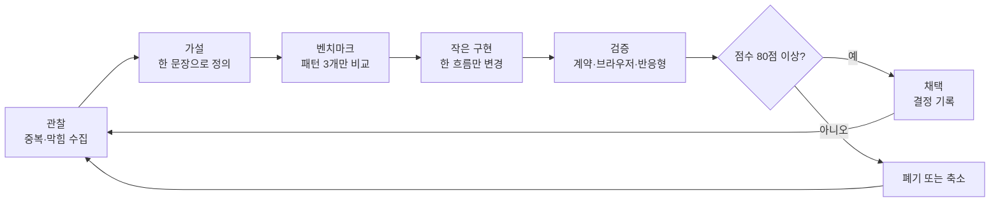

# Codex 투자 대시보드 — 반복 UI 고도화 설계

작성일: 2026-07-31
대상: `src/ai_fc/dashboard_template.html`
범위: 예측 데이터와 계산 로직을 바꾸지 않는 UI·상호작용 고도화

## 1. 목표

한 번에 기능을 많이 얹는 대신, 사용자가 실제로 읽고 판단하는 흐름을 매 회차 하나씩 개선한다.

핵심 결과는 다음 네 가지다.

1. 같은 정보를 다른 모양으로 반복하지 않는다.
2. 첫 화면에서 핵심 상태를 빠르게 이해할 수 있다.
3. 상호작용은 장식이 아니라 다음 행동을 알려준다.
4. 데스크톱·모바일·키보드·모션 축소 환경에서 품질이 유지된다.

## 2. 고정 원칙

- 예측 확률, DB, 산식, 판정 기준은 UI 개선 작업에서 수정하지 않는다.
- 새 요소는 기존 정보를 복제하지 않고 `해석`, `비교`, `다음 행동` 중 하나를 추가해야 한다.
- 한 회차의 핵심 가설은 하나만 둔다.
- 새 라이브러리는 기존 HTML·CSS·JavaScript로 해결할 수 없을 때만 도입한다.
- 호버 전용 기능에는 키보드 포커스 경로를 제공하고, 터치 화면에서는 숨기거나 동등한 클릭 경로를 둔다.
- 모션은 상태 변화를 설명할 때만 쓰고 `prefers-reduced-motion`을 따른다.
- 예쁜 기능보다 정보 중복 제거를 먼저 한다.

## 3. 회차별 반복 루프

### 3.1 관찰

다음 질문으로 화면을 5분 안에 점검한다.

- 같은 제목·확률·마감일이 가까운 곳에서 두 번 이상 보이는가?
- 사용자가 다음에 무엇을 눌러야 하는지 알 수 있는가?
- 첫 화면에서 가장 중요한 요소가 실제로 가장 먼저 보이는가?
- 호버·애니메이션이 새로운 정보를 주는가?
- 모바일에서 데스크톱의 잔재가 빈 공간이나 잘림으로 남는가?

발견 사항은 `문제 → 사용자 영향 → 증거` 세 줄로 기록한다.

### 3.2 가설

다음 형식으로 한 문장만 작성한다.

> `[요소]`를 `[변경]`하면 사용자가 `[핵심 행동/이해]`를 더 빠르게 할 수 있다.

예:

> Quick Peek을 숫자 복제에서 자연어 해석으로 바꾸면 사용자가 확률의 의미와 다음 확인 시점을 더 빠르게 이해할 수 있다.

### 3.3 벤치마크

회차마다 전체 인터넷을 다시 복제하지 않는다. 아래 역할별 후보에서 세 곳만 골라 패턴을 비교한다.

| 역할 | 관찰할 패턴 |
|---|---|
| AI 제품 사이트 | 큰 메시지, 공간감, 포인터 반응 |
| SaaS 대시보드 | 정보 밀도, 필터, 상태 표현 |
| 금융 제품 | 신뢰감, 숫자 위계, 위험 안내 |
| 에디토리얼 | 긴 페이지 리듬, 문장 가독성 |
| 인터랙티브 포트폴리오 | 미세 모션, 전환, 발견의 재미 |

가져올 것은 색상이나 컴포넌트 모양이 아니라 `왜 그 위치에서 그 반응을 주는지`다.

### 3.4 작은 구현

한 회차의 변경 한도:

- 핵심 사용자 흐름 1개
- 새 시각 패턴 최대 2개
- 새 모션 최대 1종
- 새 영구 설정 최대 1개
- 기존 화면의 정보량 증가 10% 이내

변경 전 중복 요소는 가능하면 제거한다. 추가만 하는 패치는 원칙적으로 보류한다.

### 3.5 검증

필수 검증표:

| 항목 | 통과 기준 |
|---|---|
| 의미 | 기존 화면에 없던 해석 또는 다음 행동을 제공 |
| 중복 | 가까운 요소의 제목·숫자·라벨을 그대로 재출력하지 않음 |
| 시각 | 폰트, 색, 경계, 그림자가 기존 톤과 일치 |
| 키보드 | Tab 포커스로 동일 정보 접근 가능 |
| 터치 | 호버 의존 요소가 모바일 흐름을 방해하지 않음 |
| 모션 | 축소 모션 설정에서 정적으로 동작 |
| 반응형 | 390px, 768px, 1280px에서 잘림 없음 |
| 회귀 | 대시보드 계약 테스트 및 전체 테스트 통과 |
| 성능 | 반복 이벤트가 중복 바인딩되지 않고 스크롤을 막지 않음 |

### 3.6 채택·폐기 기준

각 항목을 10점으로 평가한다.

- 이해 속도
- 정보 고유성
- 다음 행동의 명확성
- 시각적 일관성
- 접근성
- 반응형 완성도
- 성능
- 유지보수성
- 과도하지 않은 재미
- 전체 화면 기여도

80점 이상이면 채택한다. 70–79점은 축소 후 재검증한다. 69점 이하는 제거한다.

## 4. 현재 회차 — Quick Peek 의미 재설계

### 문제

기존 호버 레이어가 카드의 제목, 확률, 변화폭, 마감일, 드라이버를 큰 형태로 다시 보여줬다. 시각적 반응은 있었지만 새로운 이해를 만들지 못했다.

### 적용

- 큰 확률 숫자와 제목 복제를 제거했다.
- 확률 구간을 `뚜렷한 우세`, `우세`, `경합`, `보조 경로`, `낮은 가능성`으로 해석한다.
- 직전 회차 변화폭을 자연어로 설명한다.
- 생성일 기준 마감일까지 `D-n`, `D-DAY`, `D+n`을 계산한다.
- 다음 확인 행동을 판정 시계에 맞게 제안한다.
- 드라이버 슬러그를 사람이 읽는 한국어 관찰 변수로 변환한다.
- 카드, 마감 목록, 기타 목록에서 레이어 헤더의 맥락을 다르게 표시한다.

### 의도적으로 하지 않은 것

- 새로운 예측치 생성
- 외부 데이터 호출
- 개인화 투자 추천
- 모바일 호버를 억지로 재현
- 별도 상태 저장 또는 새 의존성 추가

## 5. 다음 반복 백로그

우선순위는 사용자 효용과 변경 위험의 비율로 정한다.

### Cycle 2 — 하단 정보 밀도 정리

- 표·패널에서 반복되는 보조 라벨 탐지
- 긴 목록의 첫 스캔 속도 개선
- 행 전체 클릭, 포커스, 선택 상태를 한 패턴으로 통일

### Cycle 3 — 페이지 이동 감각 개선

- 섹션 내비게이터의 현재 위치 표현 검토
- 사이드 메뉴와 뷰 맵의 역할 중복 제거
- 모바일에서 긴 페이지의 복귀 경로 단순화

### Cycle 4 — 비교와 공유

- 선택한 두 질문을 읽기 전용으로 비교
- 현재 필터·섹션을 URL 또는 인쇄 화면에 보존
- 공유 기능이 예측값을 오해시키지 않는지 문구 검증

### Cycle 5 — 미세 시각 품질

- 한글 본문과 숫자 폰트의 크기·행간 재조정
- 패널 간 여백 리듬과 테두리 강도 통일
- 강조색 사용량을 줄이고 의미별 색 역할 고정

### Cycle 6 — 즐거운 상호작용

- 숫자 변화와 판정 임박 상태에만 제한된 마이크로 모션
- 포인터 반응이 정보 탐색을 돕는지 검증
- 장식성 움직임은 성능·접근성 점수 미달 시 즉시 제거

## 6. 회차 산출물

매 반복 작업은 아래 다섯 가지를 남긴다.

1. 한 문장 가설
2. 변경 전 문제 증거
3. 수정 코드와 계약 테스트
4. 데스크톱·모바일 브라우저 검증 결과
5. 채택·축소·폐기 결정과 다음 백로그 1개

이 구조를 지키면 사이트가 기능 묶음으로 비대해지는 대신, 매 회차 더 짧게 읽히고 더 명확하게 반응하는 방향으로 진화한다.
