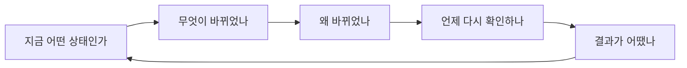

# Jin's Investing — Decision Intelligence Workspace V4 마스터플랜

작성일: 2026-07-31

대상:

- `src/ai_fc/dashboard_template.html`
- `src/ai_fc/dashboard.py`
- `src/tests/test_dashboard.py`
- GitHub Pages 자기완결 정적 배포

핵심 전제:

- 예측값, DB, 산식, 판정 기준은 바꾸지 않는다.
- 새 투자 추천이나 자동 매매 기능을 만들지 않는다.
- 기존 데이터를 더 빠르게 읽고, 비교하고, 근거를 확인하고, 회고하도록 만든다.
- Mistral 계열의 따뜻한 라이트 톤과 현재의 오렌지·크림·잉크 색상 정체성을 유지한다.
- 외부 UI 프레임워크를 추가하지 않고 최종 결과물은 하나의 자기완결 HTML로 유지한다.

---

## 0. 한 줄 결론

다음 버전의 목표는 “예측 카드가 많은 사이트”가 아니라 아래 흐름이 한 제품 안에서 이어지는 **Decision Intelligence Workspace**다.



사용자가 첫 화면에서 결론을 파악하고, 한 번의 선택으로 변화·근거·시점·트랙레코드까지 내려갈 수 있어야 한다. 기능 수보다 **연결성, 출처 투명성, 반응 속도, 모바일 완성도**를 우선한다.

---

## 1. 현재 상태 감사

### 1.1 이미 잘된 부분

- 따뜻한 아이보리 배경, 잉크색 텍스트, 오렌지 강조색이 제품 정체성을 만든다.
- 첫 화면의 시장 판단과 핵심 확률이 일반적인 관리자 대시보드보다 강한 인상을 준다.
- 좌측 제품 rail과 모바일 drawer가 실제 해시 링크로 동작한다.
- 예측 목록, 상세, 비교, 기간 조회, 시점 타임머신, 적중 이력이 이미 하나의 읽기 모델을 공유한다.
- `WHAT CHANGED`, `MY RADAR`, `REVIEW QUEUE`가 데이터 변화와 사용자 관심사를 연결한다.
- 비교 차트는 공통 날짜 커서, 포인터, 터치, 키보드 좌우 이동을 지원한다.
- 밀도, 모션 축소, 집중 모드, 단축키, 메모, 공유, 인쇄 기능이 서버 없이 동작한다.
- 외부 폰트·CDN·이미지 없이 정적 HTML 하나로 배포된다.

### 1.2 현재 규모

2026-07-31 기준:

| 항목 | 현재 값 | 해석 |
|---|---:|---|
| 템플릿 원본 | 232,425 bytes | 기능 확장 전 구조 정리가 필요한 시점 |
| 템플릿 줄 수 | 2,404줄 | CSS·마크업·상태·차트가 한 파일에 집중 |
| 이름 있는 함수 | 111개 | 기능은 풍부하지만 변경 영향 범위가 넓음 |
| 실제 데이터 포함 빌드 | 363,118 bytes | 자기완결 구조로는 양호하나 증가 예산 필요 |
| 기본 화면 | 6개 + 상세 + 비교 | 기능보다 탐색 관계를 먼저 정돈해야 함 |

### 1.3 핵심 문제

#### A. 첫 화면 이후의 흐름이 길다

첫 화면 자체는 강하지만, 변화·레이다·시나리오·판정일이 세로로 연속되어 핵심 행동이 분산된다. 무엇을 먼저 눌러야 하는지보다 패널을 순서대로 읽게 된다.

#### B. 기능은 많지만 서로 연결된 느낌이 약하다

- 예측 목록에서 상세로 들어간 뒤 관련 비교나 판정일로 이어지는 문맥이 약하다.
- 시나리오 이벤트와 개별 질문, 드라이버, 판정 시점이 시각적으로 연결되지 않는다.
- `Review Queue`, `MY RADAR`, `WHAT CHANGED`가 유사한 질문을 다른 위치에서 반복한다.

#### C. 근거와 출처가 화면의 2차 정보다

확률과 변화는 강하게 보이지만 다음 정보는 상세 화면까지 들어가야 한다.

- 현재 값이 어떤 기준일에 생성됐는지
- 최신 회차의 모델·시장·AI 입력이 무엇인지
- 어떤 판정 기준으로 완료되는지
- 데이터가 오래됐는지, 누락됐는지

#### D. 반응형이 viewport 중심이다

현재는 `1279`, `1050`, `799px` 중심의 media query로 대응한다. 같은 카드가 rail, utility panel, 비교 그리드처럼 폭이 다른 컨테이너에 들어갈 때 자체 폭에 따라 변하지 않는다.

#### E. 유지보수 비용이 기능 가치보다 빠르게 커질 수 있다

CSS, 렌더 함수, 상태, 차트 로직이 한 템플릿에 있다. 이후 기능을 그대로 추가하면 다음 문제가 생긴다.

- 같은 UI 패턴을 복사해 사용
- media query와 타입 크기 override가 누적
- 작은 수정도 전체 템플릿 문맥을 많이 읽어야 함
- 테스트가 문자열 존재 여부에 과도하게 의존

#### F. URL이 화면 상태를 충분히 설명하지 못한다

해시 라우팅은 화면 이동에는 충분하지만 필터, 선택 날짜, 비교 기준, 트랙레코드 범위는 공유 URL에 남지 않는다. 메모·핀과 같은 개인 상태는 로컬 저장이 맞지만, 분석 상태는 공유 가능해야 한다.

#### G. 접근성 기반은 좋지만 제품 수준 점검이 남아 있다

- 명확한 focus style과 다수의 ARIA label은 이미 있다.
- 다만 skip link, 표 caption, 정렬 상태, 모든 차트의 텍스트 대체 뷰가 일관되지는 않다.
- 수동 focus trap이 여러 modal에 분산되어 있어 신규 overlay 추가 시 회귀 위험이 있다.

#### H. 성능 기준이 테스트 계약에 없다

자기완결 HTML이라 네트워크 의존은 작지만 다음 수치가 자동으로 보호되지 않는다.

- 결과물 크기
- route 렌더 시간
- 긴 작업
- layout shift
- 최초 화면의 불필요한 애니메이션 수

---

## 2. 제품 원칙

### 원칙 1 — 첫 화면은 답을 주고, 두 번째 화면은 근거를 준다

홈에는 결론·변화·다음 확인 시점만 둔다. 모든 상세 표와 근거를 홈에 복제하지 않는다.

### 원칙 2 — 구조는 느껴져야 하지만 선이 먼저 보이면 안 된다

패널마다 굵은 테두리와 강한 배경을 사용하지 않는다. 핵심 영역만 오렌지 또는 잉크색으로 강조하고 나머지는 간격·타이포·배경 명도 차이로 구분한다.

### 원칙 3 — 동작은 관계를 설명할 때만 사용한다

좋은 동적 기능:

- 한 질문을 선택하면 관련 차트·이벤트·근거가 함께 강조
- 날짜를 움직이면 모든 패널이 같은 `as-of`로 동기화
- 새 회차가 생긴 요소만 짧게 표시

피해야 할 동적 기능:

- 의미 없는 3D tilt 반복
- 모든 카드가 동시에 떠오르는 애니메이션
- 숫자가 매번 0부터 다시 올라오는 연출
- hover로만 접근 가능한 핵심 정보

### 원칙 4 — 확률보다 기준일과 근거가 먼저 신뢰를 만든다

모든 핵심 확률 옆에는 최소한 다음 셋 중 두 개가 보여야 한다.

- 데이터 기준일
- 직전 회차 대비
- 판정 시점 또는 상태

### 원칙 5 — 데이터는 하나, 표현은 여러 개

표, 모바일 카드, 비교, 타임머신, Review Queue가 별도 계산을 만들지 않고 같은 selector 결과를 사용한다.

### 원칙 6 — 개인화는 로컬, 분석 상태는 URL

- 로컬: 핀, 메모, 밀도, 모션, 마지막 방문일, preset
- URL: 질문 필터, 비교 ID, 선택 날짜, 트랙레코드 범위, spotlight

### 원칙 7 — 프레임워크보다 재사용 가능한 작은 원시 컴포넌트

현재 구조를 React 등으로 전환하지 않는다. 순수 함수와 이벤트 위임을 유지하면서 공통 render primitive만 분리한다.

---

## 3. 벤치마크에서 가져올 것

| 제품 | 참고할 원칙 | 실제 적용 | 그대로 복제하지 않을 것 |
|---|---|---|---|
| Linear | 중심 작업만 전면에 두고 navigation은 후퇴, 따뜻한 회색, 적은 icon | rail 대비 완화, action 위치 통일, border 감소 | 지나치게 작은 텍스트 |
| Vercel Dashboard 2026 | 숨기거나 줄일 수 있는 sidebar, 일관된 sub-navigation, 모바일 하단 bar | 5개 primary route, 문맥 subnav, 모바일 bottom dock | 팀·프로젝트 전환 구조 |
| Mistral Studio | Build→Iterate→Deploy→Govern 같은 단계적 이야기 | 판단→변화→근거→시점→회고 흐름 | 대형 마케팅 문구의 반복 |
| Stripe Dashboard | 홈의 중요 알림, 사용자가 고른 widget, pinned/recent, shortcut | Decision Queue, 최근·고정, preset 3종 | 무제한 widget 편집 |
| Robinhood Legend | preset layout, 연결된 widget, symbol 선택 동기화 | 질문·날짜·드라이버의 linked focus | 자유 drag/resize와 주문 기능 |
| Koyfin | watchlist·차트·뉴스 widget, color group linking, shareable insight | 비교 set, 질문 그룹, URL snapshot | 복잡한 다중 자산 terminal |
| TradingView | quick search, replay, alert, watchlist, chart tool 연결 | as-of replay, 이벤트 marker, 로컬 조건 알림 | 실시간 가격·매매·기술지표 |
| Metaculus | calibration, track record, score distribution, reasoning 공유 | 정확도 회고와 표본 수 해석 | 커뮤니티 예측 입력 |
| Observable | details-on-demand, zoom/filter 같은 단순한 chart interaction | linked cursor, 작은 다중 차트, 텍스트 readout | 별도 시각화 runtime |

### 벤치마크 결론

자유 배치 대시보드보다 **세 개의 검증된 workspace preset**이 현재 제품에 적합하다.

1. `BRIEF` — 지금 판단과 변화
2. `RESEARCH` — 질문, 근거, 비교
3. `REVIEW` — 시점 재생과 트랙레코드

이 방식은 사용자 선택권을 주면서도 정적 사이트의 단순성, 모바일 일관성, 토큰 효율을 지킨다.

---

## 4. 목표 정보 구조

### 4.1 Primary navigation

현재 6개 primary route를 다음 5개 역할로 재구성한다.

| Primary | 포함 기능 | 기본 질문 |
|---|---|---|
| 오늘 | Overview, Decision Queue, 다음 이벤트 | 지금 무엇을 알아야 하나 |
| 시장 맵 | 시나리오, 과거 유사 사이클 | 시장이 어떤 경로에 있나 |
| 예측 연구 | 질문 목록, 상세, 비교 | 어떤 질문의 근거를 볼까 |
| 시점 리플레이 | 기간 조회, as-of 타임머신 | 과거 시점에는 무엇을 알았나 |
| 트랙레코드 | Brier, calibration, resolution | 예측 과정이 실제로 나아졌나 |

기존 URL은 redirect alias로 남겨 북마크를 깨지 않는다.

### 4.2 Context sub-navigation

primary rail 아래에 메뉴를 계속 추가하지 않는다. 각 화면 상단에 최대 3개의 compact tab을 둔다.

예:

- 예측 연구: `목록 / 비교 / MY RADAR`
- 시점 리플레이: `기간 / AS-OF / 이벤트`
- 트랙레코드: `요약 / Calibration / 판정 회고`

### 4.3 Utility 영역

아래 기능은 primary navigation이 아니라 우측 utility sheet와 command palette에 둔다.

- Review Queue
- 고정·최근 화면
- 메모
- 화면 밀도·모션
- 공유·복사·인쇄
- 데이터 상태·출처
- 도움말·단축키

---

## 5. 첫 화면 V4 설계

### 5.1 Desktop composition

```text
┌──────────────────────────────────────────────────────────────────────┐
│ AS OF · DATA STATUS · NEXT DECISION                                 │
├───────────────────────────────────────┬──────────────────────────────┤
│ 시장 판단 문장                        │ CHANGE QUEUE                 │
│ 중기/단기 경로 요약                    │ 새 회차 2 · 판정 임박 1      │
│ [30초 briefing] [근거 보기]            │ 가장 중요한 3개 질문         │
├───────────────────────────────────────┴──────────────────────────────┤
│ LINKED SIGNAL STRIP · 상승 경로 · 변동성 · 다음 이벤트 · 신선도     │
├───────────────────────────────────────┬──────────────────────────────┤
│ 핵심 질문 카드 3개                     │ 판정 캘린더 / 이벤트 tape     │
└───────────────────────────────────────┴──────────────────────────────┘
```

### 5.2 변경점

- 현재 시장 판단 H1은 유지하되 최대 폭과 크기를 한 단계 낮춘다.
- `stance-card`, `WHAT CHANGED`, `REVIEW QUEUE`의 역할 중복을 줄인다.
- 홈의 변화 영역은 최대 3건만 노출하고 전체 큐는 utility에서 본다.
- `MY RADAR`는 홈 대형 패널 대신 핵심 카드와 utility shortcut으로 축소한다.
- 첫 화면 아래에는 시나리오 전체 차트가 아니라 4개의 linked signal만 둔다.
- 사용자가 신호를 선택하면 관련 질문 카드와 다음 이벤트가 동시에 강조된다.

### 5.3 “마지막 방문 이후” 변화

서버 없이 구현한다.

- `localStorage.lastSeenGeneratedAt` 저장
- 해당 시점 이후 추가된 forecast round만 `NEW`로 표시
- 확률이 바뀌지 않은 재확인 회차는 `REAFFIRMED`
- 처음 방문에는 최신 회차 기준 변화만 보여준다.

새로운 확률을 만들지 않고 기존 회차 메타만 재구성한다.

---

## 6. 기능 고도화 트랙

### Track A — Decision Home

#### A1. Linked Signal Strip

네 신호만 표시한다.

- 상승 경로 비중
- 조정·횡보 경로
- 활성 질문 중 큰 변화 수
- 14일 내 판정 수

선택한 신호에 해당하는 홈 카드와 이벤트가 함께 강조된다.

#### A2. Decision Queue 통합

`WHAT CHANGED`, `REVIEW QUEUE`, `MY RADAR` 데이터를 하나의 selector로 합치고, 노출 위치마다 개수와 표현만 달리한다.

```text
selectDecisionItems({
  since,
  includePinned,
  dueWithinDays,
  minAbsoluteDelta,
  limit
})
```

#### A3. 다음 확인 조건

각 질문에 투자 행동이 아닌 **확인 조건**을 한 줄로 표시한다.

- 판정일까지 D-5
- 다음 정기 예측 회차
- 관련 이벤트 날짜
- 데이터 갱신 필요

기존 cadence·deadline·history만 사용한다.

### Track B — Evidence & Provenance

#### B1. Universal Evidence Drawer

질문 카드, 비교 카드, 차트 marker 어디서든 같은 drawer를 연다.

구성:

1. 최신 회차 기준일
2. 직전 대비
3. AI·모델·시장 확률
4. reasoning 요약
5. 판정 기준과 출처
6. 데이터 신선도
7. 상세 화면 이동

#### B2. Data Lineage Receipt

각 질문 상세에 아래 receipt를 둔다.

- question ID
- forecast ID / round
- generated timestamp
- input source 구분
- resolution source
- snapshot hash 또는 파일 경로

“왜 이 숫자를 믿어야 하는가”보다 “어떤 데이터에서 왔는가”를 먼저 보여준다.

#### B3. Glossary layer

다음 용어는 첫 등장에 설명을 제공한다.

- Brier score
- calibration
- scenario vintage
- market reflected probability
- resolved / active
- as-of

hover에만 의존하지 않고 click·focus로 열리는 작은 popover와 glossary route를 함께 둔다.

### Track C — Research Workspace

#### C1. 질문 detail 3단 구조

```text
질문·확률·기한
↓
회차 변화와 근거
↓
판정 기준·출처·관련 질문
```

현재 상세 화면의 차트, 회차 목록, reasoning을 유지하되 관련 질문과 다음 탐색을 추가한다.

#### C2. 관련 질문

새 모델을 쓰지 않는다. 다음 규칙으로 최대 3개를 찾는다.

1. 같은 driver 수
2. 같은 domain
3. 가까운 deadline

왜 관련됐는지 label로 표시한다.

#### C3. Saved Compare Sets

- 최대 3개 질문 비교 유지
- 비교 조합에 이름을 붙여 localStorage에 최대 5개 저장
- 저장 조합은 URL로 공유 가능
- 질문이 사라지면 유효한 ID만 복구

#### C4. Small Multiples

서로 날짜가 다른 질문을 한 선 차트에 겹치는 방식 외에, 같은 크기의 소형 차트 2–3개를 제공한다.

- 기본: synchronized cursor
- 보조: small multiples
- 값이 없는 날짜는 선을 이어 그리지 않고 `기록 없음`

### Track D — Event & Time

#### D1. Event Tape

시나리오 event, 질문 deadline, forecast round를 하나의 수평 tape에 합친다.

색:

- 오렌지: 예측 갱신
- 잉크: 거시·정책 이벤트
- 크림슨: 판정 마감
- 틸: resolution

#### D2. Replay Mode

기존 as-of 타임머신을 화면 전체 context로 확장한다.

- 상단 고정 `AS OF 2026-07-20`
- 홈, 질문 목록, 비교, 트랙레코드가 같은 날짜 selector 사용
- 현재와 다른 날짜에서는 `HISTORICAL VIEW`를 항상 표시
- URL에 날짜를 남긴다.

#### D3. Calendar Views

- 14일: event tape
- 30일: compact calendar
- 전체: 기존 ICS export

캘린더 자체가 새 시장 데이터를 만들지는 않으며 question deadline과 scenario event만 사용한다.

### Track E — Track Record & Learning

#### E1. Track Record Summary

첫 화면은 네 숫자로 제한한다.

- resolved count
- overall Brier
- 최근 N건 Brier
- calibration gap

표본이 작으면 숫자보다 `표본 부족`을 우선 표시한다.

#### E2. Calibration Explorer

- 확률 bucket별 예측 수
- 실제 발생률
- ideal diagonal
- domain filter
- horizon filter
- 최소 표본 기준

차트 아래에 동일한 표를 제공한다.

#### E3. Resolution Postmortem

각 판정 질문에 아래를 제공한다.

- 최초 확률
- 최종 확률
- 가장 큰 상향·하향 회차
- 결과
- Brier
- reasoning 회차 링크

“맞았다/틀렸다”보다 과정이 어떻게 이동했는지 보여준다.

#### E4. Learning Feed

별도 AI 요약을 생성하지 않는다. 기존 ledger와 history에서 다음만 추출한다.

- 가장 개선된 calibration bucket
- 가장 많은 표본 domain
- 큰 확률 이동 후 판정된 질문
- 오래 업데이트되지 않은 활성 질문

### Track F — Personal Workspace

#### F1. 세 가지 preset

| Preset | 우선 요소 | 숨기는 요소 |
|---|---|---|
| BRIEF | 판단, 변화, 다음 이벤트 | 긴 표, 상세 reasoning |
| RESEARCH | 질문, 근거, 비교, 메모 | 대형 hero |
| REVIEW | as-of, resolution, calibration | 마케팅형 copy |

#### F2. Workspace State Export

핀, compare set, 메모, preset을 JSON으로 내보내고 다시 가져온다.

- 데이터베이스와 분리
- 파일 내용 미리보기
- schema version 검사
- 잘못된 ID 무시

#### F3. Shareable Analysis State

공유 가능한 상태:

- route
- filter
- selected question IDs
- as-of date
- spotlight
- track-record range

공유하지 않는 상태:

- 메모
- local pins
- 마지막 방문 시점
- motion/density

### Track G — Delightful Motion

#### G1. Linked Focus

한 질문에 pointer 또는 keyboard focus가 가면:

- 관련 event marker가 선명해짐
- 같은 driver tag가 강조됨
- 비교 차트의 해당 series가 앞으로 옴

#### G2. New Round Pulse

마지막 방문 이후 새 회차에만 1회 표시한다. 반복 pulse를 사용하지 않는다.

#### G3. Route transition

지원 브라우저에서 View Transition API를 progressive enhancement로 사용한다.

- opacity + 8px 이동
- 180–220ms
- hero와 detail 확률 숫자만 shared transition 후보
- reduced motion에서는 즉시 전환

#### G4. Cursor Physics

차트 cursor는 가장 가까운 실제 데이터 날짜에 즉시 snap한다. 모션을 넣더라도 80ms 이하의 짧은 보간만 허용한다.

### Track H — Mobile Product

#### H1. Bottom Navigation

799px 이하에서 drawer를 primary navigation으로 사용하지 않는다.

- 하단 4개: 오늘, 시장, 예측, 더보기
- `더보기`에 시점 리플레이·트랙레코드·설정
- 현재 route 명확히 표시
- safe-area 대응

#### H2. Mobile Research Sheet

질문 카드를 누르면 즉시 전체 route로 이동하기 전에 compact sheet를 열 수 있다.

- 확률·변화·판정 시계
- 최신 reasoning 3줄
- 상세 / 비교 / 레이더

빠른 훑기는 sheet, 깊은 읽기는 detail route로 분리한다.

#### H3. One-handed Actions

모바일 핵심 버튼은 하단 44px 이상으로 유지한다.

- 비교
- 레이더
- 상세
- 날짜 이전/다음

---

## 7. 시각 시스템 V4

### 7.1 색상 비율

| 역할 | 비율 | 사용 |
|---|---:|---|
| Warm ivory / white | 76% | 배경과 데이터 surface |
| Ink / warm gray | 17% | 텍스트, rail, focus area |
| Orange | 4% | primary action, current signal |
| Crimson | 1.5% | 하락·위험·마감 |
| Teal | 1.5% | 비교·해결·보조 경로 |

한 viewport에서 채도가 높은 강조색은 최대 2종만 동시에 강하게 쓴다.

### 7.2 Surface 단계

```text
Canvas       #fbfbf8
Primary      #ffffff
Secondary    #f3f1eb
Elevated     #ffffff + soft shadow
Inverse      #11110f
Signal       orange/crimson/teal 4–6px edge
```

### 7.3 Border와 radius

- 기본 border: warm gray 1px
- 핵심 panel: border보다 배경·spacing으로 분리
- radius는 0, 4, 12px 세 단계만 사용
- 데이터 표와 terminal 성격의 panel은 0–4px
- overlay와 mobile sheet는 12px

### 7.4 Typography

현재 10/11/11/13px 가독성 token을 유지하고 semantic token을 추가한다.

| Token | 크기 | 용도 |
|---|---:|---|
| `--text-meta` | 10px | 기준일, ID, 보조 label |
| `--text-control` | 11px | 버튼, tab |
| `--text-body-sm` | 12px | 보조 설명 |
| `--text-data` | 13px | 표, 주요 수치 설명 |
| `--text-body` | 15px | 일반 본문 |
| `--text-title-sm` | 20px | card heading |
| `--text-title` | clamp 32–54px | route heading |
| `--text-display` | clamp 46–68px | 홈 판단 문장 |

7–9px는 장식용 logo mark를 제외하고 금지한다.

### 7.5 Spacing

4px 기반이되 주요 묶음은 8px rhythm을 사용한다.

```text
4 / 8 / 12 / 16 / 24 / 32 / 48 / 72
```

---

## 8. 반응형 설계

### 8.1 네 가지 동작 모드

| 범위 | 모드 | 핵심 변화 |
|---|---|---|
| 1280px+ | Workbench | rail + 2열/3열 분석 |
| 800–1279px | Compact desktop | 축소 rail + 1–2열 |
| 480–799px | Mobile | bottom nav + card + sheet |
| <480px | Small phone | 단일 열, 44px action, 축약 label |

### 8.2 Container Query 도입

다음 컴포넌트는 viewport가 아니라 자체 폭으로 변한다.

- forecast card
- compare card
- metric strip
- evidence drawer
- track-record tile
- event tape

예:

```css
.forecast-module {
  container-type: inline-size;
}

@container (width < 420px) {
  .forecast-facts {
    grid-template-columns: 1fr;
  }
}
```

### 8.3 반응형 수용 기준

- 390px에서 body 가로 스크롤 0
- 모든 primary action 44px 이상
- 차트는 pinch 또는 horizontal pan을 강제하지 않고 기본 핵심 정보가 보임
- 같은 route state가 desktop/mobile에서 유지
- mobile sheet를 닫으면 focus가 원래 card로 복귀

---

## 9. 접근성 기준

목표: WCAG 2.2 AA 핵심 항목을 기능 수용 기준에 포함한다.

### 9.1 반드시 추가

- `본문으로 건너뛰기` skip link
- primary `main`에 안정적인 ID와 focus target
- 모든 data table에 caption 또는 명확한 accessible name
- 정렬 가능한 header에 `aria-sort`
- chart 아래 동일 정보의 compact table 또는 text summary
- modal/drawer 공통 focus manager
- overlay가 열릴 때 배경 `inert`
- focus return
- color에만 의존하지 않는 상승·하락 label
- `aria-live`는 결과 수·저장 완료 등 필요한 곳만 사용

### 9.2 Focus 원칙

- pointer click 이후에도 focus가 사라지지 않음
- 두 색 focus ring으로 밝은/어두운 surface 모두 대비 확보
- chart cursor focus는 날짜와 현재 값을 읽어줌
- keyboard shortcut은 입력 중 작동하지 않음

### 9.3 Target size

- 최소 24×24px는 절대 하한
- 주요 모바일 action은 44×44px
- icon-only button은 accessible name 필수
- 촘촘한 차트 point는 대체 text control 제공

---

## 10. 성능과 품질 예산

### 10.1 성능 목표

| 항목 | 목표 |
|---|---:|
| 자기완결 빌드 raw size | 420KB 이하 |
| gzip 예상 | 100KB 이하 |
| LCP | 2.5초 이하 |
| INP | 200ms 이하 |
| CLS | 0.05 이하 목표, 0.1 절대 상한 |
| route render long task | 50ms 이상 0건 목표 |
| 첫 화면 동시 animation | 최대 4개 |

### 10.2 구현 전략

- route별 DOM만 렌더하는 현재 방식을 유지
- 긴 below-fold panel에 안전한 범위에서 `content-visibility:auto`
- SVG chart path와 label 수에 상한 설정
- pointermove는 한 frame당 한 번만 paint
- 숫자 animation은 최초 노출 1회만
- 이벤트 listener는 root event delegation 우선
- filter 입력은 데이터가 늘면 80–120ms debounce

### 10.3 측정

- build 시 HTML byte budget test
- JavaScript syntax test
- route contract test
- Lighthouse lab check
- 실제 배포 후 PageSpeed/field data가 생기면 별도 기록

---

## 11. 소스 구조와 토큰 효율화

### 11.1 프레임워크 마이그레이션 금지

현재 Python 생성기와 정적 GitHub Pages 구조는 유지한다. 결과물 역시 자기완결 HTML 하나다.

### 11.2 소스만 분리

권장 구조:

```text
src/ai_fc/
  dashboard.py
  dashboard_template.html
  dashboard_parts/
    tokens.css
    shell.css
    components.css
    views.css
    responsive.css
    state.js
    selectors.js
    components.js
    charts.js
    views.js
    app.js
```

빌드 시 Python이 partial을 inline으로 합친다. 배포 결과에 외부 파일 요청은 생기지 않는다.

### 11.3 공통 primitive

우선 분리할 함수:

- `panelHeader()`
- `metricStrip()`
- `statusBadge()`
- `emptyState()`
- `questionActionGroup()`
- `linkedCursor()`
- `dataReceipt()`
- `serializeViewState()`
- `restoreViewState()`
- `selectDecisionItems()`

### 11.4 상태 schema

```js
{
  version: 2,
  density,
  motion,
  preset,
  pins,
  recent,
  notes,
  compare,
  compareSets,
  lastSeenGeneratedAt
}
```

- v1→v2 migration 함수 작성
- 유효하지 않은 질문 ID 제거
- notes 길이와 compare set 수 제한
- import 전 schema 검증

### 11.5 토큰 절약 작업 규칙

- 한 회차에 최대 2개 사용자 흐름만 변경
- 공통 selector 없이 같은 필터 로직을 두 번 쓰지 않음
- 새 panel을 만들면 기존 panel 하나를 통합·축소
- 외부 dependency 0 유지
- 새 persistent key는 회차당 최대 1개
- 각 단계는 하나의 설계 문서와 하나의 contract test block으로 닫음
- 구현 전 변경 대상 함수와 수용 기준을 20줄 이내 작업 spec으로 고정

---

## 12. 단계별 구현 로드맵

### Wave 0 — Foundation & Cleanup

목표: 이후 고도화를 안전하고 짧게 구현할 수 있는 기반.

작업:

1. CSS/JS partial 소스 분리, 최종 inline bundle 유지
2. 중복 media query와 override 정리
3. semantic typography·surface·motion token 확정
4. UI state v2 migration
5. 공통 overlay/focus manager
6. 결과물 byte budget test
7. 기존 route와 hash 호환 유지

통과 기준:

- UI diff 최소
- 전체 테스트 통과
- 최종 HTML 외부 요청 0
- build raw size 380KB 이하 목표
- 기존 localStorage 상태 보존

### Wave 1 — Navigation & Decision Home

목표: 첫 화면에서 무엇을 보고 어디로 갈지 즉시 이해.

작업:

1. primary route 5개로 재편
2. desktop context subnav
3. mobile bottom navigation
4. 홈 V4 composition
5. `selectDecisionItems()` 통합
6. 마지막 방문 이후 변화
7. linked signal strip

통과 기준:

- 첫 viewport에 판단, 변화, 다음 이벤트가 모두 보임
- 홈 대형 panel 수 3개 이하
- 모바일 390px 가로 스크롤 0
- 기존 route deep link 호환

### Wave 2 — Evidence & Research

목표: 확률에서 근거까지 이동 거리를 줄임.

작업:

1. universal Evidence Drawer
2. data lineage receipt
3. glossary popover
4. detail 3단 구조
5. 관련 질문
6. saved compare sets
7. compare small multiples

통과 기준:

- 홈/목록/차트에서 근거 drawer 접근
- 각 최신 확률에 기준일 확인 경로 존재
- 모든 drawer keyboard/touch 지원
- 새 예측 수치 0

### Wave 3 — Replay & Events

목표: 과거 시점의 판단을 제품 전체에서 일관되게 재생.

작업:

1. global as-of context
2. event tape
3. 14일·30일 calendar
4. route state URL 직렬화
5. historical mode banner
6. 시나리오·질문·판정 marker 연결

통과 기준:

- URL 복사 후 같은 날짜·필터·선택 복원
- 미래 회차가 과거 화면에 노출되지 않음
- 현재/과거 mode 혼동 방지

### Wave 4 — Track Record & Learning

목표: 정확도 숫자를 평가가 아니라 학습 흐름으로 전환.

작업:

1. track record summary
2. calibration explorer
3. resolution postmortem
4. learning feed
5. domain/horizon filter
6. 표본 부족 상태

통과 기준:

- chart와 table 값 동일
- Brier 계산 기존 ledger와 동일
- sample count 항상 표시
- resolved 질문에서 reasoning 회차 이동 가능

### Wave 5 — Workspace Presets & Polish

목표: 사용 맥락별 밀도를 제공하고 동적 경험을 마무리.

작업:

1. BRIEF/RESEARCH/REVIEW preset
2. workspace JSON export/import
3. linked focus
4. new-round pulse
5. route transition progressive enhancement
6. container query
7. 접근성·성능 마감

통과 기준:

- preset 전환 후 데이터와 URL 불변
- reduced motion 완전 대응
- focus·target·table·chart 접근성 계약 통과
- performance budget 통과

---

## 13. 우선순위 백로그

### P0 — 다음 실행 묶음

1. 소스 partial 분리와 bundle 유지
2. CSS token·중복 media query 정리
3. 공통 selector `selectDecisionItems`
4. 홈 panel 역할 중복 제거
5. mobile bottom navigation
6. skip link와 공통 focus manager
7. byte budget contract

### P1 — 제품 가치가 큰 기능

8. 마지막 방문 이후 변화
9. universal Evidence Drawer
10. data lineage receipt
11. global as-of context
12. shareable view state
13. saved compare sets
14. calibration explorer
15. resolution postmortem
16. container query

### P2 — 완성도와 즐거움

17. linked signal focus
18. event tape
19. related questions
20. workspace presets
21. JSON export/import
22. glossary
23. small multiples
24. route transition

### 보류

- 자유 drag/resize widget
- 사용자 계정과 cloud sync
- 실시간 가격 stream
- 알림 push/email
- AI reasoning 재생성
- 투자 행동 추천
- 소셜 feed와 댓글

보류 사유: 정적 GitHub Pages 구조, 토큰·유지보수 비용, 현재 핵심 사용자 흐름과의 거리.

---

## 14. 테스트 매트릭스

### 데이터 무결성

- DB와 read-model 수치 동일
- scenario probability 합 100
- 질문별 latest와 history 마지막 회차 동일
- as-of 날짜 이후 데이터 미노출
- compare와 track-record 계산 중복 없음

### 기능

- 모든 primary route deep link
- filter와 URL state 복원
- pin·note·compare set local persistence
- v1 state migration
- ICS/print/share 유지
- compare 최대 3개 제한

### 접근성

- keyboard only 전체 주요 흐름
- visible focus
- focus trap/return
- 200% zoom
- text spacing
- reduced motion
- chart text alternative
- table caption/scope/aria-sort

### 반응형

- 390×844
- 768×1024
- 1024×768
- 1440×900
- 1920×1080

### 성능

- raw build size
- JavaScript parse
- route render time
- pointermove paint throttling
- Lighthouse LCP/CLS/TBT

---

## 15. 위험과 대응

| 위험 | 영향 | 대응 |
|---|---|---|
| 홈 기능 과밀 재발 | 첫 화면 혼잡 | 홈 대형 panel 3개 제한 |
| partial 분리 중 build 회귀 | Pages 실패 | 최종 inline snapshot test |
| URL state 과도 | 링크 길이 증가 | ID·날짜·필터만 compact serialize |
| 로컬 상태 migration 실패 | 핀·메모 손실 | v1 copy 보존 후 v2 변환 |
| as-of 데이터 누출 | 역사 왜곡 | selector 단계에서 날짜 cut |
| 동작 과다 | 산만함·INP 저하 | interaction budget와 reduced motion |
| track record 표본 오해 | 과신 | 모든 score에 N과 표본 부족 표시 |
| 모바일 기능 격차 | 이중 제품화 | desktop/mobile state parity test |

---

## 16. 다음 실행 제안

다음 구현은 **Wave 0 + Wave 1의 최소 묶음**으로 시작하는 것이 가장 효율적이다.

포함:

1. 소스 partial 분리
2. token·media query 정리
3. Decision Queue selector 통합
4. 홈 V4 레이아웃
5. mobile bottom navigation
6. skip link·공통 focus manager
7. 성능 크기 계약

제외:

- Evidence Drawer
- global as-of
- calibration explorer
- workspace import/export
- 자유 widget 편집

이 묶음이 먼저 필요한 이유:

- 다음 기능을 더 짧고 안전하게 추가할 기반을 만든다.
- 사용자가 가장 자주 보는 첫 화면과 모바일 탐색이 먼저 개선된다.
- UI를 크게 바꾸면서도 예측 데이터와 DB에는 손대지 않는다.
- 자유 widget보다 적은 코드로 더 큰 체감 개선을 만든다.

---

## 17. 참고 자료

- [Linear — A calmer interface for a product in motion](https://linear.app/now/behind-the-latest-design-refresh)
- [Vercel — 2026 Dashboard navigation redesign](https://vercel.com/changelog/dashboard-navigation-redesign-rollout)
- [Mistral Studio](https://mistral.ai/products/studio/)
- [Stripe Dashboard basics](https://docs.stripe.com/dashboard/basics?locale=en-GB)
- [Robinhood Legend](https://robinhood.com/us/en/legend/)
- [Koyfin Custom Dashboards](https://www.koyfin.com/features/custom-dashboards/)
- [TradingView Supercharts](https://www.tradingview.com/support/solutions/43000746464-getting-started-with-supercharts/)
- [Metaculus Track Record](https://www.metaculus.com/questions/track-record/)
- [Observable Plot Interactions](https://observablehq.com/plot/features/interactions)
- [WCAG 2.2 Focus Visible](https://www.w3.org/WAI/WCAG22/Understanding/focus-visible.html)
- [WCAG 2.2 Target Size Minimum](https://www.w3.org/WAI/WCAG22/Understanding/target-size-minimum.html)
- [Web Vitals](https://web.dev/articles/vitals)
- [MDN Container Queries](https://developer.mozilla.org/en-US/docs/Web/CSS/Guides/Containment/Container_queries)

---

## 18. Wave 0 + Wave 1 실행 결과 — 2026-07-31

### 완료한 기반 작업

- `dashboard_template.html`의 단일 대형 소스를 HTML shell, CSS, JavaScript 3개 파셜로 분리했다.
- Python 빌드 단계가 파셜을 다시 인라인하여 기존과 같은 자기완결 HTML을 만든다.
- 최종 embed 산출물에 420,000 byte raw size budget을 추가했다.
- GitHub Pages 경로 필터에 `src/ai_fc/dashboard_parts/**`를 추가해 파셜 변경도 배포를 실행하도록 했다.
- UI 상태를 v2로 migration하고 `lastSeenGeneratedAt`을 기기 로컬 상태에 보존했다.
- semantic text/surface/motion token, container query, 공통 focus ring을 추가했다.
- skip link, modal inert, command palette·mobile drawer focus trap/return을 적용했다.
- 데이터 테이블에 숨김 caption과 `scope="col"`을 적용했다.

### 완료한 Home V4

- 첫 화면 우측의 정적 stance panel을 `Decision Queue`로 교체했다.
- 큐 selector는 새 회차, 직전 확률 변화, 14일 내 판정, MY RADAR를 하나의 규칙으로 정렬한다.
- 마지막 방문 이후 새 forecast round는 `NEW ROUND`로 표시한다.
- 홈의 3개 forecast module은 Decision Queue 질문을 우선하고 기존 feature 질문으로 보충한다.
- 상승 경로·확률 이동·판정 임박·MY RADAR signal strip을 누르면 관련 카드가 즉시 강조된다.
- 홈 하단에서 중복되던 Change Radar와 My Radar 대형 panel을 제거했다. 두 기능은 utility workspace에서 계속 제공한다.

### 완료한 정보 구조와 모바일

- 6개 동급 primary navigation을 5개 핵심 목적지로 축소했다.
- 기간 조회와 As-of Time Machine은 `시점 리플레이` 문맥 탭으로 묶었다.
- 질문 목록과 비교 화면은 `예측 연구` 문맥 탭으로 묶었다.
- 모바일에 오늘·시장·예측·더보기 4개 고정 bottom navigation을 추가했다.
- compare tray와 toast의 하단 위치를 bottom navigation 및 safe area 기준으로 조정했다.

### 검증 결과

- JavaScript syntax check: 통과
- dashboard 계약 테스트: `9 passed`
- 전체 회귀 테스트: `141 passed`
- 실제 Pages 정적 빌드: 성공
- 최종 `index.html`: `376,367 bytes`
- raw size budget 사용률: 약 `89.6%` (`376,367 / 420,000`)
- 외부 CSS·JavaScript·font 요청: 없음
- build marker 잔존: 없음

### 의도적으로 다음 Wave로 남긴 항목

- 기존 CSS compatibility layer의 전면 삭제와 selector dead-code 측정
- Evidence Drawer와 global as-of state
- calibration explorer
- workspace import/export
- 자유 widget 편집
- 실기기 browser matrix 및 Lighthouse 측정

기존 시각 회귀 위험을 낮추기 위해 이번 Wave에서는 오래된 selector를 무리하게 삭제하지 않았다. 다음 정리에서는 실제 사용 selector와 route별 byte 기여도를 측정한 뒤 compatibility layer를 단계적으로 제거한다.
