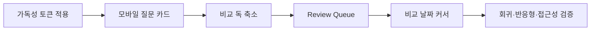

# Jin's Investing — 가독성 보정 및 다음 고도화 블루프린트

작성일: 2026-07-31
대상: `src/ai_fc/dashboard_template.html`
원칙: 예측값·DB·산식은 유지하고 읽기, 비교, 회고 흐름만 개선

## 1. 이번 회차의 문제 정의

화면 전체의 큰 제목과 핵심 확률은 충분히 강하지만, 다음 요소에는 7–9px 글자가 남아 있었다.

- 표 헤더, 질문 ID, 상태 태그
- 고정·비교·캘린더·포커스 버튼
- 비교 트레이와 유틸리티 패널
- 데이터 기준일, 변화 레이더, 타임머신 보조 라벨
- Quick Peek의 관찰 변수와 판정 시계

작은 글자는 정보 위계를 만들 수 있지만, 실제 조작과 판단에 필요한 텍스트까지 작아지면 화면이 세련된 것이 아니라 불편하게 느껴진다. 이번 회차는 큰 제목을 더 키우지 않고 작은 글자의 하한만 올리는 방향으로 정리한다.

## 2. 벤치마크에서 가져온 원칙

### Linear — 조용하고 일관된 인터페이스

[Linear의 2026 UI refresh](https://linear.app/now/behind-the-latest-design-refresh)는 기능이 하나씩 더해지면서 생긴 혼잡을 다시 정리하고, 중심 작업과 보조 내비게이션의 시각적 무게를 분리한다. 적용 원칙은 다음과 같다.

- 모든 요소를 강조하지 않는다.
- 위치와 역할이 같은 버튼은 같은 크기와 배치를 사용한다.
- 보조 요소는 색으로 물리되, 읽을 수 없을 정도로 작게 만들지 않는다.

### Stripe — 검색, 고정, 필터, 내보내기의 예측 가능한 위치

[Stripe Dashboard 안내](https://docs.stripe.com/dashboard/basics?locale=en-GB)는 탐색·검색·고정·필터·내보내기를 반복 가능한 작업 흐름으로 둔다.

- 고정 및 최근 화면은 별도 지름길로 유지한다.
- 목록은 필터와 내보내기를 같은 작업 맥락에 둔다.
- 홈 화면은 중요한 알림과 해결할 항목을 먼저 보여준다.

### Mistral Studio — Build, Iterate, Deploy, Govern의 단계감

[Mistral Studio](https://mistral.ai/products/studio/)는 복잡한 기능을 한 화면에 평평하게 놓지 않고 작업 단계를 구분한다.

- 현재 사용자가 어느 단계에 있는지 먼저 알린다.
- 비교와 반복은 별도의 작업공간으로 분리한다.
- 상태·버전·거버넌스 정보를 결과와 함께 노출한다.

### W3C — 확대와 간격 변화에도 깨지지 않는 정보 구조

[W3C Text Spacing](https://www.w3.org/WAI/WCAG22/Understanding/text-spacing)과 [Target Size](https://www.w3.org/WAI/WCAG22/Understanding/target-size-minimum)는 텍스트 확대·간격 변경 시 내용이 잘리거나 겹치지 않아야 하고, 포인터 목표는 최소 24×24px 이상이어야 한다고 설명한다.

- 제어 글자만 키우고 버튼 박스를 그대로 두지 않는다.
- 표와 긴 라벨은 확대 시 줄바꿈 또는 가로 스크롤로 내용을 보존한다.
- 글자 크기, 행간, 클릭 영역을 한 묶음으로 조정한다.

## 3. 이번에 적용한 타이포그래피 체계

역할별 크기를 네 개 토큰으로 묶었다.

| 역할 | 토큰 | 기준 크기 | 사용 위치 |
|---|---:|---:|---|
| Micro | `--type-micro` | 10px | 보조 날짜, 태그, 상태, 작은 메타 |
| Caption | `--type-caption` | 11px | 표 헤더, 필터 라벨, 비교 사실 |
| Control | `--type-control` | 11px | 고정·비교·캘린더·포커스 버튼 |
| Data | `--type-data` | 13px | 표 본문과 주요 데이터 셀 |

함께 조정한 항목:

- 표 본문 12px → 13px, 표 헤더 9px → 11px
- 상태·테마 태그 8px → 10px
- 고정·비교 버튼 30–32px → 34px
- 상세 작업 버튼 높이 38px → 40px
- 캘린더 버튼 높이 34px → 36px
- 비교·타임머신·유틸리티의 7–8px 메타 → 9–10px
- 입력·선택 컨트롤 본문 → 12px

## 4. 고도화 우선순위와 구현

### Priority 1 — 모바일 예측 목록을 표가 아닌 읽기 흐름으로 전환

현재 데스크톱 표는 효율적이지만 작은 화면에서는 900px 폭의 표를 가로로 움직여야 한다.

설계:

1. 800px 이상에서는 현재 표를 유지한다.
2. 799px 이하에서는 같은 필터 결과를 질문 카드 목록으로 렌더링한다.
3. 카드 첫 줄에는 질문, 둘째 줄에는 분야·상태, 셋째 줄에는 확률·변화·판정일을 둔다.
4. 고정·비교 버튼은 카드 하단의 44px 작업 영역으로 이동한다.
5. 데스크톱 표와 모바일 카드는 같은 데이터 배열과 정렬 함수를 사용한다.

통과 기준:

- 390px에서 가로 스크롤 없이 질문·확률·상태·작업 접근
- 표와 모바일 카드의 필터 결과 수가 동일
- 키보드와 스크린리더용 표 구조는 데스크톱에서 유지

### Priority 2 — 비교 트레이를 접을 수 있는 작업 독으로 개선

현재 비교 트레이는 명확하지만 작은 화면과 긴 페이지에서 콘텐츠를 가릴 수 있다.

설계:

1. 선택 질문이 1개면 작은 `COMPARE 1` 탭으로 접는다.
2. 2개 이상 선택되면 한 번만 자동 확장한다.
3. 이후 사용자가 접은 상태는 로컬 UI 상태에 저장한다.
4. 비교 화면에서는 독을 기본 축소해 본문 차트를 가리지 않는다.
5. 3개 선택 제한과 제거 동작은 그대로 유지한다.

통과 기준:

- 접힌 상태에서도 선택 개수와 비교 진입 버튼 접근 가능
- 모바일에서 본문 하단 56px 이상을 가리지 않음
- 선택 상태와 URL 비교 화면이 항상 동기화

### Priority 3 — 변화 질문만 모아 보는 Review Queue

`WHAT CHANGED`, 판정 임박, `MY RADAR`가 서로 유용하지만 사용자가 세 패널을 돌아다녀야 한다.

설계:

1. 기존 데이터에서 `큰 변화`, `14일 내 판정`, `내 레이더` 세 조건만 조합한다.
2. 새 예측이나 추천 없이 최대 5개의 검토 질문을 만든다.
3. 각 질문에 `왜 지금 검토하는지` 한 줄 이유를 표시한다.
4. 완료 처리는 서버에 쓰지 않고 이 기기의 세션에서만 숨긴다.
5. 첫 화면에 또 하나의 대형 패널을 추가하지 않고 유틸리티 패널의 첫 섹션으로 둔다.

통과 기준:

- 동일 질문은 한 번만 표시
- 검토 이유가 변화·기한·고정 중 하나로 명확
- 새 확률, 투자 행동, 개인화 추천을 생성하지 않음

### Priority 4 — 비교 차트에 동기화된 날짜 커서 추가

설계:

1. 비교 차트 위를 움직이면 가장 가까운 날짜를 하나 선택한다.
2. 모든 질문의 해당 날짜 이전 최신 확률을 같은 세로선에서 표시한다.
3. 값이 없는 질문은 `기록 없음`으로 표시한다.
4. 터치에서는 탭한 위치를 고정하고 다시 탭하면 이동한다.
5. 모션 축소 모드에서는 커서만 즉시 이동하고 보간 애니메이션을 사용하지 않는다.

통과 기준:

- 서로 다른 예측 날짜를 같은 날짜의 값처럼 오해시키지 않음
- 키보드 좌우 화살표로 데이터 날짜 이동 가능
- 차트 밖에도 같은 정보를 텍스트로 제공

## 5. 실행 순서

1. 가독성 토큰과 클릭 영역 보정 — 완료
2. 모바일 질문 목록 — 완료
3. 비교 독과 Review Queue — 완료
4. 비교 차트 날짜 커서 — 완료

## 6. 기능 팽창 방지 규칙

- 새 패널을 추가하려면 기존 패널 하나를 축소하거나 통합한다.
- 기존 데이터로 설명할 수 없는 수치는 만들지 않는다.
- 호버 기능은 클릭·키보드·터치 대체 경로가 없으면 추가하지 않는다.
- 7px 텍스트는 로고 장식 외에는 사용하지 않는다.
- 버튼 텍스트는 기본 10px 이상, 표 헤더는 11px 이상을 유지한다.
- 각 회차는 사용자 흐름 하나만 변경하고 전체 테스트 후 채택한다.

## 7. 실행 결과

네 우선순위를 한 번에 구현하되, 예측값·DB·산식·정적 배포 구조는 변경하지 않았다.

- 799px 이하 예측 목록은 데스크톱 표와 같은 필터 결과를 모바일 카드로 표시한다.
- 비교 선택이 한 개일 때 독을 자동 축소하고, 두 개가 되면 한 번만 펼친다. 이후 접힘 상태는 기기 로컬 UI 상태에 저장한다.
- 유틸리티 패널 첫 섹션에 `REVIEW QUEUE`를 두고, 직전 회차 5%p 이상 변화·14일 내 판정·`MY RADAR`만 최대 다섯 건으로 조합한다.
- 검토 큐의 숨김은 `sessionStorage`에만 기록해 서버나 예측 데이터에 쓰지 않는다.
- 비교 차트는 포인터·터치·키보드 좌우 화살표로 공통 기준 날짜를 선택하며, 각 질문의 해당 날짜 이전 최신 회차와 실제 회차 날짜를 별도 텍스트로 표시한다.
- 정적 빌드 결과물은 기존 GitHub Pages 방식의 자기완결 HTML을 유지한다.

검증:

- 인라인 JavaScript 문법 검사 통과
- 대시보드 계약 테스트 `8 passed`
- 전체 회귀 테스트 `139 passed, 1 deselected`
- 실제 저장소 데이터 기반 GitHub Pages 정적 빌드 성공
