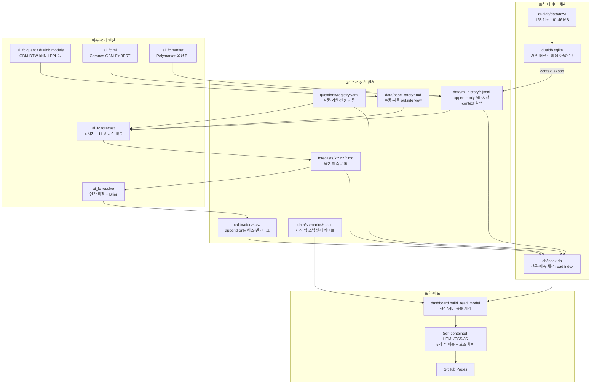

# Codex → Claude Fable 작업 폴더 정밀 인수인계서

작성일: 2026-08-01

저장소: `Sung-JinPark/Jin-s-investing-prediction`

라이브: https://sung-jinpark.github.io/Jin-s-investing-prediction/

현재 작업 브랜치: `codex/ui-sidebar-overhaul`

GitHub 배포 기준 브랜치: `main`

현재 기준 커밋: `d8b2e69` (`feat: add scenario change intelligence`)

후속 역할: **Claude Fable은 대형 설계서를 작성하고, Codex가 그 설계서를 재검증한 뒤 구현한다.**

---

## 0. 이 문서의 성격과 읽는 순서

이 문서는 저장소를 처음 넘겨받는 설계자가 코드·DB·문서 중 무엇이 진실인지 혼동하지
않도록 만든 **실측 기반 인수인계서**다. 희망 상태가 아니라 2026-08-01 현재 로컬 파일,
SQLite, Git 이력, 워크플로, 테스트를 직접 대조한 결과를 적었다.

반드시 다음 순서로 읽는다.

1. 이 문서의 `§1`, `§4`, `§5`를 읽어 진실 원천과 현재 오염 위험을 이해한다.
2. 루트 `CLAUDE.md`의 하드 게이트와 금지사항을 읽는다.
3. `docs/ARCHITECTURE.md`, `docs/KNOWN_LIMITS.md`, `docs/DECISIONS.md`,
   `docs/MODEL_REGISTRY.md`를 읽는다.
4. 실제 스키마 `src/ai_fc/db/schema.sql`, `dualdb/schema.sql`과 실제 코드를 대조한다.
5. `reports/md/claude_fable_quant_platform_master_blueprint_prompt_260801.md`의 지시대로
   신규 대형 설계서를 작성한다.

### 사실 우선순위

충돌 시 우선순위는 다음과 같다.

1. Git에 추적되는 불변 원장과 현재 소스 코드
2. 현재 브랜치의 테스트로 재현되는 동작
3. Git에 추적되는 운영·결정 문서
4. 재구축 가능한 로컬 SQLite
5. 과거 보고서의 숫자·서술

로컬 DB 숫자가 문서보다 구체적으로 보여도 DB가 항상 우선하는 것은 아니다. 이 저장소의
두 SQLite는 Git에서 제외되며, 브랜치를 바꿔도 파일이 남는다. 실제로 이번 감사에서
**다른 브랜치의 레코드가 현재 브랜치의 `db/index.db`에 남은 상태**가 확인됐다.

---

## 1. 한 장 요약

### 1.1 이 제품이 하는 일

이 프로젝트는 주식 가격을 단일 숫자로 찍는 자동매매기가 아니다. 기한·판정기준이 명확한
시장 질문을 사전에 확률로 기록하고, 결과가 확정되면 Brier 점수로 채점하는
**감사 가능한 의사결정 보조 시스템**이다.

- 질문별 공식 확률: LLM 리서치·추론 파이프라인이 생성하는 1~99% 확률
- 정량·ML·시장내재 값: 공식 확률의 대체물이 아니라 참조·견제 신호
- 나스닥 시장 맵: 질문별 확률과 별개의 GBM 조건부 시나리오
- 기록: 예측 파일, 해시, 해소 원장, 벤치마크 원장을 Git으로 추적
- 표현: 외부 CDN이 없는 자기완결 정적 대시보드, GitHub Pages 배포

### 1.2 현재 강점

- 질문 → 조사 → 확률 → 불변 기록 → 해소 → 채점의 전체 루프가 존재한다.
- 2개 SQLite와 플랫파일 원천을 분리했고 DB 재구축 경로가 있다.
- 다중 시대 가격·매크로·팩터·아날로그 데이터와 결정론 수치모델이 존재한다.
- Chronos 계열, GBM, FinBERT, 옵션·예측시장 참조 레이어가 코드로 분리되어 있다.
- UI는 Mistral 계열의 밝고 따뜻한 색감, 큰 정보 블록, 보조 사이드바, 모바일 하단 탐색,
  커맨드 메뉴, 3단계 브리핑, 비교, 시점 리플레이, 변화 추적까지 구현됐다.
- 2026-08-01 기준 전체 테스트 154개가 통과했고, 최종 HTML은 416,955 bytes로
  420,000-byte 예산 안에 있다.

### 1.3 가장 중요한 병목

모델 수보다 **데이터 정합성과 독립적인 해소 표본**이 병목이다.

- 해소 원장 6행, 대표 게이트 표본 5행뿐이다.
- 6행 중 4행은 같은 FOMC 결과에 대한 여러 회차 예측이다. 같은 결과를 공유하므로
  독립 표본 4개로 간주하면 안 된다.
- P2(30+, Brier < 0.20), P3(50+, Brier < 0.18)는 아직 미통과다.
- 현재 시장 벤치마크 확률 단위가 0~1과 0~100 사이에서 혼용되어 점수가 오염됐다.
- 로컬 파생 DB가 브랜치 전환 뒤 잔존 레코드를 보존할 수 있다.
- ML·시장 데이터는 주기적 자동 갱신이 아니다. 시나리오만 GitHub Actions에서 평일 갱신된다.

### 1.4 설계의 우선순위

1. 확률 단위·브랜치 잔존·시점 빈티지 문제를 고친다.
2. 공식 원천과 point-in-time 데이터 계약을 만든다.
3. 독립 이벤트 기준 평가·클러스터 채점 체계를 만든다.
4. 단순 기준선부터 워크포워드로 경쟁시킨 뒤 모델을 추가한다.
5. 검증된 결과만 read-model과 UI에 노출한다.

---

## 2. 시스템 아키텍처



### 핵심 경계

- `forecasts/`, `calibration/`, `data/ml_history/`는 이력 원천이다.
- `db/index.db`, `dualdb/db/dualdb.sqlite`는 파생·재구축 가능 파일이다.
- 대시보드는 계산 엔진이 아니라 read-model 소비자다.
- 질문별 LLM 확률, 시장내재확률, ML 확률, 시나리오 경로 확률은 서로 다른 확률 공간이다.
  명시적 검증 없이 합산하지 않는다.

---

## 3. 작업 폴더 지도

| 경로 | 역할 | 변경 규칙 |
|---|---|---|
| `CLAUDE.md` | 최상위 운영 헌법·게이트 | 설계와 함께 대조, 무단 완화 금지 |
| `questions/registry.yaml` | 질문·기한·판정 기준 | 첫 예측 뒤 판정 기준 변경 금지 |
| `forecasts/YYYY/` | 예측 본문·근거 | 본문 불변, 재예측은 새 rN 파일 |
| `forecasts/.hashes` | 예측 해시 앵커 | 예측 생성 직후 갱신·푸시 |
| `calibration/ledger.csv` | 해소·Brier 원장 | append-only |
| `calibration/benchmark_ledger.csv` | LLM·ML·시장 병행 점수 | append-only, 현재 단위 결함 있음 |
| `data/ml_history/*.jsonl` | 모델·시장·context 실행 이력 | append-only |
| `data/scenarios/` | 나스닥 일별 시나리오 | Actions 자동 갱신, 날짜별 아카이브 |
| `data/base_rates/` | 수동 6개 + 자동 4개 + README | 수동은 빈티지 표기, 자동은 재생성 가능 |
| `src/ai_fc/` | 메인 예측·해소·DB·대시보드 엔진 | Python 3.12 |
| `src/ai_fc/dashboard_parts/` | 대시보드 CSS·JS | 외부 CDN 0, 크기 예산 준수 |
| `dualdb/dualdb/` | 수집·파생·아날로그·context 백본 | raw → DB 재생성 가능 |
| `dualdb/data/raw/` | 로컬 원본 스냅샷 | Git 제외, 재수집/보존 |
| `docs/` | 결정·한계·모델·운영 정본 | 코드와 함께 갱신 |
| `reports/md/` | 설계·감사·인수인계 산출 | 구현 정본과 혼동 금지 |
| `.github/workflows/` | 검증·Pages·시나리오·OTS | 자동화 범위 제한 확인 |

### 코드 규모 실측

- 제품 코드: 77개 파일, 약 12,735줄
- 테스트: 33개 `test_*.py`, 약 4,254줄
- `dualdb/data/raw`: 153개 파일, 약 61.46 MB
- 현재 브랜치 `forecasts/2026`: 예측 본문 21개 + evidence 16개

`src/ai_fc`와 테스트 디렉터리의 전체 파일 수에는 `__pycache__`가 섞일 수 있으므로 설계서에서
단순 파일 개수를 품질 지표로 사용하지 않는다.

---

## 4. 2026-08-01 실측 데이터 스냅샷

## 4.1 Git 추적 플랫파일

| 원천 | 실측 | 최신 시점 | 비고 |
|---|---:|---|---|
| 질문 registry | 38개 | 2026-07-31 수정 | active 34, resolved 4 |
| 예측 본문 | 21개 | 2026-07-20 | evidence 16개는 별도 |
| 해소 원장 | 6행 | 2026-07-31 | 고유 질문 ID 3개, FOMC 회차 4개 포함 |
| 벤치마크 원장 | 6행 | 2026-07-31 | 시장확률 단위 오류 후보 |
| ML history | 13 runs | context 2026-07-30 | market 3, ml 3, context 7 |
| ML run 최신 | 3 runs 중 2026-07-20 | 51 DB 레코드로 매핑 가능 | 현재 시점 기준 stale |
| market run 최신 | 3 runs 중 2026-07-19 | 4 quotes | 현재 시점 기준 stale |
| context run 최신 | 7 runs 중 2026-07-30 | analog·regime·factor 등 | 신규 event_context 전 실행일 수 있음 |
| 시장 시나리오 | 2026-07-31 | 생성 2026-08-01 UTC | archive 7/30, 7/31 |

### 최신 시나리오

- 방법: `gbm-daily-252d-v1`
- 기준가: 25,373.85
- 252거래일 lookback, 109영업일 horizon, 20,000경로, seed 42
- S1 ATH 돌파 74%, S2 ATH 미달 상승 2%, S3 조정·횡보 24%
- 연말 중앙값 27,281
- 한계: 정규수익률, 고정 변동성, fat tail·정책·실적 이벤트 미모형화

이 값은 질문별 LLM 예측 확률과 결합하지 않는다.

## 4.2 `db/index.db` 실측

파일 크기: 204,800 bytes. 현재 로컬 파일은 **다른 브랜치 잔존 데이터가 있어 정본으로 쓰면
안 된다.** 구조와 오염 양상을 파악하기 위한 감사 값이다.

| 테이블 | 행수 | 범위/상태 |
|---|---:|---|
| `questions` | 38 | active 34 / resolved 4 |
| `forecasts` | 28 | 2026-07-08~2026-07-28 |
| `resolutions` | 6 | 2026-07-10~2026-07-31 |
| `benchmark_scores` | 6 | 2026-07-10~2026-07-31 |
| `ml_forecasts` | 51 | run 2026-07-15~2026-07-20 |
| `ml_sentiment` | 15 | run 2026-07-15~2026-07-20 |
| `market_implied` | 14 | run 2026-07-15~2026-07-28, 현재 branch history와 불일치 |
| `cost_log` | 0 | 비용 추적 배관 미사용 |

### 게이트 상태

- primary: n=5, Brier 0.11642, P2/P3 모두 미통과
- all: n=6, Brier 0.09717, P2/P3 모두 미통과
- `market-daily`: n=2, Brier 0.2708
- `macro`: n=3, Brier 0.0135

이 숫자는 표본이 극소하고 동일 결과 반복 회차가 포함되어 능력 주장에 사용할 수 없다.

## 4.3 `dualdb.sqlite` 실측

현재 로컬 DB는 Git 추적 seed/config보다 뒤처져 있다. DB 구조·대략적 커버를 보는 참고값이다.

| 테이블 | 행수 | 범위/커버 |
|---|---:|---|
| `price_daily` | 285,008 | 33 series, 1970-01-02~2026-07-28 |
| `macro_daily` | 94,418 | 8 series, 1954-07-01~2026-07-27 |
| `macro_monthly` | 9,157 | 8 series, 1854-12-01~2026-06-01 |
| `derived_daily` | 234,367 | 33 series, 1970-01-02~2026-07-28 |
| `factor_monthly` | 1,193 | 1927-01~2026-05 |
| `valuation_monthly` | 1,832 | 1871-02~2023-09, 매우 오래됨 |
| `margin_debt_monthly` | 13 | 2025-06~2026-06 |
| `ipo_annual` | 14 | 1995~2025 |
| `alignment` | 819 | 1925-01~2028-01 |
| `correction_episode` | 31 | 6 series |
| `entity` | 32 | seed는 46행 |
| `event` | 30 | seed는 48행 |
| `era` | 7 | config는 8개 anchor |
| `model_run` | 4 | kNN·DTW·LPPL·twins 각 1회 |
| `sentiment_weekly` | 0 | AAII 공백 |
| `fundamentals_annual` | 0 | EDGAR 공백 |
| `cycle_compare` | 0 | 사실상 deprecated 후보 |

---

## 5. Stop-the-line 데이터 정합성 이슈

Fable 설계서는 새 모델보다 이 절을 먼저 해결해야 한다.

## 5.1 브랜치 전환 후 파생 DB 잔존

현재 브랜치의 예측 본문은 21개인데 `db/index.db`에는 28개가 있다. DB에만 남은 7개는
`codex/work` 브랜치의 `ea630e4` 커밋에서 생성됐고 현재 `main`의 조상이 아니다.

예시:

- `2026-07-28_fomc-2026-07-29-hike_r5.md`
- `2026-07-28_nasdaq-ath-eoy-2026_r2.md`
- `2026-07-28_nasdaq-corr10-augoct-2026_r3.md`
- `2026-07-28_nasdaq-eoy-above-jul9-2026_r2.md`
- `2026-07-28_nvda-dc-beat-2026aug_r3.md`
- `2026-07-28_soxx-eoy-down15_r3.md`
- `2026-07-28_vix-25-90d_r3.md`

`sync`는 E2를 보고하지만 기존 DB 행을 지우지 않는다. append-only history를 재적재할 때도
현재 파일에 없는 과거 run을 테이블에서 제거하지 않는다. 그 결과 현재 branch history의
market 최신은 7/19인데 DB는 7/28 레코드를 보유한다.

필요 설계:

- DB `meta`에 repo ID, worktree path, branch, HEAD SHA, source manifest hash 기록
- HEAD/manifest 변경 시 incremental sync 금지 또는 자동 full rebuild
- rebuild 전후 source-record cardinality 검증
- history 재적재 시 staging table → 원자적 swap 또는 source-of-truth 전체 재생성
- `sync --check`가 오염을 경고만 하지 않고 읽기 소비를 차단하는 기준
- Pages와 로컬 서버가 동일한 clean-build 계약을 사용하도록 통합

## 5.2 시장확률 단위 혼용

`calibration/benchmark_ledger.csv`에는 FOMC 시장확률이 `22.0`, `5.0`으로 기록됐고,
`market_brier`는 각각 `484.0`, `25.0`이다. 다른 계층은 시장확률을 0~1로 저장한다.
outcome=0이라면 정규화 후보는 0.22와 0.05, Brier 후보는 0.0484와 0.0025지만,
원천 quote와 as-of를 재확인하기 전 공식 정정값으로 승격하면 안 된다.

현재 `v_benchmark_pairwise`의 시장 평균 Brier 254.5는 무효다.

필요 설계:

- 확률 canonical unit을 DB와 파일 모두 `[0,1]`로 고정
- UI에서만 `%` 변환
- CHECK constraint와 Pydantic 타입으로 0≤p≤1 강제
- legacy append-only 원장을 수정하지 않고 correction ledger/view로 정정
- source value, source unit, normalized probability, normalization version 분리
- `brier <= 1` 불변식과 단위 round-trip 테스트

## 5.3 게이트 표본의 독립성

해소 6행 중 FOMC 2026-07-29 질문의 r1~r4 네 예측은 같은 결과를 공유한다. 현재 게이트는
예측 행을 세기 때문에 같은 이벤트의 반복 업데이트가 표본 수를 빠르게 늘린다.

필요 설계:

- `forecast observation`과 `resolution event cluster`를 분리
- 운영 투명성을 위한 모든 회차 점수와 능력 게이트용 대표 점수를 별도 정의
- 이벤트별 최신·최초·시간가중·면적점수 중 어떤 집계를 쓸지 결정
- 동일 질문/동일 결과의 상관을 반영한 clustered bootstrap
- 고유 해소 이벤트 수, 도메인 수, 기간 커버, 난이도 기준을 게이트에 포함
- 반복 회차가 게이트를 부당하게 통과시키지 않는 회귀 테스트

## 5.4 point-in-time 부재

현재 FRED·Yahoo 중심 데이터는 `date`와 `ingested_at`은 있으나, 거시지표의 최초 공표값과
수정값을 완전히 복원하는 bitemporal 계약이 없다. 현재 최종 수정값으로 과거 워크포워드를
하면 look-ahead leakage가 생긴다.

필요 최소 필드:

- `observation_time`: 경제·시장 사건이 실제로 속한 시점
- `available_at`: 시스템이 합법적으로 알 수 있게 된 시점
- `retrieved_at`: 수집 시점
- `vintage_start`, `vintage_end`: 값이 유효했던 real-time 구간
- `source_revision_id`, `source_hash`, `parser_version`
- `timezone`, `market_session`, `calendar_id`

FRED current series가 아니라 ALFRED real-time period/vintage를 평가해야 한다.

## 5.5 추적 문서와 로컬 DB 불일치

`docs/DB_MAP.md`는 entity 46, event 48, era 8, model_run 9로 적지만 현재 로컬 DB는
32, 30, 7, 4다. seed/config는 문서 쪽 숫자를 지지하므로 DB가 오래된 것으로 보인다.
설계서는 문서 숫자를 복사하지 말고 clean rebuild 후 자동 생성된 inventory를 사용해야 한다.

---

## 6. 현재 예측 계층과 확률 의미

| 계층 | 생산자 | 의미 | 현재 지위 |
|---|---|---|---|
| 질문별 공식 확률 | `ai_fc forecast` LLM 파이프라인 | 판정 가능한 이벤트의 P(YES) | 유일한 공식 예측, P1 |
| shadow extremized | 고정 log-odds α=√3 | 캘리브레이션 후보 | 표시 전용 |
| Chronos/Bolt/C2/T5 | `ai_fc ml` | 시계열 분위수·종점·경로 참조 | zero-shot, 학습 없음 |
| GBM | `quant`·`ml`·`scenario` | 정규수익률 기반 종점/배리어/경로 | baseline·reference |
| 시장내재 | Polymarket·CBOE options BL | 이벤트 가격 또는 risk-neutral 종점확률 | P3 전 기록·표시 전용 |
| dualdb analog | kNN·DTW·twins·seasonality | 역사적 outside view | 확률 변환 금지 또는 reference |
| FinBERT | 뉴스 헤드라인 감성 | 현재 분위기 | 방향 증거로 사용 금지 |

### 현재 LLM 규율

- 기본 `REASONING_RUNS=1`; K회 중앙값은 P2 뒤 사용자 승인 전 비활성
- 확률 1~99% 정수 클램프
- API 모델 기본 `claude-opus-4-8`
- 검색·추론 비용: pipeline 기본 $4, 월 상한 $20
- fresh ML reference는 7일, market reference는 3일
- LLM vs ML 15%p 이상 divergence는 표시만, 자동 재예측 금지
- 모델 간 20%p 이상 불일치 시 divergence 신뢰 억제

### 현재 정량·ML 한계

- GBM: 정규성·고정 변동성·연속경로 가정
- VIX GBM: 평균회귀 미모형화
- Chronos: 이벤트 캘린더를 모르는 무조건부 zero-shot
- 옵션 BL: QQQ↔^IXIC 프록시, risk-neutral→physical 차이
- kNN: 상관된 상태변수, 제한된 독립 사이클
- LPPL: 워크포워드에서 조기경보 성능 부족으로 demoted
- 감성: 동행·후행 가능성, 현재 방향 예측 근거 아님

---

## 7. 데이터 원천 현황과 후보

## 7.1 현재 사용

- Yahoo chart API: 가격·지수 OHLCV, 무료 비공식 편의 소스
- FRED: 거시·금리·지수 시계열
- Kenneth French Data Library: 팩터
- Robert Shiller 데이터: CAPE·장기 밸류에이션
- FINRA: margin statistics
- Ritter IPO data
- Polymarket 공개 API
- CBOE 옵션 체인·변동성 데이터
- Google News RSS + FinBERT
- 수동 seed CSV: 시대·기업·사건·capex·닷컴 사망 종목

## 7.2 반드시 조사할 공식 후보

| 영역 | 후보 | 설계에서 확인할 것 |
|---|---|---|
| 거시 빈티지 | FRED/ALFRED | 최초값·수정값·release/vintage API, 키·한도 |
| 고용·물가 | BLS API v2 | 공표시각, revision, series metadata |
| GDP·산업 | BEA API | NIPA·industry·regional, revision/vintage |
| 기업 펀더멘털 | SEC EDGAR submissions/companyfacts | accepted time, XBRL taxonomy·restatement |
| 금리곡선 | U.S. Treasury XML/CSV | 일별 공식 곡선, 휴일·수정 |
| 자금시장 | New York Fed Markets Data API | SOFR·EFFR·repo volume |
| 변동성·옵션 | CBOE | VIX·term structure·옵션 license·retention |
| 포지셔닝 | CFTC COT, FINRA | 공표 지연·revision·entity mapping |
| 거래소 가격 | Nasdaq Data Link/공식 exchange feed | 비용·재배포·Pages 표시 권리 |
| 기업 이벤트 | SEC 8-K·기업 IR | 발생시각과 시스템 가용시각 분리 |

공식 근거 시작점은 `§15`에 정리했다.

---

## 8. DB·저장 계층의 현재 판단

### 현 구조

- SQLite #1 `db/index.db`: 운영 read index, 플랫파일에서 재구축
- SQLite #2 `dualdb.sqlite`: 분석용 wide history·파생·model run
- raw: 공급자 응답 파일
- append-only JSONL/CSV/Markdown: 감사 원천

### 다음 설계가 비교해야 할 옵션

1. SQLite-only 유지
2. SQLite 운영 원장 + DuckDB 분석 엔진
3. SQLite 운영 원장 + partitioned Parquet + DuckDB view
4. 더 무거운 서버 DB

이 프로젝트는 GitHub Pages 정적 배포, 단일 사용자·단일 writer, 약 0.6M price/macro rows 규모다.
서버형 warehouse를 바로 도입할 근거는 약하다. 반면 point-in-time vintage와 반복
워크포워드에는 columnar scan 이점이 있다. Fable은 **SQLite + Parquet/DuckDB의 얇은
분업안**을 우선 검토하되, DuckDB의 다중 프로세스 쓰기 제약과 파일 수·partition 비용까지
평가해야 한다.

### 필수 논리 계층

- source registry
- raw object manifest
- observation/vintage fact
- feature snapshot
- dataset snapshot/manifest
- model definition/version
- model run
- forecast distribution
- event question/forecast round
- resolution event
- score observation
- correction ledger
- lineage edge
- freshness/quality result

---

## 9. 자동화의 실제 범위

| 워크플로 | 트리거 | 하는 일 | 하지 않는 일 |
|---|---|---|---|
| `scenario-refresh.yml` | 화~토 01:30 UTC | 최신 확정 일봉으로 나스닥 scenario 생성·커밋 | ML·market·dualdb·질문 예측 갱신 안 함 |
| `pages.yml` | main 관련 경로 push, 토요일, 수동 | `sync --rebuild` 후 정적 dashboard 배포 | 새 데이터 수집·모델 실행 안 함 |
| `verify.yml` | main/PR | 154 테스트 계열, sync drift, track verifier | 네트워크 데이터 최신성 보장 안 함 |
| `ots-stamp.yml` | `.hashes` push | OpenTimestamps stamp | 일반 문서·DB stamp 안 함 |

### 결론

데이터 계층 전체가 자동 업데이트되는 구조가 아니다.

- 자동: 시나리오 snapshot, Pages 재빌드, CI 검증
- 수동: `dualdb ingest/derive/models/context`, `ai_fc quant/ml/market`, LLM forecast, resolve
- 선택: Windows Task Scheduler의 due/Telegram 알림

Fable은 각 job의 cadence, upstream dependency, freshness SLA, fail-soft/fail-closed 기준,
Git commit 정책, 비용 한도, retry/backfill, 동일 시장일 중복 방지를 설계해야 한다.

---

## 10. 현재 UI/UX와 인터페이스 계약

## 10.1 정보 구조

주 메뉴:

1. 오늘의 판단
2. 시장 맵
3. 예측 연구
4. 시점 리플레이
5. 트랙레코드

보조 화면·기능:

- 기간 조회
- 질문 상세
- 질문 최대 3개 비교 tray
- command palette
- 3-step briefing
- hover quick peek
- MY RADAR와 review queue
- vintage receipt와 model receipt
- Scenario Change: 전일 대비 anchor·EOY median·S1/S3 변화
- 시나리오 과거 기준일 비교
- URL hash routing, back/forward
- 모바일 하단 탐색
- 로컬 세션/`localStorage` 기반 보조 상태

## 10.2 시각 방향

- Mistral 계열 light/warm neutral
- ink + warm white + orange + amber + crimson + teal
- 큰 편집형 제목과 데이터 밀도 높은 카드의 대비
- 보조 rail/sidebar는 후퇴하고 핵심 판단 영역이 우선
- 전체 dark theme로 되돌리지 않는다.
- hover motion은 의미 있는 깊이·상태 변화에만 사용한다.

## 10.3 기술 계약

- 자기완결 HTML: 외부 CDN, 외부 font, 외부 runtime 0
- 정적 모드: `window.__DATA__`
- LAN server: `/api/data`, read-only, POST 405
- read-model 기존 핵심 키:
  `meta`, `scenario`, `scenario_history`, `questions`, `forecast_history`, `resolutions`,
  `ml_runs`, `market_runs`, `calibration`, `due`
- 키 추가는 가능하나 삭제·개명은 migration 없이 금지
- HTML 예산 420,000 bytes
- reduced motion, keyboard focus, mobile overflow 0을 유지

## 10.4 UI에서 아직 부족한 것

- data freshness·source health·lineage를 한눈에 보는 신뢰 센터
- 모델별 동일 시점 비교와 champion/challenger 결과
- point-in-time 데이터가 진짜 적용됐는지 보여주는 receipt
- 시나리오 fan chart와 분포·tail 설명
- 오류·stale·fallback이 발생했을 때 사용자 친화적인 상태 계층
- 데이터 단위·확률 공간을 혼동하지 않게 하는 시맨틱 범례
- 접근성 자동 감사와 실제 기기 성능 예산
- 기능이 늘어날 때 메뉴가 비대해지지 않는 progressive disclosure 규칙

---

## 11. 품질·검증 계약

### 현재 검증 상태

- 전체 Python 테스트: 154 passed
- dashboard/scenario 집중 테스트: 16 passed
- dashboard JS syntax: pass
- `git diff --check`: pass
- desktop/mobile 브라우저: console error 0, mobile horizontal overflow 0
- HTML: 416,955 / 420,000 bytes

### Fable 설계가 추가해야 할 테스트 층

- data contract / schema / unit tests
- source fixture replay
- bitemporal as-of query golden tests
- branch switch contamination test
- probability unit property tests
- unique resolution cluster gate test
- look-ahead leakage sentinel tests
- expanding/rolling walk-forward tests
- distribution scoring and interval coverage tests
- deterministic seed/reproducibility manifest tests
- static read-model contract snapshots
- a11y, keyboard, reduced-motion, mobile reflow
- performance budget and payload growth tests

---

## 12. 협상 불가 가드레일

1. `forecasts/**`의 기존 예측 파일을 수정·삭제하지 않는다.
2. 원장·history의 기존 행을 고치지 않는다. 정정은 correction record/view로 한다.
3. 결측을 평균·보간·가짜 시계열로 채우지 않는다.
4. LLM을 과거 결과가 보이는 상태로 재실행해 능력을 주장하지 않는다.
5. 결정론 수치모델의 point-in-time 워크포워드는 허용하되 결과를 LLM 캘리브레이션 표본으로
   섞지 않는다.
6. P2/P3·100/200 표본 게이트를 사용자 승인 없이 완화하지 않는다.
7. 옵션 확률은 risk-neutral이라는 라벨을 제거하지 않는다.
8. 서로 다른 확률 공간을 산술 결합하지 않는다.
9. 정확도 향상을 약속하지 않는다. 사전 정의된 out-of-sample 평가로만 개선을 판정한다.
10. 투자 자문·자동매매 신호로 제품 지위를 바꾸지 않는다.
11. 현재 UI의 핵심 톤을 전체 교체하지 않는다. 진화형 개선이어야 한다.
12. `null`을 가짜 숫자로 바꾸지 않는다. `미산출`, `표본 부족`, `stale`, `수집 실패`를 구분한다.

---

## 13. Claude Fable의 역할과 Codex 인수 계약

Claude Fable은 다음 단계에서 코드를 수정하지 않는다. 웹 조사와 저장소 감사를 수행해
`reports/md/claude_fable_quant_platform_grand_blueprint_260801.md` 하나의 대형 설계서를 만든다.

설계서는 최소한 다음을 결정해야 한다.

- 데이터 source matrix와 라이선스·비용·빈티지 판단
- point-in-time·bitemporal 스키마
- SQLite/DuckDB/Parquet ADR
- 수집·검증·backfill·freshness 오케스트레이션
- baseline→candidate→champion 모델 체계
- 시계열·변동성·regime·tail·option-implied·foundation model 비교
- 질문 확률의 hierarchical calibration·logical reconciliation
- 독립 이벤트 기준 평가와 scoring
- 모델 레지스트리·lineage·artifact 계약
- dashboard read-model v2와 UI/UX blueprint
- 부가기능·접근성·성능·비용·보안
- 단계별 파일 변경 지도, 테스트, 수용기준, 롤백

그 후 Codex는 설계서를 그대로 맹목 구현하지 않고 다음 순서로 처리한다.

1. 설계 사실과 현재 코드를 재대조한다.
2. 데이터 누출·표본 부족·라이선스·복잡도 과잉 제안을 기각하거나 축소한다.
3. Phase 0 정합성부터 작은 커밋 단위로 구현한다.
4. 각 phase마다 테스트·clean rebuild·브라우저 검증을 수행한다.
5. `DECISIONS`, `KNOWN_LIMITS`, `MODEL_REGISTRY`, DB 문서를 코드와 함께 갱신한다.
6. 사용자에게 무엇이 실제 개선됐고 무엇이 아직 shadow인지 구분해 보고한다.

---

## 14. 실행·재현 명령 지도

```powershell
# 전체 환경
uv sync

# 메인 read index
cd src
python -m ai_fc sync --check
python -m ai_fc sync --rebuild
python -m ai_fc due --explain
python -m ai_fc dashboard --pages-out ../_site

# 시나리오
python -m ai_fc scenario

# 수동 데이터·모델 갱신
python -m ai_fc quant
python -m ai_fc ml
python -m ai_fc market

# dualdb
cd ../dualdb
python -m dualdb ingest
python -m dualdb derive
python -m dualdb models
python -m dualdb context
python -m dualdb coverage

# 검증
cd ..
python -m pytest -q
python tools/verify_track_record.py
```

주의: 현재 Codex desktop 셸에서는 일반 `python` 별칭이 없을 수 있다. 이 문서는 프로젝트의
표준 명령을 적은 것이며, 실제 실행자는 `uv run` 또는 활성 virtualenv/bundled Python을
명시해야 한다.

---

## 15. 공식 조사 시작점

### 데이터·빈티지

- FRED vintage dates: https://fred.stlouisfed.org/docs/api/fred/series/vintagedates.html
- FRED/ALFRED real-time periods: https://fred.stlouisfed.org/docs/api/fred/realtime_period.html
- SEC EDGAR data APIs: https://www.sec.gov/search-filings/edgar-application-programming-interfaces
- BLS Public Data API v2: https://www.bls.gov/developers/api_signature_v2.htm
- BEA API: https://apps.bea.gov/api/signup/
- U.S. Treasury daily rates feed: https://home.treasury.gov/treasury-daily-interest-rate-xml-feed
- New York Fed reference rates: https://www.newyorkfed.org/markets/reference-rates
- CBOE VIX history: https://www.cboe.com/tradable_products/vix/vix_historical_data
- Nasdaq Data Link API: https://www.nasdaq.com/solutions/data/nasdaq-data-link/api

### 저장·분석

- DuckDB Parquet: https://duckdb.org/docs/stable/data/parquet/overview
- DuckDB concurrency: https://duckdb.org/docs/lts/connect/concurrency
- Apache Parquet: https://parquet.apache.org/
- SQLite WAL: https://www.sqlite.org/wal.html

### 모델·평가

- Amazon Chronos: https://github.com/amazon-science/chronos-forecasting
- Google TimesFM: https://github.com/google-research/timesfm
- Adaptive Conformal Inference: https://arxiv.org/abs/2106.00170
- Hamilton regime switching: https://doi.org/10.2307/1912559
- Corsi HAR-RV: https://ideas.repec.org/a/oup/jfinec/v7y2009i2p174-196.html
- Breeden–Litzenberger option-implied state prices: https://doi.org/10.1086/296025
- Brier score: https://doi.org/10.1175/1520-0493(1950)078%3C0001:VOFEIT%3E2.0.CO;2
- Murphy decomposition: https://doi.org/10.1175/1520-0450(1973)012%3C0595:ANVPOT%3E2.0.CO;2
- Proper scoring rules: https://doi.org/10.1198/016214506000001437
- Diebold–Mariano: https://www.nber.org/papers/t0169

### UI/UX·접근성

- Linear 2026 calmer interface: https://linear.app/now/behind-the-latest-design-refresh
- Linear UI redesign: https://linear.app/now/how-we-redesigned-the-linear-ui
- Vercel 2026 navigation: https://vercel.com/changelog/dashboard-navigation-redesign-rollout
- WCAG 2.2: https://www.w3.org/TR/WCAG22/
- WCAG techniques: https://www.w3.org/WAI/WCAG22/Techniques/

---

## 16. 최종 인수 체크리스트

Claude Fable은 설계 시작 전에 아래를 직접 확인한다.

- [ ] 현재 `HEAD`, `origin/main`, live Pages 기준일이 일치하는가
- [ ] 로컬 SQLite를 clean rebuild 전 사실 근거로 사용하지 않았는가
- [ ] forecast 본문·evidence·DB row 수의 의미를 구분했는가
- [ ] market probability 단위 오류를 성능표에서 제외했는가
- [ ] 반복 forecast와 고유 resolution event를 구분했는가
- [ ] 현재 데이터의 `available_at`·vintage 공백을 인정했는가
- [ ] 자동 갱신 범위를 과장하지 않았는가
- [ ] 모델 후보마다 baseline, 데이터 요구량, 실패 조건, 계산비용을 적었는가
- [ ] UI 기능마다 read-model 필드와 empty/stale/error 상태를 설계했는가
- [ ] 모든 구현 작업을 Codex가 검증 가능한 작은 work packet으로 나눴는가

이 체크리스트를 만족하지 못한 설계서는 구현 입력으로 사용할 수 없다.
