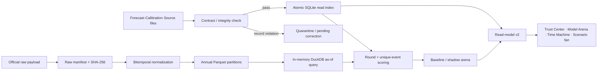

# Fable Grand Blueprint 구현·검증 보고서

기준 문서: `reports/md/claude_fable_quant_platform_grand_blueprint_260801.md`
구현일: 2026-08-01
원칙: 파일 원장은 정본, SQLite는 재생 가능한 읽기 인덱스, 신규 확률은 `[0,1]` fraction.

## 1. 재검증 결과

설계서의 `[H]` 주장은 구현 전에 저장소에서 다시 측정했다.

| 항목 | 재검증 전 | 조치 후 |
|---|---:|---:|
| forecast 본문 파일 | 21 | 21 |
| SQLite forecast 행 | 28 | 21 (clean rebuild) |
| resolution row / unique event | 6 / 3 | 6 / 3 (명시적 cluster) |
| benchmark invalid market probability | 22.0, 5.0 | 원장 보존, 성능 뷰 격리, correction `pending` |
| DualDB entity / event / era | 32 / 30 / 7 | seed 재적재 후 46 / 48 / 8 |
| source contract | 0 | 7 |

`22.0`과 `5.0`을 임의로 `0.22`·`0.05`로 바꾸지 않았다. 원출처 quote를 확인하기 전에는
어떤 단위 변환도 추정이므로, `calibration/corrections.csv`에 보정 대기로 기록하고
`v_benchmark_valid`에서 제외한다.

## 2. 구현 구조

## 3. Work packet 상태

| WP | 상태 | 구현 결과 |
|---|---|---|
| WP-01 | 완료 | repo/branch/HEAD/source fingerprint, context 불일치 clean rebuild, in-memory staging→backup, strict rollback, read-only `sync --check`, 소비 CLI fail-closed |
| WP-02 | 완료(값 승인 대기) | explicit source unit, canonical probability/space, SQL CHECK, append-only correction ledger, invalid benchmark 격리 |
| WP-03 | 완료 | `docs/generated/inventory.generated.md`, `inventory --check`, CI drift gate, DualDB seed 현행화 |
| WP-04 | 완료·표시 전용 | resolution cluster, time-weighted/first/latest, 10,000회 deterministic cluster bootstrap, gate v2; 기존 gate 무변경 |
| WP-05 | 완료 | source registry, 7 contracts, raw content receipt, quarantine 프레임 |
| WP-06 | 완료 | bitemporal Pydantic contract, annual Hive-style Parquet, DuckDB read-only as-of, leakage sentinel/golden revision test |
| WP-07 | 코드 완료·실데이터 backfill 보류 | ALFRED/BLS/BEA/Treasury/NYFed/EDGAR request builders, ALFRED·EDGAR knowledge-time normalizer. 키·공표 캘린더·재배포 조건 승인 전 라이브 수집 미실행 |
| WP-08 | 완료 | 기준선 6종, expanding walk-forward purge/embargo, Brier/log/CRPS/pinball/coverage, deterministic bootstrap |
| WP-09 | 완료 | model registry, lifecycle guard, GBM v1 champion 등록, shadow 승격 차단 |
| WP-10 | shadow 완료 | EWMA, GARCH(1,1), regime block bootstrap, Breeden–Litzenberger RND, 기존 Chronos-2 연동 보존, TimesFM 비교군 등록, p5~p95 fan |
| WP-11 | 완료 | 기존 키 무손상 + `trust/arena/receipts/asof_index/clusters/corrections/probability_semantics/changelog` |
| WP-12 | 완료 | Trust Center `
` fallback, source states, index receipt, mobile layout |
| WP-13 | 완료 | row/unique 이중 KPI, 표본 부족 시 reliability 숨김, arena·CI·한계 표시 |
| WP-14 | 완료 | as-of index 통합, fan chart, scenario conditional 라벨, 기존 HTML budget 회귀 테스트 유지 |

## 4. 활성화하지 않은 항목

아래는 미구현이 아니라 설계서가 정한 인간 승인 경계다.

- 기존 P2/P3 gate를 unique-event gate로 교체하지 않음. v2는 표시 전용이다.
- `22.0`·`5.0`의 보정값을 확정하지 않음. 원출처 증거와 reviewer가 필요하다.
- Chronos-2·TimesFM·GARCH·RND를 champion으로 올리거나 LLM 확률과 결합하지 않음.
- calibration, 학습 가중 ensemble, 논리 제약 자동수정을 활성화하지 않음.
- Yahoo cross-check 재배포 권한을 승인하지 않았고 source registry에서 비활성 상태다.
- BLS/BEA/FRED API 키를 저장소에 넣지 않았으며 유료 소스를 추가하지 않았다.

## 5. 검증 계약

- source truth 검증: `python -m ai_fc sync --check`
- clean rebuild: `python -m ai_fc sync --rebuild --force`
- inventory drift: `python -m ai_fc inventory --check`
- 전체 회귀: `python -m pytest -q`
- dashboard: raw self-contained HTML 420,000 bytes 이하, 외부 CDN 0, reduced-motion 유지
- PIT: 공표 직전 as-of에는 값 0건, revision 경계마다 당시 vintage 반환
- event gate: FOMC r1–r4가 `n_unique_events=1`

## 6. 근거가 된 공식 문서

- [FRED/ALFRED series observations와 realtime/vintage 파라미터](https://fred.stlouisfed.org/docs/api/fred/series_observations.html)
- [DuckDB Parquet 읽기·필터/프로젝션 pushdown](https://duckdb.org/docs/stable/data/parquet/overview)
- [DuckDB Hive partitioning](https://duckdb.org/docs/current/data/partitioning/hive_partitioning)
- [SEC EDGAR Data APIs](https://www.sec.gov/search-filings/edgar-application-programming-interfaces)
- [BLS Public Data API v2 signatures](https://www.bls.gov/developers/api_signature_v2.htm)
- [BEA developer resources](https://www.bea.gov/resources/for-developers)
- [New York Fed reference rates](https://www.newyorkfed.org/markets/reference-rates)
- [Amazon Chronos 공식 저장소](https://github.com/amazon-science/chronos-forecasting)
- [Google Research TimesFM 공식 저장소](https://github.com/google-research/timesfm)
