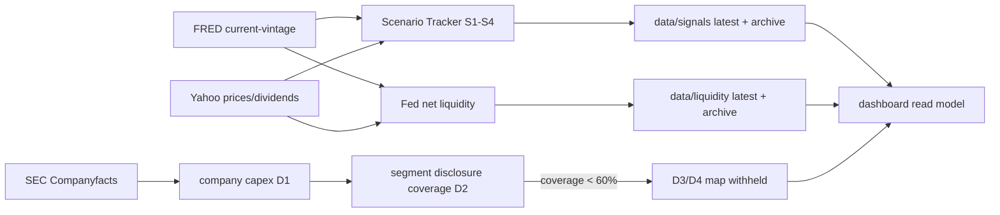

# 시장 전망 그래프 확장 v2 구현 보고서

작성일: 2026-08-03 KST
구현 기준: `시장 전망 그래프 확장 — 다음 단계 상세 설계서 (v2)`

## 결과 요약

이번 변경은 기존 01 시나리오·02 혁신 사이클·03 교차자산 공간을 보존하면서
04 AI 자본사이클과 05 유동성 조류 지도를 같은 시장 맵 안에 추가한다. 신규 공간은
`reference_only`이며 기존 질문별 확률이나 조건부 시나리오 확률과 합산하지 않는다.

| 마일스톤 | 상태 | 구현·게이트 판정 |
|---|---|---|
| M0 | 완료 | 이전 P0 정합성·정정 revision·archive 불변성·regime beta 테스트 유지 |
| M1 | 완료 | 교차자산 경로 band, beta regime, 불확실성 라벨과 endpoint 충돌 회피 유지 |
| M2 | 구현 완료·첫 운영 스냅샷 대기 | S1–S7 사전등록 YAML, count-only Tracker, S5·S6 원천 미확보 표기, BTC·O 진단, append-only path tracking, 주간 workflow 구현. 로컬 FRED DNS 실패로 첫 실데이터 스냅샷은 만들지 않음 |
| M3 | 구현 완료·첫 운영 스냅샷 대기 | Fed 순유동성 zone, BTC·NASDAQ 26주 수익률, 0/4/8/12주 진단, 156주 표본 게이트, 15KB payload 제한, 05 탭 구현. ALFRED·stablecoin·ETF는 원천 게이트 미충족으로 제외 |
| M4 | D0–D2 완료 | FRED·SEC·후보 원천 계약, SEC Companyfacts D1, 회사별 D2 공시 coverage 보고서와 archive 생성 |
| M5 | **차단·미완료** | 4개 회사의 검증된 cloud/AI segment 매출 coverage가 0%로 60% 기준 미달. 좌표·8분기 trail·fan·waterfall을 생성하지 않고 04 탭에 `데이터 커버리지 부족`을 표시 |

## 새 데이터 계층

모든 신규 레코드는 가능한 범위에서 `observation_period`, `available_at`,
`source_url`, `source_fingerprint`, `revision_vintage`를 보존한다. current-vintage
FRED 과거값은 모니터링 활성화 이후의 운영 참고용이며 point-in-time 백테스트로
사용하지 않는다.

## 사전등록·표시 안전장치

- Scenario Tracker는 `deleveraging_support`, `easing_rotation_support`, `neutral`,
  `source_unavailable` 개수만 표시한다. 가중합·점수·확률 필드는 계약 검증에서 거부한다.
- Fed 순유동성 산식과 zone 임계값은 Tracker S4와 Liquidity Tide가 같은 YAML을 사용한다.
- 실질 M2는 ALFRED vintage API key가 없으면 현재 FRED M2로 대체하지 않는다.
- stablecoin은 14일 연속 스키마 안정성·라이선스 검토, ETF flow는 2개 독립 원천과
  재배포 라이선스 검토 전까지 `원천 미확보`다.
- AI 자본사이클은 SEC 표준 facts만으로 segment AI 매출을 추론하지 않는다. coverage
  60% 미만이면 coordinates는 `null`, trail은 빈 배열이며 지도는 렌더링하지 않는다.

## 운영과 실패 안전

- `scenario-refresh.yml`: 기존 NASDAQ·교차자산과 함께 Tracker·Liquidity를 주간 갱신한다.
- `ai-regime-refresh.yml`: SEC D0–D2 layer를 월 1회 갱신한다.
- 외부 원천 단계는 `continue-on-error`이며 실패하면 기존 latest/archive를 덮어쓰지 않는다.
- 세 작성 workflow는 `investing-data-writer` concurrency group을 공유한다.

## 검증 결과 기록

최종 커밋 전 다음 검증을 다시 실행한다.

- `pytest -q`
- `node --check src/ai_fc/dashboard_parts/dashboard.js`
- `python -m ai_fc dashboard --pages-out _site`
- `python -m ai_fc sync --check`
- `python -m ai_fc inventory --check`
- GitHub Actions YAML 파싱 및 데이터 workflow dry-run

첫 로컬 `market-extensions` 실데이터 실행은 FRED DNS 조회 실패로 중단되었다. 이는
데이터를 임의 보간하지 않는 의도된 실패다. 주간 GitHub workflow의 첫 성공 전까지
Tracker와 05 탭은 검증 스냅샷 대기 상태를 표시하며 M2·M3 운영 완료로 간주하지 않는다.
