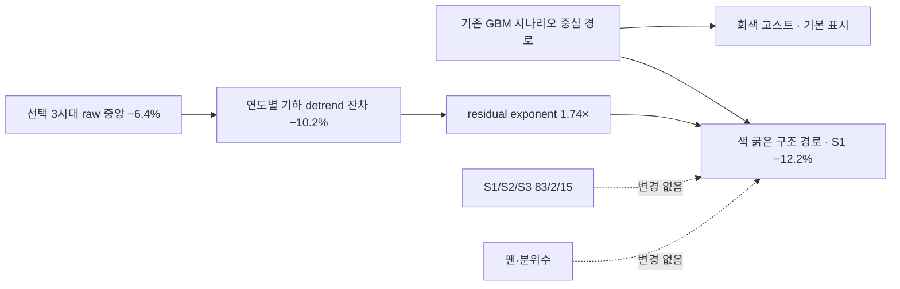

# REVIEW-260805 대응 — NASDAQ 구조 경로 v2 구현 보고

작성일: 2026-08-06 KST  
기준: `334b4e5` 이후 작업 트리  
대상 스냅샷: `nasdaq-scenario:2026-08-03:r4` → `r7`  
지위: 시스템 감사·표시 의미론 개선. 투자 자문 아님. 확률·방향 튜닝 없음.

## 1. 결론

외부 검토의 핵심 진단을 재현했다. S1/S2/S3 비중 `83/2/15`, 종점
`32,239 / 29,577 / 26,667`, 팬·quantile table·path realism은 r4와 r7이 같다.
시장의 방향을 하향 전환한 것이 아니라, v1에서 구조 굴곡이 사건처럼 보이던 표시 결함을
v2에서 분리했다.

화면은 이제 다음 두 경로를 동시에 보여준다.

- 색 굵은 선: DB 조건부 구조 경로
- 회색 고스트 선: 같은 스냅샷의 굴곡 적용 전 GBM 중심 경로, 기본 표시·토글 가능

상단에는 `굴곡=역사 중앙 형태 가정 — 발생 여부의 확률 진술 아님`을 고정한다.

## 2. N-시리즈 재검증과 처리

| ID | 재검증 | 조치 | 현재 판정 |
|---|---|---|---|
| N-1 | v1은 모든 굵은 선에 구조 굴곡을 무조건 표시 | GBM 고스트 선 기본 표시, 비교 토글, 발생확률 아님 배지, `structural_shape_occurrence_probability_claimed=false` | PASS |
| N-2 | 원형·detrend·화면 낙폭이 한 단어로 섞임 | 선택 3시대 raw `−6.4%`, detrended residual `−10.2%`, strength `1.74×`, 굴곡 전 화면 S1 `−5.7%`, 보정 화면 S1 `−12.2%`를 분리 직렬화 | PASS |
| N-3 | strength 1.735781을 S1/S2/S3·2027에 공용 | 공용 범위와 S1 83% 의존 근사를 명시. 같은 목표에 대한 시나리오별 strength 대안 S1 `1.735781`, S2 `1.320724`, S3 `0.819160` 병기 | PASS |
| N-4 | 선택 규칙·as-of가 패키지 밖 | contract v2에 풀 전용 z, 5피처, Euclidean, k=5, 동일 시대 90일 간격, stable tie-break를 사전 등록. selection asof `2026-07-29`, available_at `2026-07-30T16:38:37` 직렬화 | PASS |
| N-5 | S1 종점의 trailing μ 상속 미표시 | `μdaily=0.000811282145`, 연 μ `20.44%`, 연 σ `18.56%`와 “trailing 252거래일 μ 추세 지속 가정” 표시. ±10%p μ의 종점 scale 민감도는 reference-only로 직렬화 | PASS |
| N-6 | 57% 박스에 임계 거리·기간 없음 | 임계 거리 `−5.9%`, 잔여 `63거래일`, 정확한 직렬화 σ를 쓴 driftless first-passage 기준 `≈51%`를 별도 mechanical reference로 표시 | PASS |
| N-7 | S2 2% 재현에 μ·σ 없음 | lookback·μ·σ·seed 42·20,000경로·코드 참조를 스냅샷에 직렬화 | PASS |
| N-8 | 직전 pre-state 미포함 | 불변 r4·중간 r5/r6·최종 r7을 모두 archive에 보존. 차기 패키지 필수물에 immediate prior/current를 contract로 등록 | PASS |
| N-9 | 패키지 의존 모듈 누락 | contract의 review package 목록에 `mc.py`, `scenario.py`, `scenario_structure.py`, 직접 테스트와 pre-state를 강제. 실제 패키지 생성 시 manifest hash 대상 | 설계 PASS · ZIP 생성 시 재확인 |

검토문의 원형 `약 −7.2%`와 현재 주간 패널 실측 `−6.4%`는 같은 숫자로 강제하지
않았다. 현재 스냅샷의 52개 주간 점에서 선택 3시대 중앙 raw 경로를 직접 측정한 값은
`−6.4%`다. 기하 endpoint detrend 후의 residual은 `−10.2%`이고, 이를 GBM 연도별
endpoint 위에 strength 1.735781로 적용한 화면 S1 낙폭이 `−12.2%`다. 세 층을
따로 공개하는 것이 N-2의 실제 해소다.

또한 검토문의 기계적 기준 `≈57%`를 그대로 복사하지 않았다. 현재 스냅샷에 새로
직렬화한 일 σ `0.011689227220`과 잔여 63거래일을 driftless lower-barrier 공식에
넣으면 `≈51%`다. 공식 등록 forecast `57% [44,70]`와 이 숫자는 서로 다른 행이며
결합하지 않는다.

## 3. G-3 구조 경로 v2

시나리오별 대안 strength는 공개만 하고 적용하지 않았다. 적용하면 기존 공용 표시
가정 자체가 바뀌므로 별도의 성능 검증·승인이 필요하다.

## 4. G-4 시대 선택 사전등록과 민감도

선택 알고리즘 정본은 `knn-analog-pool-z-euclidean-k5-gap90-v1`이다.

1. AI를 제외한 일간 아날로그 시대의 월말 5피처를 후보 풀로 만든다.
2. 과거 풀만으로 z 표준화한다. 현재 AI 질의 벡터는 fit에서 제외한다.
3. Euclidean 거리 오름차순으로 k=5 이웃을 고른다.
4. 같은 시대 이웃끼리는 최소 90일 간격을 강제한다.
5. 5개 이웃의 era label을 unique/sort한 결과가 선택 시대다.

현재 선택은 `biotech2015 · dotcom · japan1989`, 후보 풀은 5시대다. 선택 시대 하나를
비선택 시대 하나로 바꾸는 6개 leave-one-replacement 민감도에서 2026 raw S1 낙폭은
`−14.5%~−2.9%`, 위험창 중심은 기준 2026-10에서 `−2~+1개월` 움직인다. 이 범위는
모델 확률이 아니라 선택 불안정성 고지다.

## 5. G-5 임계 근접도 표준화

`physical_event` 질문에 `proximity_context`가 있으면 상세 화면은 공통 컴포넌트로
다음을 표시한다.

- 현재 앵커에서 고정 임계까지 signed 거리
- 판정창에 남은 거래일
- driftless lower-barrier first-passage 기계적 기준
- 등록 확률·다른 확률공간과 결합 금지 문구

현재는 명시적 threshold contract가 있는 `nasdaq-corr10-augoct-2026`만 연결했다.
resolution 문장에서 숫자를 임의 파싱해 모든 질문에 가짜 근접도를 만들지 않는다.

## 6. G-6 재현 규격과 불변 체인

| revision | correction | 의미 |
|---|---|---|
| r4 | CORR-260805-014 | 구조 경로 v1 pre-state |
| r5 | CORR-260806-016 | 고스트·선택 규칙·μσ·근접도·증폭 공개 |
| r6 | CORR-260806-017 | detrended residual 낙폭 분리 |
| r7 | CORR-260806-018 | raw 선택시대 원형 낙폭까지 3층 분리 |

archive는 어느 파일도 덮어쓰지 않았다. 차기 검토 ZIP에는 최소 r4와 r7, contract,
구현 3개 모듈, 직접·회귀 테스트, manifest SHA-256을 넣는다.

## 7. U 잔여 상태

| 범위 | 상태 | 근거 |
|---|---|---|
| U0 15라우트 × 2 viewport | PASS | `UX_AUDIT_260805.md`, 30/30 capture |
| U1d 4개 모바일 결함 | PASS | ask width, track overflow, prob-orb, chart scroll evidence |
| U1a 4섹션·구 해시 보존 | PASS | today/future/records/trust와 redirect 전수 테스트 |
| U1b 화면별 질문·lookup 흡수·compare | PASS | 현재 router/UI 계약 테스트 |
| U1c trust/performance/operator 분리 | PASS | `?mode=operator`와 배지/route 테스트 |

이번 변경은 위 구조를 다시 합치거나 정직성 장치를 삭제하지 않았다.

## 8. G-1/G-2 보류

연준 대응 여력 질문과 사용자 human forecast는 실제 원장에 등록하지 않았다. 임계·기간·
확률·CI가 사용자 결정 사항이기 때문이다. 실행 가능한 문안과 필드 초안은
`review_260805_g1_g2_decision_drafts.md`에 분리했다.

## 9. 파일·검증 매핑

| 파일 | diff 요지 | 테스트·게이트 |
|---|---|---|
| `data/contracts/scenario_structural_forecast.yaml` | v2 선택·민감도·ghost·proximity·repro contract | contract/version 검증 |
| `src/ai_fc/scenario_structure.py` | 3층 amplitude, scenario strength 대안, selection sensitivity, mechanical proximity | scenario unit·validator |
| `src/ai_fc/scenario.py` | 정확한 μ·σ 직렬화, 구 snapshot same-source anchor-checked recovery | determinism·immutable regression |
| `tools/reproduce_scenario_snapshot.py` | 공개 snapshot만으로 83/2/15와 분위수 1,764셀 재현 | zero-mismatch reproduction |
| `src/ai_fc/dashboard_parts/dashboard.js` | ghost toggle, 의미론 배지, amplitude/μσ/proximity 표시 | UI 문자열·JS geometry |
| `src/ai_fc/dashboard_parts/dashboard.css` | 비교 컨트롤·가독성·모바일 | UI contract |
| `src/ai_fc/dashboard.py` | question detail 공통 proximity context 배선 | read-model contract |
| `calibration/corrections.csv` | r5~r7 append-only correction chain | archive regression |
| `data/method_changes.jsonl` | 구조 경로 v2 방법 변경 기록 | ledger audit |

## 10. 최종 검증

| 게이트 | 실측 결과 |
|---|---|
| 전체 테스트 | `382 passed in 89.44s` |
| JS 구문 | `node --check` PASS |
| ledger audit | `violation=0`, accumulating 22, stalled 6, planned 3 |
| sync check | exit 0; 기존 Q1 단위 quarantine 경고 2건 유지 |
| inventory | 재생성 후 `inventory --check` PASS |
| 정적 빌드 | index.html 479,479 bytes; data.json 308,921 bytes |
| payload 예산 | 320KB 상한 이내 PASS |
| read model | NASDAQ 질문에 거리 −5.9%, 63거래일, mechanical 51% 배선 확인 |
| 불변 회귀 | r4 대비 weights/endpoints/fan/quantile/path_realism 동일 |
| 공개 재현 | 확률 `83/2/15`, 분위수 1,764셀 mismatch 0 |

첫 전체 실행에서는 dualdb `^IXIC max(date)=2026-07-29`가 오늘 기준 7일 신선도 게이트를
하루 넘겨 sentinel 1건이 실패했다. 테스트를 완화하지 않고 공식 Yahoo 증분 수집을
실행해 `^IXIC` 5행을 추가했고, 이후 sentinel과 전체 382개가 통과했다. 이 운영 DB
갱신은 Git 추적 시나리오 r7의 as-of나 선택 시대를 조용히 바꾸지 않았다.
