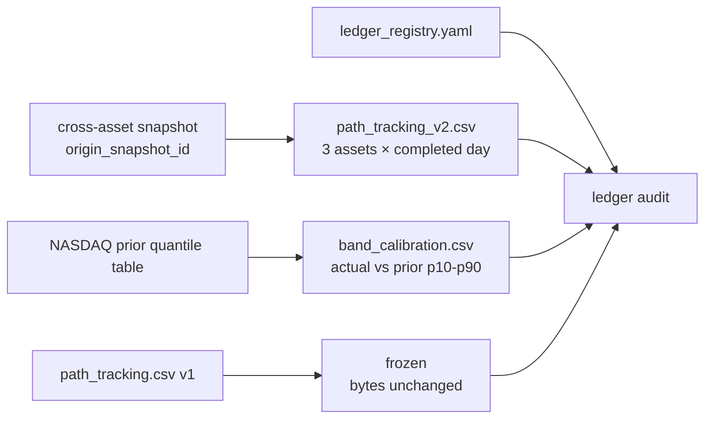

# Round 2 원장·HY·UI 고도화 구현 보고서

작성일: 2026-08-04 KST

대상 브랜치: `codex/ui-sidebar-overhaul`

기준 입력: Round 2 검토 결과 + 수정·고도화 통합 프롬프트

## 1. 결론

이번 라운드는 예측 경로의 숫자를 바꾸지 않고, 원장 불변성·사후검증·근거 추적·설명 가능성을 강화했다.

- 기존 `path_tracking.csv`는 byte 변경 없이 `frozen`으로 등록했다.
- 신규 `path_tracking_v2.csv`는 4개 시나리오와 `origin_snapshot_id`를 가지며, 동일 거래일 재실행 시 중복을 만들지 않는다.
- 현재 v2 원점은 `cross-asset:2026-08-03:r2`이고 세 자산 각 1행, 총 3행으로 시작한다.
- NASDAQ p10–p90 사후 적중 원장 `band_calibration.csv`를 등록했다. 2026-08-03이 최초 분위수 스냅샷이므로 평가 가능한 다음 거래일부터 누적하며, 60행 전에는 UI에 승격하지 않는다.
- FRED의 2026년 공개 피드 3년 제한을 영수증에 기록하고, commit-pinned 과거 FRED 공개 캡처와 결합해 등록된 6개 이벤트의 HY OAS 진단을 복구했다.
- C1–C4 조건은 tracker 한 곳에서만 계산하고 교차자산 UI는 계산하지 않고 요약을 소비한다.
- O 경로의 시장·금리·크레딧 M+3 기여, 소프트랜딩 약세 설명, 고금리/BTC 공유 경로 배지, n=156 gate 경계 상태를 추가했다.
- downside beta와 HY 항의 이중 반영 가능성을 공개했지만, 0.5 감쇠안은 `pending_operator_decision`, `applied=false`로 유지했다.

## 2. 원장 구조

### 2.1 `path_tracking_v2`

키는 `(asof, origin_snapshot_id, asset)`이다. 성공한 `refresh_cross_asset`은 완료 거래일마다 NASDAQ, Bitcoin, Realty Income 3행을 한 묶음으로 추가한다. 일부 자산만 추가되는 상태는 오류로 막는다. 같은 입력을 두 번 실행하면 두 번째 실행은 변경 없음이며, 같은 키에 다른 값이 들어오면 append-only 충돌로 거절한다.

v1은 `expected_state: frozen`이다. 감사기는 frozen 원장을 stale로 취급하지 않지만, 기존 byte가 바뀌면 violation으로 처리한다.

### 2.2 밴드 캘리브레이션

행에는 실제 종가, 직전 스냅샷의 p10/p25/p50/p75/p90, p10–p90 포함 여부, p50 오차율과 `scenario_conditional` 공간을 저장한다. 없는 분위수를 보간하지 않는다. 현재 최초 분위수 스냅샷 기준일이 2026-08-03이므로 파일은 헤더만 있고 `planned` 상태다. 다음 평가 가능한 확정 종가부터 자동 누적한다.

## 3. HY OAS 이벤트 연구 복구

공식 FRED 페이지는 2026년 4월부터 해당 공개 시리즈가 3년만 포함된다고 고지한다. 따라서 베타의 156주 창은 현재 공식 피드를 그대로 쓰고, 장기 이벤트 연구에만 별도 수집 경로를 사용했다.

1. 공식 현재 FRED CSV를 우선 요청한다.
2. 2001 이벤트를 덮지 못하면 commit-pinned 공개 FRED 캡처를 보조 자료로 읽는다.
3. 최신 구간은 공식 현재 관측이 우선한다.
4. 원시 전체 시계열은 저장소나 review ZIP에 넣지 않고 파생 이벤트 진단만 저장한다.
5. 요청 URL, SHA-256, 커버리지 시작일, 제한 문구와 `derived_event_diagnostics_only` 정책을 영수증에 남긴다.

근거:

- 공식 현재 시리즈: https://fred.stlouisfed.org/series/BAMLH0A0HYM2
- 고정 과거 캡처: https://raw.githubusercontent.com/maaurocp/Trading_Protocol/bf64e83fa4c2a6e72c37d3883476dc81bd9d2e31/data/raw/fred_BAMLH0A0HYM2.csv

복구 결과:

| 이벤트 | HY OAS 변화 | 상태 |
|---|---:|---|
| dotcom_easing | -298bp | available_full_history |
| tightening_2004_2006 | -77bp | available_full_history |
| taper_2013 | -27bp | available_full_history |
| hikes_2015_2018 | -214bp | available_full_history |
| acute_crisis_2020 | +730bp | available_full_history |
| hikes_2022_2023 | -5bp | available_full_history |

각 이벤트 registry에는 시작·종료 경계를 선택한 이유를 추가했다. `hikes_2022_2023`은 2022-03-16 첫 인상부터 2023-07-26 마지막 인상까지이며 기존 경계는 바꾸지 않았다.

## 4. 모델 의미와 운영자 경계

### 4.1 숫자를 바꾸지 않은 항목

- 네 시나리오의 NASDAQ/BTC/O 중앙 경로
- beta bootstrap band
- O 금리·신용 민감도 추정치와 사용값
- beta-credit 최소 관측 156주 gate
- 고금리 지속과 동반 디레버리징의 BTC 동일 경로

### 4.2 이중 반영 가능성

하락꼬리 beta가 이미 신용 스트레스를 일부 담을 수 있어 HY 항을 더하면 tail shock 일부가 중복될 수 있다. 이 사실을 `band_semantics`와 UI 영수증에 공개했다. 후보 감쇠계수 0.5는 운영자 판단 대기이며 적용되지 않았다.

### 4.3 n=156 경계

신용 민감도는 정확히 156개 관측으로 gate를 통과한다. 숫자를 바꾸거나 2주 hysteresis를 새로 적용하지 않고 `gate_margin_observations=0`, `gate_proximity=at_boundary`를 데이터와 UI에 표시했다.

## 5. C1–C4 및 UI

현재 조건은 2/4 충족이다.

| 조건 | 신호 | 핵심 증거 | as-of | 상태 |
|---|---|---:|---|---|
| C1 신용 스트레스 비확대 | S1 | HY 4주 +10bp | 2026-07-31 | 충족 |
| C2 장기금리 하락 | S8 | DGS10 4주 +26bp | 2026-07-31 | 미충족 |
| C3 실질금리 완화 | S2 | 최근 4주 중 3주 상승 | 2026-07-31 | 미충족 |
| C4 배당 유지·증가 | S9 | c4_met=1 | 2026-07-31 | 충족 |

UI는 이 값을 재계산하지 않고 `cross_asset.realty_income.condition_summary`만 읽는다. 시나리오 선택 시 다음이 함께 바뀐다.

- M+3 O 기여: 시장 / 금리 / 크레딧
- 해당 시나리오의 O 경로 설명
- `rates_stay_high` 선택 시 `BTC 경로 공유 · 설계상 동일` 배지

소프트랜딩 M+3 O는 시장 -2.4, 금리 -0.0, 크레딧 -0.0의 합성이다. 따라서 “금리·신용 충격 때문에 약하다”가 아니라 “시장 beta 초기 약세를 금리·신용 효과가 아직 상쇄하지 못한다”고 표시한다.

## 6. Research Pack 단위 감사

- `weight`를 확률로 취급하던 정규식을 제거했다.
- 실제로 값이 바뀐 필드 경로를 `normalized_fields`에 기록한다.
- pending correction 대상은 원본 단위를 유지하고 `unit_review_pending=true`와 필드명을 기록한다.
- 현재 pending 2행의 `market_prob` 22.0과 5.0은 변환하지 않았다.
- 기존 `research_pack_2026-08`은 불변으로 유지하고 `research_pack_2026-08-r2`를 새로 생성했다.
- DICTIONARY는 `payload_json`이 원본 자체가 아니라 정규화 표현임을 명시한다.

## 7. 방법 변경 일지

`data/method_changes.jsonl`에는 실제 v2 전환 이벤트 하나만 기록했다.

- event: `method:path-tracking-v2:2026-08-04`
- origin snapshot: `cross-asset:2026-08-03:r2`
- reason: v1 동결, 4개 시나리오와 origin ID를 갖는 중복 안전 v2 누적
- report: 이 문서

대시보드 변경 일지는 저장소 URL을 코드에 하드코딩하지 않고 `AI_FC_PUBLIC_REPOSITORY_URL` 또는 기본 공개 저장소 설정에서 만든다.

## 8. 검증 결과

검증 항목:

- v2 최초 실행 3행 추가, 두 번째 실행 0행, schema에 origin ID 존재
- 밴드 원장 동일 키 재실행 중복 없음
- HY primary/fallback 병합과 파생 전용 정책
- 분위수·확률 정규화와 pending unit 보존
- frozen 원장이 stale가 되지 않음
- read-model 계약 및 정적 Pages 빌드
- 브라우저 DOM에서 M+3 attribution, n=156 경계, C1–C4 증거, BTC 공유 배지 확인
- 변경 일지에서 method event와 보고서 링크 확인

원장 감사 결과: accumulating 23, frozen 1, stalled 0, violation 0, planned 4.

## 9. 검토 패키지 포함물

review ZIP에는 다음을 포함한다.

- 본 구현 보고서와 Round 2 원문
- 코드 diff, git 상태, 테스트 로그, 원장 감사 JSON/Markdown
- `path_tracking_v2.csv`, `band_calibration.csv`, ledger registry
- cross-asset/tracker/event-study/sensitivity 최신 스냅샷
- `rate_sensitivity_latest.json`, `dividends.csv`, rate-event registry, scenario tracker signal file
- research pack r2 manifest, dictionary 및 pending 단위 추출 결과
- 교차자산·변경 일지 브라우저 캡처

원시 HY 전체 시계열은 라이선스·재배포 원칙 때문에 의도적으로 제외한다.

## 10. 외부 운영 잔여

- Naver D0 실제 공유 게시: 인증된 대상 계정·게시 위치가 지정되지 않아 코드 범위 밖의 운영자 승인 항목으로 남긴다. 완료로 주장하지 않는다.
- credit-tail overlap 0.5 감쇠 적용 여부: 운영자 결정 대기. 현재 경로에는 미적용이다.
- band calibration UI 승격: 60개 평가 행이 쌓인 뒤에만 진행한다.
