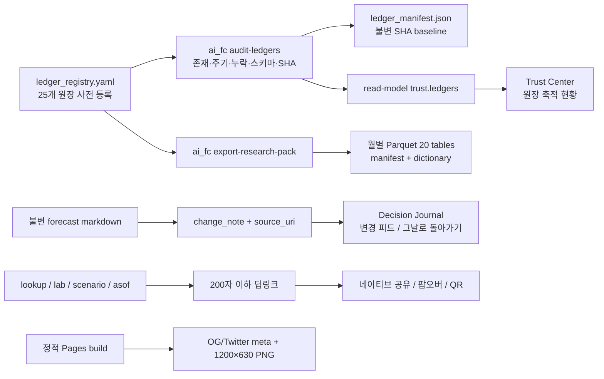

# 공유 확장 · Decision Journal · DB 축적 감사 구현 및 통합 검토 보고서

작성일: 2026-08-04 KST  
작업 기준: `ea00f4f` 이후 작업 트리  
대상: Jin's Investing Prediction 정적 GitHub Pages  
함께 검토한 선행 작업: Nasdaq 날짜별 분포 조회 L1–L3 (`c6e4253`, `b0eacaf`, `ea00f4f`)

## 1. 결론

첨부 설계서의 순서대로 C(DB 축적 감사) → B(예측 변경 일지) → A(공유 확장)를 구현했다. 정적 사이트 원칙은 유지했으며, 조회·일지·공유를 위해 서버, LLM, 외부 CDN 또는 브라우저 저장소를 새로 도입하지 않았다.

- 등록된 데이터 원장 25개를 자동 감사한다. 최초 실제 실행 결과는 `accumulating 21 / stalled 1 / violation 0 / planned 3`이다.
- 첨부 문서의 과거 관찰과 달리 현재 scenario archive는 3개이고 `.hashes.ots`도 존재한다. 이를 과거 숫자로 고정하지 않고 실제 파일을 감사했다.
- 실제 운영 경고는 `data/cross_asset/path_tracking.csv` 1건이다. 최신 교차자산 스냅샷은 2026-08-03인데 추적 행은 2026-07-31에서 멈춰 `stalled`로 검출된다.
- “예측 변화 타임머신”의 기본 화면을 “예측 변경 일지 (Decision Journal)”로 바꿨다. 변경 이벤트·근거 첫 문장·원본 링크·불변성 설명이 먼저 나오며, 기존 as-of 비교는 “그날로 돌아가기”라는 두 번째 모드로 보존했다.
- 데스크톱 공유 팝오버, 모바일 네이티브 공유, Gmail·메일·네이버 블로그·밴드·LINE·Telegram·X, 로컬 QR, OG 1200×630 PNG, 상태 딥링크를 구현했다.
- 교차자산 시나리오 버튼의 선택 상태를 진한 갈색 글자 `#5b3514` + 옅은 웜 배경 `#fff0db`로 고정했다. 대비비는 약 9.54:1이며, 비선택 상태는 약 11.53:1이다.
- 전체 테스트는 `317 passed`, JS 구문 검사 통과, Pages 실빌드 및 브라우저 실검을 완료했다.

## 2. 전체 구조



## 3. C — 데이터 원장 감사

### 3.1 등록부

`data/contracts/ledger_registry.yaml`에 다음 계층을 사전 등록했다.

- forecast 본문·근거, ML/market history
- calibration·correction·benchmark·cost·provider shadow CSV
- Nasdaq scenario latest/archive
- cross-asset latest/archive/path tracking
- signal, liquidity, rate-event, Realty Income dividend/rate-sensitivity
- AI capital-cycle archives와 source monitoring
- raw receipt, quarantine, bitemporal facts
- OpenTimestamps proof와 월별 research pack

각 항목은 `kind`, `cadence`, `criticality`, `schema_ref`, 선택적 `timestamp_field`, `expected_state`를 가진다. 앞으로 새 DB layer를 추가할 때 같은 커밋에서 등록부를 갱신하지 않으면 리뷰에서 누락이 드러나는 구조다.

### 3.2 감사 항목

`ai_fc audit-ledgers`는 다음을 검사한다.

1. glob 대상의 존재·파일 수·행 수·최신 일자
2. cadence 대비 신선도. `trading_daily`는 사전 등록된 NYSE 휴일 규칙과 completed-market cutoff를 사용한다.
3. archive 거래일 사이의 누락. 주말과 미국 휴일은 누락으로 세지 않는다.
4. 등록된 schema 재사용: scenario v2는 기존 `validate_scenario`, legacy archive는 최소 호환 계약, JSON/JSONL/CSV/frontmatter 검증
5. append CSV의 완전 중복 행과 역행 timestamp
6. `docs/generated/ledger_manifest.json`의 기존 SHA-256과 현재 파일을 비교한 불변성 위반
7. 최근 30일의 축적 시점 목록을 read-model에 전달

`stalled`는 운영 경고이므로 CI를 깨지 않는다. 기존 파일 SHA 변경이나 스키마 위반인 `violation`만 `--check`를 실패시킨다. `planned`는 미구현을 “정상”으로 위장하지 않고, 첫 수집 전에 명시적으로 등록한 상태다.

### 3.3 최초 실제 감사 결과

| 상태 | 수 | 해석 |
|---|---:|---|
| accumulating | 21 | 현재 계약상 축적 또는 event-driven 정상 |
| stalled | 1 | cross_asset path tracking이 7/31에서 정체 |
| violation | 0 | 기존 불변 파일 변경·스키마 위반 없음 |
| inactive | 0 | 미등록 상태로 방치된 활성 원장 없음 |
| planned | 3 | raw receipts, quarantine, bitemporal facts |

중요한 사실 정정:

- scenario archive: 문서 관찰값 2개 → 현재 실제 3개 (`2026-07-30`, `07-31`, `08-03`)
- timestamp proof: 문서에는 없음 → 현재 `forecasts/.hashes.ots` 존재, 감사상 accumulating
- research pack: 이번 작업으로 첫 2026-08 pack 생성, 이후 감사상 accumulating
- path tracking: 최신 스냅샷과 달리 7/31에서 멈춤 → 자동으로 `stalled`

상세 원장별 결과는 `docs/generated/ledger_audit.md`와 JSON에 있다.

### 3.4 CI와 자기검증

- `verify.yml`: `python -m ai_fc audit-ledgers --check` 추가. report-only이며 violation만 실패한다.
- `scenario-refresh.yml`: 실행 전 archive count/asof를 저장하고, 새 asof가 만들어졌다면 archive count가 반드시 증가했는지 검사한다.
- Nasdaq scenario refresh의 `continue-on-error`를 제거해 조용한 실패를 막았다.
- refresh 성공 시 데이터와 함께 ledger audit·manifest를 커밋한다.

### 3.5 월별 연구 팩

명령: `python -m ai_fc export-research-pack --month 2026-08`

생성 위치: `exports/research_pack_2026-08/`

- Parquet 20개 테이블, Zstandard 압축
- 약 281KB, repository 배포 경로
- `DICTIONARY.md`: 공통 열과 시맨틱 설명
- `manifest.json`: 생성 commit/time, 원본별 SHA, 테이블별 row/hash, 총 크기, 배포 방식
- 모든 행에 `source_file`, `source_sha256`, `derived_from`, `probability_space`, `payload_json`
- probability-like 수치가 1–100이면 fraction으로 정규화
- timezone-bearing timestamp는 UTC ISO-8601로 정규화
- 같은 source manifest로 재실행하면 동일 pack을 재사용하고, 같은 월에 source가 달라지면 덮어쓰기를 거부한다.

`monthly-research-pack` workflow는 매월 1일 실행한다. 50MB 이하면 저장소에 커밋하고, 초과하면 GitHub Release asset으로 전환한다.

## 4. B — 예측 변경 일지

### 4.1 기본 모드

기존 as-of 화면을 삭제하지 않고 목적을 재구성했다.

- 화면명: `예측 변경 일지`
- 기본 모드: 확률이 실제로 달라진 forecast round만 `role="feed"`로 표시
- 주 단위 그룹, 같은 주 안에서는 절대 변화 폭이 큰 항목 우선
- 표시: 이전 확률 → 새 확률, ±%p, 근거 첫 문장, 원본 forecast markdown 링크
- 첫 라운드 또는 확률 변화 0인 항목은 “변경 이벤트”로 과장하지 않는다.
- append-only provenance 카드를 항상 상단에 배치하고 commit·감사 일자를 함께 보여준다.

`dashboard.py`가 각 forecast 본문에서 첫 번째 의미 있는 근거 문장을 `change_note`로 추출하고 `source_uri`를 read-model에 넣는다. 추론 전문은 기존 body에 그대로 남는다.

### 4.2 “그날로 돌아가기” 모드

- 기존 as-of date rebuild를 두 번째 모드로 보존
- 라벨을 “그날의 공식 확률 / 모델 참고값 / 시장 참고값 / 현재 공식 확률 / 변화”로 평문화
- 선택일에 ML 또는 시장 값이 한 건도 없으면 해당 열 자체를 숨김
- 최초 기록 / 1개월 전 / 1주 전 / 최신 preset
- “선택일 이후 몇 개 질문이 바뀌었고 평균 절대 변화는 얼마인지” 문장형 요약
- `#asof=YYYY-MM-DD` 딥링크로 직접 재생 모드 진입

홈 forecast card의 작은 스파크라인 옆에는 `변경 일지` 버튼을 추가해 해당 질문의 일지(`#asof/<question-id>`)로 바로 간다.

## 5. A — 공유 확장

### 5.1 공유 계층

1. 포인터가 coarse인 모바일에서 `navigator.share`가 있으면 OS 공유 시트를 사용한다.
2. 데스크톱에서는 팝오버를 연다.
3. 링크 복사, Gmail, mailto, 네이버 블로그, 네이버 밴드, LINE, Telegram, X를 제공한다.
4. 카카오 JS SDK는 외부 스크립트·도메인 등록이 필요하므로 도입하지 않았다. 대신 vendored MIT QR 생성기로 현재 딥링크를 로컬 렌더링하고 모바일 기기 공유 시트로 넘긴다.

팝오버는 focus trap, ESC, scrim close, 포커스 복귀를 지원한다. 열기만 해서는 네트워크 요청을 하지 않으며, 외부 URL은 사용자가 해당 링크를 누를 때만 열린다.

### 5.2 정직한 공유 문구

```text
{화면 제목} — Jin's Investing Prediction
시장 기준 {asof} · 조건부 시나리오이며 목표가·투자자문이 아닙니다.
{딥링크 URL}
```

날짜별 분포 카드가 화면에 있으면 `10–90% 구간 · 중앙값 · 모델 조건부`를 첫 줄에 추가한다. QR URL은 최대 200자이며, 길이를 넘으면 안전한 overview 상태로 축약한다.

지원 딥링크:

- `#lookup=2026-08-30`
- `#lab=cross-asset&scenario=easing_rotation`
- `#asof=2026-07-20`
- 기존 `#q/<id>`, `#compare/...`

### 5.3 D0 endpoint 검증

2026-08-04에 공식 문서 규격과 실제 응답을 확인했다.

| 대상 | 실제 검증 | 결과 |
|---|---|---|
| Naver Blog | `/openapi/share?url=&title=` | login/share 경로까지 redirect 후 HTTP 200 |
| Naver Band | `/plugin/share?body=&route=` | auth/share 경로까지 redirect 후 HTTP 200 |
| LINE | `/lineit/share?url=&text=` | 공식 login/share 경로 HTTP 200 |
| Telegram | `/share/url?url=&text=` | HTTP 200 |

공식 문서:

- https://developers.naver.com/docs/share/share/
- https://developers.band.us/develop/guide/share
- https://developers.line.biz/en/docs/line-social-plugins/install-guide/using-line-share-buttons/
- https://core.telegram.org/widgets/share

### 5.4 QR과 OG

- `qr-creator 1.0.0` MIT 소스를 저장소 내부에 vendoring했다.
- 브라우저 canvas QR을 스크린샷한 뒤 OpenCV `QRCodeDetector`로 실제 디코딩했다.
- 디코딩 결과: `http://127.0.0.1:8898/#asof` — 원래 테스트 딥링크와 정확히 일치.
- Pages build가 `og/market-snapshot.png` 1200×630 RGB PNG를 생성한다.
- 이미지에 `CONDITIONAL SCENARIO · NOT INVESTMENT ADVICE`를 직접 각인한다.
- `og:title`, `og:description`, `og:image`, 크기, `twitter:card`가 index에 삽입된다.

## 6. 교차자산 버튼 가독성 수정

문제: 공통 `.flow-focus` 선택 규칙이 흰색 글자를 강제해 옅은 선택 배경과 겹쳤다.

수정:

- 비선택: `#3b3934` on `#ffffff`, 약 11.53:1
- 선택: `#5b3514` on `#fff0db`, 약 9.54:1
- `aria-checked=true`와 `aria-pressed=true`를 모두 같은 선택 토큰으로 처리
- hover/focus에서도 밝은 배경과 진한 글자를 유지
- 브라우저 실검에서 4개 버튼(동반 디레버리징, AI 조정 후 완화·순환, 소프트랜딩·자산 순환, 금리가 안 내려오는 붕괴)과 선택 라벨 모두 읽힘을 확인

## 7. 선행 날짜 조회 작업 재검토

이번 통합 빌드에서 선행 L1–L3도 다시 확인했다.

- scenario 생성의 동일 20,000 path·seed 42에서 `quantile_table` 생성
- D+1…D+252 실제 거래일, p05/p10/p25/p50/p75/p90/p95, anchor/ATH 상회 모델 조건부 비율, S1/S2/S3 조건부 중앙값
- 휴장일을 직전 거래일로 매핑하고 보간하지 않음
- 날짜 입력, 빠른 칩, 규칙 파서, `#lookup=` 딥링크
- 결과 카드에서 구간을 중앙값보다 먼저 배치
- physical_event 질문 확률은 별도 박스로 분리
- 현재 Pages `data.json` 232,536 bytes, `index.html` 392,978 bytes로 정적 즉시 조회 범위 유지

자세한 선행 보고서는 `reports/md/forecast_lookup_implementation_260804.md`를 함께 참조한다.

## 8. 검증 결과

| 검증 | 결과 |
|---|---|
| `node --check dashboard.js` | 통과 |
| `node --check qr-creator.min.js` | 통과 |
| `python -m ai_fc audit-ledgers` | violation 0, stalled 1 |
| `python -m ai_fc export-research-pack --month 2026-08` | 20 Parquet, repository 배포 |
| `pytest -q` | 317 passed, 85.99s (최종 재실행) |
| Pages build | 성공 |
| OG PNG | 1200×630 RGB 확인 |
| QR decode | 원본 딥링크 일치 |
| Browser: Decision Journal | feed, 근거, 링크, 모드 확인 |
| Browser: share popup | 8개 대상, 고지, QR 확인 |
| Browser: cross-asset buttons | 4개 라벨 및 선택 대비 확인 |
| Browser: ledger status | Trust 화면 패널 존재 확인 |

## 9. 파일별 변경 지도

### 데이터·감사

- `data/contracts/ledger_registry.yaml`: 원장 사전 등록부
- `src/ai_fc/ledger_audit.py`: 감사 엔진
- `docs/generated/ledger_audit.json|md`: 최신 결과
- `docs/generated/ledger_manifest.json`: SHA baseline
- `src/ai_fc/research_pack.py`: 월별 Parquet export
- `exports/research_pack_2026-08/`: 첫 연구 팩
- `src/ai_fc/cli.py`: 두 CLI 명령
- `.github/workflows/verify.yml`, `scenario-refresh.yml`, `research-pack.yml`: CI·자동화

### UI·공유

- `src/ai_fc/dashboard.py`: change_note, trust ledgers, OG build, QR bundle
- `src/ai_fc/dashboard_parts/dashboard.js`: Decision Journal, deep link, share popover, ledger card
- `src/ai_fc/dashboard_parts/dashboard.css`: journal/share/ledger/contrast styles
- `src/ai_fc/dashboard_template.html`: nav rename, share dialog, OG marker
- `src/ai_fc/dashboard_parts/qr-creator.min.js`: MIT vendored QR renderer
- `pyproject.toml`: Pillow build dependency

### 테스트

- `src/tests/test_ledger_audit.py`: baseline/violation·Parquet normalization/idempotence
- `src/tests/test_dashboard.py`: Journal/share/contrast/OG contracts

## 10. 남은 운영 관찰 사항

1. `cross_asset/path_tracking.csv`가 다음 완료 거래일 refresh에서 증가하는지 확인해야 한다. 감사기는 이미 경고한다.
2. raw receipt·quarantine·bitemporal facts는 `planned`다. 실제 source ingestion이 시작되면 등록부 상태가 자동으로 accumulating으로 바뀐다.
3. 카카오 전용 SDK는 외부 SDK 0 정책 때문에 보류했다. 현재 QR → 모바일 OS 공유가 안전한 대체 경로다.
4. 월별 pack이 50MB를 넘는 첫 달에는 workflow의 Release 전환 권한과 asset 업로드를 실제 Actions 환경에서 한 번 확인한다.

## 11. 리뷰어 체크리스트

- 기존 archive 파일 하나를 수정해 `audit-ledgers --check`가 violation으로 실패하는지 임시 작업 트리에서 확인한 뒤 되돌릴 것
- `#asof`, `#asof=<date>`, `#asof/<qid>`가 각각 feed/replay/질문 필터로 열리는지 확인할 것
- 공유 팝오버를 열기만 했을 때 Network 탭에 외부 요청이 없는지 확인할 것
- Naver/Band/LINE/Telegram은 로그인 상태에 따라 최종 화면이 달라지므로 URL 파라미터 보존을 확인할 것
- `#lab=cross-asset&scenario=<id>` 재진입 시 탭과 라디오가 모두 복원되는지 확인할 것
- OG scraper cache는 배포 후 플랫폼별로 강제 refresh가 필요할 수 있음을 감안할 것
